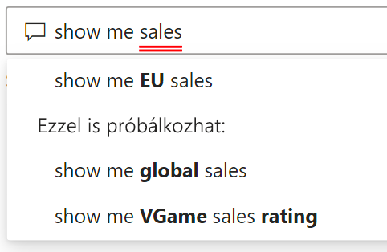
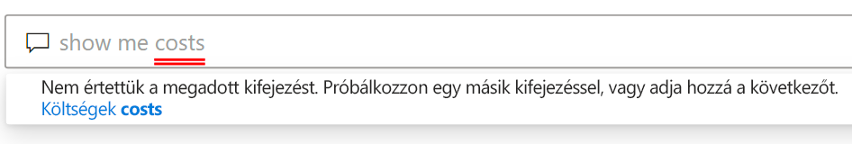

# Bevezetés a Power BI Q&A használatába

Ha válaszokat keres az adatokban, néha az a leggyorsabb megoldás, ha természetes nyelven végez keresést az adatokban. A Power BI Q&A funkciójával a saját szavaival, természetes nyelven vizsgálhatja meg az adatokat. A Q&A interaktív, sőt, szórakoztató. Gyakran előfordul, hogy egy kérdés további kérdéseket vet fel, mivel a vizualizációk érdekes utakat fednek fel a folytatáshoz. A kérdés megfogalmazása csak az első lépés. Az adatokat feltérképezve pontosíthatja vagy kibővítheti a kérdést, új információkat tárhat fel, összpontosíthat a részletekre, vagy áttekintheti a szélesebb összefüggéseket. A felület a memóriabeli tárolásnak köszönhetően interaktív és gyors. 

A Power BI Q&A ingyenes, és minden felhasználó számára elérhető. A Power BI Desktopban a jelentéstervezők az adatok vizsgálatára és vizualizációk létrehozására használhatják a Q&A-t. A Power BI szolgáltatásban mindenki használhatja a Q&A-t adatai vizsgálatára. Ha van engedélye egy irányítópult vagy jelentés szerkesztésére, akkor a Q&A-eredményeket rögzítheti is.

## A Q&A használata

Még mielőtt gépelni kezdene, a Q&A egy új képernyőt nyit meg, amelyen javaslatokkal segít a kérdés megfogalmazásában. Kiindulhat a javasolt kérdések egyikéből, vagy beírhat saját kérdéseket is. A Q&A a kérdések széles körét támogatja, beleértve többek között a következőket:

- **Természetes nyelvű kérdések feltétele** Which sales has the highest revenue? (Mely értékesítés bevétele a legnagyobb?)
- **Relatív dátumos szűrés használata** Show me sales in the last year (Az elmúlt év értékesítéseinek megjelenítése)
- **Csak az első N elem visszaadása** Top 10 products by sales (Az első 10 termék értékesítés alapján)
- **Szűrő megadása** Show me sales in the USA (Az USA-beli értékesítések megjelenítése)
- **Összetett feltételek megadása** Show me sales where product category is Category 1 or Category 2 (Azon értékesítések megjelenítése, ahol a termékkategória az 1. kategória vagy a 2. kategória)
- **Konkrét vizualizáció visszaadása** Show me sales by product as pie chart (Az értékesítés megjelenítése termék szerint, tortadiagramként)
- **Összetett aggregációk használata** Show me median sales by product (Értékesítés középértékének megjelenítése termék szerint)
- **Eredmények rendezése** Show me top 10 countries by sales ordered by country code (Az első 10 ország megjelenítése értékesítés alapján, országkód szerint rendezve)
- **Adatok összehasonlítása** Show me date by total sales vs total cost (Dátum megjelenítése az összes értékesítés és a teljes költség összevetése alapján)
- **Trendek megtekintése** Show me sales over time (Értékesítések megjelenítése az idő függvényében)

### Automatikus kiegészítés

A kérdés beírása közben a Power BI Q&A kapcsolódó és környezetfüggő javaslatokat jelenít meg, hogy gyorsan tudja hatékonyan használni a természetes nyelvet. Gépelés közben azonnali visszajelzést és eredményeket kap. Az élmény ahhoz hasonló, mint amikor egy keresőmotorba gépel.

### Piros és kék aláhúzás

A Q&A aláhúzva jelenít meg szavakat, hogy könnyebben láthatóak legyenek a szavak, amelyeket a rendszer megértett vagy nem ismert fel. A folytonos kék aláhúzás azt jelzi, hogy a rendszer sikeresen megfeleltette a szót az adatmodell egy mezőjének vagy értékének. Az alábbi példában az látható, hogy a Q&A felismerte az *EU Sales* (EU-s értékesítések) kifejezést.

Amikor begépel egy szót a Q&A-ben, az gyakran piros aláhúzással van megjelölve. A piros aláhúzás két lehetséges probléma egyikét jelezheti. A problémák első típusa az *alacsony megbízhatóság* kategóriájába van sorolva. Ha homályos vagy nem egyértelmű szót ír be, a rendszer pirossal húzza alá a mezőt. Ilyen lehet például a Sales (Értékesítés) szó. Több mező is tartalmazhatja a Sales (Értékesítés) szót, így a rendszer piros aláhúzással kéri, hogy válassza ki a kívánt mezőt. Az alacsony megbízhatóság egy másik lehetséges példája, ha az area (terület) szót írja be, de az oszlop, amelyre illeszkedik, az a region (régió). A Power BI Q&A a Bing- és az Office-integrációnak köszönhetően felismeri az azonos jelentésű szavakat. A Q&A pirossal aláhúzza a szót, hogy Ön tudja, hogy az nem közvetlen egyezés.

A problémák második típusa akkor fordul elő, ha a Q&A egyáltalán nem ismeri fel a szót. Ezzel a problémával akkor találkozhat, ha olyan szakterület-specifikus kifejezést használ, amely az adatokban sehol nem szerepel, vagy az adatmezők helytelenül vannak elnevezve. Ennek egy lehetséges példája, ha a Costs (Költségek) szót használja, annak ellenére, hogy az adatokban sehol nem szerepel. A szó megtalálható az angol szótárban, de a Q&A piros aláhúzással jelöli meg a kifejezést.

> [!NOTE]
> A Q&A kék és piros aláhúzási színeit testreszabhatja a **Vizuális formázás** panelen. Emellett a [Q&A-eszközök](q-and-a-tooling-teach-q-and-a.md) című cikk ismerteti *A Q&A tanítása* funkciót, amellyel definiálhatja a kifejezéseket, melyeket a Q&A nem ismert fel.

### Vizualizációs eredmények

A kérdés beírása közben a Q&A megpróbálja azonnal értelmezni és ábrázolni a választ. A legújabb frissítések részeként a Q&A most már megpróbálja értelmezni a kérdést, és automatikusan megjeleníti a mezőket a megfelelő tengelyen. Ha például a Sales by year (Értékesítések év szerint) kifejezést írja be, a Q&A észleli, hogy az év egy dátummező, és minden esetben a mező X tengelyen való elhelyezését részesíti előnyben. Ha módosítani szeretné a vizualizáció típusát, adja meg az „as *chart type*” (diagramtípusként) kifejezést a kérdés után. A Q&A jelenleg a következő típusú vizualizációk használatát támogatja:

- Vonaldiagram
- Sávdiagram
- Mátrix
- Tábla
- Kártya
- Terület
- Tortadiagram
- Pont- vagy buborékdiagram
 

## A Q&A hozzáadása jelentéshez

A Q&A-t két különböző módon adhatja hozzá jelentésekhez a Power BI Desktopban vagy a Power BI szolgáltatásban:

- Q&A-vizualizáció hozzáadása.
- Q&A-gomb hozzáadása.

Ha hozzá szeretné adni egy Q&A-vizualizációt egy jelentéshez, válassza az új **Q&A** ikont, majd az új Q&A vizualizációt a Vizualizáció panelen. Másik lehetőségként a jelentésvásznon tetszőleges helyre duplán kattintva is beszúrhatja a Q&A-vizualizációt.

Egy gomb hozzáadásához a menüszalag **Kezdőlap** lapján válassza a **Gombok** > **Q&A** lehetőséget. A Q&A-gomb képét teljes mértékben testreszabhatja.

> [!NOTE]
> Amikor gombban indítja el a Q&A-t, az továbbra is a régi Q&A-t használja. A Power BI későbbi kiadásaiban ez meg fog változni.

## A Q&A használata irányítópultokon

A Q&A alapértelmezés szerint az irányítópultok tetején érhető el. A Q&A használatához kezdjen el gépelni az **Ask a question on your data** (Tegyen fel kérdést az adataival kapcsolatban) mezőbe.

## Következő lépések

A természetes nyelvet többféleképpen is integrálhatja a jelentésekbe. További információval a következő cikkek szolgálnak:

* [Q&A – vizualizáció](../visuals/power-bi-visualization-q-and-a.md)
* [Q&A – ajánlott eljárások](q-and-a-best-practices.md)
