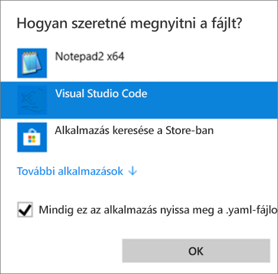
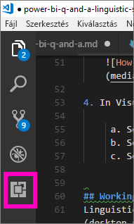
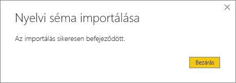

# <a name="edit-qa-linguistic-schema-and-add-phrasings-in-power-bi-desktop"></a>A Q&A nyelvi sémájának szerkesztése, és kifejezések hozzáadása a Power BI Desktopban 
Hatékony eszköz a munkához, ha gyakori kifejezéseken és természetes nyelven alapuló kérdéseket tud feltenni az adataival kapcsolatban. Még hatékonyabb, amikor az adatai választ is adnak. Amikor kérdést tesz fel a Power BI Q&A szolgáltatásának, a rendszer igyekszik a legpontosabban megválaszolni azt. Da ha még jobb Q&A-interakciókat szeretne elérni, javíthat a válaszokon. Az egyik módszer a nyelvi séma szerkesztése. 

Minden a céges adatokkal kezdődik.  Minél jobb az adatmodell, annál nagyobb eséllyel kapnak a felhasználók minőségi válaszokat. A modell továbbfejlesztésének egyik módja egy olyan nyelvi séma hozzáadása, amely meghatározza és kategorizálja a terminológiát és az adatkészletben található táblázat- és oszlopnevek közti kapcsolatokat. A nyelvi sémákat a Power BI Desktopban kezelheti. 

A Q&A funkciónak két oldala van.  Az első az előkészítés, vagy *modellezés*.  A második a kérdezés és az adatok tanulmányozása, más szóval a *felhasználás*. Egyes cégeknél *adatmodellezők* vagy informatikai rendszergazdák állítják össze az adatkészleteket, hozzák létre az adatmodelleket, és teszik közzé az adatkészleteket a Power BI-ban.  A cég más munkacsoportjai online módban „használják fel” az adatokat.  Lehetnek olyan cégek is, ahol kombinálódnak ezek a szerepek. 

Ez a cikk az adatmodellezők, az adatmodelleket a lehető legjobb Q&A-eredmények elérésére optimalizáló személyek számára íródott. 

## <a name="what-is-a-linguistic-schema"></a>Mi az a nyelvi séma?
A nyelvi séma azokat a szavakat és kifejezéseket írja le, amelyeket a Q&A szolgáltatásnak értenie kell egy adott adatkészletben található objektumokkal kapcsolatban, például az adatkészletre vonatkozó mondatrészek, rokonértelmű szavak és kifejezések. Adatkészlet importálása vagy a hozzá történő csatlakozás esetén a Power BI nyelvi sémát hoz létre az adatkészlet szerkezete alapján. A kérdés feltevését követően a Q&A az adatok közti egyezések és kapcsolatok keresésével deríti fel a kérdés célját. Például főneveket, igéket, mellékneveket, kifejezéseket és egyéb elemeket keres, valamint olyan típusú kapcsolatokat, hogy mely oszlopok egyeznek meg egy ige tárgyával. 

Ön már valószínűleg ismeri a mondatrészeket (ha nem, alább megtekintheti őket), de a *kifejezés* talán új fogalom lehet.  A kifejezés a dolgok közti kapcsolat leírásának (vagy *kifejezésének*) a módja. Például az ügyfelek és a termékek közti kapcsolat leírására a „customers buy products (az ügyfelek termékeket vásárolnak)” kifejezés használható. Az ügyfelek és életkorok közti kapcsolatról elmondható, hogy „ages indicate how old customers are (az életkor azt jelenti, hogy milyen idősek az ügyfelek)”. Az ügyfelek és a telefonszámok közti kapcsolat leírására a „customers have phone numbers (az ügyfeleknek telefonszámuk van)” kifejezés használható.

Az ilyen kifejezések számos formában és méretben jelennek meg. Némelyik közvetlenül megfelel az adatmodellen belüli kapcsolatoknak. Némelyik az oszlopokat kapcsolja össze a táblázatokkal, amelyek tartalmazzák azokat. Más kifejezések több táblázatot és oszlopot kötnek össze komplex kapcsolatok révén. De minden esetben köznapi szavakkal írják le az egyes dolgok közti kapcsolatokat.

A nyelvi sémákat .yaml formátumban menti a rendszer. Ez a formátum a népszerű JSON formátum rokona, de rugalmasabb és könnyebben olvasható szintaxist kínál. A nyelvi sémák a Power BI-ban szerkeszthetők, exportálhatók és importálhatók.

## <a name="prerequisites"></a>Előfeltételek

- Ha még nem olvasta a cikket arról, hogy [miképpen fejleszthető tovább az adatmodell a Q&A-hoz](q-and-a-best-practices.md), érdemes ezzel kezdenie. A cikk számos tanácsot sorol fel az adatmodell tervezéséhez és továbbfejlesztéséhez, és van benne egy fontos rész a rokonértelmű szavak felvételéről is.  
- [.yaml- és .pbix-mintafájlok](https://go.microsoft.com/fwlink/?linkid=871858) letöltése.   
- Telepítsen egy .yaml-szerkesztőt. A [Visual Studio Code](https://code.visualstudio.com/) használatát javasoljuk.

### <a name="set-up-an-editor-for-yaml-files"></a>Szerkesztő létrehozása .yaml-fájlokhoz
A nyelvi sémákat tartalmazó .yaml-fájlok szerkesztéséhez a Visual Studio Code használatát javasoljuk. A Visual Studio Code azonnal használható támogatást nyújt a .yaml-fájlok számára, és kiterjeszthető a Power BI nyelvi séma formátumának hitelesítésére is.
1. Telepítse a [Visual Studio Code](https://code.visualstudio.com/) szerkesztőt.    

2. Válassza ki a korábban mentett, nyelvi sémát tartalmazó mintafájlt: [.yaml-file](https://go.microsoft.com/fwlink/?linkid=871858) (SummerOlympics.lsdl.yaml).    
4. Válassza ki a **Visual Studio Code** és az **Always use this app to open .yaml files** (Mindig ezt az alkalmazás nyissa meg a .yaml-fájlokat) lehetőséget.

    

4. Telepítse a YAML támogatást a Visual Studio Code-ban a Red Hat-bővítménnyel.    
    a. Kattintson a **Bővítmények** fülre (bal oldalon az utolsó), vagy nyomja le a CTRL+SHIFT+X billentyűkombinációt.    
        
    b. Keressen rá a „yaml” kifejezésre, majd a listáról válassza a **YAML Support by Red Hat** (YAML-támogatás a Red Hat segítségével) lehetőséget.    
    c. Kattintson az **Install > Reload** elemre.


## <a name="working-with-linguistic-schemas"></a>Munka a nyelvi sémákkal

A nyelvi sémák használatával kétféleképpen dolgozhat. Az egyik módszer a .yaml szerkesztése, importálása és exportálása a menüszalagról a Power BI Desktopban. Ezt a módszert a Power BI [Q&A-eszköztár kezelőfelülete](q-and-a-tooling-intro.md) cikk írja le. A Q&A javításához nem kell megnyitnia a .yaml-fájlt. 

A nyelvi sémák szerkesztésének másik módja a .yaml-fájl közvetlen exportálása és szerkesztése.  A nyelvi sémát tartalmazó .yaml-fájl szerkesztésekor különböző nyelvtani elemekként címkézheti fel a táblázatban lévő oszlopokat, és meghatározhatja azokat a szavakat, amelyeket a munkatársai használhatnak egy kérdés megfogalmazásakor. Megadhatja például, hogy mely oszlopok legyenek az ige alanya és tárgya. Megadhat alternatív szavakat, amelyekkel a munkatársai utalhatnak a táblázatokra, oszlopokra és a modell mérőszámaira. 


A nyelvi séma szerkesztése előtt meg kell nyitnia (exportálnia kell) azt a Power BI Desktopból. A .yaml-fájl ugyanarra a helyre történő mentése importálásnak minősül.  De azt is megteheti, hogy más .yaml-fájlokat importál.  Például, ha van egy hasonló adatkészlete, amelybe már sok munkát fektetett a mondatrészek hozzáadásával, a kapcsolatok meghatározásával, a kifejezések és a rokonértelmű szavak létrehozásával, akkor használhatja ezt a .yaml-fájlt egy másik Power BI Desktop-fájlban. 

A Q&A ezeket az információkat együtt fogja felhasználni a pótlásokkal, amelyeket Ön a jobb válaszadás, automatikus kiegészítések és a kérdések összegzése érdekében adott hozzá.

## <a name="edit-a-linguistic-schema"></a>Nyelvi séma szerkesztése
Amikor az első nyelvi sémát exportálja a Power BI Desktopból, a Q&A motorja automatikusan létrehozza a fájl tartalmának nagy részét, vagy akár az egészet. Ezek a létrehozott entitások, szavak (vagy rokonértelmű szavak), kapcsolatok és kifejezések **State: Generated** (Állapot: Létrehozva) címkét kapnak. Elsősorban tájékoztatás céljából kerülnek a fájlba, de saját módosítások hasznos kiindulópontjaivá is válhatnak. 

> [!NOTE]
> Az oktatóanyagban lévő .yaml-mintafájl nem tartalmaz **State:Generated** vagy **State:Deleted** címkéket, mert kimondottan ehhez az oktatóanyaghoz készült. A címkék megtekintéséhez nyisson meg egy szerkesztetlen .pbix-fájlt Kapcsolat nézetben, és exportálja a nyelvi sémát.


Amikor visszaimportálja a nyelvi séma fájlját a Power BI Desktopba, a rendszer nem vesz tudomást a **State: Generated** címkével ellátott elemekről, és később ezeket újból létrehozza. Így, ha egy generált tartalmat szeretne módosítani, távolítsa el a megfelelő **State: Generated** címkét is. Hasonlóképpen, ha el kíván távolítani néhány létrehozott tartalmat, módosítsa a **State: Generated** címkét **State: Deleted** állapotra, így ez nem jön létre újra a nyelvi sémafájl importálásakor.

### <a name="export-then-import-a-yaml-file"></a>A .yaml-fájlt exportálása, majd importálása

1. Nyissa meg az adatkészletet a Power BI Desktop Modell nézetében. 
2. A **Modellezés** lapon válassza a **Nyelvi séma** > **Nyelvi séma exportálása** lehetőséget.
3. Mentse. A fájl neve az .lsdl.yaml kiterjesztéssel végződik.
4. Nyissa meg a Visual Code-ban vagy egy másik szerkesztőprogramban.
4. A Power BI Desktop Modell nézetében, a **Modellezés** lapon válassza a **Nyelvi séma** > **Nyelvi séma importálása** lehetőséget. 
6. Keresse meg azt a helyet, ahová a szerkesztett .yaml-fájlt mentette, és jelölje ki a fájlt. A nyelvi séma .yaml-fájljának sikeres importálását egy sikert jelző üzenet erősíti meg.

    

## <a name="phrasings-in-the-linguistic-schema"></a>Kifejezések a nyelvi sémában
A kifejezés a dolgok közti kapcsolat leírásának (vagy „kifejezésének”) a módja. Például az ügyfelek és a termékek közti kapcsolat leírására a „customers buy products (az ügyfelek termékeket vásárolnak)” kifejezés használható.

## <a name="where-do-phrasings-come-from"></a>Honnan kerülnek a kifejezések a rendszerbe?
A Power BI számos egyszerű kifejezést automatikusan hozzáad a nyelvi sémához a modell szerkezete és az oszlopneveken alapuló feltevések alapján. Például:
- A legtöbb oszlop az oszlopot tartalmazó táblázathoz kapcsolódik egy olyan egyszerű kifejezéssel, mint „products have descriptions (a termékekhez leírások tartoznak)”.
- A modellkapcsolatok a kapcsolat mindkét iránya számára alapértelmezett kifejezéseket eredményeznek, mint „orders have products (a megrendelésekhez termékek tartoznak)” és „products have orders (a termékekhez megrendelések tartoznak)”.
- Egyes modellkapcsolatok az oszlopok neve alapján összetettebb alapértelmezett kifejezéseket is kaphatnak, mint például „orders are shipped to cities (a megrendeléseket városokba szállítják)”.

A felhasználók azonban nagyon sokféleképpen beszélhetnek a dolgokról, a Q&A számára nem értelmezhető módon. Az ő kedvükért érdemes egyéni kifejezéseket felvenni manuálisan.

## <a name="why-add-phrasings"></a>Miért adja hozzá a kifejezéseket?
A kifejezés hozzáadását először is egy új szó meghatározása indokolhatja. Például, ha arra szeretné kérni a Q&A-t, hogy listázza a legidősebb ügyfeleket, („list the oldest customers”), először is meg kell tanítania az „idős” (old) szó jelentésére. Ezt egy olyan kifejezés hozzáadásával teheti meg, mint az „ages indicate how old customers are (az életkor azt jelenti, hogy milyen idősek az ügyfelek)”.

Az új kifejezések hozzáadásának második oka a kétértelműség megszüntetése. A kulcsszavakra történő egyszerű rákeresés csak akkor elég, ha a szavaknak egy jelentésük van. A „flights to Chicago (Chicagóba induló járatok)” például nem ugyanaz, mint a „flights from Chicago (Chicagóból induló járatok)”. A Q&A azonban nem tudhatja, melyikre gondolt, amíg hozzá nem adja a „flights are from departure cities (az indulás városából érkező járatok)” és a „flights are to arrival cities (az érkezés városába tartó járatok)” kifejezést. Hasonlóképpen, a Q&A csak akkor fogja megérteni a különbséget a „cars that John sold to Mary (az autók, amelyeket John adott el Marynek)” és a „cars that John bought from Mary (az autók, amelyeket John vásárolt Marytől)” kifejezés között, ha a „customers buy cars from employees (a vevők autókat vásárolnak az alkalmazottaktól)” és az „employees sell customers cars (az alkalmazottak autókat adnak el a vevőknek)” kifejezést is hozzáadta.

Végezetül pedig, az új kifejezés felvételét az átfogalmazások továbbfejlesztése is indokolhatja. Ahelyett, hogy a Q&A csak megismételné a „Show the customers and their products (A vevők és a termékeik megjelenítése)” kérdést, egyértelműbb lenne, ha azt mondaná, hogy „Show the customers and the products they bought (A vevők és az általuk vásárolt termékek megjelenítése)”, vagy „Show the customers and the products they reviewed (A vevők és az általuk értékelt termékek megjelenítése)”, attól függően, hogyan értelmezte a kérdést. Az egyéni kifejezések hozzáadása világosabbá és egyértelműbbé teszi az átfogalmazásokat.


## <a name="kinds-of-phrasings"></a>A kifejezések fajtái
A kifejezések különböző típusainak megértéséhez először is át kell ismételni néhány nyelvtani alapfogalmat:
- A *főnév* személyt, helyet vagy tárgyat jelöl. 
    Például: car, teenager, Marty, flux capacitor
- Az *ige* cselekvést, létezést vagy állapotot jelöl. 
    Például: hatch, burst, devour, eject
- A *melléknév* leíró szó, amely a főnevet módosítja. 
    Például: powerful, magical, golden, stolen
- Az *elöljárószó* az angolban a főnév előtt áll, és az előző főnévhez, igéhez vagy melléknévhez kapcsolja azt. Például: of, for, near, from
-  A *jelző* minőséget vagy tulajdonságot jelöl.
-  A *név* személyre, állatra, helyre vagy tárgyra utaló szó vagy szócsoport.   


### <a name="attribute-phrasings"></a>Jelzős kifejezések
A jelzős kifejezések a Q&A leggyakrabban használt eszközei ahhoz, hogy az egyik dologgal jellemezze a másikat. Egyszerűek, lényegre törőek, és elvégzik a munka oroszlánrészét, ha nem határozott meg árnyalt és részletesebb kifejezéseket. A jelzős kifejezések a „have (rendelkezik)” alapigével írhatók le („products have categories (a termékek kategóriával rendelkeznek)” és „host countries have host cities (az üzemeltető országok üzemeltető városokkal rendelkeznek)”). Emellett automatikusan engedélyezik az „of” és a „for” elöljárószót használó kérdéseket („categories of products (termékkategóriák)”, „orders for products (termékrendelések)”) és a birtokos szerkezetet („John’s orders (John megrendelései)”). A jelzős kifejezések az alábbi kérdésfajtákban használhatók:

- Which customers have orders (Mely vevőknek vannak megrendelései)?
- List host cities by country ascending (Listázd országok szerint növekvő sorrendben az üzemeltető városokat)
- Show orders that have chai (Mutasd a chai teát tartalmazó rendeléseket)
- List customers with orders (Listázd a vevőket, akiknek megrendeléseik vannak)
- What is the category of each product (Melyek az egyes termékkategóriák)?
- Count Robert King's orders (Számold össze Robert King megrendeléseit)    

A Power BI a modellben szükséges jelzős kifejezések túlnyomó többségét létrehozza a táblázatok/oszlopok tartalmazási kapcsolata és a modellkapcsolatok alapján. Általában nem kell Önnek létrehoznia a kifejezéseket.
Az alábbi példa egy jelzős kifejezés megjelenését mutatja a nyelvi sémában:

```json
product_has_category:
  Binding: {Table: Products}
  Phrasings:
  - Attribute: {Subject: product, Object: product.category}
```
 
### <a name="name-phrasings"></a>Neves kifejezések
A neves kifejezések akkor segítenek, ha az adatmodellben nevesített tárgyakat, például sportolók vagy vevők neveit tartalmazó táblázat van. Például a „product names are names of products (a terméknevek a termékek nevei)” kifejezés nélkülözhetetlen ahhoz, hogy termékneveket használhassunk a kérdésekben. A neves kifejezés lehetővé teszi a „named (nevű)” szó igeként való használatát is (például: „List customers named John Smith (A John Smith nevű vevők felsorolása)”). Fontosabb azonban a más kifejezésekkel való együttes szereplés, amelynek révén nevesített értékkel lehet utalni egy adott táblázatsorra. A „Customers that bought chai (Vevők, akik chai teát vásároltak)” kérdés esetén például a Q&A el tudja dönteni, hogy a „chai” érték a terméktáblázat teljes sorára vonatkozik, vagy csak az egyik érték a terméknévoszlopban. A neves kifejezések az alábbi kérdésfajtákban használhatók:    
- Which employees are named Robert King (Kik a Robert King nevű alkalmazottak)
- Who is named Ernst Handel (Kit hívnak Ernst Handelnek)
- Fernand De Montigny's sports (Fernand De Montigny sportágai)
- Count of athletes named Mary (Számold össze a Mary nevű sportolókat)
- What did Robert King buy (Mit vásárolt Robert King)?

Ha észszerű elnevezési konvenciót használt a modell oszlopaihoz (például „Name” vagy „ProductName” a „PrdNm” helyett), a Power BI automatikusan létrehozza a modellben szükséges neves kifejezések többségét, ezért általában nem kell Önnek létrehoznia azokat.

Az alábbi példa egy neves kifejezés megjelenését mutatja a nyelvi sémában:

```json
employee_has_name:
  Binding: {Table: Employees}
  Phrasings:
  - Name:
      Subject: employee
      Name: employee.name
```

 
### <a name="adjective-phrasings"></a>Mellékneves kifejezések
A mellékneves kifejezések új melléknevek segítségével írják le a modellben lévő dolgokat. Például: „happy customers are customers where rating > 6 (elégedett vevők azok, akiknél a pontszám > 6)” kifejezésre szükség van az olyan kérdések feltételéhez, mint a „list the happy customers in Des Moines (Listázd a Des Moins-ban lévő elégedett vevőket)”. A mellékneves kifejezéseknek a helyzettől függően számos formája van.

Az *egyszerű mellékneves kifejezések* feltételen alapuló új mellékneveket határoznak meg, mint például: „discontinued products are products where status = D (Megszűnt termékek azok, amelyek státusza = D)”. Az egyszerű mellékneves kifejezések az alábbi kérdésfajtákban használhatók:
- Which products are discontinued (Melyek a megszűnt termékek)?
- List the discontinued products (Listázd a megszűnt termékeket)
- List the gold medalists (Listázd az aranyérmeseket)
- Products that are backordered (Teljesítetlen rendelésekhez tartozó termékek)

Az alábbi példa egy egyszerű mellékneves kifejezés megjelenését mutatja a nyelvi sémában:

product_is_discontinued (megszűnt termék):

```json
Binding: {Table: Products}
  Conditions:
  - Target: product.discontinued
    Operator: Equals
    Value: true
  Phrasings:
  - Adjective:
      Subject: product
      Adjectives: [discontinued]
```

A *mértéket jelző mellékneves kifejezések* egy számértéken alapuló új melléknevet határoznak meg, amely a melléknév érvényességének mértékét mutatja, például: „lengths indicate how long rivers are (a hosszúság a folyók hosszát mutatja)”, és „small country/regions have small land areas (a kis országoknak/régióknak kis területük van)”. A mértéket jelző mellékneves kifejezések az alábbi kérdésfajtákban használhatók:
- List the long rivers (Listázd a hosszú folyókat)
- Which rivers are the longest (Melyek a leghosszabb folyók)?
- List the smallest country/regions that won gold in basketball (Listázd a legkisebb országot/régiókat, amelyek aranyérmet nyertek kosárlabdában)
- How long is the Rio Grande? (Milyen hosszú a Rio Grande?)

Az alábbi példa egy mértéket jelző mellékneves kifejezés megjelenését mutatja a nyelvi sémában:

river_has_length (a folyónak hosszúsága van):

 ```json
Binding: {Table: Rivers}
  Phrasings:
  - Adjective:
      Subject: river
      Adjectives: [long]
      Antonyms: [short]
      Measurement: river.length
```

A *dinamikus mellékneves kifejezések* a modell egyik oszlopának értékein alapuló új melléknevek halmazát határozzák meg, például: a „colors describe products (a színek termékeket írnak le)” és az „events have event genders (a versenyeknek nemük van)”. A dinamikus mellékneves kifejezések az alábbi kérdésfajtákban használhatók:
- List the red products (Listázd a piros termékeket)
- Which products are green (Mely termékek zöldek)?
- Show skating events for females (Mutasd a női műkorcsolyaversenyeket)
- Count issues that are active (Számold meg az aktív problémákat)

Az alábbi példa egy dinamikus mellékneves kifejezés megjelenését mutatja a nyelvi sémában:

product_has_color (a termék színes):
```json
Binding: {Table: Products}
  Phrasings:
  - DynamicAdjective:
      Subject: product
      Adjective: product.color
```

 
### <a name="noun-phrasings"></a>Főneves kifejezések
A főneves kifejezések a modellben lévő dolgok részhalmazait leíró új főneveket határozzák meg. Gyakran szerepelnek köztük a modellhez tartozó mértékek vagy feltételek. Például az olimpiás modellünkhöz hozzáadhatunk olyan kifejezéseket, amelyek megkülönböztetik a bajnokokat az érmesektől, a labdajátékokat a vízi sportoktól, a csapatokat az egyéni versenyzőktől, vagy megkülönböztetik a versenyzők egyes korcsoportjait (ifjúsági, felnőtt, szenior) stb. A filmadatbázisunkhoz hozzáadhatunk olyan főneves kifejezéseket, mint a „flops are movies where net profit < 0 (bukás az a film, ahol a nettó nyereség < 0)”, és így már feltehetjük a „count the flops by year (a bukások évenkénti számának összeszámolása)” típusú kérdéseket. A főneves kifejezéseknek a helyzettől függően két formája van.

Az *egyszerű főneves kifejezések* az új főnevet egy feltétel alapján határozzák meg, mint: „contractors are employees where full time = false (szerződésesek azok az alkalmazottak, akiknél a teljes munkaidő = false)”, vagy „champion is athlete where count of medals >5 (bajnok az a sportoló, akinél az érmek száma >5)”. Az egyszerű főneves kifejezések az alábbi kérdésfajtákban használhatók:

- Which employees are contractors (Kik a szerződéses alkalmazottak)?
- Count the contractors in Portland (Számold meg a Portlandben lévő szerződéseseket)
- How many champions in 2016 (Hány bajnok volt 2016-ban)

Az alábbi példa egy egyszerű főnévi kifejezés megjelenését mutatja a nyelvi sémában:

employee_is_contractor (az alkalmazott szerződő fél):

```json
Binding: {Table: Employees}
  Conditions:
  - Target: employee.full_time
    Operator: Equals
    Value: false
  Phrasings:
  - Noun:
      Subject: employee
      Nouns: [contractor]
```

A *dinamikus főneves kifejezések* a modell egyik oszlopának értékein alapuló új főnevek halmazát határozzák meg, például „jobs define subsets of employees (a munkakörök meghatározzák az alkalmazottak részhalmazait)”. A dinamikus főneves kifejezések az alábbi kérdésfajtákban használhatók:

- List the cashiers in Chicago (Listázd a pénztárosokat Chicagóban)
- Which employees are baristas (Kik a barista alkalmazottak)?
- List the referees in 1992 (Listázd a bírókat 1992-ben)

Az alábbi példa egy dinamikus főneves kifejezés megjelenését mutatja a nyelvi sémában: employee_has_job (az alkalmazottnak munkája van):

 ```json
Binding: {Table: Employees}
  Phrasings:
  - DynamicNoun:
      Subject: employee
      Noun: employee.job
```

### <a name="preposition-phrasings"></a>Elöljárószós kifejezések
Az elöljárószós kifejezések azt írják le, hogy a modellben lévő dolgokat miképpen kötik össze az elöljárószók. Például a „cities are in countries (a városok az országokban vannak)” kifejezés megkönnyíti az olyan kérdések megértését mint a „count the cities in Washington (Számold meg a Washington államban lévő városokat)”. Egyes elöljárószós kifejezések automatikusan létrejönnek, ha egy oszlopot a rendszer földrajzi entitásként ismer fel. Az elöljárószós kifejezések az alábbi kérdésfajtákban használhatók:

- Count the customers in New York (Számold össze a vevőket New Yorkban)
- List the books about linguistics (Listázd a nyelvészetről szóló könyveket)
- Melyik városban van Robert King?
- How many books are by Stephen Pinker (Hány könyvet írt Stephen Pinker)?
 
Az alábbi példa egy elöljárószós kifejezés megjelenését mutatja a nyelvi sémában: customers_are_in_cities (a vevők a városokban vannak):

 ```json
Binding: {Table: Customers}
  Phrasings:
  - Preposition:
      Subject: customer
      Prepositions: [in]
      Object: customer.city
```

 
### <a name="verb-phrasings"></a>Igés kifejezések
Az igés kifejezések azt írják le, hogy a modellben lévő dolgokat hogyan kapcsolják össze az igék. Például a „customers buy products (a vevők termékeket vásárolnak)” kifejezés megkönnyíti az olyan kérdések értelmezését, mint „who bought cheese (ki vásárolt sajtot)?” és „what did John buy (mit vásárolt John)?” Az igés kifejezések az összes kifejezés közül a legrugalmasabbak, és gyakran kapcsolnak össze több elemet, például: “employees sell customers products (az alkalmazottak termékeket adnak el a vevőknek)”. Az igés kifejezések az alábbi kérdésfajtákban használhatók:

- Who sold what to whom (Ki adott el mit és kinek)?
- Which employee sold chai to John (Melyik alkalmazott adott el chai teát Johnnak)?
- How many customers were sold chai by Mary (Hány vevőnek adott el chai teát Mary)?
- List the products that Mary sold to John (Listázd a termékeket, amelyeket Mary adott el Johnnak).
- Which discontinued products were sold to Chicago customers by Boston employees (Milyen megszűnt termékeket adtak el bostoni alkalmazottak chicagói vevőknek)?

Az igés kifejezések elöljárószós kifejezéseket is tartalmazhatnak, ami tovább növeli rugalmasságukat, mint ezekben az esetekben: „athletes win medals at competitions (a sportolók a versenyeken érmeket nyernek)”, és „customers are given refunds for products (a vevők visszatérítéseket kapnak a termékekért)”. Az elöljárószós kifejezéseket tartalmazó igés kifejezések az alábbi kérdéstípusokban használhatók:

- How many athletes won a gold medal at the Visa Championships (Hány sportoló nyert aranyérmet a Visa Bajnokságon)?
- Which customers were given a refund for cheese (Kik azok a vevők, akik sajtért kaptak visszatérést)?
- At which competition did Danell Leyva win a bronze medal (Melyik versenyen nyert bronzérmet Danell Leyva)?

Egyes igés kifejezések automatikusan létrejönnek, ha a rendszer felismeri, hogy egy oszlop igét és elöljárószót is tartalmaz.

Az alábbi példa egy igés kifejezés megjelenését mutatja a nyelvi sémában: customers_buy_products_from_salespeople (a vevők termékeket vásárolnak az eladóktól):

```json
Binding: {Table: Orders}
  Phrasings:
  - Verb:
      Subject: customer
      Verbs: [buy, purchase]
      Object: product
      PrepositionalPhrases:
      - Prepositions: [from]
        Object: salesperson
```

### <a name="relationships-with-multiple-phrasings"></a>Több kifejezéssel leírható kapcsolatok
Gyakran előfordul, hogy ugyanaz a kapcsolat többféleképpen is leírható. Ebben az esetben ugyanahhoz a kapcsolathoz egynél több kifejezés tartozik. A táblázatentitások és az oszlopentitások közötti kapcsolatot sokszor egy jelzős és egy másik kifejezés is leírja. Például a vevő és a vevő neve közötti kapcsolatot érdemes leírni egy jelzős kifejezéssel („customers have names (a vevőknek nevük van)”) és egy neves kifejezéssel egyaránt („customer names are the names of customers (a vevőnevek a vevők neve)”), így mindkét kérdéstípust fel lehet tenni.

Az alábbi példa egy két kifejezéssel rendelkező kapcsolat megjelenését mutatja a nyelvi sémában: customer_has_name (a vevőnek neve van):

  ```json
Binding: {Table: Customers}
  Phrasings:
    - Attribute: {Subject: customer, Object: customer.name}
    - Name:
        Subject: customer
        Object: customer.name
```

Egy másik példa lehet az, ha a „customers buy products from employees (a vevők termékeket vásárolnak az alkalmazottaktól)” kapcsolathoz hozzáadódik az „employees sell customers products (az alkalmazottak termékeket adnak el a vevőnek)” kifejezés. Vegye figyelembe, hogy az „employees sell products *to customers* (az alkalmazottak termékeket adnak el a vevőknek)”, vagy a „products are sold to customers *by employees* (a termékeket az alkalmazottak adják el a vevőknek)” változatokat nem kell hozzáadnia, mert a Q&A automatikusan felkínálja az alany és a közvetett tárgy „by” vagy „to” elöljárószós változatait.

## <a name="considerations-and-troubleshooting"></a>Megfontolandó szempontok és hibaelhárítás
Ha egy, a nyelvi séma formátumának nem megfelelő .lsdl.yaml fájlt módosít, a megjelenő érvényesítési hibák jelzik a problémákat: 


További kérdései vannak? [Kérdezze meg a Power BI közösségét](http://community.powerbi.com/)
