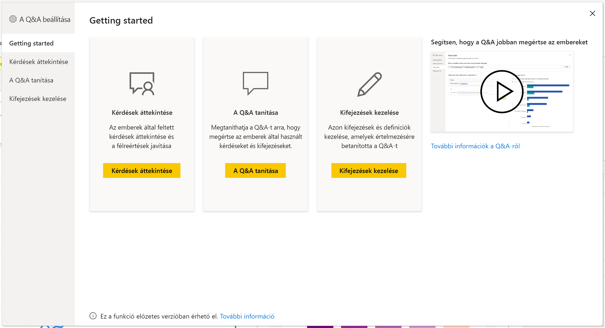
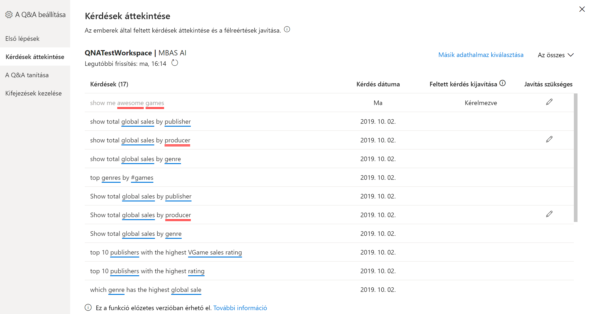
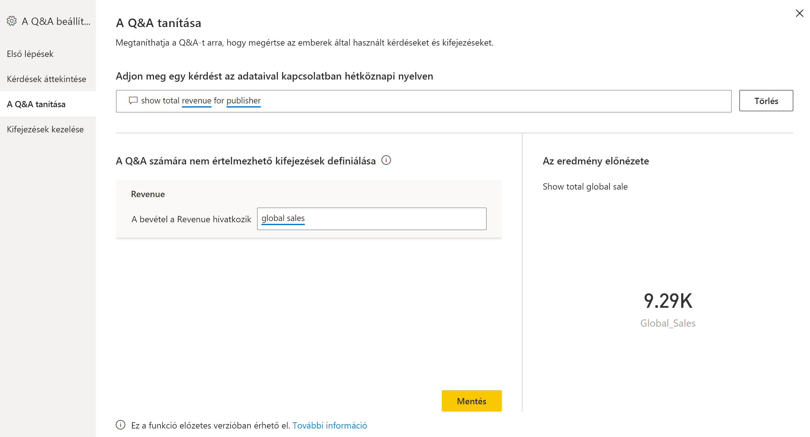
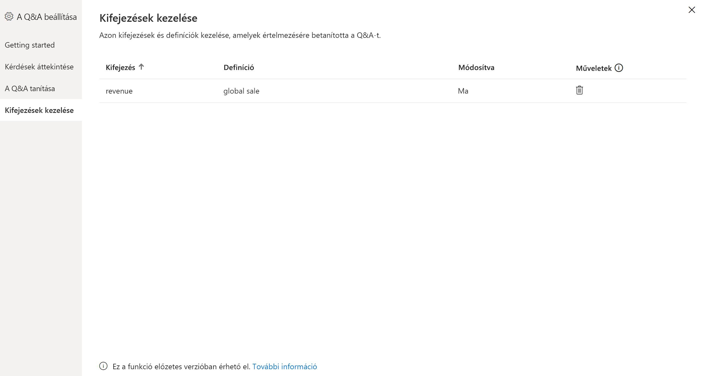
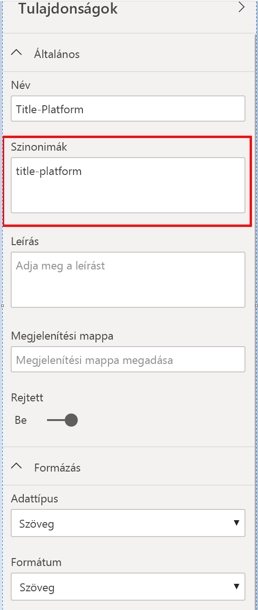

# Bevezetés a Q&A-eszközök használatába a Power BI Q&A tanításához (előzetes verzió)

A Power BI Q&A-*eszközökkel* javíthatja a felhasználók természetes nyelvi élményét. Tervezőként vagy rendszergazdaként három területen találkozhat a természetes nyelvi motorral, és fejlesztheti azt tovább: 

- A felhasználók által feltett kérdések áttekintése.
- A Q&A tanítása a kérdések megértése érdekében.
- A Q&A-nek megtanított kifejezések kezelése.

A dedikált eszközök ezen képességei mellett a Power BI Desktop **Modellezés** lapján további lehetőségek érhetők el:  

- Szinonimák
- Sorfeliratok
- Elrejtés a Q&A-ben
- Nyelvi séma konfigurálása (speciális)

## A Q&A-eszközök használatának első lépései

A Q&A-eszközök csak a Power BI Desktopban érhetők el, és jelenleg csak az importálási módot támogatják.

1. Nyissa meg Power BI Desktopot, és hozzon létre egy vizualizációt a Q&A-vel. 
2. Válassza a fogaskerék ikont a vizualizáció sarkában. 

    

    Ekkor megnyílik az Első lépések lap.  

    

### Kérdések áttekintése

Válassza a **Kérdések áttekintése** lehetőséget a bérlő a Power BI szolgáltatásban használt adathalmazai listájának megtekintéséhez. A **Kérdések áttekintése** lapon az adathalmaz tulajdonosa, a munkaterület és a legutóbbi frissítés dátuma is megjelenik. Itt kiválaszthat egy adathalmazt, és megtekintheti, hogy a felhasználók milyen kérdéseket tettek fel. Az adatok között azok a szavak is megjelennek, amelyeket nem ismert fel a rendszer. Az összes itt megjelenő adat az elmúlt 28 napra vonatkozik.

### A Q&A tanítása

**A Q&A tanítása** szakaszban betaníthatja a Q&A-t szavak felismerésére. A kezdéshez adjon meg egy olyan szót vagy szavakat tartalmazó kérdést, amelyet vagy amelyeket a Q&A nem ismer fel. A Q&A bekéri a kifejezés definícióját. Adjon meg egy olyan szűrőt vagy mezőnevet, amely megfelel annak, amit az adott szó jelöl. A Q&A ezután újból értelmezi az eredeti kérdést. Ha elégedett az eredménnyel, mentheti a bemenetet. További információért lásd: [A Q&A tanítása](q-and-a-tooling-teach-q-and-a.md)

### Kifejezések kezelése

Itt minden megjelenik, amit A Q&A tanítása szakaszból mentett, így áttekintheti vagy törölheti a definiált kifejezéseket. A meglévő definíciókat jelenleg nem lehet szerkeszteni, ezért a kifejezés újbóli definiálásához törölnie kell az adott kifejezést, majd újból létre kell hoznia azt.

## A Q&A egyéb beállításai

### Tömeges szinonimák

A Power BI Desktop **Modellezés** lapján további lehetőségek érhetők el a Q&A felhasználói élményének javítására. 

1. Válassza a Modellező nézetet a Power BI Desktopban.

2. Ha kiválaszt egy mezőt vagy egy táblát, megjelenik a **Tulajdonságok** panel.  Ez a panel a vászon jobb oldalán jelenik meg, és számos Q&A-művelet van felsorolva benne. Az egyik lehetőség a **Szinonimák**. A **Szinonimák** mezőben gyorsan definiálhat alternatívákat a kiválasztott táblához vagy mezőhöz. Emellett az Eszközök párbeszédpanel **A Q&A tanítása** szakaszában is definiálhat szinonimákat, de gyakran gyorsabb, ha egy tábla számos mezőjéhez definiál szinonimákat itt.

    

3. Ha több szinonimát szeretne definiálni egyetlen mezőhöz, a következő szinonimát vesszőkkel jelölje.

### Elrejtés a Q&A-ben

A mezőket és a táblákat el is rejtheti, hogy azok ne jelenjenek meg a Q&A eredményei között. 

1. Válassza a Modellező nézetet a Power BI Desktopban.

2. Válasszon ki egy mezőt vagy egy táblát, hogy megjelenjen a **Tulajdonságok** panel, majd a **Rejtett** beállítást kapcsolja **Be**.

    A Q&A figyelembe veszi ezt a beállítást, és biztosítja, hogy a Q&A ne ismerje fel ezt a mezőt. Előfordulhat például, hogy el szeretné rejteni az azonosítómezőket és a külső kulcsokat, hogy elkerülje a felesleges, azonos nevű ismétlődő mezők használatát. Még ha el is rejti a mezőt, a Power BI Desktopban, a Q&A-n kívüli vizualizációkban továbbra is használhatja azt.

### Sorfelirat beállítása

A sorfeliratokkal meghatározhatja, hogy melyik oszlop (vagy *mező*) azonosítja a legjobban egy tábla adott sorát. Egy Customer (Ügyfél) nevű tábla esetében például a sorfelirat általában a Display Name (Megjelenített név). Ha kiegészítő metaadatokat ad meg, a Q&A hasznosabb vizualizációt tud megjeleníteni, amikor a felhasználók a Show me sales by customer (Értékesítések megjelenítése ügyfél szerint) kifejezést írják be. Ahelyett, hogy a customer (ügyfél) kifejezést táblaként kezelné, használhatja a Display Name (Megjelenített név) mezőt, és az egyes ügyfelek értékesítéseit ábrázoló sávdiagramot jeleníthet meg. A sorfeliratot csak a Modellezés nézetben lehet beállítani. 

1. Válassza a Modellező nézetet a Power BI Desktopban.

2. Ha kiválaszt egy táblát, megjelenik a **Tulajdonságok** panel.

3. A **Sorfelirat** mezőben adjon meg egy mezőt.

## A nyelvi séma konfigurálása (speciális)

A Power BI-ban teljes egészében betaníthatja és javíthatja a Q&A-beli természetes nyelvi motort, beleértve a mögöttes természetes nyelvi eredmények pontozásának és súlyozásának módosítását is. További információért lásd: [A Q&A nyelvi sémájának szerkesztése, és kifejezések hozzáadása](q-and-a-tooling-advanced.md).

## Következő lépések

A természetes nyelvi motor fejlesztéséhez számos ajánlott eljárás áll rendelkezésre. További információkat a következő cikkekben talál:

* [Q&A – ajánlott eljárások](q-and-a-best-practices.md)
