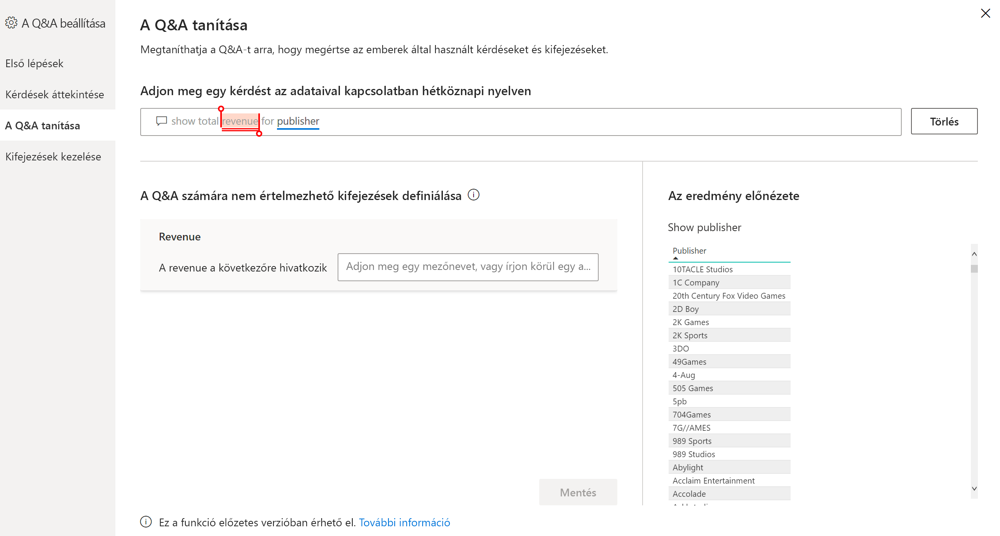
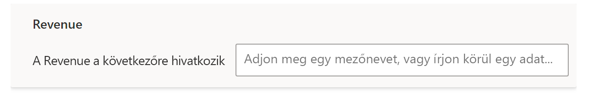
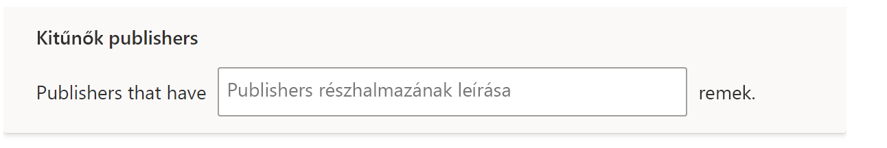

# A Q&A megtanítása arra, hogy megértse a Power BI Q&A-ben használt kérdéseket és kifejezéseket

A Q&A beállításának **A Q&A tanítása** szakaszában megtaníthatja a Q&A-t arra, hogy megértse azokat a természetes nyelvi kérdéseket és kifejezéseket, melyeket nem ismert fel. A kezdéshez egy olyan szót vagy szavakat tartalmazó kérdést kell elküldenie, amelyet vagy amelyeket a Q&A nem ismert fel. A Q&A ezután kéri, hogy definiálja a kifejezést. Egy olyan szűrőt vagy mezőnevet kell megadnia, amely megfelel annak, amit az adott szó jelöl. A Q&A ezután újból értelmezi az eredeti kérdést. Ha elégedett az eredménnyel, mentse őket.

> [!NOTE]
> A Q&A tanítása funkció csak az importálási módot támogatja. Emellett még nem támogatja a helyszíni vagy Azure Analysis Services-beli adatforráshoz való kapcsolódást. A Power BI későbbi kiadásaiban elvileg el lesz távolítva ez a korlátozás.

## A Q&A tanításának megkezdése

1. A Power BI Desktopban, a **Modellezés** menüszalagon válassza **A Q&A beállítása** > **A Q&A tanítása** lehetőséget.

    

2. Írjon be egy olyan mondatot, amelyben szerepel egy kifejezés, amelyet a Q&A nem ismer fel, majd válassza a **Küldés** lehetőséget.

3. Jelölje ki a pirossal aláhúzott szót. 

    A Q&A javaslatokat jelenít meg, és kéri, hogy adja meg a kifejezés helyes definícióját. 
    
3. **A Q&A számára nem értelmezhető kifejezések definiálása** szakaszban adjon meg egy definíciót.

    

4. A frissített vizualizáció előnézetének megtekintéséhez válassza a **Mentés** lehetőséget.

5. Adja meg a következő kérdést, vagy válassza az **X**-et a bezáráshoz.

A jelentések felhasználói számára ez a változás egészen addig nem látható, amíg a jelentést nem teszi közzé újból a szolgáltatásban.

## Főnevek és melléknevek definiálása

A kifejezések következő két típusát taníthatja meg a Q&A-nek:

- Főnevek
- Melléknevek

### Főnév szinonimájának definiálása

Az adatok kezelése során gyakran szerepelhetnek olyan mezőnevek, amelyekre alternatív nevekkel is lehet hivatkozni. Ilyen lehet például a Sales (Értékesítések). Több szóval vagy kifejezéssel is lehet az értékesítésekre hivatkozni, ilyen például a revenue (bevétel). Ha egy oszlop neve Sales (Értékesítések), és a jelentések felhasználói a revenue (bevétel) kifejezést írják be, lehetséges, hogy a Q&A nem tudja kiválasztani a megfelelő oszlopot a kérdés helyes megválaszolásához. Ebben az esetben érdemes megadni a Q&A-nek, hogy a Sales (Értékesítések) és a Revenue (Bevétel) kifejezés ugyanarra a dologra utal.

A Q&A a Microsoft Office ismeretei alapján automatikusan észleli, ha egy ismeretlen szó főnév. Ha a Q&A egy főnevet észleli, a következőképpen kér be adatokat:

- <your term> **a következőre hivatkozik:** 

Az adatokból származó kifejezéssel kell kitöltenie a mezőt.

Ha nem az adatmodellből származó mezőt, hanem valami mást ad meg, előfordulhat, hogy nemkívánatos eredményt kap.

### Melléknév szűrőfeltételének definiálása

Néha előfordulhat, hogy olyan kifejezéseket szeretne meghatározni, amelyek a mögöttes adatokra vonatkozó feltételként szolgálnak. Ilyen lehet például az Awesome Publishers (Lenyűgöző közzétevők). Az Awesome (Lenyűgöző) egy olyan feltétel lehet, amely csak azokat a közzétevőket választja ki, akik X számú terméket tettek közzé. A Q&A megpróbálja észlelni a mellékneveket, mely során egy másik adatkérés jelenik meg:

- <field name> **amelyek a következőkkel rendelkeznek:**  

A mezőben kell megadnia a feltételt.

Néhány példa a megadható feltételekre:

- Country (Ország), amely a(z) USA
- Country (Ország), amely nem a(z) USA
- Weight (Súly) > 2000
- Weight (Súly) = 2000
- Weight (Súly) < 2000

Az eszközökben csak egyetlen feltételt adhat meg. Összetettebb feltételek megadásához a DAX-szal hozzon létre egy számított oszlopot, majd az eszközök szakaszában hozzon létre egyetlen feltételt erre a számított oszlopra vonatkozóan. A mértékek használata nem támogatott. Ezek helyett használjon számított oszlopokat.

## Kifejezések kezelése

A definíciók megadása után visszaléphet az összes elvégzett javítás megtekintéséhez, és szerkesztheti vagy törölheti is azokat. 

1. **A Q&A beállítása** funkcióban lépjen a **Kifejezések kezelése** szakaszra.

2. Törölje azokat a kifejezéseket, melyekre már nincs szüksége. A kifejezéseket jelenleg nem lehet szerkeszteni. Egy kifejezés újradefiniálásához törölje a kifejezést, majd definiálja azt.

    

## Következő lépések

A természetes nyelvi motor fejlesztéséhez számos ajánlott eljárás áll rendelkezésre. További információkat a következő cikkekben talál:

* [Q&A – ajánlott eljárások](q-and-a-best-practices.md)
