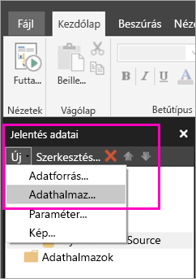
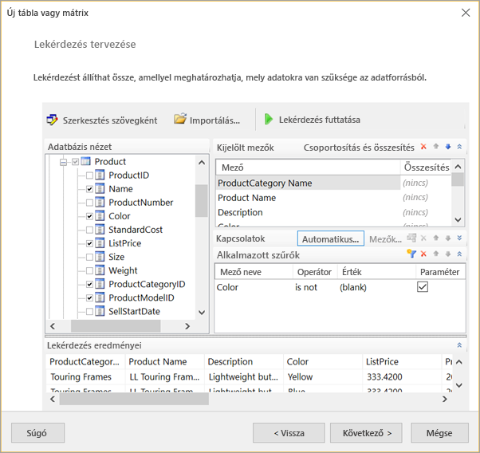
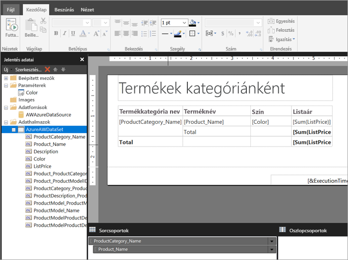

# Beágyazott adathalmaz létrehozása lapszámozott jelentéshez a Power BI szolgáltatásban

Ebből a cikkből elsajátíthatja, hogyan hozhat létre beágyazott adathalmazt egy beágyazott adatforrás alapján lapszámozott jelentéshez a Power BI szolgáltatásban. A beágyazott adatkészleteket egyetlen lapszámozott jelentés tartalmazza a jelentésben való használathoz. Jelenleg a Power BI szolgáltatásban közzétett lapszámozott jelentésekhez beágyazott adathalmazok és beágyazott adatforrások szükségesek. A beágyazott adatforrást és adatkészletet a Power BI Jelentéskészítőben hozhatja létre a jelentés létrehozásakor. 

Az adathalmaz létrehozása előtt létre kell hoznia egy adatforrást. Ennek mikéntjéről a Power BI szolgáltatásban a [Beágyazott adatforrások lapszámozott jelentésekhez](paginated-reports-embedded-data-source.md) című cikkből tájékozódhat.
  
## Beágyazott adathalmaz létrehozása
  
1. Válassza ki a Jelentésadatok panelen a Power BI Jelentéskészítőben az **Új** > **Adatkészlet** lehetőséget.

1. Adjon egy nevet az adathalmaznak az **Adatkészlet tulajdonságai**párbeszédpanel**Lekérdezés** lapján. A beágyazott adatforrás már szerepel az **Adatforrás** mezőben, vagy az **Új** lehetőség kiválasztásával létrehozhat egy másik beágyazott adatforrást.
 
     

3. A **Lekérdezéstípus** alatt válassza ki az adatkészlethez használni kívánt parancs vagy lekérdezés típusát. 
    - A **Szöveg** egy lekérdezést futtat az adatbázis adatainak lekéréséhez. Ez az alapértelmezett beállítás, és a legtöbb lekérdezésekhez használatos. Írjon be egy lekérdezést, vagy importáljon egy már létező lekérdezést az **Importálás** választásával. A lekérdezés grafikusan összeállításához, válassza a **Lekérdezéstervező** lehetőséget. Ha a Lekérdezéstervezőt használja lekérdezés összeállításához a lekérdezés szövege ebben a mezőben jelenik meg. Válassza a **Kifejezés** (**fx**) gombot, ha egy kifejezést szeretne használni a lekérdezés dinamikus generálásához. 
    - A **Tábla** használatával kiválaszthatja az összes mezőt egy táblán belül. Adja meg a tábla nevét, amely adatkészletként szeretne használni.
    - A **Tárolt eljárás** név szerint futtat egy tárolt eljárást.

4. A Lekérdezéstervezőben megtekintheti az adatkészletben lévő táblákat és mezőket, műveleteket végezhet velük, lekérdezést importálhat vagy szövegként szerkeszthet. Szűrőket és paramétereket is felvehet. 

    

5. Válassza a Lekérdezéstervezőben a **Lekérdezés futtatása** lehetőséget a teszteléshez, majd válassza az **OK** gombot.

1. Térjen vissza az Adatkészlet tulajdonságai párbeszédpanelhez, és az **Időtúllépés (másodpercben)** mezőbe írja be másodpercben a lekérdezés időkorlátját. Az alapértelmezett érték 30 mp. Az **Időtúllépés** mezőt üresen kell hagyni, vagy nullánál nagyobb értékű lehet. Ha üres, a lekérdezésnek nem lesz időkorlátja.

7.  Az adatkészlet egyéb tulajdonságait a többi lapon állíthatja be:
    - Számított mezőket a **Mezők** lapon hozhat létre.
    - Speciális beállításokat a **Beállítások** lapon adhat meg.
    - A **Szűrők** és a **Paraméterek** hozzáadása vagy frissítése a megfelelő lapokon történik.

8. Válassza az **OK** gombot.
 
   A jelentés a Jelentéstervező nézetben jelenik meg. Az adatforrás, az adatkészlet és az adatkészletmezők gyűjteménye megjelenik a Jelentésadatok panelen, és folytathatja a lapszámozott jelentés tervezését.  

     
 
## Következő lépések 

- [Mik a lapszámozott jelentések a Power BI Premiumban?](paginated-reports-report-builder-power-bi.md)  
- [Oktatóanyag: Lapszámozott jelentés létrehozása és feltöltése a Power BI szolgáltatásba](paginated-reports-quickstart-aw.md)
- [L jelentés közzététele a Power BI szolgáltatásban](paginated-reports-save-to-power-bi-service.md)

