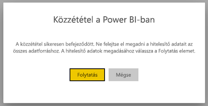
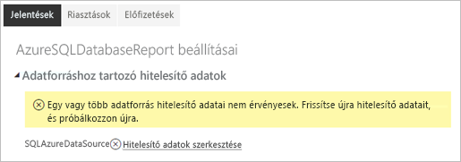

# A Power BI többoldalas jelentéseihez használható támogatott adatforrások

Ez a cikk leírja a Power BI szolgáltatás többoldalas jelentései által támogatott adatforrásokat, és ismerteti az Azure SQL Database-adatforrások csatlakoztatásának módját. Egyes adatforrások natív támogatást élveznek. Azokat, amelyek nem, adatátjárók segítségével csatlakoztathatja.

## Natív módon támogatott adatforrások

A többoldalas jelentések natív módon támogatják a következő adatforrásokat:

| Adatforrás | Hitelesítés | Megjegyzések |
| --- | --- | --- |
| Azure SQL Database  Azure SQL Data Warehouse | Alapszintű, egyszeri bejelentkezés (SSO), OAuth2 |   |
| Azure SQL felügyelt példány | Alapszintű | nyilvános végponton keresztül az Azure SQL Database bővítmény használatával  |
| Azure Analysis Services | SSO, OAuth2 |   |
| Power BI-adathalmaz | SSO | Prémium és nem prémium szintű Power BI-adathalmazok. Olvasási engedélyt igényel |
| Prémium szintű Power BI-adathalmaz (XMLA) | SSO |   |
| Adatok megadása | N.A. | Az adatok a jelentésbe ágyazva érhetők el. |

Az Azure SQL Database kivételével az összes forrás azonnal használható, amint a felhasználó feltölti a jelentést a Power BI szolgáltatásba. Ha lehetséges, az adatforrások alapértelmezés szerint az egyszeri bejelentkezést (SSO) használják. Az Azure Analysis Services esetében az OAuth2 hitelesítési típust is választhatja.

Az Azure SQL Database-adatforrások esetében több információt kell megadnia. Erről [Az Azure SQL Database hitelesítése](#azure-sql-database-authentication) részben tudhat meg többet.

## Más adatforrások

A fent felsorolt natív módon támogatott adatforrások mellett egy [Power BI-adatátjáró](service-gateway-onprem.md) segítségével a következő adatforrások is használhatók:

- SQL Server
- SQL Server Analysis Services
- Oracle
- Teradata

A többoldalas jelentések esetében a Azure SQL Database és az Azure Analysis Services jelenleg nem érhető el Power BI-adatátjárón keresztül.

## Az Azure SQL Database hitelesítése

Az Azure SQL Database-adatforrások esetében a jelentés futtatása előtt be kell állítania egy hitelesítési típust. Ezt csak akkor kell megtenni, amikor első alkalommal használja az adatforrást a munkaterületen. Először a következő üzenet jelenik meg:

Ha nem ad meg hitelesítő adatokat, a jelentés futtatásakor a rendszer hibába fog ütközni. A feltöltött jelentés **Adatforráshoz tartozó hitelesítő adatok** oldalának megnyitásához válassza a **Tovább** lehetőséget:

A **Beállítás** párbeszédpanel megnyitásához válassza a kívánt adatforráshoz tartozó **Hitelesítő adatok szerkesztése** hivatkozást:

Az Azure SQL Database-adatforrások a következő hitelesítési típusokat támogatják:

- Alapszintű (felhasználónév és jelszó)
- Egyszeri bejelentkezés (SSO)
- OAuth2 (tárolt AAD-jogkivonat)

Ahhoz, hogy az egyszeri bejelentkezés és az OAuth2 megfelelően működjön, az Azure SQL Database-kiszolgálón, amelyhez az adatforrás csatlakozik, [engedélyezni kell az AAD-hitelesítés támogatását](https://docs.microsoft.com/azure/sql-database/sql-database-aad-authentication-configure). Az OAuth2 hitelesítési módszer esetében az AAD létrehoz és tárol egy jogkivonatot az adatforrásokhoz való jövőbeli hozzáféréshez. Ha szeretné inkább az [egyszeri bejelentkezéses hitelesítési módszert](https://docs.microsoft.com/power-bi/service-azure-sql-database-with-direct-connect#single-sign-on) használni, válassza ki az egyszeri bejelentkezéshez tartozó beállítást az OAuth2 alatt. **A végfelhasználók saját OAuth2 hitelesítő adatokkal férhetnek hozzá ehhez az adatforráshoz a DirectQueryn keresztül**.
  
## Következő lépések

[Lapszámozott jelentés megtekintése a Power BI szolgáltatásban](consumer/paginated-reports-view-power-bi-service.md)

További kérdései vannak? [Kérdezze meg a Power BI közösségét](https://community.powerbi.com/)
