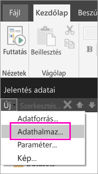
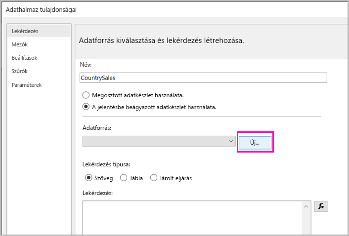
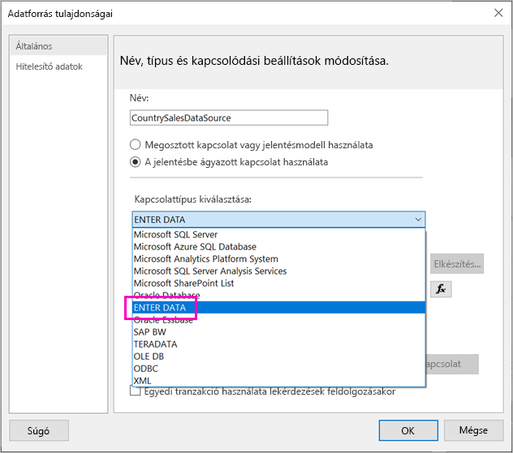
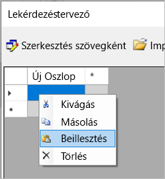
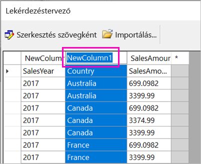
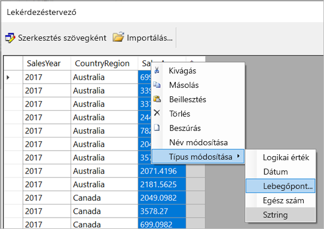
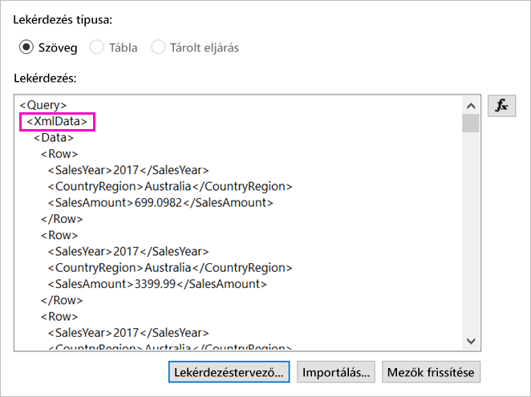
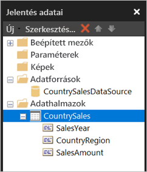

# <a name="enter-data-directly-in-a-paginated-report-in-report-builder-preview---power-bi"></a>Adatok megadása közvetlenül többoldalas jelentésben a jelentéskészítőben (előzetes verzió) - Power BI

Ebben a cikkben megismerkedhet az SQL Server 2016 jelentéskészítője új verziójának egy funkcióját, amellyel közvetlenül egy RDL-jelentésben adhat meg adatokat beágyazott adatkészletként.  Ez a funkció hasonlóan működik a Power BI Desktophoz. Az adatokat közvetlenül a jelentés egy adatkészletében adhatja meg, vagy beillesztheti egy másik programból, például a Microsoft Excelből. Miután létrehozta az adatkészletet az adatok megadásával, azt ugyanúgy használhatja, mint bármely más beágyazott adatkészletet. Emellett több táblázatot is hozzáadhat, és egyikkel szűrheti a másikat. Ez a funkció különösen hasznos kisebb méret, statikus adatkészletekhez, amelyeket a jelentésben kell használnia, például a jelentésparaméterekhez.
 
## <a name="prerequisites"></a>Előfeltételek

- Ha közvetlenül egy lapszámozott jelentésben szeretne adatokat megadni, telepítse a [jelentéskészítő új verzióját a Microsoft letöltőközpontból](https://www.microsoft.com/download/details.aspx?id=53613). 
- A lapszámozott jelentés a Power BI szolgáltatásban való mentéséhez [Power BI Pro-fiókra](service-self-service-signup-for-power-bi.md), valamint egy [Power BI Premium kapacitásbeli](service-premium-what-is.md) munkaterület írási hozzáférésére lesz szüksége.
- A lapszámozott jelentés egy jelentéskészítő kiszolgálón való mentéséhez az [RsReportServer.config fájl](#upload-the-paginated-report-to-a-report-server) szerkesztésére vonatkozó engedélyre van szüksége.

## <a name="get-started"></a>Első lépések

Miután letöltötte és telepítette a jelentéskészítőt, kövesse a beágyazott adatforrások és adatkészletek a jelentéshez való hozzáadásának lépéseit. Az alábbi eljárásban az **Adatforrások** területen egy új lehetőséget láthat: **Adatbevitel**.  Ezt az adatforrást jelentésenként csak egyszer kell beállítania. Ezt követően több, különálló adatkészletekből álló táblázatot készíthet a megadott adatokkal, amelyek mind ugyanazt az adatforrást használják.

1. A **Jelentés adatai** panelen válassza az **Új** > **Adatkészlet** lehetőséget.

    

1. Az **Adatkészlet tulajdonságai** párbeszédpanelen válassza **A jelentésbe beágyazott adatkészlet használata** lehetőséget.

1. Az **adatforrás** mellett válassza az **Új** lehetőséget.

    

1. Az **Adatforrás tulajdonságai** párbeszédpanelen válassza **A jelentésbe ágyazott kapcsolat használata** lehetőséget.
2. A **Kapcsolattípus kiválasztása** mezőben válassza az **ADATBEVITEL** > **OK** lehetőséget.

    

1. Az **Adatkészlet tulajdonságai** párbeszédpanelen válassza a **Lekérdezéstervező** lehetőséget.
2. A **Lekérdezéstervező** panelén kattintson a jobb gombbal, és illessze be az adatokat a táblázatba.

    

1. Az oszlopok neveinek beállításához kattintson duplán minden **NewColumn** elemre, és írja be a nevet.

    

1. Ha az első sor az eredeti adatok oszlopfejléceit tartalmazza, kattintson a jobb gombbal, és törölje.
    
9. Alapértelmezés szerint minden oszlop adattípusa Sztring. Az adattípus módosításához kattintson a jobb gombbal az oszlop fejlécére, és válassza a **Típus módosítása** lehetőséget, majd adjon meg egy másik adattípust, például Dátum vagy Lebegőpontos szám.

    

1. Amikor végzett a táblázat létrehozásával, válassza az **OK** gombot.  

    A létrehozott lekérdezés ugyanolyan, mint amilyet egy XML adatforrás esetében látna. Adatszolgáltatóként valójában XML-t használunk.  Sőt már át is programoztuk a jelen forgatókönyv támogatásához.

    

12. Az **Adatkészlet tulajdonságai** párbeszédpanelen válassza az **OK** lehetőséget.

13. Az adatforrás és az adatkészlet a **Jelentés adatai** panelen jelenik meg.

    

Az adatkészletet használhatja a jelentés adatvizualizációinak alapjaként. Emellett hozzáadhat még egy adatkészletet, amelyhez ugyanazon adatforrást használhatja.

## <a name="upload-the-paginated-report-to-the-power-bi-service"></a>A lapszámozott jelentés feltöltése a Power BI szolgáltatásba

Mivel a Power BI szolgáltatás már előzetes verzióban támogatja a lapszámozott jelentéseket, feltöltheti a jelentését a Prémium szintű kapacitásba. További információ: [Lapszámozott jelentés feltöltése](paginated-reports-save-to-power-bi-service.md#upload-a-paginated-report).

## <a name="upload-the-paginated-report-to-a-report-server"></a>A lapszámozott jelentés feltöltése egy jelentéskészítő kiszolgálóra

A lapszámozott jelentést egy Power BI jelentéskészítő kiszolgálóra vagy egy SQL Server Reporting Services 2016 vagy 2017 jelentéskészítő kiszolgálóra is feltöltheti. Ezt megelőzően hozzá kell adnia adatfeldolgozási bővítményként a következő elemet az RsReportServer.config fájlhoz. A módosítás előtt készítsen biztonsági másolatot az RsReportServer.config fájlról arra az esetre, ha problémába ütközne.

```xml
<Extension Name="ENTERDATA" Type="Microsoft.ReportingServices.DataExtensions.XmlDPConnection,Microsoft.ReportingServices.DataExtensions">
    <Configuration>
        <ConfigName>ENTERDATA</ConfigName>
    </Configuration>
</Extension>
```

A szerkesztés után az alábbihoz hasonlóan kell kinéznie a konfigurációs fájl adatszolgáltatóit tartalmazó listának:


Kész is van! Mostantól ezt az új funkciót használó jelentéseket is közzétehet a jelentéskészítő kiszolgálón.

## <a name="next-steps"></a>Következő lépések

- [Mik a lapszámozott jelentések a Power BI Premiumban? (előzetes verzió)](paginated-reports-report-builder-power-bi.md)
- [Mi a Power BI jelentéskészítő kiszolgáló?](report-server/get-started.md)
