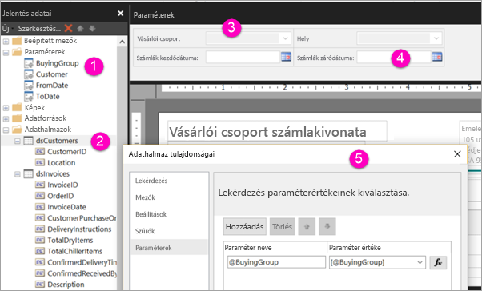

# Paraméterek létrehozása lapszámozott jelentésekhez a Power BI szolgáltatásban (előzetes verzió)

Ebből a cikkből megismerheti, hogyan hozhat létre paramétereket lapszámozott jelentésekhez a Power BI szolgáltatásban.  A jelentésparaméter módot kínál a jelentés adatainak kiválasztására és a megjelenésének módosítására. Megadhat egy alapértelmezett értéket és a rendelkezésre álló értékek listáját, és a jelentés olvasói kiválaszthatják a nekik tetszőeket.  

Az alábbi ábrán a Tervező nézet látható a Jelentéskészítőben egy jelentéshez a következő paraméterekkel: @BuyingGroup, @Customer, @FromDate és @ToDate. 
  

  
1.  A jelentés paraméterei a Jelentésadatok panelen.  
  
2.  Tábla az adatkészlet egyik paraméterével.  
  
3.  A Paraméterek panel. A paraméterek elrendezését a Paraméterek panelen szabhatja testre. 
  
4.  A @FromDate és @ToDate paraméterek adattípusa **DateTime**. A jelentés megtekintésekor beírhatja a szövegmezőbe a dátumot, vagy választhat egy dátumot a naptár vezérlőelemeivel. 

5.  Az **Adatkészlet tulajdonságai** párbeszédpanel egyik paramétere.  

  
## Jelentésparaméter létrehozása vagy szerkesztése  
  
1.  Nyissa meg a lapszámozott jelentést a Jelentéskészítőben.

1. A **Jelentésadatok** panelen kattintson a jobb gombbal a **Paraméterek** csomópontra, majd kattintson a **Paraméter hozzáadása** elemre. Megnyílik a **Jelentésparaméter tulajdonságai** párbeszédpanel.  
  
2.  A **Név** mezőbe írjon be egy nevet a paraméterhez, vagy fogadja el az alapértelmezett nevet.  
  
3.  A **Rákérdezés** mezőbe írja be azt a szöveget, amely a paraméter szövegmező mellett fog megjelenni, amikor a felhasználó futtatja a jelentést.  
  
4.  Az **Adattípus** mezőben válassza ki az adattípust a paraméterértékhez.  
  
5.  Ha a paraméter tartalmazhat üres értéket, válassza ki az **Üres érték engedélyezése** lehetőséget.  
  
6.  Ha a paraméter tartalmazhat null értéket, válassza ki a **Null érték engedélyezése** lehetőséget.  
  
7.  Ha szeretné engedélyezni a felhasználó számára, hogy egynél több értéket is kiválaszthasson a paraméterhez, válassza ki a **Több érték engedélyezése** lehetőséget.  
  
8.  Állítsa be a láthatóságot.  
  
    -   A paraméternek a jelentés tetején lévő eszköztáron való megjelenítéséhez válassza a **Látható** lehetőséget.  
  
    -   A paraméter elrejtéséhez, hogy ne legyen látható az eszköztáron, válassza a **Rejtett** lehetőséget.  
  
    -   A paraméter elrejtéséhez és a jelentés közzététele után a jelentéskészítő kiszolgálón a módosítás elleni védelméhez válassza a **Belső** lehetőséget. A jelentésparaméter ekkor csak a jelentésdefinícióban lesz megtekinthető. Ehhez a lehetőséghez be kell állítania egy alapértelmezett értéket, vagy engedélyeznie kell a paraméter számára a null érték elfogadását.  
  
9. Kattintson az **OK** gombra. 
  
## Következő lépések

Ha látni szeretné, hogyan jelennek meg a paraméterek a Power BI szolgáltatásban, olvassa el a [Paraméterek megtekintése lapszámozott jelentésekhez](paginated-reports-view-parameters.md) szakaszt.

A lapszámozott jelentésekben szereplő paraméterekkel kapcsolatos részletes információkért olvassa el a [Report Parameters (Report Builder and Report Designer)](https://docs.microsoft.com/sql/reporting-services/report-design/report-parameters-report-builder-and-report-designer) (Jelentésparaméterek (Jelentéskészítő és Jelentéstervező)) cikket az SQL Server Reporting Services dokumentációjában  
