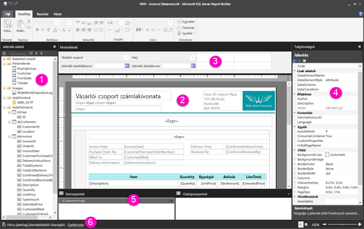

# Ismerkedés a lapszámozott jelentések Jelentéstervező nézetével

A Power BI Jelentéskészítő Jelentéstervező nézete a Power BI szolgáltatásba közzétehető lapszámozott jelentések létrehozására szolgáló tervezési felület. A tervezőfelület a Jelentéskészítő közepén található, menüsávokkal és panelekkel körülvéve. A tervezőfelületen vehetők fel és rendezhetők el a jelentés elemei. Ez a cikk a jelentés forrásainak hozzáadására, kiválasztására és elrendezésére, valamint a jelentéselemek tulajdonságainak szerkesztésére használható paneleket ismerteti.  

1. [Jelentésadatok panel](#1-report-data-pane) 
2. [Jelentéstervező felület](#2-report-design-surface)  
3. [Paraméterek panel](#3-parameters-pane) 
4. [Tulajdonságok panel](#4-properties-pane) 
5. [Csoportosítás panel](#5-grouping-pane) 
6. [Aktuális jelentés állapotsávja](#6-current-report-status-bar)  
  
## 1\. A Jelentésadatok panel  
 A Jelentésadatok panelen a jelentéshez szükséges jelentésadatokat és -forrásokat határozhatja meg a jelentés elrendezésének megtervezése előtt. A Jelentésadatok panelre többek közt adatforrásokat, adathalmazokat, számított mezőket, jelentésparamétereket és képeket vehet fel.  
  
 Miután felvette az elemeket a Jelentésadatok panelre, mezőket húzhat a jelentéselemekre a tervezési felületen, így meghatározhatja, hogy hol jelenjenek meg az adatok a jelentésben.  
  
> [!TIP]  
>  Ha a Jelentésadatok panelről közvetlenül a jelentéstervező felületre húz egy mezőt ahelyett hogy egy adatterületen – például táblázatban vagy diagramon – helyezné el, akkor a jelentés futtatásakor csak az első érték jelenik meg az adott mező adatai közül.  
  
 A Jelentésadatok panelről beépített mezőket is áthúzhat a jelentéstervező felületre. A megjelenítéskor ezek a mezők a jelentésről nyújtanak olyan információt, mint a jelentés neve, a jelentés oldalainak száma és az aktuális oldal sorszáma.  
  
 Egyes elemek automatikusan a Jelentésadatok panelre kerülnek, amikor valamit felvesz a jelentéstervező felületre. Ha például képet ágyaz be a jelentésébe, az fel lesz véve a Jelentésadatok panel Képek mappájába.  
  
> [!NOTE]  
>  Az **Új** gombbal új elemet vehet fel a Jelentésadatok panelre. Ugyanabból vagy másik adatforrásból több adathalmazt is hozzáadhat a jelentéshez. Új adathalmazt azonos adatforrásból úgy vehet fel, hogy a jobb gombbal az adatforrásra kattint, majd az **Adathalmaz hozzáadása** lehetőséget választja.  
  
## 2\. A Jelentéstervező felület  
 A Jelentéskészítő jelentéstervező felülete a jelentés tervezése során használandó fő terület. Jelentéselemeket, például adatterületeket, segédjelentéseket, szövegmezőket, képeket, téglalapokat és vonalakat úgy helyezhet el a jelentésben, hogy a menüszalagról vagy a Jelentésrészek tárából veszi fel őket a tervezési felületre. Itt csoportokat, kifejezéseket, paramétereket, szűrőket, műveleteket, valamint láthatóságot és formázást állíthat be a jelentéselemekhez.  
  
 Módosíthatja továbbá a következőket:  
  
-   A jelentés törzsének olyan tulajdonságait, mint a szegély- és kitöltőszín – kattintson a jobb gombbal a tervezési felületnek a jelentéselemeken kívüli, fehér részére, és válassza a **Törzs tulajdonságai** lehetőséget.  
  
-   A jelentés fej- és láblécének olyan tulajdonságait, mint a szegély- és kitöltőszín – kattintson a jobb gombbal a tervezési felület fej- vagy láblécterületének a jelentéselemeken kívüli, fehér részére, és válassza a **Fejléc tulajdonságai**, vagy a **Lábléc tulajdonságai** lehetőséget.  
  
-   Magának a jelentésnek az olyan tulajdonságait, mint az oldalbeállítások – kattintson a jobb gombbal a tervezőfelület körüli szürke területre, és válassza a **Jelentés tulajdonságai** lehetőséget.  
  
-   A jelentéselemek tulajdonságait – kattintson rájuk a jobb gombbal, és válassza a **Tulajdonságok** lehetőséget.  
  
### A tervezőfelület mérete, és a nyomtatási terület  
A tervezőfelület mérete eltérhet a jelentés nyomtatásához megadott nyomtatási oldalmérettől. A tervezőfelület méretének módosításával a jelentés nyomtatási területe nem változik meg. Mindegy, hogy mekkora méretet ad meg a jelentés nyomtatási területéhez, a teljes tervezőfelület mérete nem változik meg. További információt a renderelési viselkedésről szóló cikkben talál. 
  
- A vonalzó megjelenítéséhez jelölje be a **Vonalzó** jelölőnégyzetet a **Nézet** lapon.  
  
## 3\. A Paraméterek panel  
 Jelentésparaméterekkel szabályozhatja a jelentés adatait, összekötheti a kapcsolódó jelentéseket, és megváltoztathatja a jelentések bemutatásának módját. A Paraméterek panel a jelentésparaméterek rugalmas elrendezését kínálja.  
  
 További információ a jelentésparaméterekről   
  
## 4\. A Tulajdonságok panel
 Egy jelentés minden eleme, köztük minden adatterület, kép, szövegmező és maga a jelentés törzse is rendelkezik tulajdonságokkal. Egy szövegmező BorderColor tulajdonsága például a szövegmező szegélyének szín értékét, a jelentés PageSize tulajdonsága pedig a jelentés oldalméretét mutatja.  
  
 Ezek a tulajdonságok a Tulajdonságok panelen jelennek meg. A panelen látható tulajdonságok a kijelölt jelentéselemtől függően változnak.  
  
- A Tulajdonságok panel megjelenítéséhez a **Nézet** lapon a **Megjelenítés/Elrejtés** csoportban válassza a **Tulajdonságok** elemet.  
  
### Tulajdonságértékek módosítása  
 A Jelentéskészítőben több módon is megváltoztathatja a jelentéselemek tulajdonságait:  
  
-   Gombok és listák választásával a menüszalagon.  
  
-   Beállítások párbeszédpaneleken való módosításával.  
  
-   Tulajdonságértékek megváltoztatásával a Tulajdonságok panelen.  
  
 A leggyakrabban használt tulajdonságok elérhetők a menüszalag párbeszédmezőiben.  
  
 A tulajdonság értéke – a tulajdonságtól függően – legördülő listából, az érték begépelésével, vagy a `<Expression>` lehetőség választása után egy kifejezés megadásával állítható be.  
  
### A Tulajdonságok panel nézetének módosítása  
 A Tulajdonságok panelen a tulajdonságok alapértelmezés szerint olyan tág kategóriákba rendezve jelennek meg, mint a Művelet, Szegély, Kitöltés, Betűtípus és Általános. Minden kategóriához tartozik egy tulajdonsághalmaz. A Betűtípus kategóriában például az alábbi tulajdonságok vannak felsorolva: Color (szín), FontFamily (betűcsalád), FontSize (betűméret), FontStyle (betűstílus), FontWeight (betűvastagság), LineHeight (sortávolság) és TextDecoration (betűdíszítés). A panelen felsorolt tulajdonságok igény szerint ábécé szerint rendezhetők. Ekkor a kategóriák eltűnnek, a tulajdonságok pedig ábécé szerinti sorrendben, kategóriától függetlenül jelennek meg.  
  
 A Tulajdonság panel tetején három gomb található: **Kategória**, **Ábécé** és **Tulajdonságlap**. A Tulajdonságok panel nézetei között a Kategória és az Ábécé gombokkal válthat. A **Tulajdonságlap** gombbal a kijelölt jelentéselem tulajdonságainak párbeszédablakát nyithatja meg.  
  
  
## 5\. A Csoportosítás panel

 A csoportokkal vizuális hierarchiába rendezhetők a jelentés adatai, és kiszámíthatók az összegek. Az egy adatterületen belüli sor- és oszlopcsoportok a tervezőfelületen és a Csoportosítás panelen is megtekinthetők. A Csoportosítás panelen két további panel érhető el: Sorcsoportok és Oszlopcsoportok. Az adatterület kiválasztása után a Csoportosítás panel az adott adatterületen belüli összes csoportot hierarchikus listában jeleníti meg: A gyermekcsoportok a szülőcsoport alatt, behúzással jelennek meg.  
  
 Csoportokat úgy hozhat létre, hogy a Jelentésadatok panelről mezőket húz át a tervezőfelületre vagy a Csoportosítás panelre. A Csoportosítás panelen szülő-, szomszédos és gyermekcsoportokat is felvehet, módosíthatja a csoport tulajdonságait, és csoportokat törölhet.  
  
 A Csoportosítás panel alapértelmezés szerint megjelenik, de bezárhatja, ha a Nézet panelen eltávolítja a Csoportosítás panel jelölőnégyzetének jelölését. A Csoportosítás nem érhető el a Diagram és a Mérő adatterületen.  
  
 További információt a Csoportosítás panel és a Csoportok ismertetése című cikkben talál.  
  
## 6\. Az aktuális jelentés állapotsávja

Az aktuális jelentés állapotsávján annak a kiszolgálónak a neve látható, amelyhez a jelentés csatlakoztatva van, vagy a „Nincs aktuális jelentéskiszolgáló” felirat jelenik meg. A **Csatlakozás** lehetőséget választva csatlakozhat egy kiszolgálóhoz.

## Következő lépések

[Mik a lapszámozott jelentések a Power BI Premiumban?](paginated-reports-report-builder-power-bi.md) 

  
  
