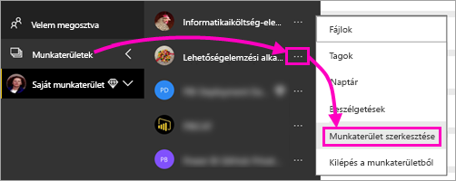
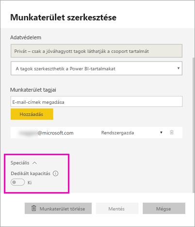
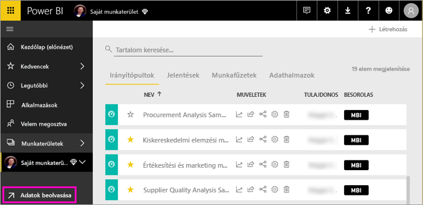
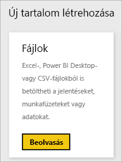
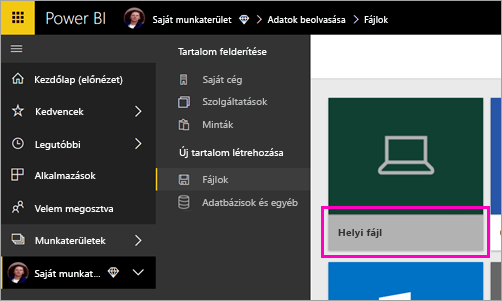
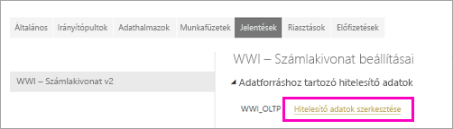
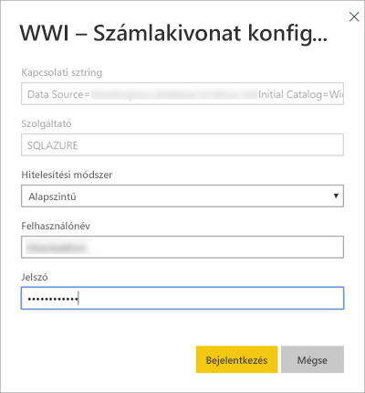
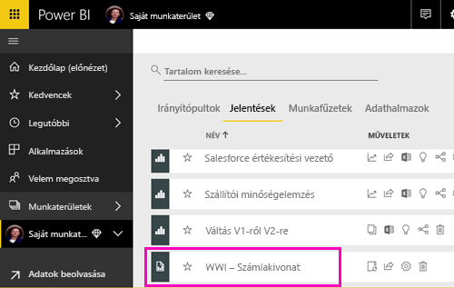
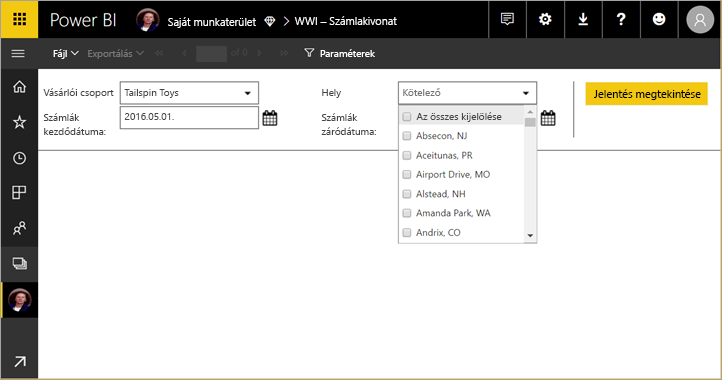

# Lapszámozott jelentés közzététele a Power BI szolgáltatásban

Ebből az oktatóanyagból a helyi számítógépről feltöltött lapszámozott jelentések Power BI szolgáltatásba való közzétételét sajátíthatja el. Lapszámozott jelentéseket a saját munkaterületre, vagy bármely más munkaterületre is feltölthet, ha a munkaterület prémium szintű kapacitásban van. Keresse a gyémánt ikont  a munkaterület neve mellett. 

Ha jelentésének helyszíni adatforrása van, akkor a jelentés feltöltése után [átjárót kell létrehoznia](#create-a-gateway-to-an-on-premises-data-source).

## Munkaterület hozzáadása prémium szintű kapacitáshoz

Lehetséges, hogy a munkaterület mellett nincs gyémánt ikon.  Ilyenkor hozzá kell adnia a munkaterületet egy prémium szintű kapacitáshoz. 

1. Válassza a **Munkaterületek** elemet, a munkaterület neve melletti három pontot (**...**), majd a **Munkaterület szerkesztése** lehetőséget.

    

1. A **Munkaterület szerkesztése** párbeszédablakban bontsa ki a **Speciális** elemet, majd állítsa a **Dedikált kapacitás** kapcsolót a **Be** állásba.

    

   Előfordulhat, hogy ezt nem tudja módosítani. Ilyen esetben forduljon a Power BI Premium-kapacitás rendszergazdájához, és kérjen hozzárendelési jogosultságot, hogy munkaterületét felvehesse egy prémium szintű kapacitásba.

## Lapszámozott jelentés feltöltése

1. Készítse el lapszámozott jelentését a Jelentéskészítőben, és mentse a helyi számítógépre.

1. Egy böngészőben nyissa meg a Power BI szolgáltatást, és keresse meg a prémium szintű munkaterületet, ahol a jelentést közzé szeretné tenni. Figyelje meg a gyémánt ikont.  A név mellett kell lennie. 

1. Válassza az **Adatok beolvasása** lehetőséget.

    

1. A **Fájlok** mezőben válassza a **Beolvasás** lehetőséget.

    

1. Válassza a **Helyi fájl** lehetőséget, tallózással keresse meg a lapszámozott jelentést, majd válassza a **Megnyitás** lehetőséget.

    

1. Válassza a **Tovább** > **Hitelesítő adatok szerkesztése** lehetőséget.

    

1. Konfigurálja hitelesítő adatait, majd válassza a **Bejelentkezés** lehetőséget.

    

   Jelentése megjelenik a jelentések listájában.

    

1. Jelölje ki, és nyissa meg a Power BI szolgáltatásban. Ha a jelentés paraméterekkel rendelkezik, akkor csak azok kiválasztása után tekinthető meg.
 
    

## Átjáró létrehozása

Mint minden Power BI-jelentésnél, itt is érvényes, hogy ha a jelentésnek helyszíni adatforrása van, akkor az adatok eléréséhez átjárót kell létrehoznia, vagy átjáróhoz kell csatlakoznia.

1. Válassza a jelentés neve melletti **Kezelés** lehetőséget.

   

1. A részleteket és a további teendőket a Power BI szolgáltatásról szóló, [Átjáró telepítése](service-gateway-install.md) című cikkben találja meg.

### Átjárókra vonatkozó korlátozások

Az átjárók jelenleg nem támogatják a többértékű paramétereket.

## Következő lépések

- [Lapszámozott jelentés megtekintése a Power BI szolgáltatásban](paginated-reports-view-power-bi-service.md)
- [Mik azok a lapszámozott jelentések a Power BI Premiumban? (előzetes verzió)](paginated-reports-report-builder-power-bi.md)

