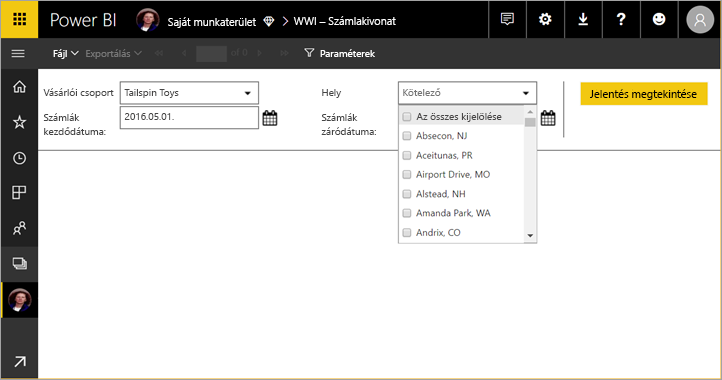
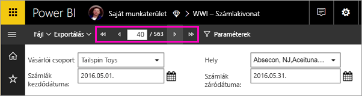
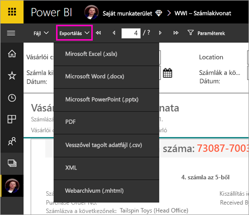

# Lapszámozott jelentés megtekintése a Power BI szolgáltatásban

Ebből a cikkből elsajátíthatja, hogyan tekinthet meg lapszámozott jelentéseket a Power BI szolgáltatásban. A lapszámozott jelentéseket a Jelentéskészítőben hozzák létre, és bármely munkaterületre feltölthetik egy prémium szintű kapacitásban. Keresse a gyémánt ikont  a munkaterület neve mellett. 

A lapszámozott jelentéseknek saját ikonja van, .

A lapszámozott jelentéseket számos formátumba exportálhatja: 

- Microsoft Excel
- Microsoft Word
- Microsoft PowerPoint
- PDF
- Vesszővel tagolt értékek
- XML
- Webarchívum (.mhtml)

## Többoldalas jelentés megtekintése

1. Válassza ki a lapszámozott jelentést a munkaterületen.

    

2. Ha a jelentés rendelkezik paraméterekkel, mint ahogy ez is, lehet, hogy nem fogja látni a jelentést, amikor először megnyitja. Válassza ki a paramétereket, majd válassza a **Jelentés megtekintése** lehetőséget. 

     

    A paramétereket bármikor meg is változtathatja.

1. Lapozza végig a jelentést az oldal tetején lévő nyilakkal, vagy írja be a mezőbe egy oldal számát.
    
   

4. Válassza az **Exportálás** lehetőséget a lapszámozott jelentések exportálási formátumának kiválasztásához.

    

## Következő lépések

[Mik a lapszámozott jelentések a Power BI Premiumban?](paginated-reports-report-builder-power-bi.md)
