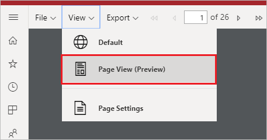

# Jelentés nézeteinek beállítása többoldalas jelentésekhez a Power BI szolgáltatásban

Ha többoldalas jelentést jelenít meg a Power BI szolgáltatásban, az alapértelmezett nézet HTML-alapú és interaktív. Egy másik jelentésnézet, amely a rögzített oldalak, például a PDF formátuma, az új Oldal nézet beállítás.

**Alapértelmezett interaktív nézet**

**Oldal nézet**

Az oldal nézetben a megjelenített jelentés az alapértelmezett nézethez képest eltérően jelenik meg. A többoldalas jelentésekben szereplő tulajdonságok és fogalmak csak rögzített lapokra vonatkoznak. A nézet hasonló ahhoz, amikor a jelentést kinyomtatjuk vagy exportáljuk. Bizonyos elemeket, például a paraméterértékeket továbbra is módosíthatja, de nem rendelkezik más interaktív funkciókkal, például oszlopok rendezésével vagy váltásával.

Az oldal nézet támogatja a böngésző PDF-megjelenítője által támogatott összes funkciót, például a nagyítást, a kicsinyítést és a laphoz igazítást.

## Váltás oldal nézetre

Amikor megnyit egy többoldalas jelentést, az alapértelmezés szerint az interaktív nézetben jelenik meg. Ha a jelentésben paraméterek is vannak, válassza a paraméterek lehetőséget, majd tekintse meg a jelentést.

1. Az eszköztáron válassza a **Nézet** > **Oldal nézet** lehetőséget.

    

2. Az oldal nézet beállításainak megváltoztatásához válassza az **Oldalbeállítások** elemet az eszköztár **Nézet** menüjében. 

    
    
    Az **Oldalbeállítások** párbeszédpanelen beállítható az **Oldalméret** és a **Tájolás** az oldal nézethez. Az oldalbeállítások alkalmazása után ugyanezek a beállítások lesznek érvényesek, amikor később kinyomtatja a lapot.
   
    

3. Ha vissza szeretne térni az interaktív nézetre, válassza az **Alapértelmezett** lehetőséget a **Nézet** legördülő listában.

## Böngészőtámogatás

Az oldal nézetet támogatja a Google Chrome és a Microsoft Edge. Ügyeljen rá, hogy a megtekintés PDF-ként engedélyezve legyen a böngészőben. Ezekben a böngészőkben az az alapértelmezett beállítás.

Az Internet Explorer és a Safari nem támogatja az oldal nézetet, ezért a beállítás le van tiltva. Nem támogatott továbbá mobileszközök böngészőiben és a natív Power BI mobilalkalmazásokban sem.  

## Következő lépések

- [Lapszámozott jelentés megtekintése a Power BI szolgáltatásban](../consumer/paginated-reports-view-power-bi-service.md)
- [Mik a lapszámozott jelentések a Power BI Premiumban?](paginated-reports-report-builder-power-bi.md)
