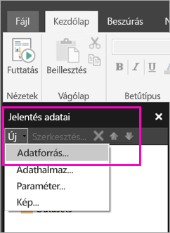

# Beágyazott adatforrás létrehozása lapszámozott jelentésekhez a Power BI szolgáltatásban

Ebből a cikkből beágyazott adatforrások lapszámozott jelentésekhez való létrehozását és módosítását sajátíthatja el a Power BI szolgáltatásban. Beágyazott adatforrást egyetlen jelentéshez definiálhat, és csak ebben a jelentésben használhatja fel. A Power BI szolgáltatásban közzétett lapszámozott jelentések jelenleg beágyazott adathalmazokat és beágyazott adatforrásokat igényelnek, és a következő adatforrásokhoz kapcsolódhatnak:

- Azure Analysis Services
- Azure SQL Database és 
- Azure SQL Data Warehouse
- SQL Server
- SQL Server Analysis Services
- Oracle 
- Teradata 

A következő adatforrások esetében használja az [SQL Server Analysis Services-kapcsolat](../admin/service-premium-connect-tools.md) lehetőséget:

- Power BI Premium-adatkészletek

A lapszámozott jelentések átjárón keresztül kapcsolódnak a [Power BI-átjáróhoz](../connect-data/service-gateway-onprem.md). Az átjárót azután állíthatja be, hogy a jelentést közzéteszi a Power BI szolgáltatásban.

További információ: [Jelentésadatok a Power BI Jelentéskészítőben](report-builder-data.md).

## Beágyazott adatforrás létrehozása
  
1. Nyissa meg a Power BI Jelentéskészítőt.

1. A Jelentésadatok panel eszköztárán válassza az **Új** > **Adatforrás** lehetőséget. Ekkor megnyílik az **Adatforrás tulajdonságai** párbeszédpanel.

    
  
2.  A **Név** szövegmezőbe írja be az adatforrás nevét, vagy fogadja el az alapértelmezett nevet.  
  
3.  Válassza **A jelentésbe ágyazott kapcsolat használata** lehetőséget.  
  
1.  A **Kapcsolattípus kiválasztása** listában válassza ki az adatforrás típusát. 

1.  Adjon meg egy kapcsolati sztringet az alábbi módszerek egyikével:  
  
    -   Gépelje be a kapcsolati sztringet közvetlenül a **Kapcsolati sztring** szövegmezőbe. 
  
     -   Válassza a **Build** lehetőséget a 2. lépésben választott adatforráshoz tartozó **Kapcsolat tulajdonságai** párbeszédablak megnyitásához.  
  
        Töltse ki a **Kapcsolat tulajdonságai** párbeszédablak mezőit az adatforrás típusának megfelelően. A kapcsolat tulajdonságai közé tartozik az adatforrás típusa, az adatforrás neve és a használni kívánt hitelesítő adatok. Miután megadta az értékeket ebben a párbeszédablakban, a **Kapcsolat tesztelése** lehetőséggel ellenőrizze, hogy az adatforrás elérhető-e, és a megadott hitelesítő adatok helyesek-e.  
  
4.  Válassza a **Hitelesítő adatok** lehetőséget.  
  
     Adja meg az ehhez az adatforráshoz használni kívánt hitelesítő adatokat. A támogatott hitelesítőadat-típusokat az adatforrás tulajdonosa határozza meg. További információt a [Hitelesítő adatok és kapcsolati adatok megadása jelentésadat-forrásokhoz](https://docs.microsoft.com/sql/reporting-services/report-data/specify-credential-and-connection-information-for-report-data-sources) című cikkben talál.
  
5.  Válassza az **OK** lehetőséget.  
  
     Az adatforrás megjelenik a Jelentésadatok panelen.  
     
## Korlátozások és megfontolandó szempontok

A Power BI-adatkészletekhez csatlakozó többoldalas jelentések kisebb eltérésektől eltekintve ugyanazokat a szabályokat követik, mint amelyek a Power BI-beli megosztott adatkészletekre vonatkoznak.  Annak érdekében, hogy a felhasználók megfelelően tudják megtekinteni a Power BI-adatkészleteket használó többoldalas jelentéseket, és hogy kötelezővé tegye a sorszintű biztonság (RLS) engedélyezését a megtekintéshez, mindenképpen kövesse az alábbi szabályokat:

### Klasszikus alkalmazások és munkaterületek

- .rdl ugyanabban a munkaterületben, mint az adatkészlet (ugyanazon tulajdonos): Támogatott
- .rdl más munkaterületben, mint az adatkészlet (ugyanazon tulajdonos): Támogatott
- Megosztott .rdl: A jelentést megtekintő minden felhasználónak meg kell adnia az Olvasási engedélyt az adathalmaz szintjén
- Megosztott alkalmazás: A jelentést megtekintő minden felhasználónak meg kell adnia az Olvasási engedélyt az adathalmaz szintjén
- .rdl ugyanabban a munkaterületben, mint az adatkészlet (eltérő tulajdonos): Támogatott
- .rdl az adathalmazétól különböző munkaterületen (eltérő felhasználó): A jelentést megtekintő minden felhasználónak meg kell adnia az Olvasási engedélyt az adathalmaz szintjén
- Sorszintű biztonság: Ennek érvényre juttatásához a jelentést megtekintő minden felhasználónak meg kell adnia az Olvasási engedélyt az adathalmaz szintjén

### Új felületű alkalmazások és munkaterületek

- .rdl ugyanabban a munkaterületben, mint az adatkészlet: Támogatott
- .rdl más munkaterületben, mint az adatkészlet (ugyanazon tulajdonos): Támogatott
- Megosztott .rdl: A jelentést megtekintő minden felhasználónak meg kell adnia az Olvasási engedélyt az adathalmaz szintjén
- Megosztott alkalmazás: A jelentést megtekintő minden felhasználónak meg kell adnia az Olvasási engedélyt az adathalmaz szintjén
- .rdl ugyanabban a munkaterületben, mint az adatkészlet (eltérő tulajdonos) – támogatott
- .rdl más munkaterületben, mint az adatkészlet (eltérő tulajdonos): A jelentést megtekintő minden felhasználónak meg kell adnia az Olvasási engedélyt az adathalmaz szintjén
- Sorszintű biztonság: Ennek érvényre juttatásához a jelentést megtekintő minden felhasználónak meg kell adnia az Olvasási engedélyt az adathalmaz szintjén

## Következő lépések

- [Beágyazott adathalmaz létrehozása lapszámozott jelentéshez a Power BI szolgáltatásban](paginated-reports-create-embedded-dataset.md)
- [Mik a lapszámozott jelentések a Power BI Premiumban?](paginated-reports-report-builder-power-bi.md)

