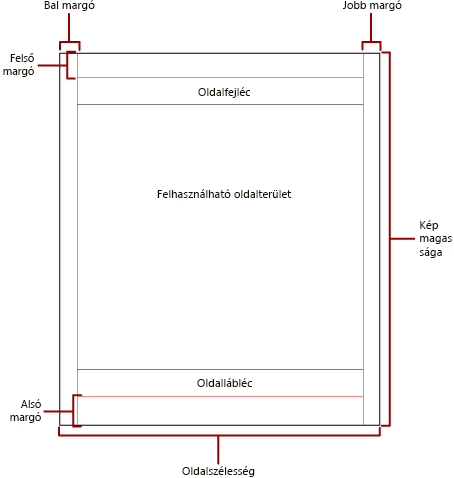
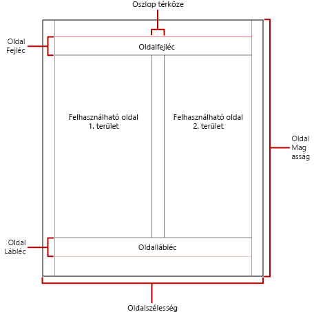

# Tördelési mód többoldalas Power BI-jelentésekben

 A *tördelési mód* szabja meg az egy jelentésen belüli oldalak számát és a jelentéselemek elrendezését ezeken az oldalakon. A többoldalas Power BI-jelentések tördelési módja a jelentés megtekintéséhez és kézbesítéséhez használt renderelő bővítménytől függően változhat. Ha a jelentéskészítő kiszolgálón futtat egy jelentést, a jelentés a HTML-renderelőt használja. A HTML meghatározott tördelési szabályokat követ. Ha ugyanezt a jelentést például PDF-be exportálja, a PDF-renderelőt kell használnia, amely más szabályokat alkalmaz. A jelentés így másképp lesz tördelve. Fontos, hogy ismerje a Power BI lapszámozott jelentéseire vonatkozó tördelési szabályokat. Így sikeresen tervezhet könnyen érthető jelentéseket, amelyeket a bemutatáshoz szánt renderelőhöz optimalizálhat.  
  
 Ez a témakör a fizikai oldal méretének és a jelentés elrendezésnek arra gyakorolt hatásait ismerteti, ahogyan a kényszerített oldaltörést használó renderelők megjelenítik a jelentést. Beállíthatja a fizikai oldalméretet és a margókat módosító beállításokat, és hasábokra oszthatja fel a jelentést a **Jelentés tulajdonságai** panelen, a **Tulajdonságok** panelen, vagy az **Oldalbeállítás** párbeszédpanelen. A **Jelentés tulajdonságai** panel eléréséhez kattintson a jelentés törzsén kívüli kék területre. Az **Oldalbeállítás** párbeszédpanel eléréséhez kattintson a Kezdőlap **Futtatás** elemére, majd a Futtatás lap **Oldalbeállítás** elemére.  
  
> [!NOTE]  
>  Ha úgy tervezte meg a jelentést, hogy a szélessége egy oldalnyi legyen, de az mégis több oldalon jelenik meg, ellenőrizze, hogy a jelentéstörzs szélessége a margókkal együtt nem nagyobb a fizikai oldal szélességénél. Annak érdekében, hogy a jelentésben ne jelenjenek meg üres oldalak, a befoglaló sarkának balra húzásával csökkentheti a befoglaló méretét.  

## A jelentés törzse  
 A jelentés törzse a tervezőfelületen fehér területként megjelenő befoglaló téglalap. Tágulhat vagy zsugorodhat, hogy helyet adjon a benne lévő jelentéselemeknek. A jelentéstörzs nem tükrözi a fizikai oldalméretet, és a jelentés törzse túl is nyúlhat a fizikai oldal határain, és több oldalra is kiterjedhet. Egyes renderelők, például a Microsoft Excel, a Word, a HTML és az MHTML az oldal tartalmának megfelelően tágulni vagy zsugorodni képes jelentéseket renderelnek. Az ezekben a formátumokban renderelt jelentések képernyőn, például webböngészőben való megtekintésre vannak optimalizálva. Ezek a renderelők szükség esetén függőleges oldaltöréseket szúrnak be.  
  
 Formázhatja a jelentéstörzs szegélyének színét, stílusát és vastagságát. Háttérszínt és háttérképet is beállíthat.  
  
## A fizikai oldal  
 A fizikai oldalméret a papír mérete. A jelentés renderelését a jelentéshez megadott papírméret határozza meg. A kiadványbarát oldaltöréses formátumokban renderelt jelentések a fizikai oldalmérettől függően vízszintes és függőleges oldaltöréseket szúrnak be. Ezek az oldaltörések optimális olvasási élményt nyújtanak a nyomtatott jelentésekhez és a kiadványbarát oldaltöréses formátumokhoz. A szoftveres oldaltöréses formátumokban renderelt jelentések a fizikai oldalmérettől függően vízszintes oldaltöréseket szúrnak be. Ezek szintén optimális olvasási élményt nyújtanak a webböngészőben való megtekintéshez.  
  
 Az alapértelmezett oldalméret 21 × 29,7 cm, de ez módosítható a **Jelentés tulajdonságai** panelen, az **Oldalbeállítás** párbeszédpanelen, vagy a PageHeight és PageWidth tulajdonságok módosításával a **Tulajdonságok** panelen. Az oldalméret nem nő vagy csökken a jelentéstörzs tartalmának megfelelően. Ha azt szeretné, hogy a jelentés egyetlen oldalon jelenjen meg, a jelentéstörzs teljes tartalmának el kell férnie a fizikai oldalon. Ha nem fér el, és kiadványbarát tördelési formátumot használ, akkor a jelentéshez további oldalakra lesz szükség. Ha a jelentés törzse túlnyúlik a fizikai oldal jobb szélén, függőleges oldaltörés lesz beszúrva. Ha a jelentés törzse túlnyúlik a fizikai oldal alsó szélén, vízszintes oldaltörés lesz beszúrva.  
  
 Ha felül szeretné írni a jelentésben megadott fizikai oldalméretet, a fizikai oldalméretet a jelentés exportálásához használt adott renderelő Eszközinformációk beállításai között adhatja meg. A teljes listát megtalálhatja az SQL Server Reporting Services dokumentációjának [Renderelő bővítmények eszközinformáció-beállításai](https://docs.microsoft.com/sql/reporting-services/device-information-settings-for-rendering-extensions-reporting-services?view=sql-server-2017) szakaszában.  
  
### Margók

 A margók a fizikai oldal méreteihez képest a megadott margóbeállítással befelé eltolva vannak meghúzva. Ha egy jelentéselem átnyúlik a margó területére, úgy lesz levágva, hogy az átfedő terület ne legyen renderelve. Ha olyan margókat állít be, amelyek miatt az oldal függőleges vagy vízszintes kiterjedése nulla lesz, a margó alapértelmezetten a nulla értéket veszi fel. A margók beállíthatók a **Jelentés tulajdonságai** panelen, az **Oldalbeállítás** párbeszédpanelen, vagy a TopMargin, BottomMargin, LeftMargin és RightMargin tulajdonság módosításával a **Tulajdonságok** panelen. Ha felül szeretné írni a jelentésben megadott margóméretet, a margóméretet a jelentés exportálásához használt adott renderelő Eszközinformációk beállításai között adhatja meg.  
  
 A fizikai oldalnak a margók, a hasábközök, valamint a fej- és lábléc lefoglalása után fennmaradó területe az úgynevezett *hasznos oldalterület*. A margók csak akkor lesznek alkalmazva, ha a jelentést kiadványbarát megjelenítési formátumban rendereli vagy nyomtatja. Az alábbi ábra a margókat és a fizikai oldal hasznos oldalterületét szemlélteti.  
  
 
  
### Hírlevél-stílusú hasábok  

 A jelentést az újságokéhoz hasonló hasábokba rendezheti. A hasábok egy *fizikai* oldalon belül renderelt *logikai* oldalakként vannak kezelve. Balról jobbra és felülről lefelé vannak elrendezve, és a hasábok között üres sáv választja el őket. Ha a jelentés több hasábra van felosztva, minden fizikai oldal hasábokra lesz osztva függőlegesen, és minden hasáb egy logikai oldalnak számít. Tegyük fel, hogy egy oldalon például két hasáb van. A jelentés tartalma feltölti az első hasábot, majd a másodikat. Ha a teljes jelentés nem fér el az első két hasábban, akkor a jelentés a következő oldal első, majd második hasábját tölti fel. A hasábok balról jobbra, felülről lefelé lesznek feltöltve az összes jelentéselem rendereléséig. Ha olyan hasábméreteket ad meg, amelyek miatt a vízszintes vagy függőleges kiterjedés nullára csökken, az hasábköz alapértelmezetten a nulla értéket veszi fel.  
  
 A hasábok beállíthatók a **Jelentés tulajdonságai** panelen, az **Oldalbeállítás** párbeszédpanelen, vagy a TopMargin, BottomMargin, LeftMargin és RightMargin tulajdonság módosításával a **Tulajdonságok** panelen. Ha nem megadott margóméretet szeretne használni, a margóméretet annak a renderelőnek az Eszközinformációk beállításai között adhatja meg, amelybe a jelentést exportálja. A hasábok csak akkor lesznek alkalmazva, ha a jelentést PDF vagy kép formátumban rendereli vagy nyomtatja. Az alábbi ábra egy hasábokat tartalmazó oldal hasznos oldalterületét mutatja.  
  

  
## Oldaltörések és oldalnevek

 Egy jelentés olvashatóbb lesz, adatai pedig könnyebben elemezhetők és exportálhatók, ha a jelentés oldalai el vannak nevezve. A Reporting Services több tulajdonságot, táblázat-, mátrix- és lista-adatterületeket, csoportokat, valamint a tördelést, az oldalszámozás újrakezdését és az oldaltörésenként megadható oldalneveket szabályozó téglalapokat kínál a jelentésekhez. Ezek a funkciók a jelentések renderelési formátumától függetlenül is javítják a jelentések minőségét, de különösen akkor hasznosak, ha a jelentéseket Excel-munkafüzetekbe exportálja.

> [!NOTE]
> Hátterét tekintve minden táblázat-, mátrix- és lista-adatterület ugyanolyan adatterület: rácsos adatterület, vagyis *táblix*. Ezzel a névvel is találkozhat. 

 Az InitialPageName tulajdonság adja meg a jelentésbeli oldalak kezdeti nevét. Ha a jelentése nem tartalmaz az oldaltörésekhez tartozó oldalneveket, akkor az oldaltörések által létrehozott összes új oldalhoz a kezdeti oldalnév lesz használva. A kezdeti oldalnév használata nem kötelező.  
  
 A renderelt jelentések új oldalnevet adhatnak az egy oldaltörés miatt keletkező új oldalnak. Oldalnév megadásához a táblázat, mátrix, lista, csoport vagy téglalap PageName tulajdonságát kell beállítania. Nem kötelező oldalneveket megadni a töréseknél. Ezek hiányában az InitialPageName értéke lesz használva. Ha az InitialPageName is üres, akkor az új oldalnak nem lesz neve.  
  
 A táblázat-, mátrix- és lista-adatterületek, a csoportok és a téglalapok támogatják az oldaltöréseket.  
  
 Az oldaltörés tulajdonságai többek között a következők:  
  
- **BreakLocation** – a törés helyét adja meg ahhoz a jelentéselemhez, amelyen az oldaltörés engedélyezve van: előtte, utána, vagy előtte és utána is. Csoportok esetén a BreakLocation által megadott hely a csoportok között is lehet.  
  
- **Disabled** – azt jelzi, hogy a jelentéselemre alkalmazva van-e oldaltörés. Ha ennek a tulajdonságnak az értéke True (igaz), akkor az oldaltörés figyelmen kívül lesz hagyva. Ez a tulajdonság az oldaltörések dinamikus letiltására használható egy kifejezés alapján, a jelentés futtatásakor.  
  
- **ResetPageNumber** – azt jelzi, hogy vissza kell-e állítani az oldalszámot 1-re oldaltörés esetén. Ha ennek a tulajdonságnak az értéke True (igaz), akkor az oldalszámozás vissza lesz állítva.  
  
 A BreakLocation tulajdonság beállítható a **Rácsos adatterület tulajdonságai**, **Téglalap tulajdonságai** vagy **Csoport tulajdonságai** párbeszédpanelen, de a Disabled, a ResetPageNumber és a PageName tulajdonságokat a Jelentéskészítő Tulajdonságok paneljén kell beállítania. A Tulajdonságok panelen a tulajdonságok kategóriánként vannak elrendezve, akkor ezek a **PageBreak** kategóriában találhatók. Csoportok esetén a **PageBreak** kategória a **Group** kategórián belül található.  
  
 A Disabled és a ResetPageNumber tulajdonság értékének beállítására használhat konstanst, és egyszerű vagy összetett kifejezést is. A BreakLocation tulajdonságnál azonban nem használhat kifejezést. A kifejezések írásáról és használatáról a [Kifejezések a Power BI Jelentéskészítőben](report-builder-expressions.md) című cikk nyújt tájékoztatást.  
  
 A jelentésben a **Globals** gyűjtemény használatával írhat az aktuális oldalnevekre vagy oldalszámokra hivatkozó kifejezéseket. További információt a Jelentéskészítő és a Reporting Services dokumentációjának [Beépített globális és felhasználói hivatkozások](https://docs.microsoft.com/sql/reporting-services/report-design/built-in-collections-built-in-globals-and-users-references-report-builder?view=sql-server-2017) szakasza nyújt.
  
### Excel-munkafüzet lapjainak elnevezése

 Ezek a tulajdonságok különösen hasznosak, amikor Excel-munkafüzetekbe exportál jelentéseket. Az InitialPage tulajdonságban megadhatja a munkalap alapértelmezett nevét a jelentés exportálásakor, oldaltörések és a PageName tulajdonság használatával pedig különböző neveket adhat az egyes munkalapoknak. Minden új, oldaltöréssel meghatározott jelentésoldal külön, a PageName tulajdonság értéke alapján elnevezett munkalapra lesz exportálva. Ha a PageName üres, de a jelentésnek van kezdeti oldalneve, akkor az Excel-munkafüzet minden lapjának neve ugyanaz lesz: a kezdeti oldalnév.  
  
 Ezeknek a jelentések Excelbe exportálásakor használt tulajdonságoknak a működéséről a Jelentéskészítő és a Reporting Services dokumentációjának [Exportálás Microsoft Excelbe](https://docs.microsoft.com/sql/reporting-services/report-builder/exporting-to-microsoft-excel-report-builder-and-ssrs) című szakasza nyújt további információt.  
  
## További lépések

- [Lapszámozott jelentés megtekintése a Power BI szolgáltatásban](../consumer/paginated-reports-view-power-bi-service.md)
- [Ne legyenek üres lapok a többoldalas jelentések nyomtatásakor](../guidance/report-paginated-blank-page.md)
- Több kérdése van? [Kérdezze meg a Power BI közösségét](https://community.powerbi.com/)
