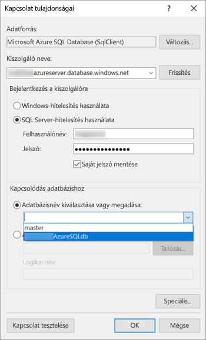

# Oktatóanyag: Lapszámozott jelentés létrehozása és feltöltése a Power BI szolgáltatásba

Ebben az oktatóanyagban egy Azure SQL-mintaadatbázishoz csatlakozik. Ezután a Power BI Jelentéskészítő varázslójával létrehoz egy lapszámozott jelentést egy több oldalon átívelő táblázattal. Ezt követően feltölti a lapszámozott jelentést a Power BI szolgáltatás Prémium szintű kapacitásának egyik munkaterületére.

A jelen oktatóanyagban az alábbi lépéseket fogja végrehajtani:

> [!div class="checklist"]
> * Azure-mintaadatbázis létrehozása.
> * Mátrix létrehozása a Power BI Jelentéskészítőben egy varázslóval.
> * A jelentés formázása címmel, oldalszámokkal és oszlopfejlécekkel minden oldalon.
> * A pénznem formázása.
> * Jelentés feltöltése a Power BI szolgáltatásba.

Ha még nincs Azure-előfizetése, kezdés előtt hozzon létre egy [ingyenes fiókot](https://azure.microsoft.com/free/?WT.mc_id=A261C142F).
 
## Előfeltételek  

Lapszámozott jelentések létrehozásának előfeltételei:

- [A Power BI Jelentéskészítő telepítése a Microsoft letöltőközpontból](https://go.microsoft.com/fwlink/?linkid=2086513). 

- Kövese az [Azure SQL-mintaadatbázis létrehozása az Azure Portalon](https://docs.microsoft.com/azure/sql-database/sql-database-get-started-portal) című rövid útmutató lépéseit. Másolja ki és mentse az **Áttekintés** lap **Kiszolgálónév** mezőjének értékét. Jegyezze meg az Azure-ban létrehozott felhasználónevet és jelszót.

A lapszámozott jelentés a Power BI szolgáltatásba való feltöltésének előfeltételei:

- [Power BI Pro-licencre](../service-admin-power-bi-pro-in-your-organization.md) lesz szüksége.
- Egy [Power BI Premium-kapacitásban](../service-premium-what-is.md) található munkaterületre van szüksége a szolgáltatásban. A munkaterület neve mellett egy gyémánt ikon látható .

## A mátrix létrehozása a varázslóval
  
1.  Indítsa el a Power BI Jelentéskészítőt a számítógépen.  
  
     Ekkor megjelenik az **Első lépések** párbeszédpanel.  
  
     
  
1.  A bal oldali panelen ellenőrizze, hogy az **Új jelentés** elem van-e kijelölve, a jobb oldali panelen pedig válassza a **Táblázat vagy mátrix varázsló** lehetőséget.  
  
4.  Az **Adatkészlet kiválasztása** lapon válassza az **Adatkészlet létrehozása** > **Tovább** lehetőséget.  

    
  
5.  Az **Adatforrás felé irányuló kapcsolat kiválasztása** lapon válassza az **Új** lehetőséget. 

    
  
     Ekkor megnyílik az **Adatforrás tulajdonságai** párbeszédpanel.  
  
6.  Az adatforrásnak tetszőleges nevet adhat, amelyekben karaktereket és aláhúzásjeleket használhat. Ebben az oktatóanyagban a **Név** mezőbe a **MyAzureDataSource** kifejezést írja be.  
  
7.  A **Kapcsolattípus kiválasztása** mezőben válassza a **Microsoft Azure SQL Database** elemet.  
  
8.  A **Kapcsolati sztring** mező mellett válassza a **Build** lehetőséget. 

    

9. **Az Azure-ban:** Lépjen az Azure Portalra, majd válassza az **SQL-adatbázisok** elemet.

1. Válassza ki a cikk **Előfeltételek** szakaszában található „Azure SQL-mintaadatbázis létrehozása az Azure Portalon” című útmutatóban létrehozott Azure SQL-adatbázist.

1. Másolja ki és mentse az **Áttekintés** lap **Kiszolgálónév** mezőjének értékét.

2. **A Jelentéskészítőben**: A **Kapcsolat tulajdonságai** párbeszédpanel **Kiszolgálónév** területén illessze be a másolt kiszolgálónevet. 

1. A **Bejelentkezés a kiszolgálóra** esetén győződjön meg arról, hogy az **SQL Server-hitelesítés használata** lehetőség van kiválasztva, majd adja meg az Azure-ban létrehozott felhasználónevet és jelszót a mintaadatbázisban.

1. A **Kapcsolódás adatbázishoz** területen kattintson a legördülő nyílra, majd válassza ki az Azure-ban létrehozott adatbázist.
 
    

1. Válassza a **Kapcsolat tesztelése** lehetőséget. Ekkor megjelenik a **teszteredmények** üzenet, amely a **tesztkapcsolat sikerességét** jelzi.

1. Válassza az **OK** > **OK** gombot. 

   A Jelentéskészítő a **Kapcsolati sztring** mezőben megjeleníti a létrehozott kapcsolati sztringet. 

    

1. Válassza az **OK** lehetőséget.
  
9. Az **Adatforrás felé irányuló kapcsolat kiválasztása** lapon az „(ebben a jelentésben)” kifejezést láthatja a létrehozott adatforrás-kapcsolat alatt. Válassza ki az adatforrást, majd kattintson a **Tovább** gombra.  

    

10. Írja a mezőbe ugyanazt a felhasználónevet és jelszót. 
  
10. A **Lekérdezés tervezése** lapon bontsa ki a SalesLT, majd a Táblázatok elemet, és jelölje ki a következő táblázatokat:

    - Cím
    - Ügyfél
    - Termék
    - ProductCategory
    - SalesOrderDetail
    - SalesOrderHeader

     Mivel a **Kapcsolatok** > **Automatikus észlelés** beállítás van kiválasztva, a Jelentéskészítő észleli a táblázatok közötti kapcsolatot. 
    
    
 
1.  Válassza a **Lekérdezés futtatása** lehetőséget. A Jelentéskészítő megjeleníti a **lekérdezés eredményeit**. 
 
     

18. Válassza a **Tovább** lehetőséget. 

19. Az **Adatkészlet kiválasztása** lapon válassza ki az imént létrehozott adatkészletet, majd kattintson a **Tovább** gombra.

    

1. A **Mezők elrendezése** lapon húzza a következő mezőket a **Használható mezők** mezőből a **Sorcsoportok** mezőbe:

    - CompanyName
    - SalesOrderNumber
    - Product_Name

1. Húzza a következő mezőket a **Használható mezők** mezőből az **Értékek** mezőbe:

    - OrderQty
    - EgységÁr
    - LineTotal

    A Jelentéskészítő automatikusan összeggé alakította az **Értékek** mező mezőit.

    

24. Az **Elrendezés kiválasztása** lapon hagyja meg az alapértelmezett beállításokat, de törölje a jelet **Csoportok kibontása/összecsukása** jelölőnégyzetből. A Csoportok kibontása/összecsukása funkció a legtöbb esetben hasznos, jelenleg azonban azt szeretnénk, hogy a táblázat több oldalon átíveljen.

1. Válassza a **Tovább** > **Befejezés** lehetőséget. A táblázat a tervezési felületen jelenik meg.
 
## Az eredmény

Tekintsük át a varázsló eredményét.

1. A Jelentés adatai panelen láthatja a létrehozott beágyazott Azure-adatforrást és az azon alapuló beágyazott adatkészletet. 

2. A tervezési felület körülbelül 6 hüvelyk széles. A tervezési felületen megjelenik a mátrix, amelyben láthatók az oszlopfejlécek és a helyőrzők. A mátrix hat oszlopot tartalmaz, és úgy tűnik, hogy csak öt sor magas. 

3. Az Order Qty, Unit Price és Line Total értékek mind összegek, és mindegyik sorcsoport egy részösszeget tartalmaz. 

    A tényleges adatértékek továbbra sem látszanak. Ehhez futtatnia kell a jelentést.

4. A Tulajdonságok panelen a kiválasztott mátrix neve Tablix1. A Jelentéskészítőben a *táblix* egy olyan adatterület, amely sorokban és oszlopokban jelenít meg adatokat. Ez táblázat vagy mátrix is lehet.

5. A Csoportosítás panelen három sorcsoport jelenik meg, amelyet létrehozott a varázslóban: 

    - CompanyName
    - Értékesítési megrendelés
    - Terméknév

    Ez a mátrix nem tartalmaz oszlopcsoportokat.

### A jelentés futtatása

A tényleges értékek megtekintéséhez futtatnia kell a jelentést.

1. Válassza a **Futtatás** lehetőséget a**kezdőlapon**.

   Ekkor megjelennek az értékek. A mátrix jóval több sorral rendelkezik, mint amit Tervezés nézetben láthatott. Láthatja, hogy a Jelentéskészítő szerint az **1.** oldalon tartózkodik a **2?** oldalból. A Jelentéskészítő a lehető leggyorsabban betölti a jelentést, így egyszerre csak néhány oldalnyi adatot tud lekérni. A kérdőjel azt jelenti, hogy a Jelentéskészítő még nem töltötte be az összes adatot.

   

2. Válassza a **Nyomtatási elrendezés** lehetőséget. A jelentés ebben a formátumban jelenik meg a nyomtatáskor. A Jelentéskészítő mostanra felmérte, hogy a jelentés 33 oldalas, és automatikusan hozzáadott egy dátum- és időbélyeget az élőlábhoz.

## A jelentés formázása

Most már van egy mátrixos, 33 oldalas jelentése. Adjunk hozzá néhány funkciót, amellyel feldobhatjuk a megjelenését. A jelentést minden lépés után futtathatja, így megtekintheti a részeredményeket.

- A menüszalag **Futtatás** lapján válassza a **Tervezés** lehetőséget, amely további szerkesztést tesz lehetővé.  

### Oldalszélesség beállítása

A lapszámozott jelentések általában nyomtatáshoz vannak formázva, az átlagos oldalméret pedig 8,5x11 hüvelyk nagyságú. 

1. A vonalzó húzásával módosítsa a felületet 7 hüvelyk szélességűre. Az alapértelmezett margóméret 1 hüvelyk mindkét oldalon – ezeket kisebbre kell vennünk.

1. Kattintson a tervezőfelület körüli szürke területre a **jelentés** tulajdonságainak megjelenítéséhez.

    Ha nem látja a Tulajdonságok panelt, kattintson a **Nézet** fül **Tulajdonságok** elemére.

2. Bontsa ki a **Margók** szakaszt, és módosítsa a **bal** és **jobb** margókat 0,75 hüvelykre. 

    
  
### Jelentéscím hozzáadása  

1. Válassza a **Kattintson ide cím megadásához** lehetőséget az oldal tetején, majd írja be az **Értékesítés cég szerint** kifejezést.  

2. Válassza ki a címszöveget, majd a Tulajdonságok panel **Betűtípus** területén módosítsa a **színt** **kékre**.
  
### Oldalszám hozzáadása

Megfigyelhette, hogy egy dátum- és időbélyeg található a jelentés élőlábában. Ehhez oldalszámot is hozzáadhat.

1. A tervezési felület alján, az élőláb jobb oldalán az [&ExecutionTime] kifejezést láthatja. 

2. A Jelentés adatai panelen bontsa ki a Beépített mezők mappát. Húzza az **Oldalszám** elemet az élőláb bal oldalára, az [&ExecutionTime] elemmel megegyező magasságba.

3. A [&PageNumber] mező jobb oldalának húzásával formázza azt négyzet alakúra.

4. A **Beszúrás** lapon válassza a **Szövegmező** lehetőséget.

5. Kattintson a [& PageNumber] jobb oldalára, írja be az „of” kifejezést, majd formázza négyzet alakúra a szövegmezőt.

6. A **Teljes oldalszám összesen** elemet húzza az élőlábra, az „of” kifejezés jobb oldalára, majd a jobb oldal húzásával formázzon ebből is négyzetet.

    

### A táblázat kiszélesítése  

Most már kiszélesítheti a mátrixot annyira, hogy az széltében kitöltse a teljes oldalt, a szöveges oszlopok kiszélesítésével pedig elkerülheti a nevek megkurtítását. 
 
1. Jelölje ki a mátrixot, majd a Cég neve oszlopot.

3. Helyezze a kurzort a mátrix tetején található szürke területre, a Cég neve oszlop jobb széléhez. Húzza jobbra addig, amíg az oszlop el nem éri az 1 és 3/8 hüvelyket. 

    

4. A Terméknév jobb szélét húzza addig, amíg az oszlop el nem éri a 3 és 3/4 hüvelyket.   

A mátrix így már majdnem olyan széles, mint a nyomtatási terület.

### A pénznem formázása

A jelentés futtatásakor megfigyelhette, hogy a dollárban megadott mennyiségek még nincsenek pénznemként formázva.

1. Jelölje ki a bal felső, [Sum(OrderQty)] cellát, tartsa lenyomva a Shift billentyűt, és jelölje ki a jobb alsó, [Sum(LineTotal)] cellát.

    

2. A **kezdőlapon** válassza a dollárjel ( **$** ) pénznemszimbólumot, majd válassza a **Helyőrzőstílusok** > **Mintaértékek** elem melletti nyilat.
 
    

    Most már pénznemként formázva láthatja az értékeket.

    

### Oszlopfejlécek hozzáadása minden oldalhoz

Mielőtt közzétenné a jelentést a Power BI szolgáltatásban, még egy formázást elvégezhet: az oszlopfejléceket a jelentés minden oldalán megjelenítheti.

1. A Csoportosítás panel felső sávjának jobb szélén válassza a legördülő nyilat, majd a **Speciális mód** lehetőséget.

    

2. A **Sorcsoportok** területen válassza ki a felső **statikus** sávot. Láthatja, hogy a mátrix Cég neve cellája ki van jelölve.

   

3. A **Tulajdonságok** panelen keresse meg a **Táblix tagja** tulajdonságait. A**KeepWithGroup** beállítást állítsa **Utána** értékre, a **RepeatOnNewPage** beállítást pedig **igazra**.

    

    Ideje futtatni a jelentést, hogy lássa, jelenleg hogy mutat.

5. A **kezdőlapon** válassza a **Futtatás** lehetőséget.

6. Válassza a **Nyomtatási elrendezés** lehetőséget, ha ezt még nem tette meg. A jelentés már 29 oldalból áll. Görgessen át néhány oldalon. Láthatja, hogy a pénznem formázva van, az oszlopok minden oldalon rendelkeznek fejléccel, a jelentés minden oldala pedig tartalmaz egy élőlábat oldalszámokkal és dátum- és időbélyeggel.
 
    

7. Mentse a jelentést a számítógépre.
 
##  Jelentés feltöltése a szolgáltatásba

Most, hogy létrehozta a lapszámozott jelentést, ideje feltölteni a Power BI szolgáltatásba.

1. A Power BI szolgáltatás (`https://app.powerbi.com`) navigációs paneljén válassza a **Munkaterületek** > **Munkaterület létrehozása** lehetőséget.

2. A munkaterületet nevezze el **Azure AW-nek** vagy adjon neki egy egyedi nevet. Egyelőre Ön az egyetlen tag. 

3. Kattintson a **Speciális** elem melletti nyílra, és kapcsolja be a **dedikált kapacitást**. 

    

    Ha nem tudja bekapcsolni a dedikált kapacitást, engedélyt kell kérnie a Power BI-rendszergazdájától a munkaterület a dedikált Prémium szintű kapacitáshoz való hozzáadásához.

4. Válasszon egy **elérhető dedikált kapacitást a munkaterület számára**, majd igény szerint **mentse**.
    
    

    Ha a munkaterület nem egy Prémium szintű kapacitás része, a jelentés feltöltésekor a következő üzenet jelenik meg: „Nem sikerült feltölteni a lapszámozott jelentést.” Lépjen kapcsolatba a Power BI- rendszergazdával a munkaterület áthelyezéséhez.

1. Az új munkaterületen válassza az **Adatok lekérése** lehetőséget.

2. A **Fájlok** mezőben válassza a **Beolvasás** lehetőséget.

3. Válassza a **Helyi fájl** elemet, keresse meg a mentett fájl helyét, majd válassza a **Megnyitás** lehetőséget.

   A Power BI importálja a fájlt, amely megjelenik az alkalmazáslista oldal **Jelentések** területén.

    

4. A megtekintéshez válassza ki a jelentést.

5. Ha hibaüzenetet kap, előfordulhat, hogy újra meg kell adnia a hitelesítő adatokat. Válassza a **Kezelés** ikont.

    

6. Válassza a **Hitelesítő adatok szerkesztése** lehetőséget és adja meg az Azure-adatbázis létrehozásakor használt, Azure-beli hitelesítő adatokat.

    

7. A lapszámozott jelentést mostantól megtekintheti a Power BI szolgáltatásban.

    

## Következő lépések

[Mik a lapszámozott jelentések a Power BI Premiumban?](paginated-reports-report-builder-power-bi.md)

