# Lapszámozott jelentés közzététele a Power BI szolgáltatásban

Ebből az oktatóanyagból a helyi számítógépről feltöltött lapszámozott jelentések Power BI szolgáltatásba való közzétételét sajátíthatja el. Lapszámozott jelentéseket a saját munkaterületre, vagy bármely más munkaterületre is feltölthet, ha a munkaterület prémium szintű kapacitásban van. Keresse a gyémánt ikont  a munkaterület neve mellett. 

Ha a jelentés adatforrása a helyszínen található, átjárót kell létrehoznia a jelentés feltöltése után. Ehhez tekintse meg a cikk [Átjáró létrehozása](#create-a-gateway) című szakaszát.

## Munkaterület hozzáadása prémium szintű kapacitáshoz

Lehetséges, hogy a munkaterület mellett nincs gyémánt ikon.  Ilyenkor hozzá kell adnia a munkaterületet egy prémium szintű kapacitáshoz. 

1. Válassza a **Munkaterületek** elemet, a munkaterület neve melletti három pontot ( **...** ), majd a **Munkaterület szerkesztése** lehetőséget.

    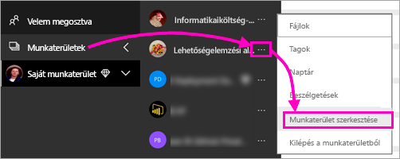

1. A **Munkaterület szerkesztése** párbeszédablakban bontsa ki a **Speciális** elemet, majd állítsa a **Dedikált kapacitás** kapcsolót a **Be** állásba.

    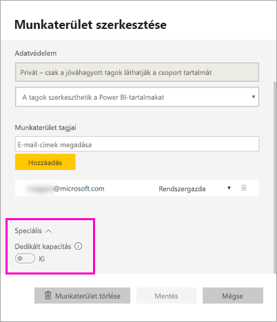

   Előfordulhat, hogy ezt nem tudja módosítani. Ilyen esetben forduljon a Power BI Premium-kapacitás rendszergazdájához, és kérjen hozzárendelési jogosultságot, hogy munkaterületét felvehesse egy prémium szintű kapacitásba.

## Lapszámozott jelentés közzététele a Jelentéskészítőből

1. Készítse el lapszámozott jelentését a Jelentéskészítőben, és mentse a helyi számítógépre.

1. A Jelentéskészítő **Fájl** menüben válassza a **Mentés másként** lehetőséget.

    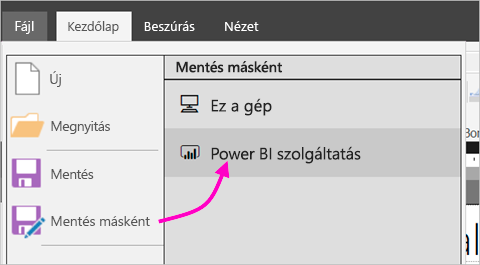

    Ha még nem jelentkezett be Power BI-ba, jelentkezzen be vagy hozzon létre egy fiókot. A Jelentéskészítő jobb felső sarkában válassza a **Bejelentkezés** lehetőséget, majd hajtsa végre a lépéseket.

2. A bal oldali munkaterületek listájában válasszon ki egy, gyémánt ikonnal  ellátott munkaterületet. Írjon be egy **fájlnevet** a mezőbe, majd válassza a **Mentés** lehetőséget. 

    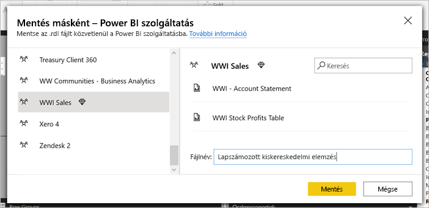

4. Egy böngészőben nyissa meg a Power BI szolgáltatást, és keresse meg a prémium szintű munkaterületet, ahol a lapszámozott jelentést közzétette. A **Jelentések** lapon megjelenik a jelentés.

    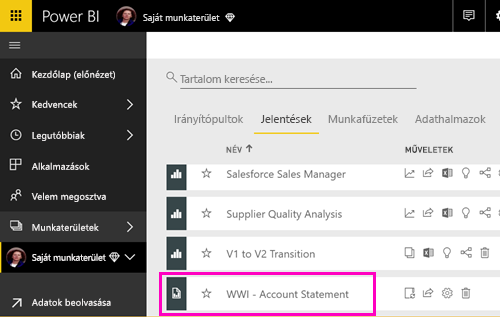

5. Válassza ki a lapszámozott jelentést, hogy megnyissa a Power BI szolgáltatásban. Ha a jelentés paraméterekkel rendelkezik, akkor csak azok kiválasztása után tekinthető meg.

    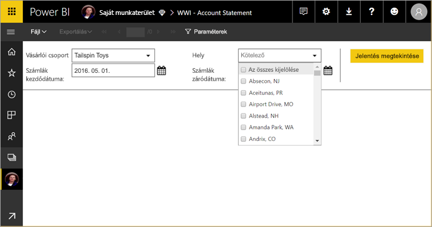

6. Ha a jelentés adatforrása helyszíni, a cikkből megtudhatja, hogyan [hozhat létre egy átjárót](#create-a-gateway) az adatforráshoz.

## Lapszámozott jelentés feltöltése a Power BI szolgáltatásba

A Power BI szolgáltatásból kiindulva is feltölthet egy lapszámozott jelentést.

1. Készítse el lapszámozott jelentését a Jelentéskészítőben, és mentse a helyi számítógépre.

1. Egy böngészőben nyissa meg a Power BI szolgáltatást, és keresse meg a prémium szintű munkaterületet, ahol a jelentést közzé szeretné tenni. Figyelje meg a gyémánt ikont.  A név mellett kell lennie. 

1. Válassza az **Adatok beolvasása** lehetőséget.

    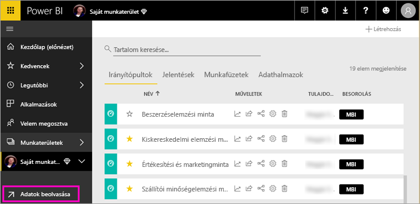

1. A **Fájlok** mezőben válassza a **Beolvasás** lehetőséget.

    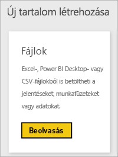

1. Válassza a **Helyi fájl** lehetőséget, tallózással keresse meg a lapszámozott jelentést, majd válassza a **Megnyitás** lehetőséget.

    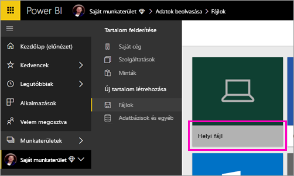

1. Válassza a **Tovább** > **Hitelesítő adatok szerkesztése** lehetőséget.

    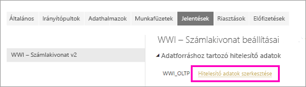

1. Konfigurálja hitelesítő adatait, majd válassza a **Bejelentkezés** lehetőséget.

    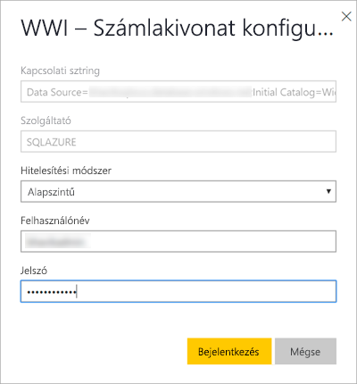

   A **Jelentések** lapon megjelenik a jelentés.

    

1. Jelölje ki, és nyissa meg a Power BI szolgáltatásban. Ha a jelentés paraméterekkel rendelkezik, akkor csak azok kiválasztása után tekinthető meg.
 
    

6. Ha a jelentés adatforrása helyszíni, a cikkből megtudhatja, hogyan [hozhat létre egy átjárót](#create-a-gateway) az adatforráshoz.

## Átjáró létrehozása

Mint minden Power BI-jelentésnél, itt is érvényes, hogy ha a jelentésnek helyszíni adatforrása van, akkor az adatok eléréséhez átjárót kell létrehoznia, vagy átjáróhoz kell csatlakoznia.

1. Válassza a jelentés neve melletti **Kezelés** lehetőséget.

   

1. A részleteket és a következő lépéseket a [Mi az a helyszíni adatátjáró](../connect-data/service-gateway-onprem.md) című Power BI szolgáltatás-cikkben találja meg.

## Következő lépések

- [Lapszámozott jelentés megtekintése a Power BI szolgáltatásban](../consumer/paginated-reports-view-power-bi-service.md)
- [Mik a lapszámozott jelentések a Power BI Premiumban?](paginated-reports-report-builder-power-bi.md)
- [Oktatóanyag: Lapszámozott Power BI-jelentések beágyazása egy alkalmazásba az ügyfelek számára](../developer/embed-paginated-reports-customers.md)

