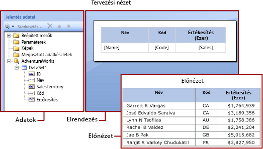

# Kifejezések a Power BI Jelentéskészítőben
  A Power BI Jelentéskészítővel készült lapszámozott jelentésekben gyakran használnak kifejezéseket az adatok lekéréséhez, kiszámításához, megjelenítéséhez, csoportosításához, rendezéséhez, szűréséhez, paraméterezéséhez és formázásához. 
  
  Számos jelentéselem tulajdonságaiként beállíthatók kifejezések. A kifejezések segítenek a jelentés tartalmának, kivitelének és használhatóságának szabályozásában. A kifejezések Visual Basicben vannak megírva, a jelentésdefinícióba vannak mentve, és a jelentésfeldolgozó értékeli ki őket a jelentés futtatásakor.  
  
 Szemben az olyan alkalmazásokkal, mint a Microsoft Excel, ahol az adatokat közvetlenül kezelheti egy munkalapon, a jelentésekben kifejezéseket használhat, amelyek helyőrzők az adatok számára. A kiértékelt kifejezésekből származó tényleges adatok megtekintéséhez meg kell nyitnia a jelentés előnézetét. A jelentés futtatásakor a jelentésfeldolgozó minden kifejezést kiértékel a jelentésbeli adatok és az olyan elrendezési elemek kombinálása során, mint a táblázatok és diagramok.  
  
 A jelentés tervezésekor a jelentéselemekhez sok kifejezés előre be van állítva. Ha például áthúz egy mezőt az adatpanelről egy táblázatcellában a jelentéstervező felületen, a szövegdoboz értéke egy egyszerű kifejezésre lesz beállítva a mezőhöz. Az alábbi ábrán a Jelentésadatok panelen az ID, Name, SalesTerritory, Code és Sales adathalmaz-mezők láthatók. Három mező lett hozzáadva a táblázathoz: [Name], [Code] és [Sales]. A tervezőfelületen megjelenő [Name] elnevezés a mögöttes `=Fields!Name.Value` kifejezésnek felel meg.  
  

  
 A jelentés előnézetében a jelentésfeldolgozó az adatkapcsolatból származó tényeleges adatokkal kombinálja a táblázatos adatterületet, és az eredményhalmaz minden sorához egy sort jelenít meg a táblázatban.  
  
 Kifejezés manuális beviteléhez jelöljön ki egy elemet a tervezőfelületen, majd helyi menük és párbeszédpanelek segítségével állítsa be az elem tulajdonságait. Ha egy legördülő listában az ***(fx)*** gombot vagy az `<Expression>` értéket látja, ebből tudhatja, hogy a tulajdonságként kifejezést is beállíthat. 
  
##   Egyszerű és összetett kifejezések  
 A kifejezések egyenlőségjellel (=) kezdődnek, és Visual Basicben vannak írva. A kifejezések konstansok, operátorok, valamint beépített értékekre (mezőkre, gyűjteményekre és függvényekre) és külső vagy egyéni kódra mutató hivatkozások kombinációját tartalmazhatják.  
  
 Sok jelentéselem-tulajdonság értéke megadható kifejezések használatával. A leggyakoribb ilyen tulajdonságok a szövegdobozok értékei és a helyőrző szövegek. Ha egy szövegdoboz csak egy kifejezést tartalmaz, ez a kifejezés általában a szövegdoboz-tulajdonság értéke. Ha egy szövegdoboz több kifejezést is tartalmaz, akkor ezek mindegyike a szövegdobozbeli helyőrző szöveg értéke.  
  
 A kifejezések alapértelmezés szerint *egyszerű* vagy *összetett kifejezésekként* jelennek meg a jelentés tervezőfelületén.  
  
-   **Egyszerű** – Egy egyszerű kifejezés egy beépített gyűjtemény egyetlen elemére, például egy adathalmazmezőre, paraméterre vagy beépített mezőre mutató hivatkozást tartalmaz. A tervezőfelületen az egyszerű kifejezések szögletes zárójelben jelennek meg. `[FieldName]` például a `=Fields!FieldName.Value` mögöttes kifejezésnek felel meg. Az egyszerű kifejezéseket a rendszer automatikusan hozza létre, amikor a jelentés elrendezésének kialakítása során elemeket húz a Jelentésadatok panelről a tervezőfelületre. A különböző beépített gyűjteményeknek megfelelő szimbólumokról az [Előtagszimbólumok egyszerű kifejezésekben](#DisplayText) című szakasz nyújt további információt.  
  
-   **Összetett** – Egy összetett kifejezés több beépített hivatkozásra, operátorra és függvényhívásra mutató hivatkozást tartalmaz. Az összetett kifejezések <\<Expr>> formában jelennek meg, ha a kifejezés értéke egy egyszerű hivatkozáson kívül mást is tartalmaz. A kifejezés megtekintéséhez vigye fölé a kurzort, és használja az elemleírást. A kifejezést úgy szerkesztheti, hogy megnyitja a **Kifejezés** párbeszédpanelen.  
  
 Az alábbi ábra szövegdobozokban és helyőrző szövegként alkalmazott jellegzetes egyszerű és összetett kifejezéseket mutat be.  
  
 
  
 Hogy a kifejezések szövege helyett mintaértékek jelenjenek meg, alkalmazzon formázást a szövegdobozra vagy a helyőrző szövegre. Az alábbi ábrán a jelentés tervezőfelülete a mintaértékek mutatására átváltva látható:  
  
  

##  Előtagszimbólumok egyszerű kifejezésekben  

Az egyszerű kifejezések szimbólumokkal jelölik, hogy a hivatkozás mezőre, paraméterre, beépített gyűjteményre vagy a ReportItems gyűjteményre vonatkozik-e. Az alábbi táblázat a megjelenített szövegre és a kifejezésre mutat példákat:  
  
|Item|Megjelenített példaszöveg|Példakifejezés szövege|  
|----------|--------------------------|-----------------------------|  
|Adathalmaz-mezők|`[Sales]`   `[SUM(Sales)]`   `[FIRST(Store)]`|`=Fields!Sales.Value`   `=Sum(Fields!Sales.Value)`   `=First(Fields!Store.Value)`|  
|Jelentésparaméterek|`[@Param]`   `[@Param.Label]`|`=Parameters!Param.Value`   `=Parameters!Param.Label`|  
|Beépített mezők|`[&ReportName]`|`=Globals!ReportName.Value`|  
|Megjelenítendő literál karakterek|`\[Sales\]`|`[Sales]`|  
  
##   Összetett kifejezések írása  
 A kifejezések függvényekre, operátorokra, konstansokra, mezőkre, paraméterekre, beépített gyűjteményekből származó elemekre, valamint beágyazott egyéni kódra vagy egyéni szerelvényekre mutató hivatkozásokat tartalmazhatnak.  
  
 Az alábbi táblázat a kifejezésbe foglalható hivatkozási fajtákat sorolja fel:  
  
|Hivatkozások|Leírás|Példa|  
|----------------|-----------------|-------------|  
|Állandók|Olyan konstansokat ír le, amelyeket interaktív módon elérhet konstans értéket kívánó tulajdonságokhoz, például a betűszínekhez.|`="Blue"`|  
|Operátorok|A kifejezésekben a hivatkozások kombinálására használható operátorokat írja le. Az **&** operátor például sztringek összefűzésére szolgál.|`="The report ran at: " & Globals!ExecutionTime & "."`|  
|Beépített gyűjtemények|A kifejezésbe foglalható beépített gyűjteményeket írja le, amilyen például a `Fields`, a `Parameters` és a `Variables`.|`=Fields!Sales.Value`   `=Parameters!Store.Value`   `=Variables!MyCalculation.Value`|  
|Beépített jelentés- és összesítő függvények|Az olyan, kifejezésből elérhető beépített függvényeket ír le, amilyen a `Sum` vagy a `Previous`.|`=Previous(Sum(Fields!Sales.Value))`|  
|Egyéni kódra és egyéni szerelvényre mutató hivatkozások kifejezésekben a Jelentéskészítőben |Leírja, hogyan érhetők el a beépített `xref:System.Math` és `xref:System.Convert` CLR-osztály, más CLR-osztályok, Visual Basic futtatókörnyezeti kódtárfüggvények, vagy külső szerelvényből származó metódusok.   Leírja, hogyan érhető el olyan egyéni kód, amely a jelentésbe van beágyazva, vagy amely egyéni szerelvényként van lefordítva és telepítve a jelentés-ügyfélnél és a jelentéskészítő kiszolgálón.|`=Sum(Fields!Sales.Value)`   `=CDate(Fields!SalesDate.Value)`   `=DateAdd("d",3,Fields!BirthDate.Value)`   `=Code.ToUSD(Fields!StandardCost.Value)`|  
   
##   Kifejezések ellenőrzése  
 Amikor egy adott jelentéselem-tulajdonsághoz hoz létre kifejezést, az abba foglalható hivatkozások függnek a jelentéselem-tulajdonság által elfogadható értékektől és a tulajdonság kiértékelésének hatókörétől. Például:  
  
-   A [Sum] kifejezés alapértelmezés szerint a kifejezés kiértékeléskor a hatókörben lévő adatok összegét számítja ki. Táblázatcella esetén a hatókör a sorcsoport- és oszlopcsoport-tagságoktól függ. 
  
-   Egy Betűtípus tulajdonság esetén a kiértékelésnek egy betűtípus nevét kell eredményeznie.  
  
-   A kifejezések szintaxisát a tervezés során ellenőrzi a rendszer. A kifejezések hatókörének ellenőrzése a jelentés közzétételekor történik. A tényleges adatoktól függő ellenőrzések esetén a hibák csak futásidőben észlelhetők. Az ilyen kifejezések olykor az #Error hibaüzenetet eredményezik a megjelenített jelentésben. 

## Következő lépések

- [Mik a lapszámozott jelentések a Power BI Premiumban?](paginated-reports-report-builder-power-bi.md)
