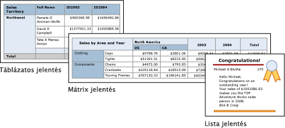

# Táblázatok, mátrixok és listák a Power BI Jelentéskészítőben
 A Jelentéskészítőben a táblázatok, mátrixok és listák olyan *adatterületek*, amelyek a lapszámozott jelentés adatait sorokba és oszlopokba szervezett cellákban jelenítik meg. A cellák tartalma általában szöveges adat, például szöveg, dátum vagy szám, de tartalmazhatnak kijelzőket, diagramokat vagy jelentéselemeket, például képeket is. A táblázatok, mátrixok és listák gyakran használt összefoglaló neve *rácsos* adatterület.  
  
 A táblázat-, mátrix- és listasablonok a rácsos adatterületre épülnek, amely az adatok cellákban való megjelenítésére alkalmas rugalmas rács. A táblázat- és mátrixsablonok cellái sorokba és oszlopokba vannak szervezve. Mivel a sablonok az alapjukul szolgáló általános rácsos adatterület változatai, az adatok a sablonformátumok kombinációjával is megjeleníthetők, és a jelentés fejlesztése során táblázattá, mátrixszá vagy listává alakíthatók, hogy tartalmazhassák egy másik adatterület funkcióit. Ha például felvesz egy táblázatot, majd úgy találja, hogy az nem felel meg az igényeinek, oszlopcsoportok hozzáadásával mátrixszá teheti a táblázatot.  
  
 A táblázat és a mátrix adatterületek összetett adatkapcsolatok megjelenítésére alkalmasak például beágyazott táblázatok, mátrixok, listák, diagramok és kijelzők használatával. A táblázatok és a mátrixok elrendezése táblázatos, adataik pedig egyetlen adathalmazból származnak, amely egyetlen adatforrásra épül. A táblázatok és a mátrixok közötti fő eltérés az, hogy a táblázatok csak sorcsoportokat, a mátrixok viszont sorcsoportokat és oszlopcsoportokat is tartalmazhatnak.  
  
 A listák egy kicsit mások. Szabad elrendezést támogatnak, és több társtáblázatot vagy -mátrixot is tartalmazhatnak, amelyek mindegyike más adathalmaz adatait használhatja. A listák űrlapokhoz, például számlákhoz is használhatók.  
  
 Az alábbi ábrán egyszerű jelentések láthatók táblázattal, mátrixszal és listával.  

  
##   Táblázatok  
 Táblázat használatával részletes adatokat jeleníthet meg, sorcsoportokba rendezheti az adatokat, vagy a kettőt egyszerre is megteheti. A Táblázat sablon három oszlopot tartalmaz táblázatfejléccel és egy részletező sorral az adatok számára. Az alábbi ábrán a tervezési felületen kijelölt kiindulási táblázatsablon látható:  

  
 Az adatok egy mező, több mező, vagy saját készítésű kifejezés alapján is csoportosíthatók. Létrehozhat beágyazott csoportokat, vagy független, szomszédos csoportokat is, és összesített értékeket jeleníthet meg a csoportosított adatokhoz, vagy összegeket adhat meg a csoportokhoz. Ha a táblázatban van például egy **Kategória** nevű sorcsoport, a jelentés teljes összege mellett minden csoporthoz megadhat egy részösszeget. A tábla megjelenésének javítása és a hangsúlyozni kívánt adatok kiemelése érdekében cellákat egyesíthet, és formázhatja az adat- és a táblázatfejléceket.  
  
 Kezdetben elrejtheti a részletes vagy csoportosított adatokat, és részletező váltókapcsolók felvételével lehetővé teheti, hogy a felhasználó interaktív módon dönthessen a megjelenítendő adatok mennyiségéről.  
  
##   Mátrixok  
 Mátrix használatával összesített adatösszegeket jeleníthet meg sorokban és oszlopokban csoportosítva, a kimutatásokhoz vagy kereszttáblákhoz hasonlóan. A csoportok sorainak és oszlopainak számát az egyes sor- és oszlopcsoportokban lévő egyedi értékek száma határozza meg. Az alábbi ábrán a tervezési felületen kijelölt kiindulási mátrixsablon látható:  

 
 Az adatok több mező vagy kifejezés alapján csoportosíthatók sor- vagy oszlopcsoportokba. Amikor a futtatás során a jelentésadatok és az adatterületek kombinálva vannak, a mátrix vízszintesen és függőelegesen is növekszik az oldalon az oszlopcsoportokhoz hozzáadott oszlopokkal és a sorcsoportokhoz adott sorokkal. A mátrix cellái összesített értékeket jelenítenek meg, ezek pedig azoknak a sor- és oszlopcsoportoknak a metszetére vonatkoznak, amelyekhez a cella tartozik. Ha a mátrixban például egy sorcsoport (Kategória) és két oszlopcsoport (Terület és Év) van, amelyek az értékesítések összegét jelenítik meg, akkor a jelentésben két cella jelenik meg a Kategória csoportban az egyes értékekhez tatozó összegekkel. A cellák hatóköre két metszet: Kategória és Terület, valamint Kategória és Év. A mátrix beágyazott és szomszédos csoportokat is tartalmazhat. A beágyazott csoportok szülő-gyermek kapcsolatban, a szomszédos csoportok társkapcsolatban állnak. A beágyazott sor- és oszlopcsoportok bármely, akár összes szintjéhez megadhatók részösszegek a mátrixban.  
  
 A mátrixbeli adatok olvashatóbbá tételéhez, és azoknak az adatoknak a kiemeléséhez, amelyekre fel szeretné hívni a figyelmet, egyesítheti, vagy vízszintesen vagy függőlegesen feloszthatja a cellákat, és formázhatja az adat- és csoportfejléceket.  
  
 Részletezési váltókapcsolókat is belefoglalhat, amelyek kezdetben elrejtik a részletes adatokat, majd a felhasználó a kapcsolókra kattintva igény szerint több vagy kevesebb részletet jeleníthet meg.  
  
##   Listák  
 Lista használatával kötetlen formátumú elrendezést hozhat létre. Nem kell a rácsos elrendezéshez igazodnia, a listán belül bárhol helyezhet el mezőket. Lista használatával űrlapot tervezhet sok adathalmaz-mező megjelenítésére, vagy használhatja a listát tárolóként, amely egymás mellett több adatterületen jeleníti meg a csoportosított adatokat. Egy listához definiálhat például egy csoportot, hozzáadhat egy táblázatot, egy diagramot és képet, és minden csoportértékhez táblázatban és grafikusan is megjelenítheti az értékeket, például egy alkalmazotti vagy páciens-rekord esetén.  

  
##   Az adatok előkészítése  
 A táblázat, a mátrix és a lista adatterületek egy adathalmaz adatait jelenítik meg. Az adatokat előkészítheti az azokat az adathalmazból beolvasó lekérdezésben, vagy a táblázatban, mátrixban vagy listában beállított tulajdonságokkal.  
  
 A Transact-SQL és a jelentés adathalmazaiból adatokat beolvasó hasonló lekérdezőnyelvek szűrők alkalmazásával úgy készíthetik elő az adatokat, hogy azok csak az eredeti adatok egy részhalmazát tartalmazzák, a NULL vagy üres értékeket konstansokra cserélve olvashatóbbá teszik a jelentést, és rendezik és csoportosítják az adatokat.  
  
 Ha úgy dönt, hogy az adatokat egy jelentés tábla, mátrix vagy lista adatterületén készíti elő, akkor az adatterületre vagy az adatterület celláira állíthat be tulajdonságokat. Az adatok az adatterületre beállított tulajdonságokkal szűrhetők vagy rendezhetők. Az adatok rendezéséhez például megadhatja az oszlopot, amely alapján rendezni kíván, valamint a rendezés irányát is. Ha egy mezőhöz szeretne más értéket megjeleníteni, akkor a mezőt megjelenítő cellaszöveg értékeit állíthatja be. Ha például üres vagy NULL értékű mezőkhöz a Nincs kitöltve szöveget szeretné megjeleníteni, egy képlettel állíthatja be ezt az értéket.  
  
##   Táblázat, mátrix vagy lista készítése és konfigurálása  
 Amikor táblázatokat vagy mátrixokat ad jelentéséhez, használhatja a Táblázat és Mátrix varázslót, vagy elkészítheti őket manuálisan a Jelentéskészítő által kínált sablonokból. Listák a listasablonból készíthetők.  
  
 A varázsló végigvezeti Önt a lépéseken, hogy gyorsan elkészíthessen és konfigurálhasson egy táblázatot vagy mátrixot. A varázsló befejezése vagy a rácsos adatterületek elkészítése után tovább konfigurálhatja és finomíthatja azokat. Az adatterületek jobb kattintással elérhető helyi menüi megkönnyítik az olyan gyakran használt beállítások megadását, mint az oldaltörések, a fejlécek és láblécek ismétlése és láthatósága, a megjelenítési beállítások, a szűrők és a rendezés. A rácsos adatterület azonban sok más tulajdonságot is kínál, amelyek csak a Jelentéskészítő Tulajdonságok paneljén állíthatók be. Ha például üzenetet szeretne megjeleníteni, amikor egy táblázat, mátrix vagy lista adathalmaza üres, ezt az üzenetet a rácsos adatterület NoRowsMessage tulajdonságában adhatja meg a Tulajdonságok panelen.  
  
##   Váltás rácsos adatterület-sablonok között  
 Nem csak az eredetileg választott rácsos adatterületet használhatja. Új csoportok, összegek és címkék hozzáadása során előfordulhat, hogy módosítani szeretné a rácsos adatterület kivitelét. Kiindulhat például egy táblázatból, amelynek aztán törli a részletező sorát, és oszlopcsoportokat ad hozzá.  
  
 Egy táblázat, mátrix vagy lista a rácsos adatterület bármely funkciójának hozzáadásával továbbfejleszthető. A rácsos adatterületek funkciói közé tartozik, hogy részletes adatokat vagy csoportosított adatok összegzéseit jelenítik meg sorokban és oszlopokban. Létrehozhat beágyazott csoportokat, független szomszédos csoportokat vagy rekurzív csoportokat is. A csoportosított adatokat szűrheti és rendezheti, a csoportokat pedig egyszerűen kombinálhatja a csoport definíciójába foglalt csoportkifejezésekkel.  
  
 A csoportokra összegeket, az adatterülethez pedig teljes összeget is felvehet. Elrejthet sorokat vagy oszlopokat, hogy egyszerűbbé tegye a jelentést, és lehetővé teheti a felhasználó számára, hogy a rejtett adatok megjelenítésének bekapcsolásával részletesen tanulmányozza a jelentést. 

## Következő lépések

- [Mik a lapszámozott jelentések a Power BI Premiumban?](paginated-reports-report-builder-power-bi.md)
