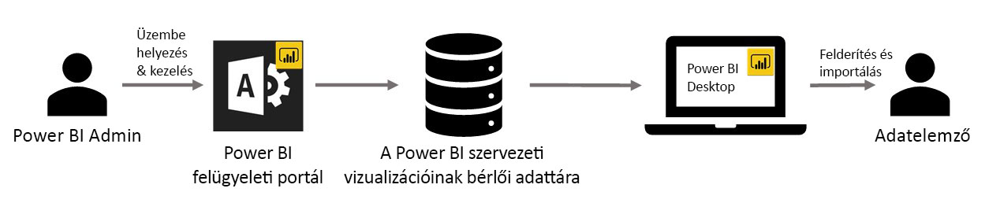

# Vállalati vizualizációk a Power BI-ban

A Power BI-ban az egyéni vizualizációkkal személyre szabott, egyedi stílusú vizualizációkat hozhat létre. Ezeket az egyéni vizualizációkat fejlesztők készítik, és azokat gyakran akkor hozzák létre, amikor a Power BI-ban található számos látványelem nem egészen felelt meg az igényeiknek.

Egyes szervezeteknél az egyéni vizualizációk még ennél is fontosabbak – szükségesek lehetnek a szervezet bizonyos egyedi adatainak vagy elemzéseinek átadásához, speciális adatkövetelményeik lehetnek, vagy privát üzleti eljárásokat emelhetnek ki. Az ilyen szervezeteknek egyéni vizualizációkat kell fejleszteniük, azokat meg kell osztaniuk az egész szervezetben, és gondoskodniuk kell azok megfelelő karbantartásáról. A Power BI egyéni vizualizációival a szervezetek pont ezt tehetik.

A következő képen az a folyamat látható, mely alapján a Power BI egyéni szervezeti vizualizációi a rendszergazdától a fejlesztésen és a karbantartáson át végül eljutnak az adatelemzőkhöz.

A szervezeti vizualizációkat a Power BI rendszergazdája helyezi üzembe és kezeli a felügyeleti portálon. A szervezeti adattárban való üzembe helyezésük után a szervezet felhasználói könnyedén felderíthetik őket, és közvetlenül a Power BI Desktopból importálhatják az egyéni szervezeti vizualizációkat.

Az egyéni szervezeti vizualizációk létrehozott jelentésekben való használatával kapcsolatban a következő cikkben találhat további információt: [További tudnivalók a szervezeti vizualizációk jelentésekbe importálásáról](power-bi-custom-visuals.md).

## Az egyéni szervezeti vizualizációk felügyelete

Az egyéni szervezeti vizualizációknak a szervezetben való felügyeletével, üzembe helyezésével és kezelésével kapcsolatban a következő cikkben találhat további információt: [További információk az egyéni szervezeti vizualizációk üzembe helyezésével és kezelésével kapcsolatban](https://go.microsoft.com/fwlink/?linkid=866790).

> [!WARNING]
> Az egyéni vizualizációk biztonsági és adatvédelmi kockázatokat tartalmazó kódot is tartalmazhatnak. Győződjön meg arról, hogy az egyéni vizualizációk szerzője és forrása megbízható, mielőtt üzembe helyezné őket a szervezet tárházban.

## Megfontolandó szempontok és korlátozások

Több szempontot és korlátozást is figyelembe kell venni.

Rendszergazdák:

* Az örökölt egyéni vizualizációk (mint például azok az egyéni vizualizációk, melyek nem az új verzióval ellátott API-kra épülnek) használata nem támogatott

* Ha egy egyéni vizualizációt törölnek a tárházból, leáll minden olyan meglévő jelentés megjelenítése, mely a törölt vizualizációt használja. Az adattárból való törlés művelete nem vonható vissza. Az egyéni vizualizációk ideiglenes letiltásához használja a „Letiltás” funkciót.

Végfelhasználók:

* Az egyéni szervezeti vizualizációk a szervezeti adattárból importált privát vizualizációk. Ahogy a többi privát vizualizáció, ezek sem [exportálhatók a PowerPointba](https://docs.microsoft.com/power-bi/consumer/end-user-powerpoint), és nem jeleníthetők meg olyan e-mailekben, amelyek akkor érkeznek, amikor egy felhasználó [feliratkozik jelentésoldalakra](https://docs.microsoft.com/power-bi/consumer/end-user-subscribe). Ezeket a funkciókat csak a közvetlenül a piactérről importált, [minősített egyéni vizualizációk](https://docs.microsoft.com/power-bi/power-bi-custom-visuals-certified) támogatják.

* Az AppSource piactérről származó Visio-vizualizáció, PowerApps-vizualizáció és GlobeMap-vizualizáció nem jelenik meg, ha a szervezet adattárának használatával lett üzembe helyezve.

## Hibaelhárítás

A hibaelhárítással kapcsolatban az [egyéni Power BI-vizualizációk hibáinak elhárítását](power-bi-custom-visuals-troubleshoot.md) ismertető cikkből tájékozódhat.

## Gyakori kérdések

További információt és válaszokat [az egyéni Power BI-vizualizációkkal kapcsolatos gyakori kérdések](power-bi-custom-visuals-faq.md#organizational-custom-visuals) között talál.

További kérdései vannak? [Kérdezze meg a Power BI közösségét](http://community.powerbi.com/).
