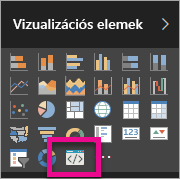

# Power BI-vizualizációk hibáinak elhárítása

## Hibakeresés

**A pbiviz parancs nem található (vagy ehhez hasonló hibaüzenetek)**

Ha a terminálon/parancssorból kiadja a `pbiviz` parancsot, akkor meg kell jelennie a súgóképernyőnek. Ha nem jelenik meg, akkor nincs jól telepítve az eszköz. Ellenőrizze, hogy telepítve van-e a NodeJS 4.0-s vagy újabb verziója.

**Nem látható a Vizualizációk lapon a vizualizációk hibáinak keresését indító ikon**

A **Megjelenítések** panelen egy olyan ikon jelzi a vizualizáció hibakeresését, amelyen egy parancssor grafikája látható.

Ha ez nincs ott, akkor valószínűleg engedélyeznie kell a Power BI beállításai között.

> [!NOTE]
> A vizualizáció hibakeresése jelenleg csak a Power BI szolgáltatásban érhető el, a Power BI Desktopban és a mobilappan nem. A csomagolt vizualizáció ennek ellenére minden platformon működik.

**Nem lehet kapcsolatot létesíteni a vizualizáció kiszolgálójával**

Futtassa a vizualizáció kiszolgálóját. Ehhez adja ki a terminálon/parancsorból a `pbiviz start` parancsot a vizualizáció projektjének gyökérmappájából. Ha a kiszolgáló nem fut, akkor valószínűleg nincsenek helyesen telepítve az SSL-tanúsítványok.

Ha bármilyen kérdése, megjegyzése vagy problémája van, vegye fel a kapcsolatot a Power BI-vizualizációk csapatával a  *pbicvsupport@microsoft.com*   címen.

## Következő lépések

További információt [a Power BI-vizualizációkkal kapcsolatos gyakori kérdések](power-bi-custom-visuals-faq.md#organizational-visuals) között talál.