# Egyéni vizualizációk a Power BI-ban

Létrehozásakor, vagy a Power BI-jelentés szerkesztése, használhatja a számos különböző vizualizációtípust. Ezek a Vizualizációk a ikonjai megjelennek a **Vizualizációk** ablaktáblán. Ezek a Vizualizációk előrecsomagolt származnak, amikor letölti [Power BI Desktop](https://powerbi.microsoft.com/desktop/) , vagy nyissa meg a [Power BI szolgáltatás](https://app.powerbi.com).

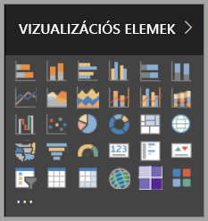

Ön azonban nem a Vizualizációk egy készlete korlátozott. Ha kiválasztja a három pontra (...) a lap alján, egy másik forrását jelentésvizualizációk válik érhető el –*egyéni Vizualizációk*.

A fejlesztők az egyéni Vizualizációk SDK használatával egyéni Vizualizációk létrehozása. Ezek a Vizualizációk engedélyezése az üzleti felhasználók számára olyan módon, hogy a leginkább megfelel az üzleti adatok. Jelentések szerzői Ezután importálja az egyéni vizualizációfájlok jelentéseikbe és használja őket, mint bármely más Power BI-Vizualizációk. Egyéni Vizualizációk a Power BI első osztályú állampolgárok és szűrhetők, kiemelt, szerkesztett, megosztott és így tovább.

Egyéni Vizualizációk háromféle módon vannak telepítve:

* Egyéni vizualizációfájlok
* Szervezeti vizualizációk
* Piactér-vizualizációk

## Egyéni vizualizációfájlok

Egyéni Vizualizációk olyan csomagok, a kód szolgáltatott adatok rendereléséhez szükséges őket. Bárki hozzon létre egy egyéni vizualizációt és Becsomagolhatja azt egy `.pbiviz` fájlt, majd importálhatja a Power BI-jelentés.

> [!WARNING]
> Az egyéni Vizualizációk biztonsági vagy adatvédelmi kockázatot kódot tartalmazhatnak. Győződjön meg arról, hogy megbízik a szerzőben és egyéni Vizualizáció forráskódja mielőtt importálná azokat a jelentésbe.

## Szervezeti vizualizációk

Power BI-rendszergazdák hagyja jóvá, és helyezze üzembe az egyéni Vizualizációk szervezet, amely a jelentéskészítők könnyen felderítése, frissítheti, és használja. A rendszergazdák egyszerűen kezelhetik (például verziójának frissítése, letilthatják vagy engedélyezhetik) ezek a Vizualizációk.

 [További információk a szervezeti Vizualizációk](power-bi-custom-visuals-organization.md).

## Piactér-vizualizációk

Közösség tagjai és a Microsoft rendelkezik hozzájárult az egyéni vizualizációikat nyilvános juttatásra, és közzétette őket a [AppSource](https://appsource.microsoft.com/marketplace/apps?product=power-bi-visuals) Marketplace-en. Ezeket letöltheti a Power BI-jelentések azokat hozzá Vizualizációk. A Microsoft tesztelt és jóváhagyott működés és minőség ezeket az egyéni vizualizációkat.

Mi az az [AppSource](developer/office-store.md)? Legyen a hely, ahol annak alkalmazásokat, beépülő modulok és bővítmények a Microsoft-szoftverekhez. [Appsource-ban](https://appsource.microsoft.com/) millió felhasználójának termékek, például az Office 365, Azure, Dynamics 365, Cortana és a Power BI-megoldásokat, amelyekkel való munkavégzés hatékonyabban, részletgazdagabban, és lenyűgöző formában, mint korábban.

### Hitelesített vizualizációk

A Power BI minősítéssel rendelkező Vizualizációk, amelyek megfeleltek a további szigorú minőségi tesztelése és további forgatókönyvek, például a támogatott Piactéri Vizualizációk [e-mailes előfizetések](https://docs.microsoft.com/power-bi/service-report-subscribe), és [exportálás a PowerPointba](https://docs.microsoft.com/power-bi/service-publish-to-powerpoint).
A minősített egyéni vizualizációk listájának megtekintéséhez vagy saját vizualizáció közzétételéhez lásd a [minősített egyéni vizualizációkat](https://docs.microsoft.com/power-bi/power-bi-custom-visuals-certified) ismertető szakaszt.

Ön olyan webfejlesztő, aki szeretne saját vizualizációkat létrehozni, és hozzáadni azokat az AppSource-hoz? Lásd: [Power BI egyéni Vizualizációk fejlesztésével](developer/custom-visual-develop-tutorial.md) , és ismerje meg, hogyan [egyéni Vizualizációk közzététele az appsource-ban](https://docs.microsoft.com/power-bi/developer/office-store).

### Egyéni vizualizáció importálása fájlból

1. Kattintson a három pontra alján a **Vizualizációk** ablaktáblán.

    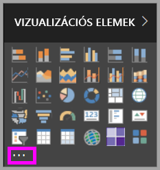

2. A legördülő listából válassza az **Importálás fájlból** lehetőséget.

    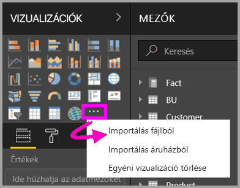

3. A fájl megnyitása menüben válassza a `.pbiviz` fájlt, amelyet szeretne importálni, majd **nyílt**. Az egyéni Vizualizáció ikonja alján hozzáadódik a **Vizualizációk** ablaktáblán, és most használatra kész a jelentés.

    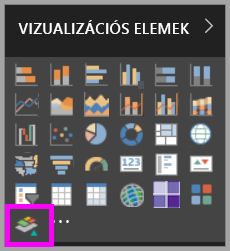

### Szervezeti vizualizációk importálása

1. Kattintson a három pontra alján a **Vizualizációk** ablaktáblán.

    

2. A legördülő listából válassza az **Importálás a piactérről** lehetőséget.

    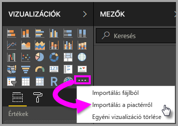

3. Válassza a **SAJÁT SZERVEZET** lehetőséget a felső lap menüjében.

    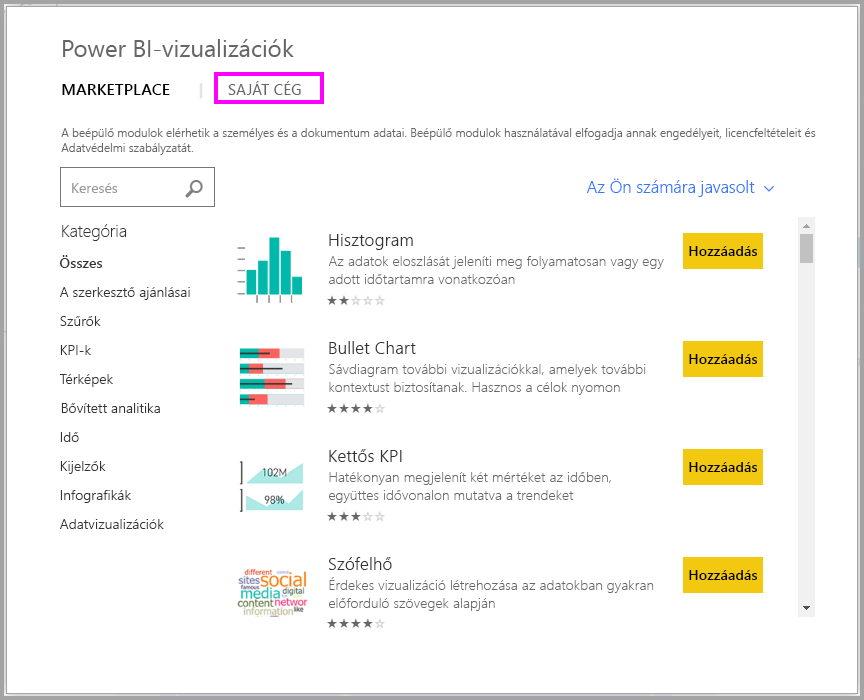

4. Tekintse át a listát, és keresse meg az importálni kívánt vizualizációt.

    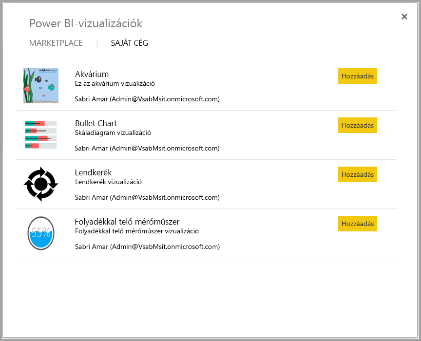

5. Válassza ki **Hozzáadás** az egyéni Vizualizáció importálása. Ikonjára alján hozzáadódik a **Vizualizációk** ablaktáblán, és most használatra kész a jelentés.

    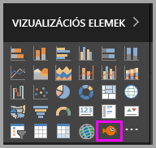

## Egyéni vizualizáció letöltése vagy importálása a Microsoft AppSource-ról

Letöltéséhez és importálásához az egyéni Vizualizációk két lehetősége van: a Power BI-ban, és a a [AppSource webhelyen](https://appsource.microsoft.com/).

### Egyéni vizualizációk importálása a Power BI-on belül

1. Kattintson a három pontra alján a **Vizualizációk** ablaktáblán.

    

2. A legördülő listából válassza az **Importálás a piactérről** lehetőséget.

    

3. Tekintse át a listát, és keresse meg az importálni kívánt vizualizációt.

    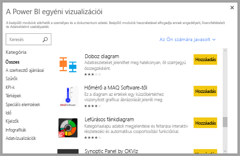

4. Az egyes vizualizációk kijelölésével további információkat tudhat meg róluk.

    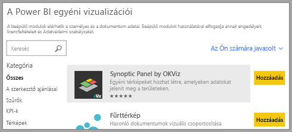

5. A részletek lapon többek között képernyőképeket, videókat és részletes leírásokat tekinthet meg.

    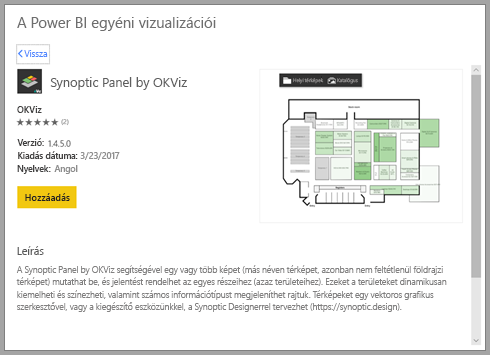

6. A képernyő alján értékelések is találhatók.

    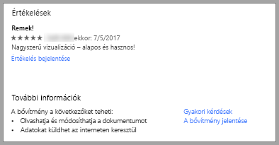

7. Válassza ki **Hozzáadás** az egyéni Vizualizáció importálása. Ikonjára alján hozzáadódik a **Vizualizációk** ablaktáblán, és most használatra kész a jelentés.

    

### Egyéni vizualizáció letöltése és importálása a Microsoft AppSource-ról

1. A [Microsoft AppSource](https://appsource.microsoft.com) webhelyről kiindulva válassza az **Alkalmazások** lapot.

    

2. Látogasson el az [Alkalmazások találatainak oldalára](https://appsource.microsoft.com/marketplace/apps), ott megtekintheti az egyes kategóriák legnépszerűbb alkalmazásait, beleértve a *Power BI-alkalmazásokat*. Egyéni Vizualizációk, ezért válassza számíthatunk **Power BI-Vizualizációk** a bal oldali navigációs listában az eredmények szűkítéséhez.

    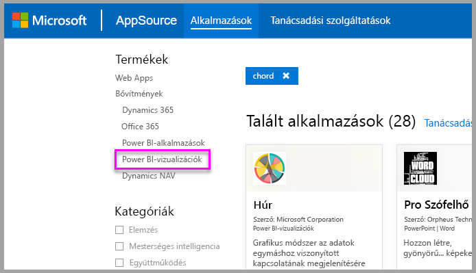

3. Az AppSource minden egyes egyéni vizualizációhoz megjelenít egy csempét.  Mindegyik csempe rendelkezik egy egyéni vizuális pillanatkép egy rövid leírást és a egy letöltési hivatkozást. További részletekért kattintson a csempére.

    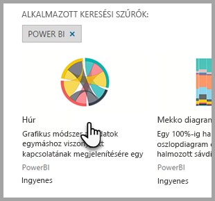

4. A részletek lapon többek között képernyőképeket, videókat és részletes leírásokat tekinthet meg. Válassza ki **Letöltés most** az egyéni Vizualizáció letöltéséhez, és a használati feltételeket, majd fogadja el.

    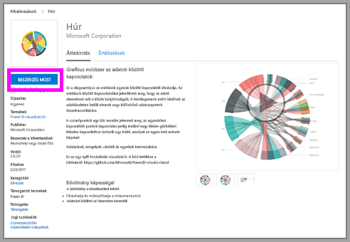

5. Kattintson az egyéni vizualizáció letöltési hivatkozására.

    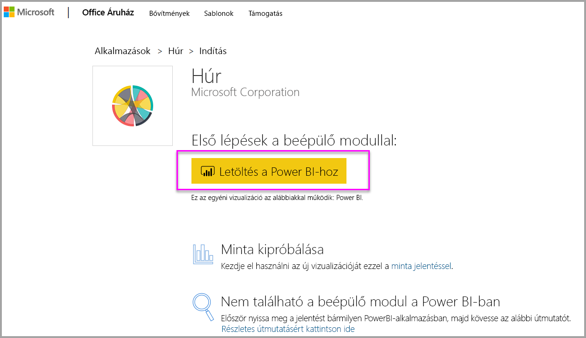

    A letöltési oldalról is útmutatást nyújt az egyéni Vizualizáció importálása a Power BI Desktop és a Power BI szolgáltatásban.

    Egy mintajelentést is letölthet, amely tartalmazza az egyéni vizualizációt, és bemutatja annak képességeit.

    

6. Mentse a `.pbiviz` fájlt, és nyissa meg a Power bi-ban.

7. Importálás a `.pbiviz` fájlt a jelentésbe. (Lásd a fenti [Egyéni látványelem importálása](#import-a-custom-visual-from-a-file) szakaszt.)

## Megfontolandó szempontok és korlátozások

* Az egyéni vizualizáció az importálásakor az adott jelentéshez lesz hozzáadva. Ha egy másik jelentésben is használni szeretné a vizualizációt, abba a jelentésbe is importálnia kell. Ha egy egyéni vizualizációval rendelkező jelentést a **Mentés másként** lehetőséggel ment, az új jelentéssel együtt az egyéni vizualizáció egy másolata is mentve lesz.

* Ha nem látja a **Vizualizációk** panelen, amely azt jelenti, hogy az nem rendelkezik a jelentés szerkesztéséhez szükséges engedélyekkel.  Csak azokhoz a jelentésekhez adhat hozzá egyéni vizualizációkat, amelyek szerkesztésére jogosult, az Önnel megosztott jelentésekhez nem.

## Hibaelhárítás

Hibaelhárítása: [hibáinak elhárítása a Power BI egyéni vizualizációinak](power-bi-custom-visuals-troubleshoot.md).

## Gyakori kérdések

További információt és válaszokat [az egyéni Power BI-vizualizációkkal kapcsolatos gyakori kérdések](power-bi-custom-visuals-faq.md#organizational-custom-visuals) között talál.

## Következő lépések

* [Vizualizációk a Power BI-jelentések](visuals/power-bi-report-visualizations.md)

További kérdései vannak? [Kérdezze meg a Power BI közösségét](http://community.powerbi.com/).
