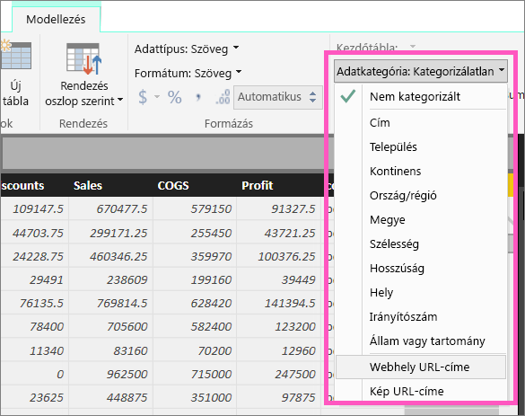

# Hivatkozások (URL-címek) felvétele táblázatba
Ez a témakör a hivatkozások (URL-címek) táblázatokba való felvételét mutatja be. Hivatkozásokat a Power BI Desktop használatával vehet fel táblázatba vagy mátrixba. Ezeket a hivatkozásokat aztán a Power BI Desktopban vagy a Power BI szolgáltatásban adhatja hozzá a jelentések táblázataihoz és a mátrixaihoz. 

> [!NOTE]
> A Power BI szolgáltatásban menet közben hozhatja létre az [irányítópultok csempéin](service-dashboard-edit-tile.md) és az [irányítópultok szövegdobozaiban](service-dashboard-add-widget.md) lévő hivatkozásokat. A [jelentések szövegdobozaiban](service-add-hyperlink-to-text-box.md) lévő hivatkozásokat a Power BI szolgáltatásban és a Power BI Desktopban is létrehozhatja menet közben.
> 

## Hivatkozás létrehozása táblázatban vagy mátrixban a Power BI Desktop segítségével
A táblázatokban és mátrixokban lévő hivatkozásokat csak a Power BI Desktoppal hozhatja létre, a Power BI szolgáltatással nem. Hivatkozásokat az Excel Power Pivotban is létrehozhat, mielőtt a munkafüzetet a Power BI-ba importálná. Az alábbiakban mindkét módszer leírása megtalálható.

## Hivatkozás létrehozása táblázatban vagy mátrixban a Power BI Desktop használatával
A hivatkozás felvételének menete attól függ, hogy importálta az adatokat, vagy a DirectQuery segítségével csatlakozott hozzájuk. Az alábbiakban mindkét eset leírása megtalálható.

### Power BI-ba importált adatok
1. Ha a hivatkozás még nem létezik mezőként az adatkészletben, vegye fel a Power BI Desktoppal [egyéni oszlopként](desktop-common-query-tasks.md).
2. Az Adatok nézetben válassza ki az oszlopot, és a **Modellezés** lapon válassza az **Adatkategória** legördülő menüt.
   
    
3. Kattintson a **Webes URL-cím** lehetőségre.
4. Váltson Jelentés nézetre, majd hozzon létre egy táblázatot vagy mátrixot a Webes URL-cím kategóriába sorolt mező használatával. A hivatkozások kék színnel, aláhúzva jelennek meg.

    

    > [!NOTE]
    > Az URL-címeknek bizonyos előtagokkal kell kezdődniük. A teljes listát a [Megfontolandó szempontok és hibaelhárítás](#considerations-and-troubleshooting) című részben találhatja.
    >
   
1. Ha nem szeretne hosszú URL-címet megjeleníteni a táblázatban, egy hivatkozásikont is megjeleníthet   helyette. Figyelem: a mátrixokban nem jeleníthet meg ikonokat.
   
    A diagram aktiválásához kattintson a diagramra.

    A Formázás ikon kiválasztása  a Formázás lap megnyitásához.

    Bontsa ki az **Értékek** elemet, keresse meg az **URL-ikont**, és kapcsolja **Be**.

    

1. (Választható) [A Power BI Desktopból származó jelentést közzéteheti a Power BI szolgáltatásban](/learn/modules/publish-share-power-bi/2-publish-reports), és megnyithatja a Power BI szolgáltatáson belül. A hivatkozások itt is működni fognak.

### DirectQuery segítségével csatlakoztatott adatok
DirectQuery módban nem hozhat létre új oszlopot.  Az adatokban már meglévő URL-címeket viszont átalakíthatja hivatkozásokká.

1. Jelentés nézetben hozzon létre egy táblázatot egy URL-címeket tartalmazó mezővel.
2. Jelölje ki az oszlopot, majd a **Modellezés** lapon válassza az **Adatkategória** legördülő menüt.
3. Kattintson a **Webes URL-cím** lehetőségre. A hivatkozások kék színnel, aláhúzva jelennek meg.
4. (Választható) [A Power BI Desktopból származó jelentést közzéteheti a Power BI szolgáltatásban](/learn/modules/publish-share-power-bi/2-publish-reports), és megnyithatja a Power BI szolgáltatáson belül. A hivatkozások itt is működni fognak.

## Hivatkozás létrehozása táblázatban vagy mátrixban az Excel Power Pivot használatával
A Power BI táblázataihoz és mátrixaihoz úgy is hozzáadhatja a hivatkozásokat, hogy még azelőtt létrehozza őket az adatkészletben, hogy az adatkészletet importálná vagy csatlakoztatná a Power BI-ban. Ez a példa egy Excel-munkafüzetet használ.

1. Nyissa meg a munkafüzetet az Excelben.
2. Kattintson a **PowerPivot** lapra, majd a **Kezelés** elemre.
   
   
1. Amikor megnyílik a PowerPivot, kattintson a **Speciális** fülre.
   
   
4. Vigye a kurzort arra az oszlopra, amely azokat az URL-címeket tartalmazza, amelyeket hivatkozásokká szeretne alakítani a Power BI tábláiban.
   
   > [!NOTE]
   > Az URL-címeknek bizonyos előtagokkal kell kezdődniük. A teljes listát a [Megfontolandó szempontok és hibaelhárítás](#considerations-and-troubleshooting) című részben találhatja.
   > 
   
5. A **Jelentéskészítési tulajdonságok** csoportban válassza az **Adatkategória** legördülő menüt, és kattintson a **Webes URL-cím** elemre. 
   
   

6. Csatlakozzon a munkafüzethez a Power BI szolgáltatásból vagy a Power BI Desktopról, vagy importálja a munkafüzetet.
7. Hozzon létre egy táblázatvizualizációt, amely tartalmazza az URL-mezőt.
   
   

## Megfontolandó szempontok és hibaelhárítás

Az URL-címeknek a következőkkel kell kezdődniük:
- http
- https
- -mailto
- file
- ftp
- news
- telnet

KÉRDÉS: Használhatok hivatkozásként egyéni URL-t a táblázatokban és a mátrixokban?    
VÁLASZ: Nem. Csak hivatkozás ikont lehet használni. Ha a hivatkozáshoz egyéni szöveget szeretne használni, és túl kevés URL van a listán, érdemes lehet szövegmezőt használni inkább.

## Következő lépések
[Vizualizációk a Power BI-jelentésekben](visuals/power-bi-report-visualizations.md)

[A Power BI szolgáltatás alapfogalmai tervezők számára](service-basic-concepts.md)

További kérdései vannak? [Kérdezze meg a Power BI közösségét](https://community.powerbi.com/)

