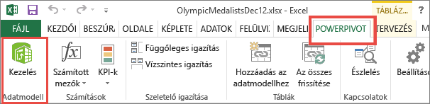
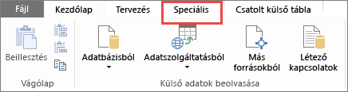
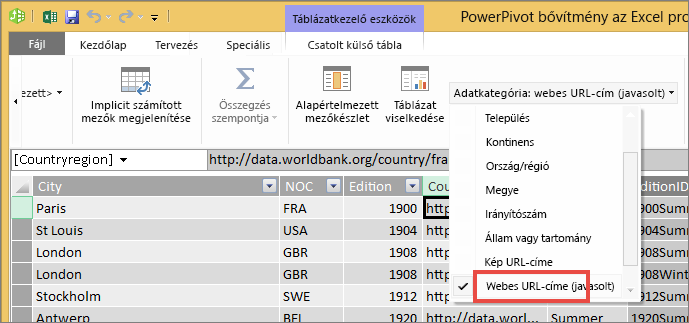

# Hivatkozások (URL-címek) felvétele táblázatba vagy mátrixba
Ez a témakör a hivatkozások (URL-címek) táblázatokba való felvételét mutatja be. Hivatkozásokat a Power BI Desktop használatával vehet fel adathalmazokba. Ezeket a hivatkozásokat a Power BI Desktopban vagy a Power BI szolgáltatásban adhatja hozzá a jelentések táblázataihoz és mátrixaihoz. Ezután megjelenítheti az URL-címet vagy a hivatkozás ikonját, vagy hivatkozásszövegként formázhat egy másik oszlopot.

A [jelentések szövegdobozaiban](service-add-hyperlink-to-text-box.md) lévő hivatkozásokat is létrehozhat a Power BI szolgáltatásban és a Power BI Desktopban. A Power BI szolgáltatásban pedig az [irányítópultok csempéihez](service-dashboard-edit-tile.md) és az [irányítópultok szövegdobozaihoz](service-dashboard-add-widget.md) is hozzáadhat hivatkozásokat. 

## URL-cím formázása hivatkozásként a Power BI Desktopban

A Power BI Desktopban formázhatja egy mező URL-címeit hiperhivatkozásként, a Power BI szolgáltatásban viszont nem. Emellett [az Excel Power Pivotban is formázhatja a hivatkozásokat](#create-a-table-or-matrix-hyperlink-in-excel-power-pivot), mielőtt a munkafüzetet a Power BI-ba importálná.

1. A Power BI Desktopban ha egy hivatkozást tartalmazó mező még nem létezik az adathalmazban, vegye fel [egyéni oszlopként](desktop-common-query-tasks.md).

    > [!NOTE]
    > DirectQuery módban nem hozhat létre oszlopokat.  Az adatokban már meglévő URL-címeket viszont átalakíthatja hivatkozásokká.

2. Az Adatnézetben vagy a Jelentésnézetben válassza ki az oszlopot. 

3. A **Modellezés** lapon válassza az **Adatkategória** > **Webes URL-cím** lehetőséget.
   
    

    > [!NOTE]
    > Az URL-címeknek bizonyos előtagokkal kell kezdődniük. A teljes listát a cikk [Megfontolandó szempontok és hibaelhárítás](#considerations-and-troubleshooting) című részében találhatja.

## Táblázat vagy mátrix létrehozása hivatkozással

1. Miután [egy hivatkozást URL-címként formázott](#format-a-url-as-a-hyperlink-in-power-bi-desktop), váltson a Jelentés nézetre.
2. Hozzon létre egy táblázatot vagy mátrixot a Webes URL-címként kategorizált mezővel. A hivatkozások kék színnel, aláhúzva jelennek meg.

    

## Hivatkozásikon megjelenítése URL-cím helyett

Ha nem szeretne hosszú URL-címet megjeleníteni a táblázatban, egy hivatkozásikont is megjeleníthet  helyette. 

> [!NOTE]
> Mátrixokban nem jeleníthet meg ikonokat.
   
1. Első lépésként [hozzon létre egy táblát egy hivatkozással](#create-a-table-or-matrix-with-a-hyperlink).

2. A táblázat aktiválásához kattintson rá.

    A **Formátum** ikont  választva nyissa meg a Formázás lapot.

    Bontsa ki az **Értékek** elemet, keresse meg az **URL ikont**, és kapcsolja **Be**.

    

1. (Nem kötelező) [Tegye közzé a jelentést](desktop-upload-desktop-files.md) a Power BI szolgáltatásban Power BI Desktop használatával. Amikor megnyitja a jelentést a Power BI szolgáltatásban, a hivatkozások ott is működnek.

## Hivatkozásszöveg formázása hivatkozásként

Azt is megteheti, hogy a tábla egy másik mezőjét formázza hivatkozásként, és egy oszlopban sem tárolja az URL-címet. Ebben az esetben nem kell webes URL-címként formáznia az oszlopot.

> [!NOTE]
> Mátrixokban nem formázhat másik mezőt hivatkozásként.

1. Ha egy hivatkozást tartalmazó mező még nem létezik az adathalmazban, vegye fel [egyéni oszlopként](desktop-common-query-tasks.md) a Power BI Desktopban. DirectQuery módban ebben az esetben sem hozhat létre oszlopokat.  Az adatokban már meglévő URL-címeket viszont átalakíthatja hivatkozásokká.

2. Adatnézetben vagy Jelentésnézetben válassza ki azt az oszlopot, amely tartalmazza az URL-címet. 

3. A **Modellezés** lapon válassza az **Adatkategória** lehetőséget. Az oszlop formázása legyen **Kategorizálatlan**.

2. A Jelentés nézetben hozzon létre egy táblázatot vagy mátrixot az URL oszlopával és azzal az oszloppal, amelyet hivatkozásszövegként fog formázni.

3. A **Formátum** ikont  választva nyissa meg a Formázás lapot úgy, hogy a táblázat ki van választva.

4. Bontsa ki a **Feltételes formázás**, elemet, és ügyeljen rá, hogy a mezőben szereplő név azé az oszlopé, amelyet hivatkozásszövegeként szeretne használni. Keresse meg a **Web URL** beállítást, és kapcsolja **Be**.

    

    > [!NOTE]
    > Ha nem látható a **Web URL** lehetőség, győződjön meg róla, hogy az oszlop, amely tartalmazza a hivatkozásokat, *nincs* **Web URL**-ként formázva az **Adatkategória** legördülő menüben.

5. A **Webes URL-cím** párbeszédpanelen válassza ki az URL-címet tartalmazó mezőt **A mező alapján** szövegmezőben > **OK**.

    

    Az oszlopban lévő szöveg most már hivatkozásként van formázva.

    

1. (Nem kötelező) [Tegye közzé a jelentést](desktop-upload-desktop-files.md) a Power BI szolgáltatásban Power BI Desktop használatával. Amikor megnyitja a jelentést a Power BI szolgáltatásban, a hivatkozások ott is működnek.

## Hivatkozás létrehozása táblázatban vagy mátrixban az Excel Power Pivot használatával

A Power BI táblázataihoz és mátrixaihoz úgy is hozzáadhatja a hivatkozásokat, hogy még azelőtt létrehozza őket az adatkészletben, hogy az adatkészletet importálná vagy csatlakoztatná a Power BI-ban. Ez a példa egy Excel-munkafüzetet használ.

1. Nyissa meg a munkafüzetet az Excelben.
2. Kattintson a **PowerPivot** lapra, majd a **Kezelés** elemre.
   
   
1. Amikor megnyílik a PowerPivot, kattintson a **Speciális** fülre.
   
   
4. Vigye a kurzort arra az oszlopra, amely azokat az URL-címeket tartalmazza, amelyeket hivatkozásokká szeretne alakítani a Power BI tábláiban.
   
   > [!NOTE]
   > Az URL-címeknek bizonyos előtagokkal kell kezdődniük. A teljes listát a [Megfontolandó szempontok és hibaelhárítás](#considerations-and-troubleshooting) című részben találhatja.
   > 
   
5. A **Jelentéskészítési tulajdonságok** csoportban válassza az **Adatkategória** legördülő menüt, és kattintson a **Webes URL-cím** elemre. 
   
   

6. Csatlakozzon a munkafüzethez a Power BI szolgáltatásból vagy a Power BI Desktopról, vagy importálja a munkafüzetet.
7. Hozzon létre egy táblázatvizualizációt, amely tartalmazza az URL-mezőt.
   
   

## Szempontok és hibaelhárítás

Az URL-címeknek a következőkkel kell kezdődniük:
- http
- https
- -mailto
- file
- ftp
- news
- telnet

K: Használhatok hivatkozásként egyéni URL-t a táblázatokban és a mátrixokban?    
V: Nem. Csak hivatkozás ikont lehet használni. Ha a hivatkozáshoz egyéni szöveget szeretne használni, és túl kevés URL van a listán, érdemes lehet szövegmezőt használni inkább.

## További lépések
[Vizualizációk a Power BI jelentéseiben](visuals/power-bi-report-visualizations.md)

[A Power BI szolgáltatás alapfogalmai tervezők számára](service-basic-concepts.md)

Több kérdése van? [Kérdezze meg a Power BI közösségét](https://community.powerbi.com/)

