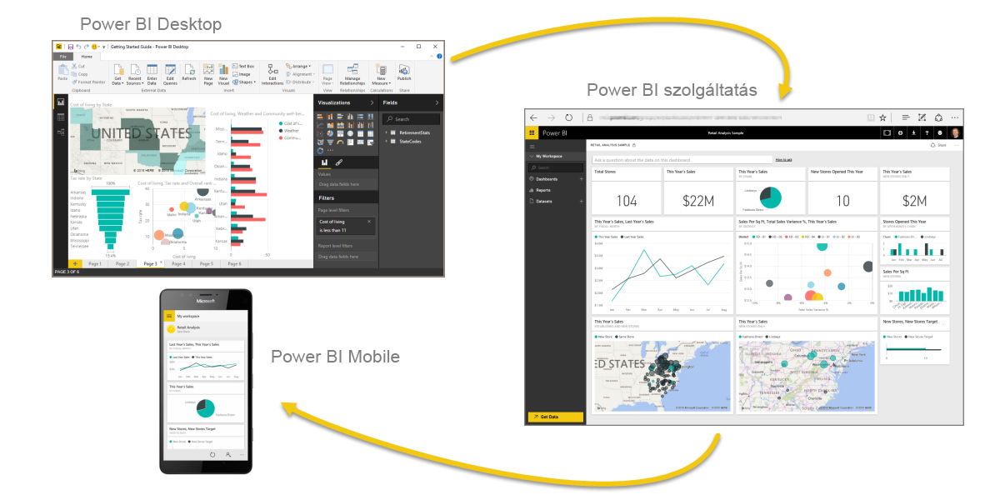

# A Power BI bemutatása
A **Power BI** olyan szoftverszolgáltatások, alkalmazások és összekötők gyűjteménye, amellyel az egymástól független adatforrásokat egymással együttműködő, vizuálisan megragadó, interaktív elemzésekké alakítja. Az adatok lehetnek akár egy Excel-táblában, vagy felhőalapú és helyszíni hibrid adattárházak gyűjteményében is. Power BI segítségével egyszerűen csatlakozhat az adatforrásokhoz, jelenítheti meg és Fedezze fel a fontos és bárkivel, akivel csak szeretné megosztani, amely.

A Power BI lehet egyszerű és gyors, hozhat létre gyors elemzések egy Excel-táblázatban, vagy egy helyi adatbázist. De a Power BI emellett egy robusztus, nagyvállalati szintű, készen áll a széles körű modellezési és valós idejű elemzések, valamint egyéni fejlesztésekhez. Ez lehet az Ön személyes jelentéskészítő és vizualizációs eszközeként, és segédanyagként is használható, a projektek, részlegek vagy teljes vállalatok analitikai és döntéshozatali motor.

## A Power BI részei
A Power BI áll: 
- Windows asztali alkalmazások nevű **Power BI Desktopban**
- Szolgáltatott (*szolgáltatott szoftver*) nevű szolgáltatást a **Power BI szolgáltatásban** 
- Power bi-ban **mobilalkalmazások** Windows, iOS és Android-eszközök

Ez a három elem&mdash;Power BI Desktopban, a szolgáltatás és a mobilalkalmazások&mdash;úgy létre, megoszthatják és üzleti elemzések létrehozásában, vagy azok szerepét a leghatékonyabban szolgál módon lett tervezve.

A **Power BI jelentéskészítő kiszolgáló** a negyedik elem. Ezzel a Power BI Desktopban létrehozott Power BI-jelentéseket lehet közzétenni helyszíni jelentéskészítő kiszolgálón. További információ: [Power BI jelentéskészítő kiszolgáló](#on-premises-reporting-with-power-bi-report-server).

## A Power BI illeszkedése az Ön szerepköréhez
A Power BI szolgáltatás használata függhet attól, hogy Ön milyen szerepkört tölt be egy projektben vagy egy csapatban. Más személyek esetében más szerepkörök, előfordulhat, hogy használja a Power BI eltérően.

Előfordulhat például, hogy Ön elsősorban a **Power BI szolgáltatást** használja. A számításokat végző és üzleti jelentéseket létrehozó munkatársa azonban nagy mértékben támaszkodik a **Power BI Desktop** alkalmazásra, és a jelentéseket közzéteszi a Power BI szolgáltatásban, ahol Ön aztán megtekintheti őket. Egy másik munkatársának, az értékesítés, főleg használhatja saját **Power BI telefonos alkalmazás** az értékesítési kvótái előrehaladásának figyeléséhez, és új értékesítési érdeklődők részletek feltárásához.

Fejlesztőként használhatja a Power BI API-jait arra, hogy az adatokat adatkészletekbe töltse be, vagy hogy irányítópultokat és jelentéseket ágyazzon be egyéni alkalmazásaiba. Javaslata van új vizualizációra? Hozza létre, és ossza meg másokkal is.  

Minden elem, a Power bi különböző időpontokban, mit szeretne elérni, vagy a szerepkör egy adott projekt függően előfordulhat, hogy használja.

A Power BI használatát az határozza meg, hogy e Power BI melyik funkciója vagy szolgáltatása a legmegfelelőbb az adott helyzetben. Például használhatja a Power BI Desktopban is létrehozhat jelentéseket a saját csapat customer engagement statisztika, és megtekintheti a készlet és a gyártási folyamat valós idejű irányítópultokon a Power BI szolgáltatásban. A Power BI minden elemét elérheti, ami nagy mértékű rugalmasságot jelent.

A szerepköréhez kapcsolódó dokumentumok elemzése:
- Power BI [***tervezők***](desktop-what-is-desktop.md) számára
- Power BI [***felhasználók***](consumer/end-user-consumer.md) számára
- Power BI [***fejlesztők***](developer/what-can-you-do.md) számára
- Power BI [***rendszergazdák***](service-admin-administering-power-bi-in-your-organization.md) számára

## A Power BI-ban való munka folyamata
Egy Power BI-ban munka szokásos menetét megkezdi az adatforráshoz csatlakozik, és a Power BI Desktop-jelentés létrehozásához. Majd teheti közzé a Power BI Desktopból a Power BI szolgáltatásba, és ossza meg, így a végfelhasználók számára a Power BI szolgáltatásban és a mobileszközök megtekintheti és interakcióba a jelentést.
Ez egy nagyon gyakori munkafolyamat, és jól látszik benne, hogy hogyan egészíti ki egymást a Power BI három összetevője.

Az alábbiakban [a Power BI Desktop és a Power BI szolgáltatás részletes összehasonlítását](service-service-vs-desktop.md) találja.

De mi történik, ha Ön nem áll még készen arra, hogy a felhőbe települjön át, és jelentéseit egy vállalati tűzfal mögött szeretné tartani?  Olvasson tovább.

## Helyszíni jelentéskészítés a Power BI jelentéskészítő kiszolgálóval
Hozzon létre, üzembe helyezése és kezelése a Power BI mobil és többoldalas jelentések helyszíni használatra kész eszközökkel és szolgáltatásokkal, a Power BI jelentéskészítő kiszolgáló biztosító tartománnyal.

A Power BI jelentéskészítő kiszolgáló megoldást tűzfal mögött lehet üzembe helyezni, és ezt követően különféle módokon lehet a jelentéseket a megfelelő felhasználókhoz eljuttatni, akik megnézhetik azokat egy webböngészőben, mobileszközön vagy e-mailben is. Mivel a Power BI jelentéskészítő kiszolgálója kompatibilis a felhőalapú Power BI-jal, bármikor dönthet úgy, hogy áttelepül a felhőbe, ha készen áll rá. 

További információ: [Power BI jelentéskészítő kiszolgáló](report-server/get-started.md).

## Következő lépések
- [Rövid útmutató: A Power BI szolgáltatás megismeréséhez](service-the-new-power-bi-experience.md)   
- [Oktatóanyag: A Power BI szolgáltatás használatának első lépései](service-get-started.md)
- [Rövid útmutató: Csatlakozás adatokhoz a Power BI Desktopban](desktop-quickstart-connect-to-data.md)
