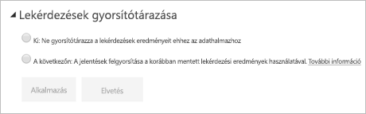

# Lekérdezések gyorsítótárazása a Power BI Premiumban

A Power BI Premiummal rendelkező cégek kihasználhatják a *lekérdezések gyorsítótárazása* funkciót az adatkészletekhez társított jelentések felgyorsítására. A lekérdezések gyorsítótárazása arra utasítja a prémium szintű kapacitást, hogy a helyi gyorsítótárazási szolgáltatását használja a lekérdezések eredményeinek megtartására, így elkerülhető, hogy a mögöttes adatforrás végezze el az eredmények kiszámítását.

> [!IMPORTANT]
> A lekérdezések gyorsítótárazása csak a Power BI Premiumban érhető el. Nem használható az Azure Analysis Services vagy az SQL Server Analysis Services szolgáltatásokat használó LiveConnect-adatkészletek esetén.

A gyorsítótárazott lekérdezéseredmények adott felhasználói és adatkészlet-kontextusokra vonatkoznak, és mindig megfelelnek a biztonsági szabályoknak is. A szolgáltatás jelenleg csak a kezdőlaphoz végez lekérdezési gyorsítótárazást. Ez azt jelenti, hogy a jelentés használata közben a lekérdezések nem lesznek gyorsítótárazva. A gyorsítótár figyelembe veszi a személyes könyvjelzőket és az állandó szűrőket is. A lekérdezés gyorsítótárazásánál az ugyanazokat a lekérdezések használó [irányítópult-csempék](service-dashboard-tiles.md) is használhatják a gyorsítótárat. A teljesítményt ez leginkább akkor növeli, ha egy adatkészletet gyakran kell elérni, és ha azt nem kell gyakran frissíteni. A lekérdezés gyorsítótárazása a prémium szintű kapacitásra háruló terhelést is csökkentheti, mivel csökkenti a lekérdezések teljes számát.

A lekérdezések gyorsítótárazásának szabályozását a Power BI szolgáltatásban az adott adatkészlet **Beállítások** lapján végezheti el. Három beállítást tartalmaz:

- **Alapértelmezett kapacitás**: Az adatkészlet a prémium szintű kapacitásból örökli a beállítást. Az alapértelmezett kapacitást a Power BI Premium kapacitásadminisztrátora vezérli.

- **Ki**: Ne használjon lekérdezési gyorsítótárazást ehhez az adatkészlethez.

- **Be**: Használjon lekérdezési gyorsítótárazást ehhez az adatkészlethez.

> [!NOTE]
> Ha a gyorsítótárazási beállítást **Be** állásból **Ki** értékre változtatja, az adatkészlethez tartozó minden korábban mentett lekérdezéseredmény törölve lesz a gyorsítótárból. A gyorsítótárazást kikapcsolhatja explicit módon, vagy úgy is, ha a kapacitás alapértelmezett beállítására vált, amelyet a rendszergazda **Ki** beállításként határozott meg. A kikapcsolás némi késést eredményez majd, amikor valamely jelentés lekérdezést futtat ezen az adatkészleten. A késést az okozza, hogy a jelentéshez tartozó lekérdezések igény szerint futnak, és nem használják a mentett eredményeket. Ezen kívül előfordulhat, hogy a kívánt adatkészletet be kell tölteni a memóriába, mielőtt az kiszolgálhatná a lekérdezéseket.

