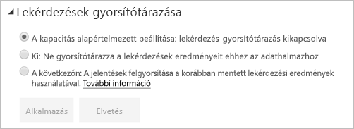

# Lekérdezések gyorsítótárazása a Power BI Premium/Embedded szolgáltatásban

A Power BI Premiummal vagy Power BI Embeddeddel rendelkező cégek kihasználhatják a *lekérdezések gyorsítótárazása* funkciót az adatkészletekhez társított jelentések felgyorsítására. A lekérdezések gyorsítótárazása arra utasítja a Premium-/Embedded-kapacitást, hogy a helyi gyorsítótárazási szolgáltatását használja a lekérdezések eredményeinek megtartására, így elkerülhető, hogy a mögöttes adatforrás végezze el az eredmények kiszámítását.

> [!IMPORTANT]
> A lekérdezések gyorsítótárazása csak a Power BI Premiumban és a Power BI Embeddedben érhető el. Nem használható az Azure Analysis Services vagy az SQL Server Analysis Services szolgáltatásokat használó LiveConnect-adatkészletek esetén.

A gyorsítótárazott lekérdezéseredmények adott felhasználói és adatkészlet-kontextusokra vonatkoznak, és mindig megfelelnek a biztonsági szabályoknak is. A szolgáltatás jelenleg csak a kezdőlaphoz végez lekérdezési gyorsítótárazást. Ez azt jelenti, hogy a jelentés használata közben a lekérdezések nem lesznek gyorsítótárazva. A lekérdezési gyorsítótár tiszteletben tartja a [személyes könyvjelzőket](consumer/end-user-bookmarks.md#personal-bookmarks) és az [állandó szűrőket](https://powerbi.microsoft.com/blog/announcing-persistent-filters-in-the-service/), így a rendszer a személyre szabott jelentés által készített lekérdezéseket is a gyorsítótárba helyezi. A lekérdezés gyorsítótárazásánál az ugyanazokat a lekérdezések használó [irányítópult-csempék](service-dashboard-tiles.md) is használhatják a gyorsítótárat. A teljesítményt ez leginkább akkor növeli, ha egy adatkészletet gyakran kell elérni, és ha azt nem kell gyakran frissíteni. A lekérdezés gyorsítótárazása a Premium-/Embedded-kapacitásra háruló terhelést is csökkentheti, mivel csökkenti a lekérdezések teljes számát.

A lekérdezések gyorsítótárazásának szabályozását a Power BI szolgáltatásban az adott adatkészlet **Beállítások** lapján végezheti el. Három beállítást tartalmaz:

- **Alapértelmezett kapacitás**: Lekérdezések gyorsítótárazásának kikapcsolása
- **Ki**: Ne használjon lekérdezési gyorsítótárazást ehhez az adatkészlethez.
- **Be**: Használjon lekérdezési gyorsítótárazást ehhez az adatkészlethez.

    

## Megfontolandó szempontok és korlátozások

- Ha a gyorsítótárazási beállítást **Be** állásból **Ki** értékre változtatja, az adatkészlethez tartozó minden korábban mentett lekérdezéseredmény törölve lesz a gyorsítótárból. A gyorsítótárazást kikapcsolhatja explicit módon, vagy úgy is, ha a kapacitás alapértelmezett beállítására vált, amelyet a rendszergazda **Ki** beállításként határozott meg. A kikapcsolás némi késést eredményez majd, amikor valamely jelentés lekérdezést futtat ezen az adatkészleten. A késést az okozza, hogy a jelentéshez tartozó lekérdezések igény szerint futnak, és nem használják a mentett eredményeket. Ezen kívül előfordulhat, hogy a kívánt adatkészletet be kell tölteni a memóriába, mielőtt az kiszolgálhatná a lekérdezéseket.
- A lekérdezési gyorsítótár frissítésekor a Power BI a legújabb eredmények beszerzéséhez lefuttatja a lekérdezéseket a mögöttes adatmodelleken. Ha nagy számú adathalmaznál van engedélyezve a lekérdezések gyorsítótárazása, és a Premium-/Embedded-kapacitás ezért nagy terhelés alatt van, alacsonyabb lehet a gyorsítótár frissítésének teljesítménye. A teljesítménycsökkenés a nagy számú lefuttatott lekérdezés eredménye.

## Következő lépések

* [Mi a Power BI Premium?](service-premium-what-is.md)
* [A Power BI Embedded az Azure-ban ismertetése](developer/embedded/azure-pbie-what-is-power-bi-embedded.md)
