# Szűrő hozzáadása jelentéshez Szerkesztési nézetben

Ez a cikk ismerteti, hogyan adhat hozzá oldalszűrőt, vizualizációszűrőt, jelentésszűrőt vagy részletezési szűrőt egy jelentéshez a Power BI-ban. A cikkben található példák a Power BI szolgáltatásban szerepelnek. Az elvégzendő lépések csaknem teljesen azonosak a Power BI Desktop alkalmazásban is.

**Tudta?** A Power BI új szűrési felülettel rendelkezik, egyelőre előzetes verzióban. Bővebben is tájékozódhat [a Power BI-jelentésekben elérhető új szűrési felületről](power-bi-report-filter-preview.md).

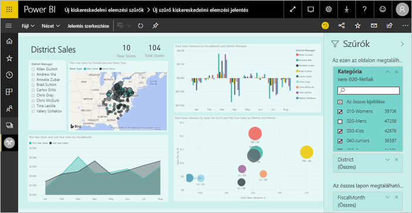

## Szűrők a Szerkesztő nézetben és az Olvasó nézetben
A jelentésekkel két nézetben végezhet műveleteket: az Olvasó nézetben és a Szerkesztő nézetben. Az elérhető szűrési képességek az éppen használatban lévő nézettől függnek. További információt a [Szűrők és kiemelés a Power BI-jelentésekben](power-bi-reports-filters-and-highlighting.md) című cikkben találhat.

Ez a cikk azt ismerteti, hogyan hozhatók létre szűrők egy jelentés **Szerkesztő nézetében**.  Az Olvasó nézet szűrőire vonatkozó további információkért tekintse át [a jelentés szűrőinek Olvasó nézetben történő használatával foglalkozó témakört](consumer/end-user-report-filter.md).

## Szűrőtípusok a Szűrők panelen
Akár a Desktop alkalmazást, akár a Power BI szolgáltatást használja, a Szűrők panel megjelenik a jelentésvászon jobb oldalán. Ha a Szűrők panel nem látható, válassza a jobb felső sarokban lévő „>” ikont a kibontásához.

Négy szűrőtípus létezik: **oldalszűrő**, **vizualizációszűrő**, **részletezési szűrő** és **jelentésszűrő**.

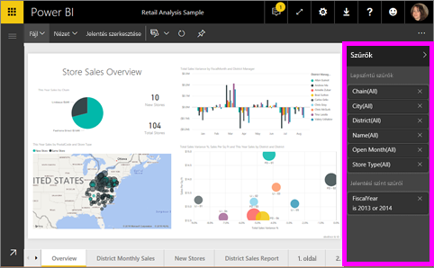

Mivel a szűrőket *megőrzi* a rendszer, amikor kilép a jelentésből, a Power BI tárolja a szűrők, a szeletelők és az adatnézet egyéb módosításait. Így amikor visszatér a jelentéshez, ott folytathatja, ahol abbahagyta. Ha nem szeretné, hogy a rendszer megőrizze a szűrők módosításait, válassza a **Visszaállítás alapértelmezettre** lehetőséget a felső menüsoron.

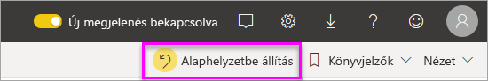

## Szűrő hozzáadása vizualizációhoz
Vizualizáció-szintű szűrőt adhat egy adott vizualizációt, két különböző módon. 

* Szűrhet egy, a vizualizáció által már használt mezőt.
* Azonosíthat egy mezőt, amelyet a vizualizáció még nem használ, és hozzáadhatja ezt a mezőt közvetlenül a **Vizualizációszint szűrői** gyűjtőhöz.

Ez a folyamat a Kiskereskedelmi elemzési mintát használja, ha le szeretné tölteni, és követni szeretné a lépéseket. A [Kiskereskedelmi elemzési minta](sample-retail-analysis.md) letöltése.

### Mezők szűrése a vizualizációban

1. Válassza ki **jelentés szerkesztése** nyissa meg a jelentést szerkesztési nézetben.
   
   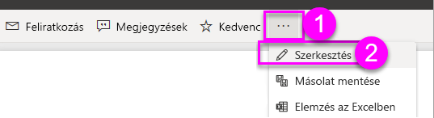

2. Nyissa meg a Megjelenítések, a Szűrők és a Mezők panelt (ha még nincsenek megnyitva).
   
   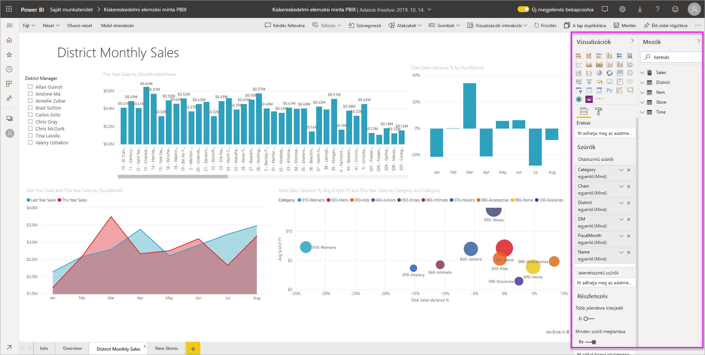
3. Tegyen aktívvá egy vizualizációt kijelöléssel. A vizualizáció által használt összes mező szerepel a **Mezők** és a **Szűrők** panelen is, a **Vizualizációszint szűrői** fejléc alatt.
   
   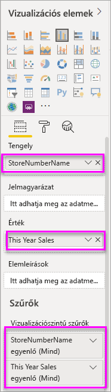
4. Ezen a ponton felveszünk egy szűrőt egy, a vizualizáció által már használt mezőhöz. 
   
    Görgessen le a **Vizualizációszint szűrői** területre, és a nyilat kiválasztva bontsa ki a szűrni kívánt mezőt. Ebben a példában a **StoreNumberName** mezőt szűrjük.
     
    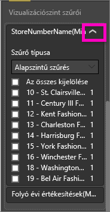 
    
    Állítson be **Alapszintű**, **Speciális** vagy **Felső N** szűrésvezérlőket. Ebben a példában Alapszintű szűrést alkalmazunk a **cha** kifejezésre, és kiválasztjuk az öt áruházat.
     
    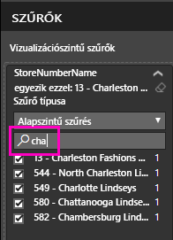 
   
    A vizualizáció módosul az új szűrőnek megfelelően. Ha menti a jelentést a szűrővel, a jelentés olvasói megtekinthetik a szűrt vizualizációt, és használhatják a szűrőt Olvasás nézetben: kiválaszthatnak vagy törölhetnek értékeket.
     
    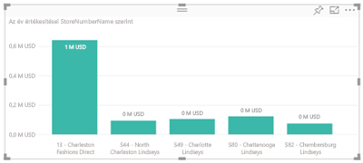

### Egy, a vizualizációban nem szereplő mező szűrése

Most vegyünk fel egy új mezőt a vizualizációhoz vizualizáció szintű szűrőnek.
   
1. A Mezők panelen válassza ki az új vizualizáció szintű szűrőként felvenni kívánt mezőt, és húzza a **Vizualizációszint szűrői területre**.  Ebben a példában a **District Manager** (területi vezető) mezőt húzzuk a **Vizualizációszint szűrői** gyűjtőbe, rákeresünk az **an** kifejezésre, és kiválasztjuk a három vezetőt. 
     
    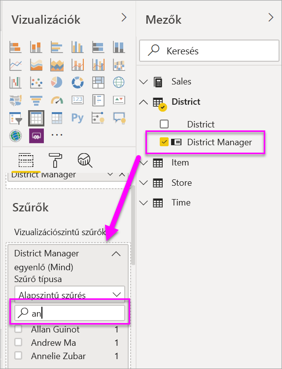

    Vegye figyelembe, hogy a **District Manager** elemet a rendszer *nem* adta hozzá magához a vizualizációhoz. A vizualizációnak még mindig a **StoreNumberName** mező a tengelye, és a **This Year Sales** (Idei értékesítések) az értéke.  
     
    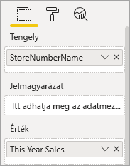

    A vizualizáció maga viszont úgy van most szűrve, hogy csak ezen vezetők idei értékesítéseit jelenítse meg az adott üzletekhez.
     
    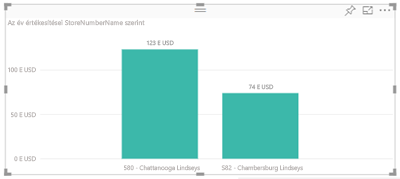

    Ha menti a jelentést a szűrővel, a jelentés olvasói használhatják a **District Manager** szűrőt Olvasás nézetben: kiválaszthatnak vagy törölhetnek értékeket.

## Szűrő hozzáadása az egész oldalhoz

Azt is megteheti egy oldalszintű szűrőt teljes oldal.

1. Válassza ki **jelentés szerkesztése** nyissa meg a jelentést szerkesztési nézetben.
   
   
2. Nyissa meg a Megjelenítések, a Szűrők és a Mezők panelt (ha még nincsenek megnyitva).
3. A Mezők panelen válassza az új oldalszintű szűrőként hozzáadni kívánt mezőt, és húzza a **Lapszintű szűrők** területre.  
4. Válassza ki a szűrni kívánt értékeket, és állítson be **Alapszintű** vagy **Speciális** szűrésvezérlőket.
   
   Az oldal összes Vizualizáció rendszer újrarajzolja a változás tükrözése érdekében.
   
   

    Ha menti a jelentést a szűrővel, a jelentés olvasói használhatják a szűrőt Olvasás nézetben: kiválaszthatnak vagy törölhetnek értékeket.

## Részletezési szűrő hozzáadása
A Power BI szolgáltatás és a Power BI Desktop részletezési funkciójával olyan *cél* jelentésoldalt hozhat létre, amely egy adott entitásra összpontosít – például egy szállítóra, ügyfélre vagy gyártóra. A felhasználók a jelentés többi oldalán a jobb gombbal az entitáshoz tartozó adatpontra kattintva eljuthatnak az összpontosított oldalra.

### Részletezési szűrő létrehozása
Követéséhez töltse le a [ügyfél-jövedelmezőségi minta](sample-customer-profitability.md). Tegyük fel, hogy egy olyan oldalt szeretne, amely a vezetői üzleti területekre összpontosít.

1. Válassza a **Jelentés szerkesztése** elemet a jelentés Szerkesztési nézetben való megnyitásához.
   
   

1. Adjon a jelentéshez egy új, **Csapatvezető** nevű oldalt. Ez az oldal lesz a részletezés *célja*.
2. Adjon hozzá vizualizációkat, amelyek nyomon követik a csapatvezetők üzleti területeinek fő mérőszámait.    
3. Vegye fel a Részletezési szűrők szakaszba a **Vezető > Vezető neve** elemet.    
   
    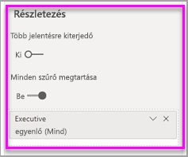
   
    Észreveheti, hogy a Power BI hozzáad egy vissza nyilat a jelentésoldalhoz.  A vissza nyíl kiválasztásával a felhasználó visszatér a *kiindulási* jelentésoldalra, ahol a részletezés megjelenítése mellett döntött. A vissza nyíl csak Olvasás nézetben működik.
   
     

### A részletezési szűrő használata
Lássuk, hogy működik a részletezési szűrő.

1. Kezdjen a **Team Scorecard** (Csapat mutatószáma) jelentésoldalon.    
2. Tegyük fel, hogy Ön Andrew Ma, és úgy szeretné megtekinteni a Csapatvezető jelentésoldalt, hogy az csak a saját adatait mutassa.  A diagram bal felső területén kattintson a jobb gombbal egy zöld adatpontra a Részletezés menüelem megnyitásához.
   
    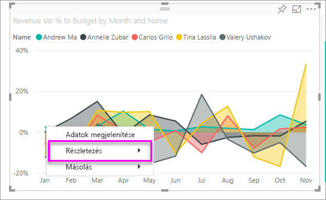
3. Válassza a **Részletezés > Csapatvezető** lehetőséget, hogy a **Csapatvezető** jelentésoldalra lépjen. A rendszer szűri az oldalt, hogy megjelenítse azon adatpont információit, amelyre a jobb gombbal kattintott, ami ebben az esetben az Andrew Ma. Csak a Részletezési szűrők szakaszban lévő mező kerül át a részletező jelentésoldalra.  
   
    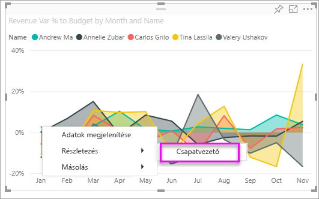

## Adja hozzá a jelentés-szintű szűrőt egy egész jelentésre

1. Válassza a **Jelentés szerkesztése** elemet a jelentés Szerkesztési nézetben való megnyitásához.
   
   

2. Nyissa meg a Vizualizációk és szűrők ablaktáblán, és a mezők panelen, ha azok még nem tette nyissa meg.
3. A Mezők panelen válassza ki az új jelentésszintű szűrőként felvenni kívánt mezőt, és húzza a **Jelentési szint szűrői** területre.  
4. Válassza ki a szűrni kívánt értékeket.

    A vizualizációk a jelentés összes oldalán módosulnak az új szűrőnek megfelelően, az aktív oldalt is beleértve. Ha menti a jelentést a szűrővel, a jelentés olvasói használhatják a szűrőt Olvasás nézetben: kiválaszthatnak vagy törölhetnek értékeket.

1. A vissza nyilat kiválasztva térhet vissza az előző jelentésoldalra.

## Megfontolandó szempontok és hibaelhárítás

- Bizonyos helyzetekben a vizualizációszintű és az oldalszintű szűrő különböző eredményt adhat.  Például amikor vizualizációszintű szűrőt ad meg, a Power BI az összesített eredményeket szűri.  Az alapértelmezett összesítés a Sum, de [az összesítés típusa módosítható](service-aggregates.md).  

    Amikor ezután oldalszintű szűrőt ad meg, a Power BI összesítés nélkül végzi el a szűrést.  Azért nem összegez, mert egy oldalon több, különböző típusú összesítést használó vizualizáció is lehet.  Így a rendszer minden egyes adatsorra külön alkalmazza a szűrőt.

- Ha nem látja a Mezők panelt, győződjön meg arról, hogy a jelentés [Szerkesztési nézetében](service-interact-with-a-report-in-editing-view.md) van.    
- Ha nagy mennyiségű módosítást végzett a szűrőkön, és szeretne visszatérni a jelentés készítőjének alapértelmezett beállításaihoz, válassza a **Visszaállítás alapértelmezettre** lehetőséget a felső menüsoron.

## Következő lépések
[Ismerkedés a jelentések Szűrők panelével](consumer/end-user-report-filter.md)

[Szűrők és kiemelések a jelentésekben](power-bi-reports-filters-and-highlighting.md)

[Szűrők és kiemelések használata a jelentések Olvasás nézetében](consumer/end-user-reading-view.md)

[A jelentésvizualizációk keresztszűrési és keresztkiemelési viselkedésének módosítása](consumer/end-user-interactions.md)

További kérdései vannak? [Kérdezze meg a Power BI közösségét](http://community.powerbi.com/)

