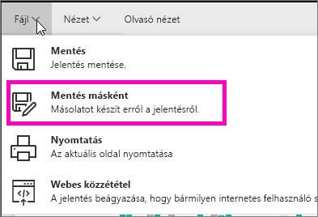

# Új jelentés létrehozása meglévő jelentésből (jelentés másolása)
Lehet, hogy rendelkezik egy jelentéssel, amely már az adatkészletéhez kapcsolódik, és van néhány vizualizációja, amelyeket szeretne újrahasznosítani vagy módosítani.  Miért nem másolja le ezt a jelentést egy új jelentés alapjául?  Ehhez:

1. [Nyisson meg egy jelentést](service-report-open.md).
2. A **Fájl** menüben válassza a **Mentés másként** pontot.
   
   
3. Írjon be egy új nevet a jelentéshez, és kattintson a **Mentés** gombra.
   
   
   
   Az új jelentésnek a Power BI-ban a jelenlegi munkaterületre történő sikeres mentéséről egy üzenet értesíti.
   
   
4. Nyissa meg a munkaterület **Jelentések** lapját, és jelölje ki az új jelentést a megnyitásához. Törölheti is azokat a vizualizációkat, amelyeket nem szeretne megőrizni, módosíthat más vizualizációkat, és felvehet újakat.
   
   
5. Jó szórakozást az új jelentés frissítéséhez és szerkesztéséhez.

## Következő lépések:
[Új vizualizációk létrehozása](power-bi-report-add-visualizations-ii.md)

Szükségtelen [vizualizációk törlése](service-delete.md)

[Jelentés létrehozása a Power BI Desktopban](desktop-report-view.md)
