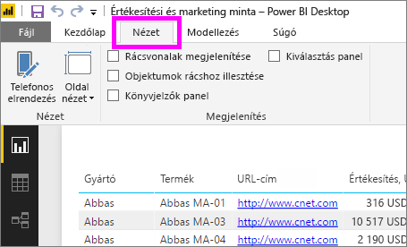
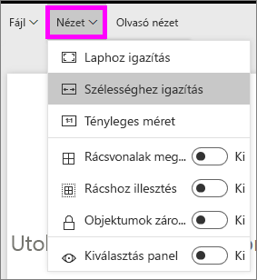
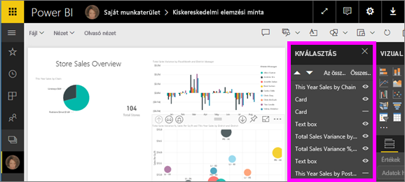
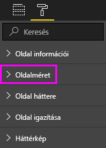

# Oldal megjelenítési beállításai Power BI-jelentésben
Tudjuk, milyen fontos, hogy a jelentés elrendezése az utolsó pixelig tökéletes legyen. Egyes esetekben ez kihívást jelenthet, mert Ön és kollégái is megtekintheti ezeket a jelentéseket különböző nézik és méretű képernyőkön. 

Az alapértelmezett megjelenítési nézet a **Laphoz igazítás**, az alapértelmezett méretarány pedig a **16:9**-es. Ha a jelentést egy másik méretarányban szeretné zárolni, vagy máshogyan szeretné igazítani, akkor ehhez két eszköz áll rendelkezésére: ***Oldalmegtekintés*** beállítások és ***Oldalméret*** beállításait.

<iframe width="560" height="315" src="https://www.youtube.com/embed/5tg-OXzxe2g" frameborder="0" allowfullscreen></iframe>

## Oldalnézet-beállítások megkeresése a Power BI szolgáltatásban és a Power BI Desktopban
Oldalnézet-beállítások a Power BI szolgáltatásban és a Power BI Desktopban, de a felület kissé eltér. Az alábbi szakaszok ismertetik, hogy hol találhatók nézet beállításait az egyes Power BI-eszközt.

### A Power BI Desktopban
A Jelentés nézetben a **Nézet** lapot választva nyithatja meg az oldalnézet-beállításokat, illetve a telefonos elrendezés beállításait.

  

### A Power BI szolgáltatásban (app.powerbi.com)
A Power BI szolgáltatásban nyisson meg egy jelentést, majd válassza **nézet** a bal felső menüsorban.

Oldalnézet-beállítások érhetők el mindkét [olvasó nézetben és szerkesztési nézete](consumer/end-user-reading-view.md). Szerkesztési nézetben a jelentés tulajdonosa oldalnézet-beállítások rendelhet az egyes jelentésoldalak, és ezeket a beállításokat a jelentéssel együtt lesznek mentve. Ha a munkatársak Olvasó nézetben nyitnak meg egy jelentést, akkor a jelentésoldalakat a tulajdonos beállításainak megfelelően fogják látni. Az olvasó nézetben, módosíthatja a munkatársai *néhány* , a **oldalmegtekintés** a beállításokat, de a módosítások mentése nem történik meg, amikor kilépnek a jelentésből.

## Oldalnézet beállításai
Az oldalnézet-beállítások első készletét a megjelenítését a jelentésoldalon, a böngésző ablakához viszonyítva szabályozza. Az alábbiak közül választhat:

* **Laphoz igazítás** (alapértelmezett): Tartalmak úgy vannak méretezve, hogy a legjobban igazodjanak a laphoz
* **Szélességhez igazítás**: Tartalmak úgy vannak méretezve, hogy a lap szélességéhez
* **Tényleges méret**: Tartalom teljes méretben jelennek meg

A második készlete oldal nézet beállításai szabályozza a jelentésvásznon való elhelyezését objektumok a jelentésvásznon. Az alábbiak közül választhat:

* **Rácsvonalak megjelenítése**: Rácsvonalak megjelenítése érdekében elhelyezése az objektumok a jelentésvásznon.
* **Rácshoz illesztés**: Használata **rácsvonalak megjelenítése** , pontosan el és igazíthatja az objektumokat a jelentésvásznon. 
* **Objektumok zárolása**: Minden objektum zárolása a vásznon, hogy azok nem kell áthelyezni vagy átméretezni.
* **Kiválasztás panel**: A **kijelölés** panelen a vásznon levő összes objektum fel. Eldöntheti, hogy melyik jelenjen meg és melyik legyen elrejtve.

    

## Oldalméret-beállítások

**Oldalméret** beállítások csak a jelentések tulajdonosai számára érhetők el. A Power BI szolgáltatásban (app.powerbi.com), ez azt jelenti, hogy képes arra, hogy nyissa meg a jelentést [szerkesztési nézetben](consumer/end-user-reading-view.md). **Oldalméret** beállítások szerepelnek a **Vizualizációk** ablaktábla és a vezérlő a méretarányt és a tényleges méretet (pixelben) a jelentés vászon:   

* 4:3-as arány
* 16:9-es arány (alapértelmezett)
* Cortana
* Letter
* Egyéni (magasság és szélesség pixelben)

## Következő lépések
[A Power BI Desktopban jelentés nézetben](desktop-report-view.md)

[Oldal nézet és a saját Power BI-jelentéseket az oldalméret-beállítások módosítása](consumer/end-user-report-view.md)

A [Power BI jelentéseiről itt talál](consumer/end-user-reports.md) további információkat

[A Power BI szolgáltatás felhasználói alapvető fogalmai](consumer/end-user-basic-concepts.md)

További kérdései vannak? [Kérdezze meg a Power BI közösségét](http://community.powerbi.com/)

