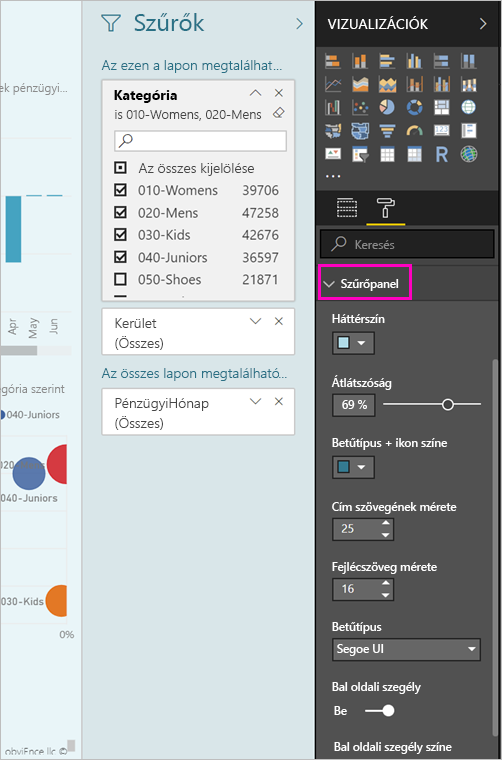
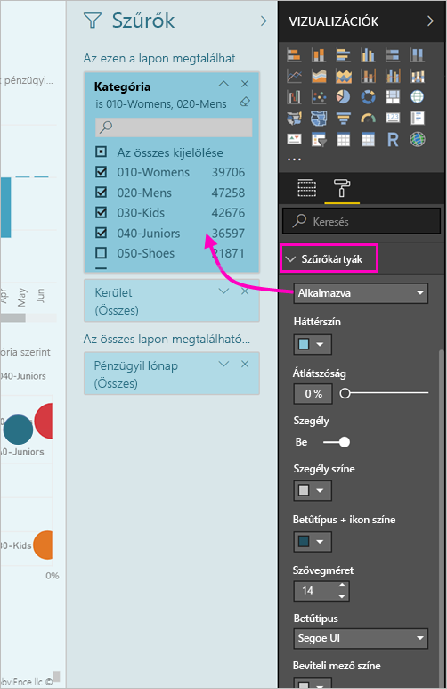

# <a name="the-new-filter-experience-in-power-bi-reports-preview"></a>A Power BI-jelentésekben elérhető új szűrési felület (előzetes verzió)

A Power BI szűrők új funkciókat és a egy új tervezési rendelkezik. Ha az új szűrő felület csatlakozott a, a szűrők ablaktáblán keresse meg a jelentés többi hasonlóan lehet formázni. Zárolhatja az és még a szűrők elrejtése. A jelentés tervezésekor többé nem látja a régi szűrők panel minden a megjelenítések ablaktáblán. Az összes a szűrő szerkesztési és formázási egyetlen szűrők panelen teheti meg. 


> [!NOTE]
> Az új szűrési felület előzetes verzióban érhető el. Az új buildek felülbírálhatják a már beállított formázást.

A jelentéstervezőben, Íme, mi mindent az új egyetlen szűrők panelen:

- Hozzáadhat és eltávolíthat mezőket szűréséhez. 
- Módosíthatja a szűrő állapota.
- Formázza és a szűrők panel testreszabása, hogy úgy érzi, hogy a jelentés része.
- Megadhatja, hogy a Szűrők panel alapértelmezés szerint meg legyen nyitva, vagy össze legyen csukva, amikor egy fogyasztó megnyitja a jelentést.
- A teljes szűrők ablaktábla vagy konkrét szűrők, amelyek nem szeretné, hogy a jelentés a fogyasztók megtekintéséhez elrejtése.
- Vezérlőelem még akkor is, könyvjelző látható-e, nyissa meg és állapotát az új szűrők panel, összecsukva.
- Zárolhat szűrőket, ha nem szeretné, hogy a fogyasztók szerkesszék őket.

Az új szűrő felhasználói élményét bármilyen vizualizációt, a szűrőket vagy a Vizualizáció érintő Szeletelők csak olvasható listája jelentés is fölé.


## <a name="turn-on-the-new-filter-experience"></a>Az új szűrési felület bekapcsolása 

Az új felületet a Power BI Desktopban engedélyezheti. Ez követően ott vagy a Power BI szolgáltatásban módosíthatja a szűrőket (https://app.powerbi.com). Mivel az új szűrési felület előzetes verzióban van, először engedélyeznie kell a Power BI Desktopban. Ha első lépésként jelentést hoz létre a Power BI szolgáltatásban, az nem rendelkezhet az új szűrőkkel.

### <a name="turn-on-new-filters-for-all-new-reports"></a>Új szűrők bekapcsolása minden új jelentéshez

1. A Power BI Desktopban válassza a **Fájl** > **Lehetőségek és beállítások** > **Beállítások** > **Előzetes verziójú funkciók** lehetőséget, majd jelölje be az **Új szűrési felület** jelölőnégyzetet. 
2. Hogy az új szűrési felület minden új jelentésben megjelenjen, indítsa újra a Power BI Desktopot.

A Power BI Desktop újraindítása után alapértelmezés szerint ez lesz engedélyezve minden új jelentéshez, amelyet létrehoz.  

### <a name="turn-on-new-filters-for-an-existing-report"></a>Új szűrők bekapcsolása meglévő jelentéshez

Az új szűrőket meglévő jelentésekhez is engedélyezheti.

1. A Power BI Desktopban egy meglévő jelentésben válassza a **Fájl** > **Lehetőségek és beállítások** > **Beállítások** lehetőséget.
2. A bal oldali navigációs sávon a **aktuális fájl**válassza **beállítások jelentés**.
3. Alatt **élmény szűrés**válassza **engedélyezése a frissített szűrőterület és szűrők megjelenítése a jelentés vizuális fejlécében**.

## <a name="view-filters-for-a-visual-in-reading-mode"></a>Vizualizáció szűrőinek megtekintése olvasási módban

Ha olvasási módban egy vizualizáció szűrőikonja fölé viszi a kurzort, felugrik egy panel az összes szűrővel, szeletelővel és minden mással, ami a vizualizációt befolyásolja. Előugró formázása megegyezik a szűrők ablaktáblán formázást. 


Ebben a nézetben a következő szűrőtípusok jelennek meg: 
- Alapszintű szűrők
- Szeletelők
- Keresztkijelölés 
- Keresztszűrés
- Speciális szűrők
- Felső N szűrők
- Relatív dátum szerinti szűrők
- Szinkronszűrők
- Belefoglalási/kizárási szűrők
- URL-címen keresztül átadott szűrők

## <a name="build-the-new-filters-pane"></a>Hozhat létre az új szűrők panel

Miután engedélyezte az új szűrők panel, megjelenik a jelentés oldalon, a jelentés jelenlegi beállításai alapján alapértelmezés szerint formázott jobbra. Az új szűrők panel használatával konfigurálja a melyik szűrőket tartalmaznak, és frissítse a meglévő szűrők az új panelen. Az új szűrők ablaktáblán láthatók, mely a jelentés a felhasználók látni fogja, ha a jelentést közzéteszi. 

1. Alapértelmezés szerint a jelentés a fogyasztók a szűrők ablaktáblán látható. Ha nem szeretné, ha meg szeretné őket, jelölje a szem ikonjára a **szűrők**.

    

2. Az új szűrők panel kiépítésének megkezdésére mezőkre vagy Vizualizáció lapon húzza az új szűrők ablaktábla vagy jelentési szint szűrői.

Egy vizualizációt a jelentésvásznon való hozzáadásakor a Power BI automatikusan hozzáadja a szűrőt a szűrők panelen az egyes mezők a vizualizációban. 

## <a name="lock-or-hide-filters"></a>Szűrők zárolása vagy elrejtése

Az egyes szűrőkártyákat zárolhatja vagy el is rejtheti. Ha zárol egy szűrőt, akkor a jelentés fogyasztói azt láthatják, de nem szerkeszthetik. Ha elrejti, akkor látni sem fogják. A szűrőkártyák elrejtése általában akkor hasznos, ha az üres vagy nem várt értékek kizárására használt tisztítószűrőket kívánja elrejteni. 

- Az új szűrők ablaktáblán jelölje be vagy törölje a **Zamknout filtr** vagy **elrejtése szűrő** ikonok a szűrő kártya.

   

Ezeket a beállításokat, kapcsolja ki az új szűrők panelen kapcsolja be, mert a módosítások megjelennek a jelentésben látni. A rejtett szűrők nem jelennek meg a vizualizációk felugró szűrőablakában.

Beállíthatja, hogy az új szűrők ablaktáblán állapotának a jelentés könyvjelzők tartalmazó folyamat. A panel megnyitott, bezárt és látható állapota is könyvjelzőzhető.
 
## <a name="format-the-new-filters-pane"></a>Az új Szűrők panel formázása

Az új felületet jelenős részét, hogy a szűrők panel megjelenését és működését a jelentés megfelelően formázhatja. A szűrők panel eltérően a jelentés minden oldalát az is lehet formázni. A következő elemeket formázhatja: 

- Háttérszín
- Háttér áttetszősége
- A szegély be- vagy kikapcsolása
- Szegély színe
- Cím és fejléc betűkészletet, színt és a szöveg mérete

Ezeket az elemeket szűrőkártyákhoz is formázhatja attól függően, hogy alkalmazva lettek (valamire beállítva), vagy elérhetők (a tartalmuk törölve van): 

- Háttérszín
- Háttér áttetszősége
- Szegély: be- vagy kikapcsolva
- Szegély színe
- Betűtípus, szín és szövegméret
- Beviteli mező színe

### <a name="format-the-filters-pane-and-cards"></a>A szűrők panel és a kártya formázása

1. A jelentésben kattintson magára a jelentésre vagy a háttérre (*háttérkép*), majd a **Vizualizációk** panelen válassza a **Formátum** lehetőséget. 
    Megjelenik a jelentés oldalon, a háttérkép, és is a szűrők panel és a szűrő kártyák formázási lehetőségek.

        

1. Bontsa ki a **Szűrő panelt**, és állítsa be a háttér, az ikonok és a bal szegély színét a jelentésoldalhoz illően.

    

1. Bontsa ki a **Szűrőkártyák** elemet, és állítsa be az **Elérhető** és az **Alkalmazott** színt és szegélyt. Ha az elérhető és az alkalmazott kártyákhoz más színt ad meg, akkor nyilvánvaló lesz, hogy mely szűrők lettek alkalmazva. 
  
    

## <a name="theming-for-filter-pane"></a>A szűrő ablaktábla témája
Most módosíthatja az alapértelmezett beállításokat, a szűrő ablaktábla téma-fájllal. Itt látható egy minta téma részlet az első lépésekhez:

 
```
"outspacePane": [{ 

"backgroundColor": {"solid": {"color": "#0000ff"}}, 

"foregroundColor": {"solid": {"color": "#00ff00"}}, 

"transparency": 50, 

"titleSize": 35, 

"headerSize": 8, 

"fontFamily": "Georgia", 

"border": true, 

"borderColor": {"solid": {"color": "#ff0000"}} 

}], 

"filterCard": [ 

{ 

"$id": "Applied", 

"transparency": 0, 

"backgroundColor": {"solid": {"color": "#ff0000"}}, 

"foregroundColor": {"solid": {"color": "#45f442"}}, 

"textSize": 30, 

"fontFamily": "Arial", 

"border": true, 

"borderColor": {"solid": {"color": "#ffffff"}}, 

"inputBoxColor": {"solid": {"color": "#C8C8C8"}} 

}, 

{ 

"$id": "Available", 

"transparency": 40, 

"backgroundColor": {"solid": {"color": "#00ff00"}}, 

"foregroundColor": {"solid": {"color": "#ffffff"}}, 

"textSize": 10, 

"fontFamily": "Times New Roman", 

"border": true, 

"borderColor": {"solid": {"color": "#123456"}}, 

"inputBoxColor": {"solid": {"color": "#777777"}} 

}] 
```

## <a name="sort-the-filter-pane"></a>Rendezés a szűrő ablaktábla

Egyéni rendezési funkció az új funkció a szűrő ablaktábla részét képezi. A jelentés létrehozói húzással rendezheti át szűrőket, átrendezheti őket a hatalmat sorrendben.


Az alapértelmezett rendezési sorrend a betűrend szerinti rendezés, a szűrők. Egyéni rendezési mód indításához egyszerűen húzza bármely szűrőt az új helyre. Szűrők belül érvényesek, – például egy Vizualizáció-szintű, oldalszintű és jelentésszintű szűrő a szint csak rendezheti.

## <a name="filters-pane-scaling"></a>Szűrők ablaktábla méretezése

Az új szűrők panel méretezhető a jelentésoldalt és a Vizualizációk, így a jelentés oldalon, és a szűrők ablaktáblán maradás az időarány, amíg egymással.

## <a name="improved-filters-pane-accessibility"></a>Továbbfejlesztett szűrők ablaktáblán kisegítő lehetőségek

Továbbfejlesztettük az új szűrők ablaktábla a billentyűzetnavigációt. Minden része a szűrők panelen keresztül lapon, és a környezet kulcs használatával a billentyűzet vagy a Shift + F10 billentyűkombinációt a megnyíló helyi menüből.


## <a name="rename-filters"></a>Nevezze át a szűrők
A szűrők panel szerkesztésekor duplán kattintva szerkesztheti a címet. Átnevezése akkor hasznos, ha frissíti a szűrő kártyát célszerűbb a végfelhasználók számára. Ne feledje, a szűrő kártya átnevezése does *nem* nevezze át a mezőt a mezők listában megjelenített neve. A szűrő kártya a megjelenítendő név csak változik.


## <a name="restrict-changes-to-filter-type"></a>A szűrő típusa módosítások korlátozása

A szűrés mellett élmény a jelentések beállításai, lehetősége van a vezérlőelemet, ha a felhasználók megváltoztathatják a szűrő típusa.


## <a name="next-steps"></a>Következő lépések

Próbálja ki az új szűrési felületet. Ez a funkció, és hogyan lehet folyamatos fejlesztése, a visszajelzés a [ötleteket a Power BI-webhelyen](https://ideas.powerbi.com/forums/265200-power-bi). 

- [A jelentésszűrők használata](consumer/end-user-report-filter.md)
- [Szűrők és kiemelések a jelentésekben](power-bi-reports-filters-and-highlighting.md)

További kérdései vannak? [Kérdezze meg a Power BI közösségét](http://community.powerbi.com/)

