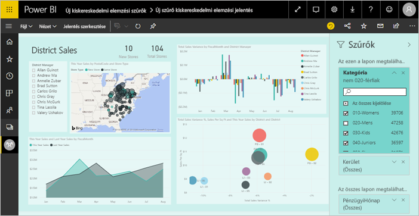
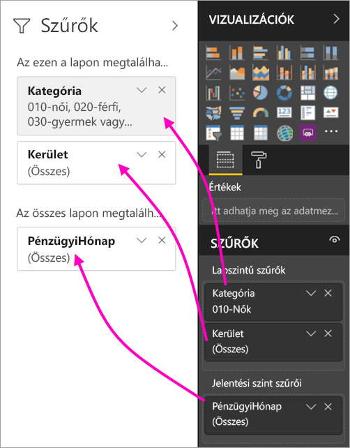
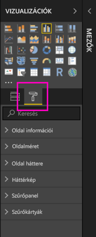
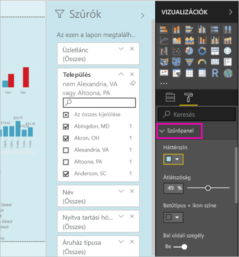
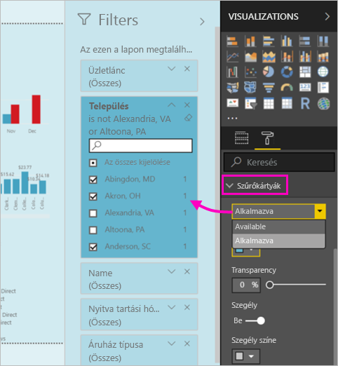
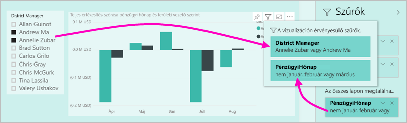

# A Power BI-jelentésekben elérhető új szűrési felület (előzetes verzió)

Ez a cikk az új szűrési felületet ismerteti: A Power BI szűrői új funkciókat és új megjelenést kapnak. Amikor jelentéseket tervez a Power BI Desktopban vagy a Power BI szolgáltatásban, úgy alakíthatja ki a Szűrők panelt, hogy megjelenésében és viselkedésében is illeszkedjen a teljes jelentéshez. Az új felületen a régi Szűrők panel a szűrők szerkesztésére szolgál, a felhasználók viszont egyedül az új szűrőpanelt látják majd. 
 

Jelentések tervezése során a következőket érheti el az új szűrőkkel:

- Megjelenítheti a szűrők csak olvasható nézetét a vizualizáció fejlécében, hogy a felhasználók tudják, pontosan milyen szűrők vagy szeletelők befolyásolják az adott vizualizációt.
- Formázhatja és testre szabhatja a szűrőpanelt, hogy a jelentés részeként hasson.
- Megadhatja, hogy a Szűrők panel alapértelmezés szerint meg legyen nyitva, vagy össze legyen csukva, amikor egy fogyasztó megnyitja a jelentést.
- Elrejtheti a teljes szűrőpanelt, vagy azokat a szűrőket, amelyeket nem kíván megmutatni a jelentés fogyasztóinak.
- Szabályozhatja, és akár könyvjelzőzheti is az új szűrőpanel láthatóságát, valamint megnyitott vagy összecsukott állapotát.
- Zárolhat szűrőket, ha nem szeretné, hogy a fogyasztók szerkesszék őket.

## Az új szűrési felület bekapcsolása 

Az új felületet a Power BI Desktopban engedélyezheti. Ez követően ott vagy a Power BI szolgáltatásban módosíthatja a szűrőket (https://app.powerbi.com). Mivel az új szűrési felület előzetes verzióban van, először engedélyeznie kell a Power BI Desktopban. 

### Új szűrők bekapcsolása minden új jelentéshez

1. Válassza a **Fájl** > **Lehetőségek és beállítások** > **Beállítások** > **Előzetes verziójú funkciók** lehetőséget, majd jelölje be az **Új szűrési felület** jelölőnégyzetet. 
2. Hogy az új szűrési felület minden új jelentésben megjelenjen, indítsa újra a Power BI Desktopot.

A Power BI Desktop újraindítása után alapértelmezés szerint ez lesz engedélyezve minden új jelentéshez, amelyet létrehoz.  

### Új szűrők bekapcsolása meglévő jelentéshez

Az új szűrőket meglévő jelentésekhez is engedélyezheti.

1. Egy meglévő jelentésben válassza a **Fájl** > **Lehetőségek és beállítások** > **Beállítások** lehetőséget.
2. A **Jelentésbeállítások** alatt jelölje be a **Frissített szűrőpanel engedélyezése, valamint a szűrők megjelenítése a jelentés vizualizációjának fejlécében** lehetőséget.

## Új szűrőpanel készítése

Az új szűrőpanel az engedélyezése után a jelentésoldaltól jobbra jelenik meg, alapértelmezés szerint a jelentés aktuális beállításainak megfelelően formázva. Ettől kezdve a régi szűrőpanel a szűrők szerkesztésére szolgál. Az új szűrőpanelen az jelenik meg, amit a jelentés fogyasztói fognak látni, miután Ön közzéteszi a jelentést. A meglévő szűrőket az új panelen módosíthatja, de a belefoglalandó szűrők a régi szűrőpanelen konfigurálhatók.

1. Először azt kell eldöntenie, hogy szeretné-e megjeleníteni a szűrőpanelt a jelentés fogyasztói számára. Ha azt szeretné, hogy lássák, válassza a szemikont,  amelyet a Szűrők felirat mellett talál.

2. Az új szűrőpanel kialakítását kezdje azzal, hogy a kívánt mezőket vizualizáció-, lap- vagy jelentésszintű szűrőként áthúzza a szűrők szerkesztésére szolgáló panelre. Ezek megjelennek az új Szűrők panelen.

    

Amikor vizualizációt ad egy jelentésvászonhoz, a Power BI automatikusan hozzáad egy szűrőt a vizualizációban szereplő mezők mindegyikéhez. Ezeket az automatikus szűrőket a Power BI nem veszi fel a csak olvasható szűrők paneljére. A felvételükhöz Önnek kell a szemikonra kell kattintania.

 
## Szűrők zárolása vagy elrejtése

Az egyes szűrőkártyákat zárolhatja vagy el is rejtheti. Ha zárol egy szűrőt, akkor a jelentés fogyasztói azt láthatják, de nem szerkeszthetik. Ha elrejti, akkor látni sem fogják. A szűrőkártyák elrejtése általában akkor hasznos, ha az üres vagy nem várt értékek kizárására használt tisztítószűrőket kívánja elrejteni. 

- A **Szűrő zárolása** vagy a **Szűrő elrejtése** ikont a szűrőszerkesztő panelen jelölheti be, és ugyanott szüntetheti is meg a kijelölést.

   

Miközben ezeket a beállításokat be- és kikapcsolja a szűrőszerkesztő panelen, a változások az új szűrőpanelen is nyomon követhetők. A rejtett szűrők nem jelennek meg a vizualizációk felugró szűrőablakában.

A szűrőpanel állapota is konfigurálható a jelentés könyvjelzőinek követésére. A panel megnyitott, bezárt és látható állapota is könyvjelzőzhető.
 
## Az új Szűrők panel formázása

A felületet jelentős újdonsága, hogy a szűrőpanel már a jelentés megjelenéséhez és működéséhez igazodva formázható. A szűrőpanel minden jelentésoldalhoz másként formázható. A következő elemeket formázhatja: 

- Háttérszín
- Háttér áttetszősége
- Szűrőpanel szegélyének be- vagy kikapcsolása
- Szűrőpanel szegélyének színe

Ezeket az elemeket szűrőkártyákhoz is formázhatja attól függően, hogy alkalmazva lettek (valamire beállítva), vagy elérhetők (a tartalmuk törölve van): 

- Háttérszín
- Háttér áttetszősége
- Szegély: be- vagy kikapcsolva
- Szegély színe

### A Szűrők panel és a kártyák formátumának beállítása

1. A jelentésben kattintson magára a jelentésre vagy a háttérre (*háttérkép*), majd a **Vizualizációk** panelen válassza a **Formátum** lehetőséget. 
    Itt találja meg a formázási lehetőségeket a jelentésoldalhoz, a háttérképhez, valamint a Szűrők panelhez és a szűrőkártyákhoz is.

        

1. Bontsa ki a **szűrőpanelt**, és állítsa be a háttér, a betűk, az ikonok és a bal szegély színét a jelentésoldalhoz illően.

    

1. Bontsa ki a **Szűrőkártyák** elemet, és állítsa be az **Elérhető** és az **Alkalmazott** színt és szegélyt. Ha az elérhető és az alkalmazott kártyákhoz más színt ad meg, akkor nyilvánvaló lesz, hogy mely szűrők lettek alkalmazva. 
  
    

## Vizualizáció szűrőinek megtekintése olvasási módban

Ha olvasási módban egy vizualizáció fölé viszi a kurzort, felugrik egy panel az összes szűrővel, szeletelővel és minden mással, ami a vizualizációt befolyásolja. A felugró panel ugyanúgy formázható, mint a szűrőpanel. 

Ebben a nézetben a következő szűrőtípusok jelennek meg: 
- Alapszintű szűrők
- Szeletelők
- Keresztkijelölés 
- Keresztszűrés
- Speciális szűrők
- Felső N szűrők
- Relatív dátum szerinti szűrők
- Szinkronszűrők
- Belefoglalási/kizárási szűrők
- URL-címen keresztül átadott szűrők

## Hamarosan elérhető

A következő hónapok során a következő fejlesztéseket tervezzük beépíteni:
- Lehetőség a szűrőkártyák sorrendjének megváltoztatására
- Egyetlen szűrőpanelt használó felület jelentéskészítők számára 
- További formázási lehetőségek

Próbálja ki az új szűrési felületet. Küldjön visszajelzést erről a funkcióról, és arról, hogy hogyan tehetnénk még jobbá ezt a felületet. 

## Következő lépések
[A jelentésszűrők használata](consumer/end-user-report-filter.md)

[Szűrők és kiemelések a jelentésekben](power-bi-reports-filters-and-highlighting.md)

[Szűrők és kiemelések használata a jelentések Olvasás nézetében](consumer/end-user-reading-view.md)

[A jelentésvizualizációk keresztszűrési és keresztkiemelési viselkedésének módosítása](consumer/end-user-interactions.md)

További kérdései vannak? [Kérdezze meg a Power BI közösségét](http://community.powerbi.com/)

