# <a name="work-with-filters-in-power-bi-reports"></a>Szűrők használata Power BI-jelentésekben

[!INCLUDE [applies-to](includes/applies-to.md)] [!INCLUDE [yes-desktop](includes/yes-desktop.md)] [!INCLUDE [yes-service](includes/yes-service.md)]

A Power BI szűrői új funkciókkal és megjelenéssel rendelkeznek. Ha az új szűrőfelületet választja, a Szűrők panelt is formázhatja, hogy a megjelenése megegyezzen a jelentés többi részéével. A szűrőket zárolhatja, vagy akár el is rejtheti. Jelentés tervezésekor már egyáltalán nem jelenik meg a régi Szűrők panel a Vizualizációk panelen. A szűrők szerkesztését és formázását egyetlen Szűrők panelen végezheti. 

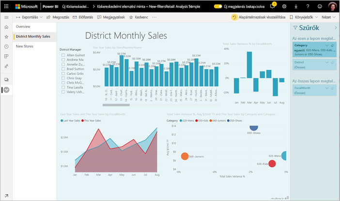

Jelentések tervezése során sok egyéb mellett a következőket végezheti el az új Szűrők panelen:

- A szűrés alapjául szolgáló mezők felvétele és eltávolítása. 
- A szűrő állapotának módosítása.
- A szűrőpanel formázása és testreszabása, hogy a jelentés részeként hasson.
- Megadhatja, hogy a Szűrők panel alapértelmezés szerint meg legyen nyitva, vagy össze legyen csukva, amikor egy fogyasztó megnyitja a jelentést.
- Elrejtheti a teljes szűrőpanelt, vagy azokat a szűrőket, amelyeket nem kíván megmutatni a jelentés fogyasztóinak.
- Szabályozhatja, és akár könyvjelzőzheti is az új Szűrők panel láthatóságát, valamint megnyitott vagy összecsukott állapotát.
- Zárolhat szűrőket, ha nem szeretné, hogy a fogyasztók szerkesszék őket.

Az új szűrési felülettel a jelentés felhasználói a vizualizációk fölé vitt kurzorral megjeleníthetik a vizualizációt befolyásoló összes szűrő és szeletelő csak olvasható listáját.

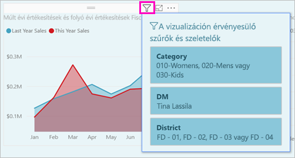

## <a name="turn-on-the-new-filter-experience"></a>Az új szűrési felület bekapcsolása 

Az új jelentésekben alapértelmezés szerint be van kapcsolva az új szűrési felület. Az új felületet a Power BI Desktop vagy a Power BI szolgáltatás meglévő jelentéseihez is használhatja.

### <a name="turn-on-new-filters-for-an-existing-report-in-power-bi-desktop"></a>Új szűrők bekapcsolása meglévő jelentéshez a Power BI Desktopban

1. A Power BI Desktopban egy meglévő jelentésben válassza a **Fájl** > **Lehetőségek és beállítások** > **Beállítások** lehetőséget.
2. A navigációs panelen az **Aktuális fájl** területen válassza a **Jelentésbeállítások** szakaszt.
3. A **Szűrési felület** alatt jelölje be a **Frissített szűrőpanel engedélyezése, valamint a szűrők megjelenítése a jelentés vizualizációjának fejlécében** lehetőséget.

### <a name="turn-on-new-filters-for-an-existing-report-in-the-service"></a>Új szűrők bekapcsolása meglévő jelentéshez a szolgáltatásban

Ha bekapcsolta a Power BI szolgáltatás **új megjelenését**, az új szűrők automatikusan engedélyezve lesznek. Tájékozódjon tovább [a Power BI szolgáltatás új megjelenéséről](service-new-look.md).

Ha nem kapcsolta be az új megjelenést, az alábbi lépésekkel továbbra is megtekintheti az új szűrőket.

1. A Power BI szolgáltatásban nyissa meg egy munkaterület tartalomlistáját.
2. Keresse meg az engedélyezni kívánt jelentést, válassza a **További beállítások (...)** lehetőséget, majd a jelentés **Beállítások** lehetőségét.

    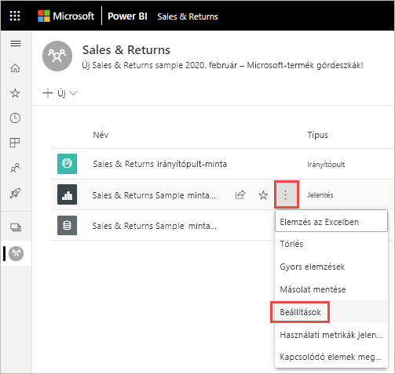

3. A **Szűrési felület** alatt jelölje be a **Frissített szűrőpanel engedélyezése, valamint a szűrők megjelenítése a jelentés vizualizációjának fejlécében** lehetőséget.

    

## <a name="view-filters-for-a-visual-in-reading-mode"></a>Vizualizáció szűrőinek megtekintése olvasási módban

Ha olvasási módban egy vizualizáció szűrőikonja fölé viszi a kurzort, felugrik egy panel az összes szűrővel, szeletelővel és minden mással, ami a vizualizációt befolyásolja. A felugró szűrőpanel ugyanúgy formázható, mint a szűrőpanel. 

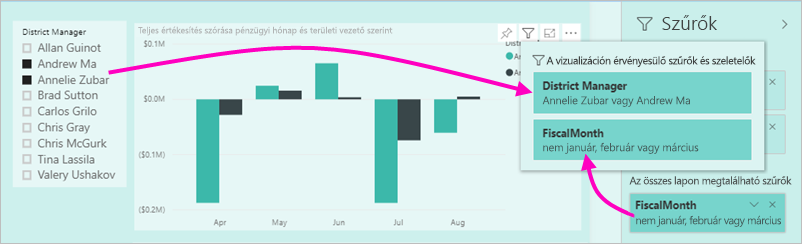

Ebben a nézetben a következő szűrőtípusok jelennek meg: 
- Alapszintű szűrők
- Szeletelők
- Keresztkijelölés 
- Keresztszűrés
- Speciális szűrők
- Felső N szűrők
- Relatív dátum szerinti szűrők
- Szinkronszűrők
- Belefoglalási/kizárási szűrők
- URL-címen keresztül átadott szűrők

## <a name="build-the-new-filters-pane"></a>Az új Szűrők panel felépítése

Az új Szűrők panel az engedélyezése után a jelentésoldaltól jobbra jelenik meg, alapértelmezés szerint a jelentés aktuális beállításainak megfelelően formázva. Az új Szűrők panel használatával konfigurálhatja a belefoglalandó szűrőket, és módosíthatja a meglévőket az új panelen. Az új Szűrők panelen az jelenik meg, amit a jelentés fogyasztói fognak látni, miután Ön közzéteszi a jelentést. 

1. A jelentés felhasználói alapértelmezés szerint láthatják a Szűrők panelt. Ha nem szeretné, hogy lássák, válassza a **Szűrők** melletti szem ikont.

    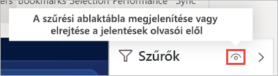

2. Az új Szűrők panel kialakítását kezdje azzal, hogy a kívánt mezőket vizualizáció-, lap- vagy jelentésszintű szűrőként áthúzza az új Szűrők panelre.

Amikor vizualizációt ad egy jelentésvászonhoz, a Power BI automatikusan felvesz egy szűrőt a Szűrők panelre a vizualizációban szereplő mezők mindegyikéhez. 

## <a name="hide-the-filters-pane-while-editing"></a>A Szűrők panel elrejtése szerkesztéskor

A Power BI Desktopban elérhető előzetes verzióban egy új menüszalag. A **Nézet** lap **Szűrők** váltógombjával megjelenítheti vagy elrejtheti a Szűrők panelt. Ez a funkció akkor hasznos, ha nem a Szűrők panelt használja, és további helyre van szüksége a képernyőn. Ez a bővítmény a többi megnyitható és bezárható panelhez igazítja a Szűrők panelt, például a Könyvjelzők és a Kijelölés panelhez. 

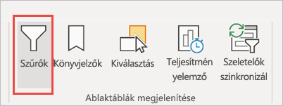

Ez a beállítás csak a Power BI Desktopban rejti el a Szűrők panelt. Ha el szeretné rejteni a Szűrők panelt a végfelhasználók számára, válassza a **Szűrők** melletti **szem** ikont.

 

## <a name="lock-or-hide-filters"></a>Szűrők zárolása vagy elrejtése

Az egyes szűrőkártyákat zárolhatja vagy el is rejtheti. Ha zárol egy szűrőt, akkor a jelentés fogyasztói azt láthatják, de nem szerkeszthetik. Ha elrejti, akkor látni sem fogják. A szűrőkártyák elrejtése általában akkor hasznos, ha az üres vagy nem várt értékek kizárására használt tisztítószűrőket kívánja elrejteni. 

- A **Szűrő zárolása** vagy a **Szűrő elrejtése** ikont az új Szűrők panelen jelölheti be, és ugyanott szüntetheti is meg a kijelölést a szűrőkártyákon.

   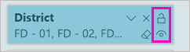

Amikor ezeket a beállításokat ki- vagy bekapcsolja az új Szűrők panelen, a módosítások azonnal tükröződnek a jelentésben. A rejtett szűrők nem jelennek meg a vizualizációk felugró szűrőablakában.

Az új Szűrők panel állapotát úgy is konfigurálhatja, hogy kövesse a jelentések könyvjelzőit. A panel megnyitott, bezárt és látható állapota is könyvjelzőzhető.
 
## <a name="format-the-new-filters-pane"></a>Az új Szűrők panel formázása

A felületet jelentős újdonsága, hogy a Szűrők panel a jelentés megjelenéséhez és működéséhez igazodva formázható. A Szűrők panel a jelentés minden oldalához külön formázható. A következő elemeket formázhatja: 

- Háttérszín
- Háttér áttetszősége
- Szegély be- vagy kikapcsolása
- Szegély színe
- Fej- és lábléc betűtípusa, színe és szövegmérete

Ezeket az elemeket szűrőkártyákhoz is formázhatja attól függően, hogy alkalmazva lettek (valamire beállítva), vagy elérhetők (a tartalmuk törölve van): 

- Háttérszín
- Háttér áttetszősége
- Szegély: be- vagy kikapcsolva
- Szegély színe
- Betűtípus, szín és szövegméret
- Beviteli mező színe

### <a name="format-the-filters-pane-and-cards"></a>A Szűrők panel és a kártyák formázása

1. A jelentésben kattintson magára a jelentésre vagy a háttérre (*háttérkép*), majd a **Vizualizációk** panelen válassza a **Formátum** lehetőséget. 
    Itt találja meg a formázási lehetőségeket a jelentésoldalhoz, a háttérképhez, valamint a Szűrők panelhez és a szűrőkártyákhoz is.

1. Bontsa ki a **Szűrők panelt**, és állítsa be a háttér, az ikonok és a bal szegély színét a jelentésoldalhoz illően.

    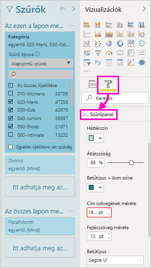

1. Bontsa ki a **Szűrőkártyák** elemet, és állítsa be az **Elérhető** és az **Alkalmazott** színt és szegélyt. Ha az elérhető és az alkalmazott kártyákhoz más színt ad meg, akkor nyilvánvaló lesz, hogy mely szűrők lettek alkalmazva. 
  
    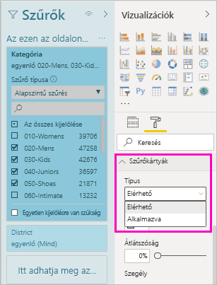

## <a name="theming-for-filters-pane"></a>Témák a Szűrők panelhez
A Szűrők panel alapértelmezett beállításai témafájllal módosíthatók. Az alábbi kódrészlet-minta segít az első lépéseknél:

 
```
"outspacePane": [{ 

"backgroundColor": {"solid": {"color": "#0000ff"}}, 

"foregroundColor": {"solid": {"color": "#00ff00"}}, 

"transparency": 50, 

"titleSize": 35, 

"headerSize": 8, 

"fontFamily": "Georgia", 

"border": true, 

"borderColor": {"solid": {"color": "#ff0000"}} 

}], 

"filterCard": [ 

{ 

"$id": "Applied", 

"transparency": 0, 

"backgroundColor": {"solid": {"color": "#ff0000"}}, 

"foregroundColor": {"solid": {"color": "#45f442"}}, 

"textSize": 30, 

"fontFamily": "Arial", 

"border": true, 

"borderColor": {"solid": {"color": "#ffffff"}}, 

"inputBoxColor": {"solid": {"color": "#C8C8C8"}} 

}, 

{ 

"$id": "Available", 

"transparency": 40, 

"backgroundColor": {"solid": {"color": "#00ff00"}}, 

"foregroundColor": {"solid": {"color": "#ffffff"}}, 

"textSize": 10, 

"fontFamily": "Times New Roman", 

"border": true, 

"borderColor": {"solid": {"color": "#123456"}}, 

"inputBoxColor": {"solid": {"color": "#777777"}} 

}] 
```

## <a name="sort-the-filters-pane"></a>A Szűrők panel rendezése

Az egyéni rendezés lehetősége is a Szűrők panel egyik újdonsága. A jelentéskészítők húzással tetszőleges sorrendbe átrendezhetik a szűrőket.


A szűrők alapértelmezés szerint betűrendben vannak elhelyezve. Egyéni sorrend kialakításához elég új helyre áthúzni egy szűrőt. A szűrők csak azon a szinten belül rendezhetők át, amelyre érvényesek – például a vizualizációk szintjén, az oldal szintjén vagy a jelentés szintjén.

## <a name="improved-filters-pane-accessibility"></a>A Szűrők panel továbbfejlesztett akadálymentessége

Az új Szűrők panelhez továbbfejlesztettük a billentyűzetnavigációt. A tabulátorral a Szűrők panel minden részére eljuthat, a helyi menü billentyűvel vagy a Shift+F10 kombinációval pedig megnyithatja a helyi menüt.

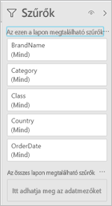

## <a name="rename-filters"></a>Szűrők átnevezése
A Szűrők panel szerkesztésekor kattintson duplán a címre, hogy szerkeszteni tudja. Átnevezni akkor érdemes, ha az a cél, hogy a szűrőkártya érthető legyen a végfelhasználók számára. Vegye figyelemben, hogy a szűrőkártya átnevezése *nem* változtatja meg a mező megjelenített nevét a mezőlistában. Csak a szűrőkártyán használt megjelenített nevet módosítja.

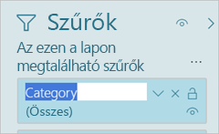

## <a name="filters-pane-search"></a>Keresés a Szűrők panelen

A Szűrők panel keresési funkciójával cím alapján kereshet a szűrőkártyák között. Ez a funkció akkor hasznos, ha több különböző szűrőkártyával rendelkezik a Szűrők panelen, és meg szeretne keresni néhányat.

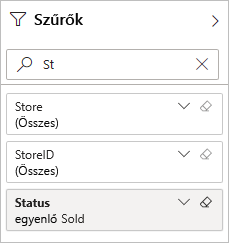

A keresőmezőt a Szűrők panel többi eleméhez hasonlóan formázhatja is.

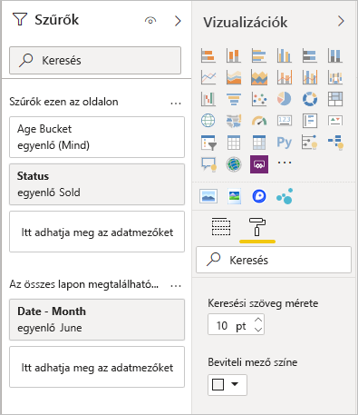

Habár a Szűrők panel keresési funkciója alapértelmezés szerint be lesz kapcsolva, igény szerint ki is kapcsolhatja a Beállítások párbeszédpanel Jelentés beállításai területének **Keresés engedélyezése a Szűrők panelen** lehetőségével.

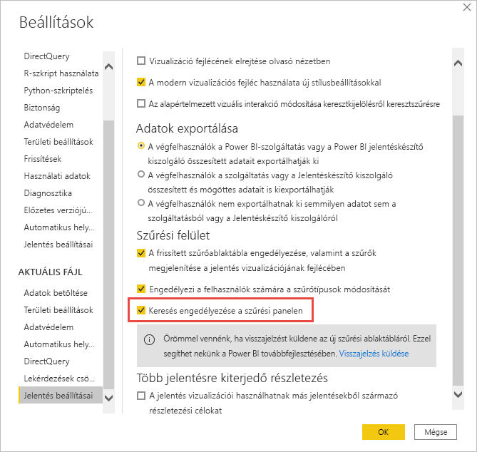

## <a name="restrict-changes-to-filter-type"></a>Szűrőtípus módosításának korlátozása

A jelentés beállításainak Szűrési felület szakaszában beállíthatja, hogy a felhasználók megváltoztathatják-e a szűrő típusát.

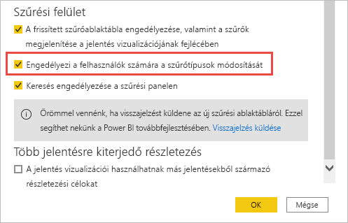

## <a name="next-steps"></a>Következő lépések

Próbálja ki az új szűrési felületet. Küldjön visszajelzést erről a funkcióról, és arról, hogy hogyan tehetnénk még jobbá ezt a felületet a [Power BI Ideas webhelyen](https://ideas.powerbi.com/forums/265200-power-bi). 

- [A jelentésszűrők használata](consumer/end-user-report-filter.md)
- [Szűrők és kiemelések a jelentésekben](power-bi-reports-filters-and-highlighting.md)
- [Különböző szűrők a Power BI-ban](power-bi-report-filter-types.md)

További kérdései vannak? [Kérdezze meg a Power BI közösségét](https://community.powerbi.com/)

