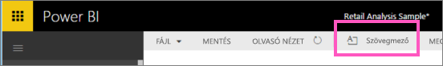
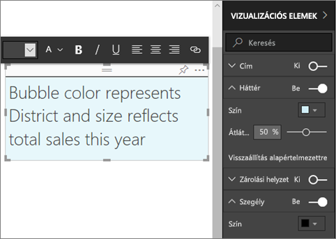
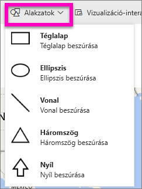
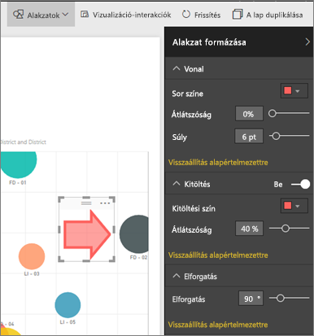

# Szövegdobozok és alakzatok hozzáadása Power BI-jelentésekhez
A Power BI szolgáltatás és a Power BI Desktop használatával szövegdobozokat és alakzatokat adhat jelentésekhez. Mindkét esetben a jelentésre vonatkozó szerkesztési jogosultsággal kell rendelkeznie. Ha a jelentést megosztották Önnel a Power BI szolgáltatásban, akkor nem rendelkezik hozzá szerkesztési jogosultsággal. 

Figyelje meg, hogyan használja Will a Power BI Desktopot, hogy [statikus képeket adjon egy jelentéshez](/learn/modules/visuals-in-power-bi/12-formatting), majd az alábbi lépéseket használva próbálja meg ugyanezt elvégezni a Power BI szolgáltatás használatával.
> 
> <iframe width="560" height="315" src="https://www.youtube.com/embed/_3q6VEBhGew" frameborder="0" allowfullscreen></iframe>
> 

## Szövegmező hozzáadása egy jelentéshez
1. Nyisson meg egy jelentést Szerkesztési nézetben.

2. Vigye az egérkurzort a jelentés vásznán bármely üres helyre, és válassza a **Szövegdoboz** elemet a felső menüből.
   
   
3. Gépelje be a szövegdobozba a szöveget, amelynek betűtípusát, színét és igazítását is beállíthatja. 
   
   
4. A szövegdoboz elhelyezéséhez jelölje ki a tetején a szürke területet, és húzza a helyére. A szövegdoboz átméretezéséhez jelölje ki és húzza a körvonalának valamelyik fogópontját. 
   
   

5. A szövegdobozt hagyja kijelölve, és a **Vizualizációk** panelen végezzen el további formázási beállításokat. Ebben a példában a hátteret és a szegélyt formáztuk. A szövegdoboznak a pontos méretét és elhelyezkedését is meghatározhatja.  

   

6. A szövegdoboz bezárásához jelöljön ki egy üres helyet a jelentés vásznán. 

7. Válassza a gombostű ikont,   a szövegdoboz irányítópultra rögzítéséhez. 

## Alakzat hozzáadása a jelentéshez
1. Vigye az egérkurzort a jelentés vásznán bárhová, és válassza a **Shapes** (Alakzatok) elemet.
   
   
2. A legördülő menüben válasszon egy alakzatot a jelentés vásznához adásához. Ebben a példában adjon hozzá egy nyilat, amely a legnagyobb összértékesítési varianciát tartalmazó buborékra mutat. 
   
   Szabja testre az alakzatot a **Format shape** (Alakzat formázása) ablaktáblában. Ebben a példában egy sötétvörös szegélyű, piros nyilat hoztunk létre, 90 fokkal elforgatva.
   
   
3. Az alakzat elhelyezéséhez jelölje ki a tetején a szürke területet, és húzza a helyére. Az alakzat átméretezéséhez jelölje ki és húzza a körvonalának valamelyik fogópontját. Ahogy a szövegdoboz esetén, az alakzat pontos méretét és elhelyezkedését is meghatározhatja.

   > [!NOTE]
   > Az alakzatokat nem lehet az irányítópulton rögzíteni, kivéve vizualizációk részeként [élő oldal rögzítésénél](service-dashboard-pin-live-tile-from-report.md). 
   > 
   > 

## További lépések

Az alábbi cikkeket is érdekesnek találhatja:

* [Hivatkozás hozzáadása egy szövegdobozhoz](service-add-hyperlink-to-text-box.md)
* [A Power BI szolgáltatás alapfogalmai tervezők számára](service-basic-concepts.md)
* [Tippek a Power BI-jelentésekben lévő alakzatokkal, képekkel és ikonokkal való elemzés javításához](guidance/report-tips-shapes-images-icons.md)
* Több kérdése van? [Kérdezze meg a Power BI közösségét](https://community.powerbi.com/)
