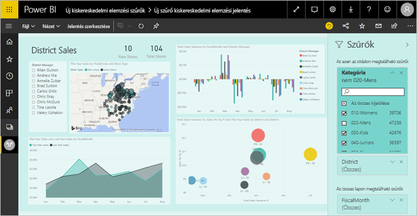
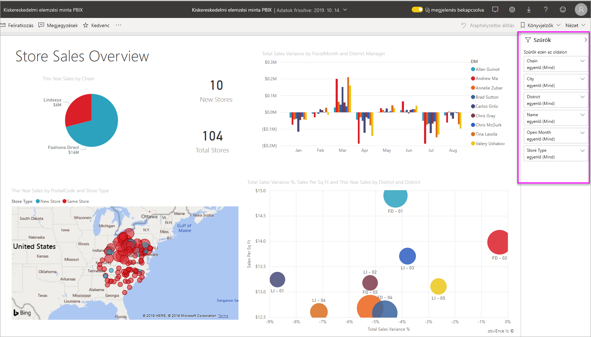
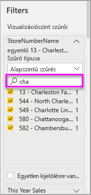
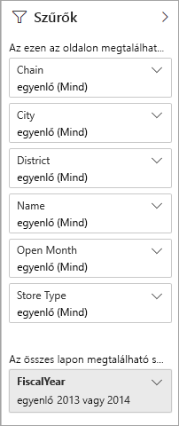
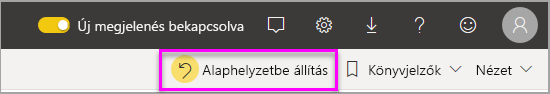
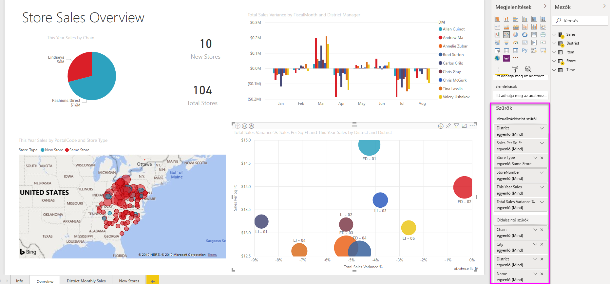

# Szűrők és kiemelések a Power BI-jelentések
 Ez a cikk bemutatja, hogy a szűrők és kiemelések a Power BI szolgáltatásban. A funkciók szinte ugyanúgy működnek, mint a Power BI Desktop szolgáltatásban. A *szűrők* használatával minden olyan adatot eltávolíthat, amelyek az Ön szempontjából lényegtelenek. *Kiemelés* szűrése nem. Az adatok nem távolítja el, hanem ehelyett kiemeli a látható adatok egy részét Nincs kijelölve adatok láthatóak maradnak.

A Power BI-ban sokféleképpen szűrheti és kiemelheti a jelentések adatait. Ha az összes információt egyetlen cikkbe sűrítenénk, az nehezen lenne áttekinthető, ezért a tudnivalókat a következő szakaszokra bontottuk fel:

* Bevezetés a szűrők és kiemelések, a cikk amelyet most olvas.
* Hogyan [létrehozása és használata a szűrők a szerkesztési nézetében](power-bi-report-add-filter.md) Power BI Desktop és a Power BI szolgáltatás jelentéseiben. Ha szerkesztési engedélye van egy jelentéshez, akkor létrehozhatja, módosíthatja és törölheti a szűrőket a jelentésekben.
* Hogyan Vizualizációk [szűrheti és kiemelheti az Önnel megosztott jelentésekben](consumer/end-user-interactions.md), a jelentés olvasó nézete a Power BI szolgáltatásban. A cselekvés korlátozott, de még így is számos lehetőség marad a szűrésre és a kiemelésre.  
* Részletes bemutatása a [szűrési és kiemelési vezérlők szerkesztő nézetben elérhető](power-bi-report-add-filter.md) a Power BI Desktop és a Power BI szolgáltatásban. A cikk egy dátum és idő, szám, például szűrők típusai pillantást részletes és a szöveges vesz igénybe. Emellett ismerteti az alapszintű és speciális lehetőségek közötti eltéréseket.
* Ha már megismerte a szűrők és a kiemelés alapértelmezés szerinti működését, nézze meg, [miképpen módosíthatja azt, ahogy az oldal vizualizációi egymást szűrik és kiemelik](service-reports-visual-interactions.md)

**Tudta?** A Power BI új szűrési felülettel rendelkezik, egyelőre előzetes verzióban. Bővebben is tájékozódhat [a Power BI-jelentésekben elérhető új szűrési felületről](power-bi-report-filter-preview.md).

## A Szűrők panel ismertetése

A szűrőket alkalmazhatja a **Szűrők** panelen, vagy úgy, hogy [szeletelőkön választ](visuals/power-bi-visualization-slicers.md) közvetlenül a jelentésben. A Szűrők ablaktáblán láthatók a jelentésben használt táblák és mezők és az alkalmazott szűrők, ha vannak. 

A szűrőknek négy különböző típusa létezik.

- **Oldalszűrő:** A jelentésoldal összes vizualizációjára vonatkozik.     
- **Vizualizációszűrő:** Egy adott vizualizációra vonatkozik a jelentésoldalon. Vizuális szintű szűrőket csak akkor láthat, ha kiválasztott egy vizualizációt a jelentés vásznán.    
- **Jelentésszűrő:** A jelentés összes oldalára vonatkozik.    
- **Részletezési szűrő:** A jelentés egyetlen entitására vonatkozik.    

A kívánt értékre oldal-, vizualizáció-, és jelentésszűrőkben, valamint Olvasó vagy Szerkesztő nézetben kereshet, majd kiválaszthatja azt. 

Ha a szűrő mellett jelen van a **Mind** szó, akkor a szűrőbe a mező összes értéke beletartozik.  A fenti képernyőfelvételen például a **Lánc (Mind)** beállítás azt jelzi, hogy a jelentésoldal minden áruházlánc adatait tartalmazza.  A **FiscalYear is 2013 or 2014** (A pénzügyi év 2013 vagy 2014) jelentésszintű szűrő azonban azt jelzi, hogy a jelentés csak a 2013-as és 2014-es pénzügyi évek adatait tartalmazza.

## Szűrők Olvasás vagy Szerkesztés nézetben
A jelentések kétféle módban használhatók: [Olvasás nézetben](consumer/end-user-reading-view.md) vagy Szerkesztés nézetben. Az elérhető szűrési képességek az éppen használatban lévő módtól függenek.

* Szerkesztés nézetben jelentés-, oldal-, részletező és vizualizációszűrőket vehet fel. A jelentés mentésekor a szűrőket is menti, akkor is, ha a jelentést mobilalkalmazásban nyitja meg. Aki Olvasás nézetben tekinti meg a jelentést, használhatja a hozzáadott szűrőket, de nem vehet fel újat.
* Olvasás nézetben használhatja a jelentés meglévő szűrőit, és mentheti az elvégzett kijelöléseket. Új szűrőket nem vehet fel.

### Szűrők Olvasás nézetben
Ha csak Olvasás nézetben van hozzáférése a jelentéshez, a Szűrők ablaktábla ehhez hasonló:

A jelentésoldalnak tehát hat oldalszintű és egy jelentésszintű szűrője van.

Minden vizualizáció tartalmaz szűrőket a saját összes mezőjéhez, és a jelentés szerzője továbbiakat is felvehet. Az alábbi képen szereplő buborék diagram hat szűrőt tartalmaz.

Olvasás nézetben a meglévő szűrők módosításával tárhatja fel az adatokat. A módosításokat menti a rendszer a jelentéssel együtt, még akkor is, ha mobilalkalmazásban nyitja meg a jelentést. Ennek a módját [a Szűrők panel bemutatójában](consumer/end-user-report-filter.md) ismerheti meg.

Amikor kilép a jelentésből, a szűrők mentve lesznek. Ha visszavonná a szűrést, és visszatérne a jelentés készítője által beállított alapértelmezett szűrő-, szeletelő-, részletezési és rendezési készlethez, válassza a **Visszaállítás alapértelmezettre** lehetőséget a felső menüsoron.

### Szűrők Szerkesztés nézetben
Ha tulajdonosi engedélye van a jelentéshez, és Szerkesztés nézetben nyitja meg azt, akkor látni fogja, hogy a **Szűrők** panel csak az egyike a rendelkezésre álló szerkesztési ablaktábláknak.

Hasonlóan az Olvasás nézethez, a jelentésoldalnak itt is hat oldalszintű és egy jelentésszintű szűrője van. A buborék diagram kijelölésekor látható, hogy arra hat vizuális szintű szűrőt alkalmaztak.

Szerkesztés nézetben több lehetőség van a szűrők és a kiemelés használatára. A legfontosabb, hogy új szűrőket lehet felvenni. [Szűrők hozzáadása a jelentésekhez](power-bi-report-add-filter.md) és más tudnivalók.

## Ad hoc kiemelése
Válassza ki a megfelelő értéket, vagy a tengely címkét egy vizualizációban, kiemelheti a többi vizualizációt az oldalon. A minőségbiztosítás eltávolításához válassza ki újra az értéket, vagy jelölje ki bármely üres helyet ugyanabban a vizualizációban. Kiemelés egy szórakoztató módja az adathatások. Az ilyen típusú keresztkiemelés finombeállításához lásd: [Vizualizációk interakciói](service-reports-visual-interactions.md).

## Következő lépések

[Az új szűrő funkció a Power BI-jelentésekben](power-bi-report-filter-preview.md)

[Szűrő hozzáadása jelentéshez (Szerkesztés nézetben)](power-bi-report-add-filter.md)

[Ismerkedés a jelentésszűrőkkel](consumer/end-user-report-filter.md)

[A jelentésvizualizációk keresztszűrési és keresztkiemelési viselkedésének módosítása](consumer/end-user-interactions.md)

További kérdései vannak? [Kérdezze meg a Power BI közösségét](http://community.powerbi.com/)

