# A Power BI Q&A használatával áttekintheti az adatait, és vizualizációkat hozhat létre

Ha válaszokat keres az adatokban, néha az a leggyorsabb megoldás, ha természetes nyelven kérdez. A Power BI Q&A funkciójával a saját szavaival tekintheti át az adatait.  A cikk első része bemutatja a Q&A használatát a Power BI szolgáltatás irányítópultjaiban. A második rész bemutatja, hogy mit tehet a Q&A-vel, amikor jelentéseket készít a Power BI szolgáltatással vagy a Power BI Desktoppal. További információt a [Q&A felhasználóknak készült](consumer/end-user-q-and-a.md) cikkében talál. 

A [Q&A a Power BI-mobilalkalmazásokban](consumer/mobile/mobile-apps-ios-qna.md) és a [Q&A a Power BI Embedded használatával](developer/embedded/qanda.md) külön cikkekben szerepelnek. 

A Q&A interaktív, és a használata még szórakoztató is. Gyakran előfordul, hogy egy kérdés további kérdéseket vet fel, mivel a vizualizációk érdekes utakat fednek fel a folytatáshoz. Figyelje meg, hogyan hoz létre Amanda vizualizációkat a Q&A-val, hogyan tárja fel ezeket a vizualizációkat, és rögzíti őket irányítópultokon.

<iframe width="560" height="315" src="https://www.youtube.com/embed/qMf7OLJfCz8?list=PL1N57mwBHtN0JFoKSR0n-tBkUJHeMP2cP" frameborder="0" allowfullscreen></iframe>

## 1\. rész: A Q&A használata irányítópulton a Power BI szolgáltatásban

A Power BI szolgáltatásban (app.powerbi.com) az irányítópultokon egy vagy több adatkészletből származó csempék vannak rögzítve, így bármely adatkészlet bármely adatával kapcsolatban feltehető kérdés. Ha meg szeretné nézni, hogy mely jelentéseket és adatkészleteket használták fel az irányítópult létrehozásához, válassza a menüsávon a **Kapcsolódó megtekintése** elemet.

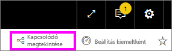

A Q&A kérdésmező az irányítópult bal felső sarkában található. Ide kell beírni a kérdéseket természetes nyelvezetet használva. Nem látja a Q&A mezőt? További információt a **Q&A felhasználóknak készült** cikkének [megfontolandó szempontokat és hibaelhárítást](consumer/end-user-q-and-a.md#considerations-and-troubleshooting) tartalmazó részében talál.  A Q&A felismeri a beírt szavakat, és kitalálja, hogy hol (melyik adathalmazban) található meg a válasz. A Q&A a kérdés megfogalmazásában is segít automatikus kiegészítéssel, átfogalmazással és más szöveges és vizuális támogatással.

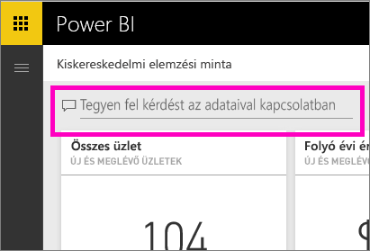

A kérdésére adott válasz használható vizualizációként jelenik meg, és a kérdés módosításakor frissül.

1. Nyisson meg egy irányítópultot, és vigye a kurzort a kérdésmező fölé. A jobb felső sarokban válassza az **Új Q&A-élmény** elemet.

    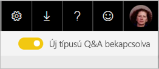

1. Még mielőtt gépelni kezdene, a Q&A egy új képernyőt nyit meg, amelyen javaslatokkal segít a kérdés megfogalmazásában. Kifejezéseket és az alapul szolgáló adathalmazok tábláinak nevét tartalmazó kész kérdéseket találhat, és ha az adathalmaz tulajdonosa létrehozott [kiemelt kérdéseket](service-q-and-a-create-featured-questions.md) is, akkor ezeket a kész kérdéseket is itt találja.

   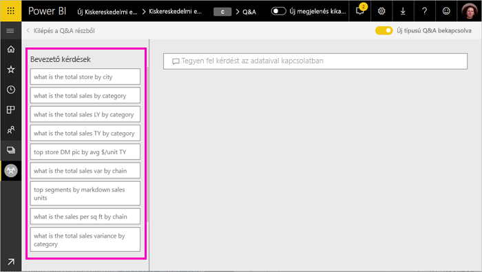

   Kiindulásként választhatja ezen kérdések egyikét, és a kérdést tovább pontosíthatja, míg rá nem talál az Ön által keresett válaszra. Egy tábla nevét használva új kérdést is megfogalmazhat.

2. Válasszon a kérdések közül, vagy kezdje el beírni saját kérdését, és válasszon a legördülő javaslatokból.

   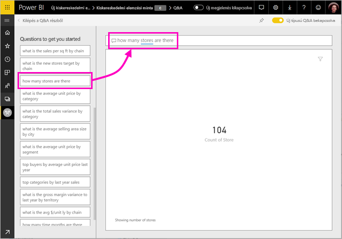

3. Miközben a kérdést írja, a Q&A kiválasztja a válasz megjelenítésére legalkalmasabb vizualizációt.

   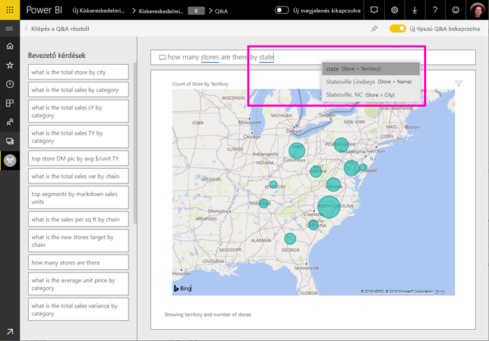

4. A vizualizáció dinamikusan változik a kérdés módosításakor.

   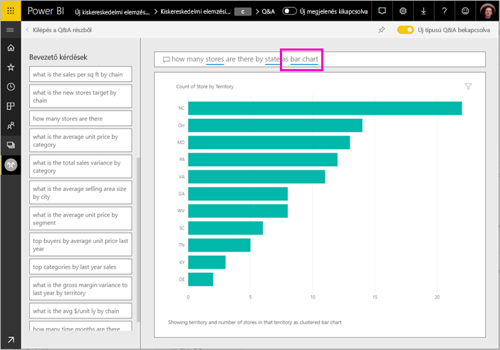

1. A kérdés begépelésekor a Power BI minden olyan adatkészletben keresi a választ, amelyhez csempe tartozik az irányítópulton.  Ha az összes csempe forrása az *A adatkészlet*, akkor a válaszok az *A adatkészletből* származnak.  Ha vannak az *A adathalmazból* és a *B adathalmazból* származó csempék is, akkor a Q&A a két adathalmazból keresi ki a legjobb választ.

   > [!TIP]
   > Ügyeljen rá, hogy ha az *A adatkészletnek* csak egy csempéje van, és eltávolítja azt az irányítópultról, akkor a Q&A többé nem fog hozzáférni az *A adatkészlethez*.
   >

5. Ha elégedett az eredménnyel, rögzítse a vizualizációt egy irányítópulton a jobb felső sarokban lévő gombostű ikon használatával. Ha az irányítópultot más osztotta meg Önnel, vagy egy alkalmazás része, akkor a rögzítésre nincs lehetősége.

   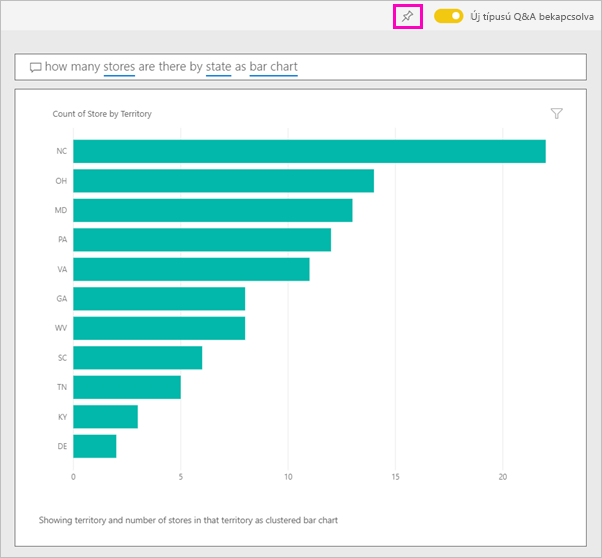

## 2\. rész: A Q&A használata jelentésben a Power BI szolgáltatásban és a Power BI Desktopban

A Q&A használatával megismerheti az adatkészletet, és vizualizációkat adhat hozzá jelentésekhez és irányítópultokhoz. Egy jelentés egyetlen adatkészletet használ, és lehet teljesen üres is, vagy tartalmazhat számos vizualizációval rendelkező oldalakat is. Ha azonban üres egy jelentés, az még nem jelenti azt, hogy nincsenek rendelkezésre álló és feltárható adatok benne: az adatkészlet csatolva van a jelentéshez, és az adatai vizualizációk létrehozásával fel is tárhatóak.  Ha meg szeretné nézni, hogy a jelentés mely adatkészlet használatával készült, nyissa meg a jelentést a Power BI szolgáltatásban Olvasó nézetben, és válassza a **Kapcsolódó megtekintése** lehetőséget.

Ahhoz, hogy a Q&A-t használni tudja a jelentésekben, szerkesztési engedélyekkel kell rendelkeznie a jelentésnél és a jelentés alapjául szolgáló adathalmaznál. A [Q&A felhasználóknak készült](consumer/end-user-q-and-a.md) cikkében erre *létrehozói* forgatókönyvként hivatkozunk. Ha viszont egy Önnel megosztott jelentést *használ*, akkor a Q&A nem érhető el.

1. Nyisson meg egy jelentést szerkesztési nézetben (Power BI szolgáltatás) vagy jelentési nézetben (Power BI Desktop), és a menüsávon válassza a **Kérdés feltevése** lehetőséget.

    **Power BI Desktop**    
    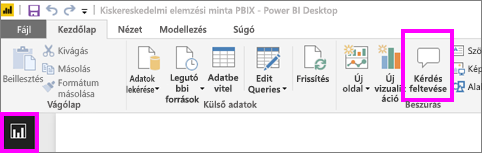

    **Service**    
    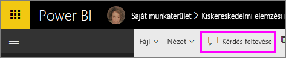

2. A jelentésvásznon megjelenik a Q&A kérdésmező. Az alábbi példában a kérdésmező egy másik vizualizáció fölött jelenik meg. Ez nem okoz problémát, de tanácsosabb új üres oldalt hozzáadni a jelentéshez a kérdés feltevése előtt.

    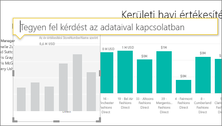

3. Vigye a kurzort a kérdésmező fölé. A kérdés begépelése közben a Q&A javaslatokat jelenít meg a kérdés megfogalmazásához.

   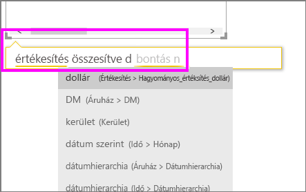

4. A kérdés beírása közben a Q&A kiválasztja a legjobb [vizualizációt](visuals/power-bi-visualization-types-for-reports-and-q-and-a.md) a válasz megjelenítéséhez; a kérdés módosítása közben a vizualizáció dinamikusan változik.

   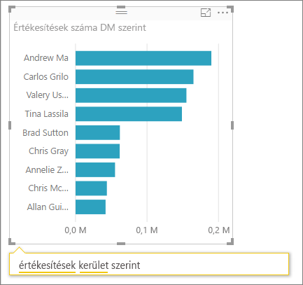

5. Ha megjelent a kívánt vizualizáció, nyomja meg az ENTER billentyűt. Ha a vizualizációt menteni szeretné a jelentéssel, válassza a **Fájl > Mentés** lehetőséget.

6. Az új vizualizációt használatba is veheti. Függetlenül attól, hogy a vizualizációt hogyan hozta létre, elérhetőek lesznek ugyanazok a lehetőségek az interakcióra, a formázásra és egyéb funkciókra.

   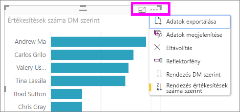

   Ha a vizualizációt a Power BI szolgáltatás használatával hozta létre, akkor [rögzítheti is azt egy irányítópulton](service-dashboard-pin-tile-from-q-and-a.md).

## A Q&A által használt vizualizáció megadása
A Q&A-tól nem csak annyit kérhet, hogy az adatok beszéljenek magukért, azt is megadhatja, hogy a Power BI hogyan jelenítse meg a válaszokat. Elég a kérdés végét a "as a <visualization type>" ("mint ...") szöveggel kiegészíteni.  Erre példa a "show inventory volume by plant as a map" ("mutasd a raktárkészletet üzemenként mint térkép") és a "show total inventory as a card" ("mutasd a teljes leltárt mint kártya").  Próbálja ki.

## Megfontolandó szempontok és hibaelhárítás
- Ha az adatkészlethez élő kapcsolattal vagy átjáró használatával csatlakozott, a Q&A-t [engedélyezni kell az adott adatkészlethez](service-q-and-a-direct-query.md).

- Megnyitott egy jelentést, de nem jelenik meg a Q&A lehetőség. Ha a Power BI szolgáltatást használja, mindenképpen a Szerkesztési nézetében nyissa meg a jelentést. Ha nem tudja megnyitni a szerkesztési nézetet, akkor nincs engedélye a jelentés szerkesztéséhez, és nem használhatja a Q&A-t ehhez a jelentéshez.

## Következő lépések

- [Q&A felhasználók számára](consumer/end-user-q-and-a.md)   
- [Tippek kérdések feltevéséhez a Q&A-ben](consumer/end-user-q-and-a-tips.md)   
- [Munkafüzet előkészítése a Q&A használatához](service-prepare-data-for-q-and-a.md)  
- [Helyszíni adathalmazok előkészítése Q&A-hez](service-q-and-a-direct-query.md)   
- [Csempe rögzítése az irányítópulton a Q&A-ból](service-dashboard-pin-tile-from-q-and-a.md)
