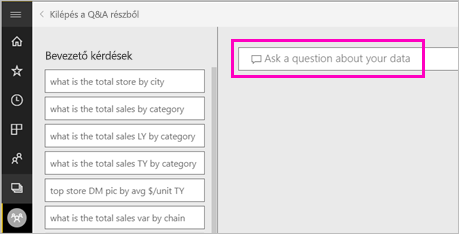
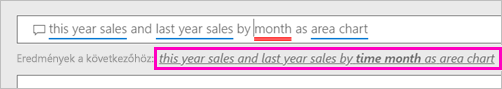
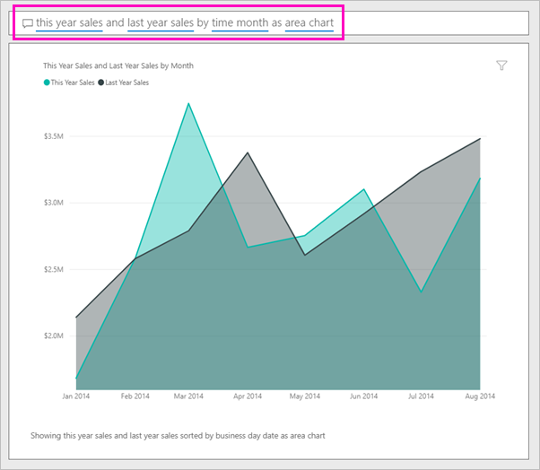

# Vizualizáció létrehozása a Power BI Q&A használatával

Ha válaszokat keres az adatokban, néha az a leggyorsabb megoldás, ha természetes nyelven kérdez.  Ebben az útmutatóban két különböző módszert is megtekintünk ugyanannak a vizualizációnak a létrehozására: először kérdést teszünk fel a Q&A-vel, majd felépítjük egy jelentésben. A Power BI szolgáltatást használjuk a vizualizáció a jelentésben történő felépítéséhez, de a folyamat közel azonos a Power BI Desktop használata esetén is.

A bemutatott megoldások elvégzéséhez rendelkeznie kell egy Ön által szerkeszthető jelentéssel, ezért a Power BI-ban elérhető egyik mintát fogjuk használni.

## Vizualizáció létrehozása a Q&A segítségével

Hogyan tudnánk létrehozni ezt a vonaldiagramot a Q&A-vel?

1. Válassza a Power BI munkaterületén az **Adatok beolvasása** \> **Minták** \> **Kiskereskedelmi elemzési minta** > **Csatlakozás** menüpontot.

1. Nyissa meg a Kiskereskedelmi elemzési minta irányítópultját, és helyezze az egérmutatót a Q&A mezőre, **Tegyen fel kérdést az adataival kapcsolatban**.

    

2. A Q&A mezőben írjon be egy ehhez hasonló kérdést:
   
    **this year sales and last year sales by month as area chart** (az idei értékesítés és a múlt évi értékesítés havi bontásban, területdiagramon ábrázolva)
   
    A kérdés beírása közben a Q&A kiválasztja a legjobb vizualizációt a válasz megjelenítéséhez; a kérdés módosítása közben a vizualizáció dinamikusan változik. A Q&A segít a kérdés megfogalmazásában is javaslatokkal, automatikus kiegészítéssel és helyesírási javításokkal. A Q&A egy kis módosítást javasol a megfogalmazásban: „this year sales and last year sales by *time month* as area chart” (az idei értékesítés és a múlt évi értékesítés havi időbontásban, területdiagramon ábrázolva).  

    

4. Kattintson a mondatra a javaslat elfogadásához. 
   
   Amikor befejezi a kérdés beírását, az eredmény ugyanaz a diagram lesz, amelyet az irányítópulton lát.
   
   

4. A diagram irányítópultra való kitűzéséhez válassza a gombostű ikont  a jobb felső sarokban.

## Vizualizáció létrehozása a jelentésszerkesztőben

1. Térjen vissza a Kiskereskedelmi elemzési minta irányítópulthoz.
   
2. Az irányítópult ugyanazt a területdiagram-csempét tartalmazza a „Last Year Sales and This Year Sales” (múlt évi értékesítések és idei értékesítések) esetén.  Jelölje ki ezt a csempét. Ne jelölje ki a Q&A-vel létrehozott csempét. A kijelölésével megnyitja a Q&A-t. Az eredeti területdiagram-csempét egy jelentésben hozták létre, ezért a jelentés megnyílik a vizualizációt tartalmazó oldalon.

    

1. Nyissa meg a jelentést szerkesztési nézetben a **Jelentés szerkesztése** lehetőséget választva.  Ha nem tulajdonosa a jelentésnek, akkor nem nyithatja meg Szerkesztő nézetben.
   
    
4. Jelölje ki a területdiagramot, és tekintse át a beállításokat a **Mezők** ablaktáblán.  A jelentés létrehozója ennek a három értéknek a kiválasztásával építette fel a diagramot (**múlt évi értékesítések** és **idei értékesítések > érték** az **Értékesítések** táblából, illetve **FiscalMonth** az **Idő** táblából), és rendezte őket a **Tengely** és **Értékek** területen.
   
    

    Láthatja, hogy azonos vizualizációk jöttek létre. A létrehozás így nem volt túl bonyolult. De a létrehozás a Q&A-vel egyszerűbb volt!

## Következő lépések

- [A Q&A használata irányítópultokon és jelentésekben](power-bi-tutorial-q-and-a.md)  
- [Q&A felhasználók számára](consumer/end-user-q-and-a.md)
- [Megfelelő adatműködés biztosítása a Q&A és a Power BI használatánál](service-prepare-data-for-q-and-a.md)

További kérdései vannak? [Kérdezze meg a Power BI közösségét](https://community.powerbi.com/)

