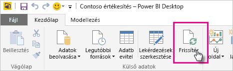
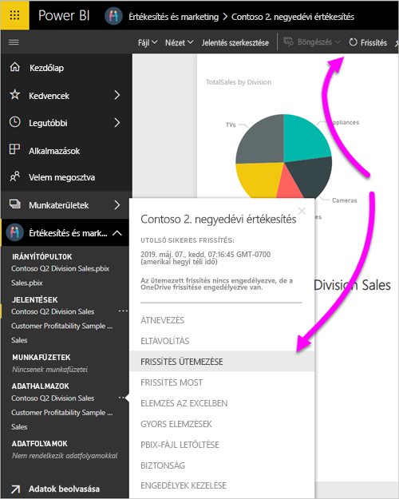
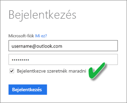

# A OneDrive vagy a SharePoint Online szolgáltatásban tárolt adatkészletek frissítése
A fájlok importálása a OneDrive vagy a SharePoint Online szolgáltatásból a Power BI szolgáltatásba nagyszerű mód annak biztosítására, hogy a Power BI Desktopban végzett munkája szinkronban maradjon a Power BI szolgáltatással.

## A Power BI Desktop-fájlok OneDrive vagy SharePoint Online szolgáltatásban való tárolásának előnyei
Ha egy Power BI Desktop-fájlt a OneDrive vagy a SharePoint Online szolgáltatásban tárol, a rendszer a fájl modelljébe töltött összes adatot importálja az adatkészletbe. A fájlban létrehozott összes jelentés be lesz töltve a Power BI szolgáltatásba a **Jelentések** közé. Tegyük fel, hogy módosítja a OneDrive-on vagy a SharePoint Online-ban tárolt fájlt. A módosítások során új mértékeket ad hozzá, oszlopneveket változtat meg, vagy vizualizációkat szerkeszt. A fájl mentése után a Power BI szolgáltatás ezeket a módosításokat is szinkronizálja, általában körülbelül egy órán belül.

Közvetlenül a Power BI Desktopban is végezhet egyszeri, manuális frissítést, ha a **Kezdőlap** szalagon a **Frissítés** lehetőséget választja. Amikor a **Frissítés** lehetőséget választja, a fájlbeli modell az eredeti adatforrásból származó adatokkal lesz frissítve. Ez a fajta frissítés teljes egészében a Power BI Desktop alkalmazásból megy végbe. Különbözik a Power BI-beli manuális vagy ütemezett frissítéstől, és fontos tisztában lenni az eltérésekkel.

Amikor a Power BI Desktop-fájlt a OneDrive-ról vagy a SharePoint Online-ról importálja, az adatokat és a modellel kapcsolatos információkat egy Power BI-beli adathalmazba tölti. Azért frissíti a Power BI szolgáltatásban lévő adathalmazt, mert a jelentései arra épülnek. Mivel az adatforrások külső adatforrások, manuálisan frissítheti az adatkészletet az **Azonnali frissítéssel**, vagy beállíthat egy frissítési ütemtervet a **Frissítés ütemezésével**. 

Az adathalmaz frissítésekor a Power BI nem csatlakozik a OneDrive vagy a SharePoint Online szolgáltatásban lévő fájlhoz a frissített adatok lekérdezéséhez. Az adathalmazban lévő információkkal közvetlenül az adatforrásokhoz csatlakozik a frissített adatok lekérdezése érdekében. Ezeket az adatokat aztán betölti az adathalmazba. Az adathalmaz frissített adatait a rendszer nem szinkronizálja vissza a OneDrive vagy a SharePoint Online szolgáltatásban lévő fájllal.

## Mi támogatott?
A Power BI-ban a **Frissítés** és a **Frissítés ütemezése** támogatott a helyi meghajtóról importált Power BI Desktop fájlokból létrehozott adathalmazok esetében, ahol a következő adatforrásokhoz való csatlakozás, illetve az azokról való adatbetöltés **Adatok lekérése** vagy a **Lekérdezésszerkesztő** használatával történik.

> [!NOTE]
> Támogatott az élő kapcsolattal rendelkező adatkészletek OneDrive-frissítése. Az élő kapcsolatú adatkészlet módosítása egy már közzétett jelentésben azonban nem támogatott a OneDrive-frissítési forgatókönyvben.

### Power BI Gateway – Personal
* A Power BI Desktop **Adatok lekérése** és **Lekérdezésszerkesztő** területein látható összes online adatforrás.
* A Power BI Desktop **Adatok lekérése** és **Lekérdezésszerkesztő** területein látható összes helyszíni adatforrás a Hadoop-fájl (HDFS) és a Microsoft Exchange kivételével.

<!-- Refresh Data sources-->
[!INCLUDE [refresh-datasources](./includes/refresh-datasources.md)]

> [!NOTE]
> Ahhoz, hogy a Power BI helyszíni adatforrásokhoz kapcsolódhasson és frissíthesse az adatkészletet telepítve kell lennie és futnia kell egy átjárónak.
> 
> 

## OneDrive vagy OneDrive Vállalati verzió. Mi közöttük a különbség?
Ha rendelkezik személyes OneDrive-val és OneDrive vállalati verzióval is, a Power BI-ba importálni kívánt fájlokat érdemes a OneDrive vállalati verziójában tartani. Ennek az az oka, hogy minden bizonnyal két külön fiókot használ a két szolgáltatáshoz.

A Power BI-ban egyszerűen csatlakozhat a OneDrive vállalati verziójához, mert a Power BI-fiók gyakran megegyezik a OneDrive vállalati verzióhoz használt fiókkal. Személyes OneDrive esetén valószínűleg másik [Microsoft-fiókkal](https://account.microsoft.com) jelentkezik be.

Amikor bejelentkezik a Microsoft-fiókjával, mindenképp jelölje be a **Bejelentkezve szeretnék maradni** lehetőséget. A Power BI ezután szinkronizálni tudja a Power BI Desktopban végrehajtott fájlfrissítéseket a Power BI adatkészleteivel.

Ha módosította a microsoftos hitelesítő adatait, nem tudja szinkronizálni a módosításokat a OneDrive-on lévő fájl és a Power BI-beli adathalmaz között. Ismét csatlakoznia kell, hogy újra importálja a fájlt a OneDrive-ról.

## Hogyan ütemezhetek frissítést?
Frissítési ütemezés beállításakor a Power BI közvetlenül az adatforrásokhoz csatlakozik. A Power BI az adathalmazbeli kapcsolódási információk és hitelesítő adatok használatával kérdezi le a módosított adatokat. A Power BI az adathalmazba tölti a módosított adatokat. Ez után a Power BI szolgáltatásban erre az adathalmazra épülő összes jelentésvizualizációt és irányítópultot is frissíti.

Az ütemezett frissítés beállításáról az [Ütemezett frissítés konfigurálása](refresh-scheduled-refresh.md) című cikkben talál további részleteket.

## Hiba esetén
Ha hiba lép fel, annak általában az az oka, hogy a Power BI nem tud bejelentkezni az adatforrásokba. Az is hibát okozhat, ha az adathalmaz helyszíni adatforráshoz próbál csatlakozni, de az átjáró offline állapotban van. Ezek a problémák elkerülhetők, ha gondoskodik róla, hogy a Power BI be tudjon jelentkezni az adatforrásokba. Próbáljon meg bejelentkezni adatforrásaiba az **Adatforráshoz tartozó hitelesítő adatok** alatt. Előfordulhat, hogy az adatforrásba való bejelentkezéshez használt jelszó megváltozik, vagy a rendszer kijelentkezteti a Power BI-t az adatforrásból.

Ha menti egy OneDrive-on tárolt Power BI Desktop-fájl módosításait, majd ezek a módosítások nem jelennek meg a Power BI-ban nagyjából egy órán belül, ennek az lehet az oka, hogy a Power BI nem tud csatlakozni a OneDrive-hoz. Próbáljon meg ismét csatlakozni a OneDrive-on tárolt fájlhoz. Ha a rendszer arra kéri, hogy jelentkezzen be, feltétlenül jelölje be a **Bejelentkezve szeretnék maradni** lehetőséget. Mivel a Power BI nem tudott csatlakozni a OneDrive szolgáltatáshoz, és így nem tudta szinkronizálni a fájl adatait, újra importálnia kell az adott fájlt.

Mindenképpen hagyja bejelölve az **Értesítést kérek e-mailben, ha sikertelen a frissítés** jelölőnégyzetet. Azonnal tudnia kell, ha egy ütemezett frissítés meghiúsul.

## Hibaelhárítás
Néha az adatok frissítése nem a várt módon történik. Adatfrissítési problémák általában átjáróval való csatlakozáskor lépnek fel. Az átjáró-hibaelhárítással kapcsolatos cikkekben találja az eszközöket és az ismert hibákat.

[A Helyszíni adatátjáróval kapcsolatos hibák elhárítása](service-gateway-onprem-tshoot.md)

[A személyes Power BI Gateway hibáinak elhárítása](service-admin-troubleshooting-power-bi-personal-gateway.md)

Több kérdése van? Forduljon a [Power BI közösségéhez](https://community.powerbi.com/).

