# Többoldalas jelentés létrehozása megosztott Power BI-adathalmaz alapján

Egy Power BI Desktopban létrehozott adathalmazt adatforrásként használhat a Power BI jelentéskészítővel készített többoldalas jelentésekhez. Képzelje el a következő helyzetet: Létrehozott egy Power BI-jelentést a Power BI Desktopban. Sok időt áldozott az adatmodell megtervezésére, majd létrehozott egy sok csodás vizualizációt tartalmazó, szépséges Power BI-jelentést. A jelentése tartalmaz egy soksoros mátrixot, amelyet görgetni kell, hogy mindet megtekinthesse. A jelentés olvasói olyan nyomtatható jelentést szeretnének, amelyen ennek a mátrixnak minden sora látható. A többoldalas Power BI-jelentés alkalmas erre: egy kinyomtatható táblázat vagy mátrix több oldalra kiterjedhet, fej- és láblécekkel ellátva, az Ön által tervezett tökéletes elrendezésben. Teljessé tenné a Power BI Desktop-jelentést. Ha azt szeretné, hogy a kettő pontosan, eltérések nélkül ugyanazokra az adatokra épüljön, akkor ugyanazt az adathalmazt kell használnia.

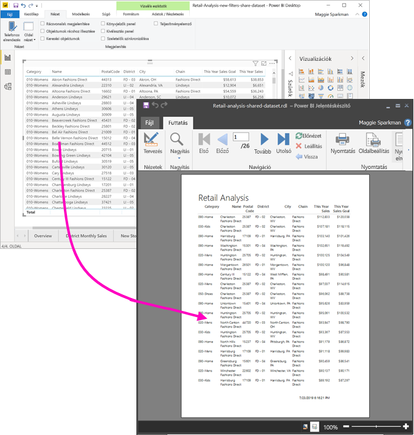

Az adathalmaznak nem kell Prémium szintű kapacitásban lévő munkaterületen lennie, és Önnek sem kell a munkaterület tagjának lennie. Elég [Összeállítási engedéllyel](service-datasets-build-permissions.md) rendelkeznie az adathalmazra. Többoldalas jelentése közzétételéhez viszont Power BI Pro-licencre lesz szüksége. Ezen kívül legalább Közreműködői szerepkörrel kell rendelkeznie egy Prémium szintű kapacitásbeli munkaterületen.

## Amire szükség lesz

Az alábbi lista felsorolja mindazt, ami megosztott adathalmaz Power BI Jelentéskészítőben való felhasználásához szükséges, és ami nem szükséges.

- Power BI Jelentéskészítő. [Töltse le és telepítse a Power BI Jelentéskészítőt](https://go.microsoft.com/fwlink/?linkid=2086513).
- Power BI-adathalmazhoz akkor férhet hozzá, ha rendelkezik az adathalmazra vonatkozó Összeállítási engedéllyel. Tájékozódjon az [Összeállítási engedélyről](service-datasets-build-permissions.md).
- Többoldalas jelentést Power BI Pro-licenc nélkül is létrehozhat a Jelentéskészítőben. 
- A többoldalas jelentés közzétételéhez viszont Power BI Pro-licenc szükséges. Ezen kívül legalább Közreműködői szerepkörrel kell rendelkeznie egy Prémium szintű kapacitásbeli munkaterületen. 
- Választható: Ha követni szeretné a cikk tartalmát, töltse le a [Kiskereskedelmi elemzési minta .pbix](https://download.microsoft.com/download/9/6/D/96DDC2FF-2568-491D-AAFA-AFDD6F763AE3/Retail%20Analysis%20Sample%20PBIX.pbix) Power BI Desktop-fájlt, nyissa meg a Power BI Desktopban, és vegyen fel egy sok oszlopból álló táblázatot. A **Formátum** panelen kapcsolja ki az **Összegek** beállítást. Ez után tegye közzé egy munkaterületen a Power BI szolgáltatásban.

    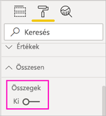

## Csatlakozás a Power BI-adathalmazhoz

1. Nyissa meg a Power BI Jelentéskészítőt.
1. Válassza a **Bejelentkezés** lehetőséget a Jelentéskészítő jobb felső sarkában, és jelentkezzen be Power BI-fiókjába.
1. A Jelentésadatok panelen válassza az **Új** > **Power BI-adathalmaz kapcsolat** lehetőséget.

    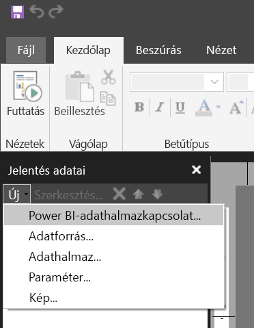

    > [!NOTE]
    > Egy Power BI-adathalmaz adatforrását vagy adathalmazát nem hozhatja létre a Jelentéskészítő táblázat-, mátrix- vagy diagram-varázslója használatával. Ezek alapján a létrehozásuk után hozhat létre táblázatokat, mátrixokat vagy diagramokat a varázslók használatával.

1. Keresse meg vagy tallózza ki az adathalmazt vagy az azt tartalmazó munkaterületet > **Kiválasztás**.
    A Jelentéskészítő kitölti az adathalmaz nevét.

    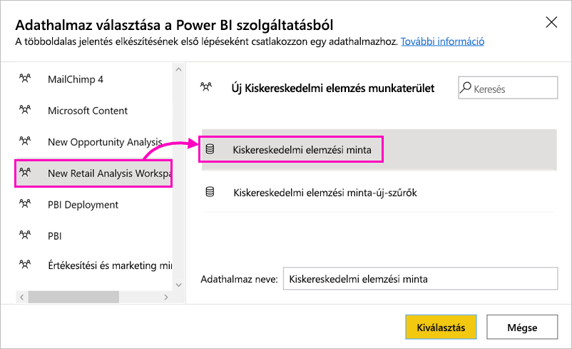
    
1. Az adathalmaz az Adatforrások listájában jelenik meg a Jelentésadatok panelen.

    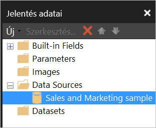

    Lényeges, hogy egy többoldalas jelentésen belül több Power BI-adathalmazhoz vagy más adatforráshoz is csatlakozhat.

## Az adathalmazhoz tartozó lekérdezés átvétele

Ha az a cél, hogy a Power BI-jelentés és a Jelentéskészítőbeli jelentés adatai megegyezzenek, akkor nem elég az adathalmazhoz csatlakozni. Ehhez az adathalmazra épülő lekérdezés is szükséges.

1. Nyissa meg a Power BI-jelentést (.pbix) a Power BI Desktopban.
1. Ellenőrizze, hogy a jelentés egyik táblázata a többoldalas jelentésben kívánt összes adatot tartalmazza-e.

1. A **Nézet** menüszalagon válassza a **Teljesítményelemző** elemet.

    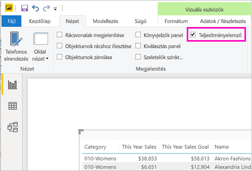

1. A **Teljesítményelemző** panelen válassza a **Rögzítés indítása**, majd a **Vizualizációk frissítése** lehetőséget.

    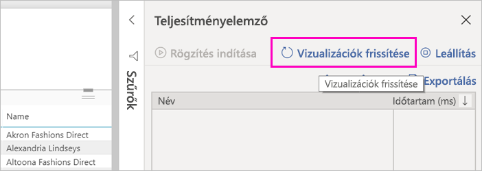

1. Bontsa ki a táblázat neve melletti pluszjelet ( **+** ), majd válassza a **Lekérdezés másolása** lehetőséget. A lekérdezés az adathalmazhoz a Power BI Jelentéskészítőben szükséges DAX-képlet.

    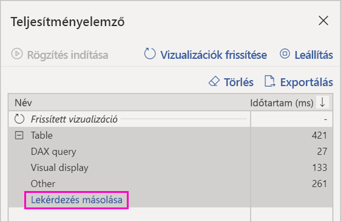

## Az adathalmaz létrehozása a lekérdezéssel

1. Lépjen vissza a Power BI Jelentéskészítőbe.
1. Kattintson a jobb gombbal az **Adatforrások** területen megjelenő adathalmazra, majd válassza az **Adathalmaz hozzáadása** lehetőséget.

    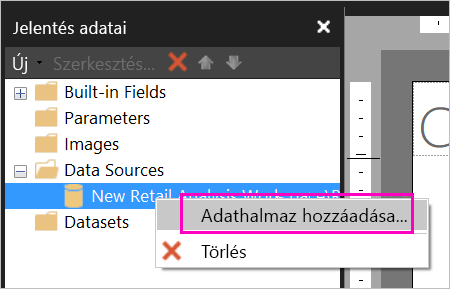

1. Adjon neki nevet az Adathalmaz tulajdonságainál, majd válassza a **Lekérdezéstervezőt**.

4. Ügyeljen rá, hogy a **DAX** lehetőség legyen kijelölve, és szüntesse meg a **Tervezési mód** ikon kijelölését.

    

1. A felső mezőbe illessze be a Power BI Desktopból kimásolt lekérdezést.

1. A **Lekérdezés végrehajtása** (piros felkiáltójel, !) lehetőséggel ellenőrizze, hogy működik-e a lekérdezés. 

    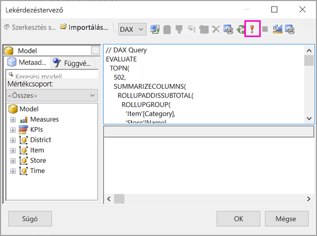

    A lekérdezés eredménye az alsó mezőben jelenik meg.

    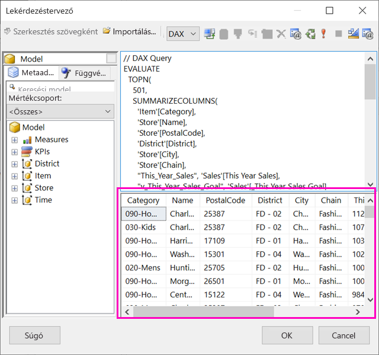

1. Válassza az **OK** lehetőséget.

    A lekérdezés az **Adathalmaz tulajdonságai** párbeszédpanel **Lekérdezés** ablakában látható.

    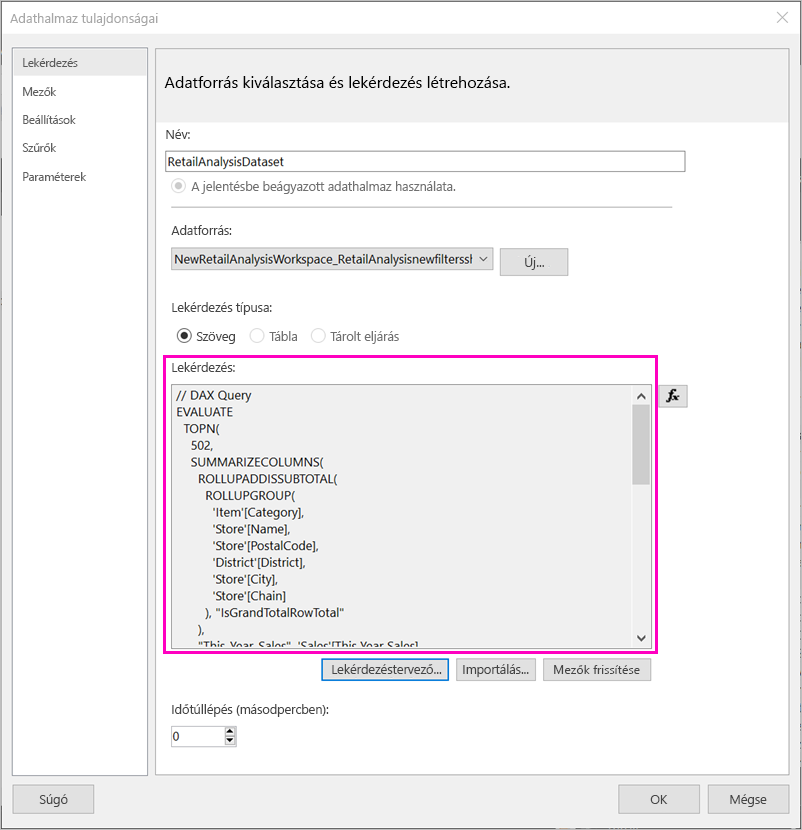

1. Válassza az **OK** lehetőséget.

    Az új adathalmaz most már a mezői listájával együtt látható a Jelentésadatok panelen.

    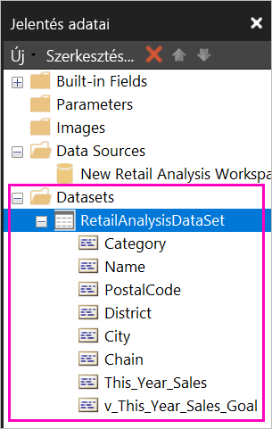

## Táblázat létrehozása a jelentésben

Táblázat létrehozására gyors módszer a Táblázat varázsló használata.

1. Válassza a **Beszúrás** menüszalag **Táblázat** > **Táblázat varázsló** elemét.

    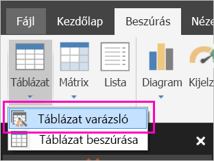

1. Jelölje ki a DAX-lekérdezéssel létrehozott adathalmazt > **Tovább**.

    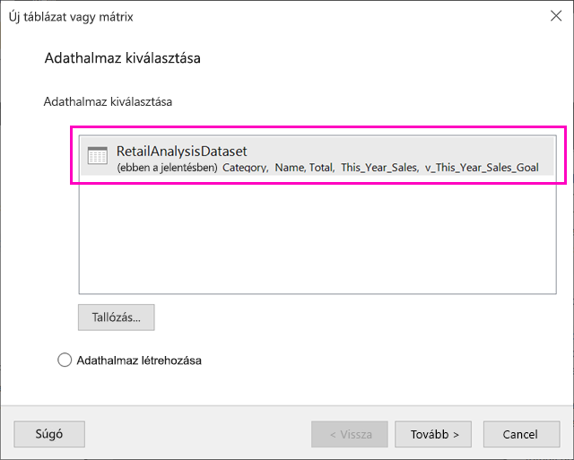

1. Egyszerű táblázat létrehozásához jelölje ki a kívánt mezőket a **Használható mezők** között. Egyszerre több mezőt is kijelölhet úgy, hogy kijelöli az elsőt, majd a Shift billentyűt lenyomva tartva kijelöli az utolsót.

    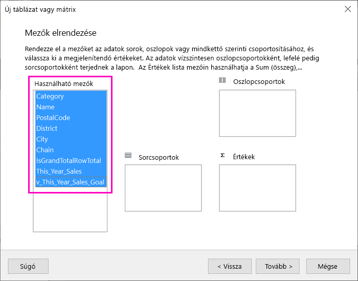

1. Húzza az adatmezőket az **Értékek** mezőbe > **Tovább**.

    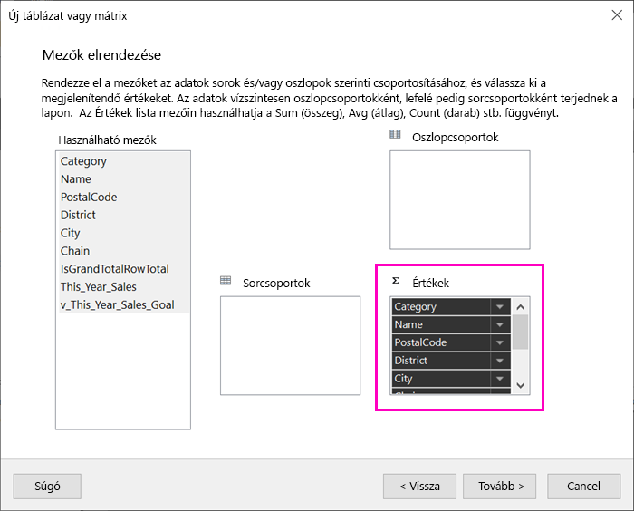

1. Válassza ki a kívánt elrendezési lehetőségeket > **Tovább**.

1. Válassza a **Befejezés** gombot.
    A táblázat Tervezési nézetben jelenik meg.

    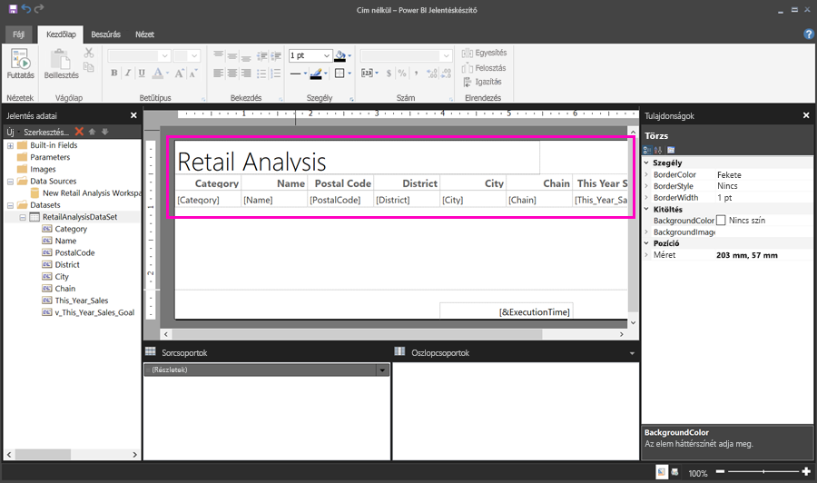

1. Válassza a **Kattintson ide cím megadásához.** lehetőséget, és adjon meg egy címet.

1. A jelentés előnézetéhez válassza a **Futtatás** lehetőséget.

    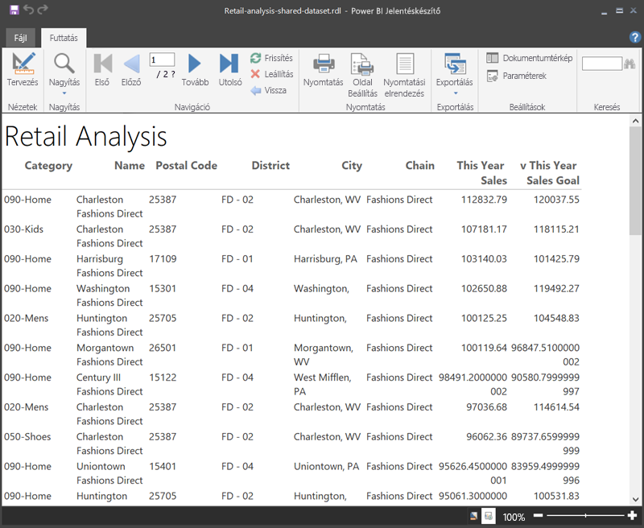

1. A **Nyomtatási elrendezés** lehetőséggel úgy tekintheti meg a jelentést, ahogyan nyomtatásban jelenik meg. 

    Ennek a jelentésnek az elrendezésén még dolgozni kell. 54 oldalból áll, mert az oszlopok és a margók miatt a táblázat szélessége két oldal.

    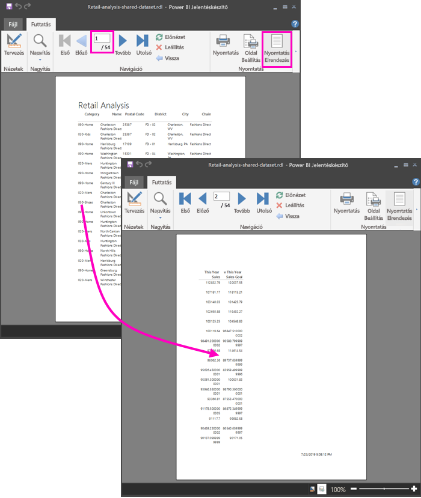

## A jelentés formázása

Többféle formázási lehetőséggel érhető el, hogy a táblázat elférjen egy oldalon. 

1. Az oldal margóit a Tulajdonságok panelen teheti keskenyebbé. Ha nem látja a Tulajdonságok panelt, jelölje be a **Nézet** menüszalagon a **Tulajdonságok** jelölőnégyzetet.

1. Ne a táblázatot vagy a címét, hanem a jelentést jelölje ki.
1. A **Jelentés tulajdonságai** panel **Oldal** területén bontsa ki a **Margók** elemet, és módosítsa mindegyiket a **2 cm** értékre.

    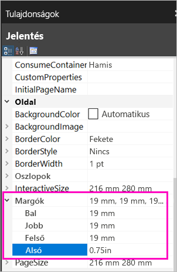

1. Az oszlopokat is karcsúbbá teheti. Jelölje ki az oszlophatárt, és húzza balra a jobb szélét.

    

1. Egy másik lehetőség a számértékek megfelelő formátumának ellenőrzése. Jelöljön ki egy számértéket tartalmazó cellát. 
    > [!TIP]
    > Egyszerre több cellát is formázhat, ha a többi cella kijelölése közben lenyomva tartja a Shift billentyűt.

    

1. A **Kezdőlap** menüszalag **Szám** szakaszában módosítsa az **Alapértelmezett** formátumot egy numerikus, például **Pénznem** formátumra.

    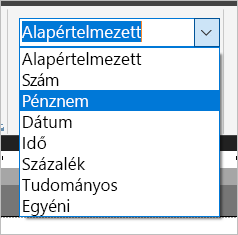

1. A **Helyőrző** stílust módosítsa **Mintaértékekre**, hogy a formázást a cellában láthassa. 

    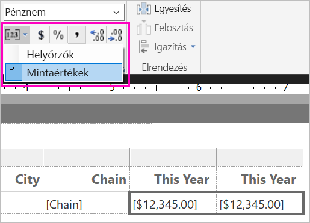

1. Ha megteheti, helytakarékosság céljából csökkentse a tizedesjegyek számát a **Szám** szakaszban.

### Üres oldalak kiiktatása

Előfordulhat, hogy bár a margókat és a táblázat oszlopait is keskenyebbre állította, minden második oldal üres lesz. Miért? A matematika ad magyarázatot. 

A beállított margóknak és a *jelentéstörzs* szélességének összesen kisebbnek kell lennie a jelentésformátum szélességénél.

Tegyük fel például, hogy a jelentés 210 mm × 297 mm formátumú, az oldalmargókat pedig 20 mm-re állította be. A két margó összege 40 mm, ezért a törzs szélessége legfeljebb 170 mm lehet.

1. Jelölje ki a jelentéstervező felület jobb szélét, és húzza addig, amíg a kívánt értéknél kisebbhez ér a vonalzón. 

    > [!TIP]
    > A **Törzs** tulajdonságaiban ezt pontosabban is beállíthatja. Válassza a **Szélesség** tulajdonságot a **Méret** területen.

    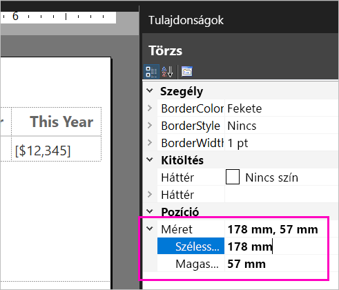

1. Válassza a **Futtatás** lehetőséget a jelentés előnézetének megtekintéséhez, és ügyeljen rá, hogy eltüntesse az üres oldalakat. A jelentés már csak 26 oldalból áll az eredeti 54 helyett. Sikerült!

    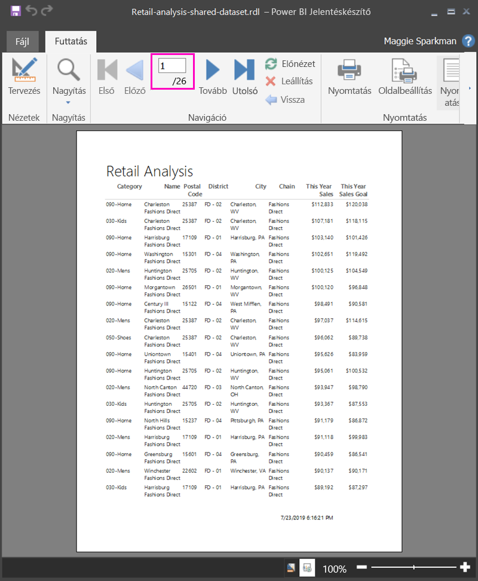

## Korlátozások és szempontok 

- Élő Analysis Services-kapcsolatot használó adathalmazok esetén közvetlenül csatlakozhat, ha megosztott adathalmaz helyett a mögöttes Analysis Services-kapcsolatot használja.
- A Meghirdetett vagy Minősített támogatási szinttel rendelkező adathalmazok megjelennek a rendelkezésre álló adathalmazok listájában, de nincsenek megjelölve. 

## Következő lépések

- [Mik a lapszámozott jelentések a Power BI Premiumban?](paginated-reports-report-builder-power-bi.md)