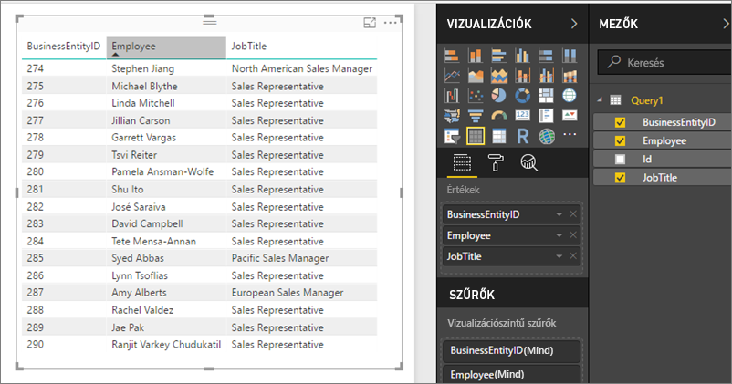

# Megosztott adatkészletek elérése OData-csatornákként a Microsoft Power BI jelentéskészítő kiszolgálóban
A megosztott adatkészletek a Power BI Desktopból OData-csatorna használatával érhetők el.

1. Az OData-csatorna URL-címével csatlakozhat az OData-forráshoz.
   
    
2. Miután lekérte az adatokat a Power BI Desktopban, a Lekérdezés-szerkesztőben módosíthatja azokat.
   
    
3. Most már használhatja az adatokat jelentések tervezésére.
   
    

Használja a **Speciális beállítások** lehetőséget, hogy bekapcsolhassa a nyitott típusú oszlopokat, és ennek megfelelően formázhassa az oszlopokat a Power Query bővítményben az igényei szerint.

További információ az [OData-csatornákhoz való csatlakozásról a Power BI Desktopban](../desktop-connect-odata.md).

Több kérdése van? [Kérdezze meg a Power BI-közösséget](https://community.powerbi.com/)

