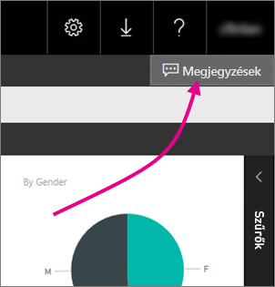
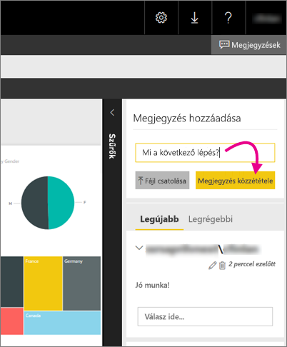

# Megjegyzések hozzáadása jelentéshez jelentéskészítő kiszolgálón – Power BI jelentéskészítő kiszolgáló

Megjegyzéseket adhat a jelentésekhez (beleértve a Power BI-jelentéseket is) a jelentéskészítő kiszolgálók webes portálján. A megjegyzések a jelentésben szerepelnek, és megfelelő engedélyekkel bárki láthatja a jelentés megjegyzéseit. Ennek részleteit a cikk későbbi, [Engedélyek](#permissions) című bekezdése tartalmazza.

## Megjegyzések hozzáadása vagy megtekintése

1. Nyisson meg egy tördelt vagy Power BI-jelentést egy jelentéskészítő kiszolgálón.
2. Válassza a jobb felső sarokban lévő **Megjegyzések** elemet.

    

    A Megjegyzések panelen láthatja a meglévő megjegyzéseket.
3. Írja be a megjegyzését, majd válassza a **Megjegyzés közzététele** lehetőséget.

    

    A megjegyzése a webes portál panelén látható, az összes korábbi megjegyzéssel együtt. Nem jelennek meg a jelentéssel a Power BI mobilalkalmazásokban.

   > [!TIP]
   > Tudta? [Feliratozhatja a Power BI-jelentéseket a Power BI mobilalkalmazásokban](../consumer/mobile/mobile-annotate-and-share-a-tile-from-the-mobile-apps.md), és megoszthatja a feliratozott jelentéseket másokkal.

## Engedélyek

Az engedélyeitől függően a következők vonatkozhatnak Önre:

* Nem láthatja a megjegyzéseket.
* Láthatja az összes megjegyzést, és saját megjegyzéseket tehet közzé, szerkeszthet és törölhet.
* Láthatja az összes megjegyzést; saját megjegyzéseket tehet közzé, szerkeszthet és törölhet; és törölheti mások megjegyzéseit.

## Következő lépések
* [Mi a Power BI jelentéskészítő kiszolgáló?](get-started.md)  

További kérdései vannak? [Kérdezze meg a Power BI közösségét](https://community.powerbi.com/)

