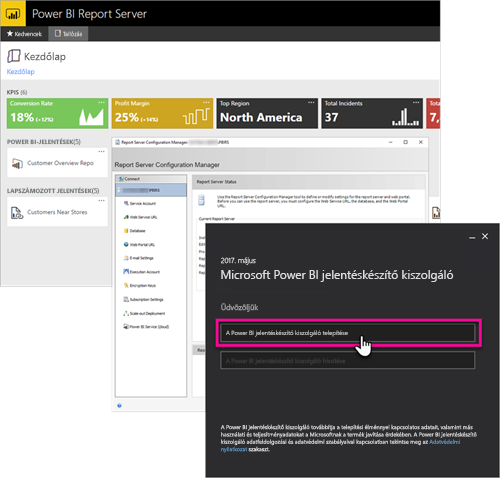

# Rendszergazdai áttekintés, Power BI jelentéskészítő kiszolgáló
Ez a cikk a Power BI jelentéskészítő kiszolgáló rendszergazdai áttekintését tartalmazza. A kiszolgáló a Power BI-, mobil- és többoldalas jelentések helyszíni tárolására és kezelésére szolgál. A cikk bemutatja a Power BI jelentéskészítő kiszolgáló megtervezésének, üzembe helyezésének és kezelésének alapelveit, és további információkra mutató hivatkozásokat is tartalmaz.

## Telepítés és migráció
A használatának megkezdéséhez telepítenie kell a Microsoft Power BI jelentéskészítő kiszolgálót. A feladat elvégzéséhez több cikkben is elérhető magyarázat.

Mielőtt elkezdené a Power BI jelentéskészítő kiszolgáló telepítését, vagy az arra való frissítést vagy migrálást, vessen egy pillantást a jelentéskészítő kiszolgáló [rendszerkövetelményeire](system-requirements.md).

### Telepítés
Ha egy új Power BI jelentéskészítő kiszolgálót helyez üzembe, ehhez a következő dokumentum nyújt segítséget. 

[A Power BI jelentéskészítő kiszolgáló telepítése](install-report-server.md)

### Migráció
Az SQL Server Reporting Serviceshez nem áll rendelkezésre helyben végzett verzióváltás. Ha egy meglévő SQL Server Reporting Services-példánnyal rendelkezik, amelyet Power BI jelentéskészítő kiszolgálóvá szeretne átalakítani, akkor azt migrálnia kell. Migrációra más okokból is szükség lehet. További részletekért tekintse át a migrációra vonatkozó dokumentumot.

[Telepített jelentéskészítő kiszolgáló migrálása](migrate-report-server.md)

## A jelentéskészítő kiszolgáló beállítása
A jelentéskészítő kiszolgáló konfigurálásakor számos lehetőség közül választhat. Használni fog SSL-t? E-mail-kiszolgálót konfigurál? Szeretne a Power BI szolgáltatással való integrációt létrehozni a vizualizációk rögzítéséhez?

A beállítások nagy részét a jelentéskészítő kiszolgáló konfigurációkezelőjében kell elvégeznie. További részletekért lásd a [konfigurációkezelő](https://docs.microsoft.com/sql/reporting-services/install-windows/reporting-services-configuration-manager-native-mode) dokumentációját.

## Biztonság
A biztonság és a védelem minden cég számára fontos. A hitelesítésről, engedélyezésről, szerepkörökről és engedélyekről a [biztonsági](https://docs.microsoft.com/sql/reporting-services/security/reporting-services-security-and-protection) dokumentációban olvashat.

## Következő lépések
[A Power BI jelentéskészítő kiszolgáló telepítése](install-report-server.md)  
[A jelentéskészítő kiszolgáló termékkulcsának megkeresése](find-product-key.md)  
[A Power BI jelentéskészítő kiszolgálóhoz optimalizált Power BI Desktop telepítése](install-powerbi-desktop.md)  
[A Jelentéskészítő letöltése](https://www.microsoft.com/download/details.aspx?id=53613)  
[Az SQL Server Data Tools (SSDT) letöltése](http://go.microsoft.com/fwlink/?LinkID=616714)

További kérdései vannak? [Kérdezze meg a Power BI közösségét](https://community.powerbi.com/)

