# <a name="configure-power-bi-report-server-with-azure-application-proxy"></a>A Power BI jelentéskészítő kiszolgáló konfigurálása az Azure-alkalmazásproxyval

Ez a cikk azt ismerteti, hogy csatlakozhat a Power BI jelentéskészítő kiszolgálóhoz és a 2016-os vagy újabb SQL Server Reporting Serviceshez (SSRS) az Azure Active Directory-alkalmazásproxy használatával. Ezzel az integrációval a vállalati hálózaton kívül tartózkodó felhasználók hozzáférhetnek a Power BI jelentéskészítő kiszolgálóhoz és a Reporting Services-jelentésekhez az ügyfélböngészőből, a védelmükről pedig az Azure Active Directory (AD) gondoskodik. További információk a helyszíni alkalmazások [Azure Active Directory-alkalmazásproxyval](https://docs.microsoft.com/azure/active-directory/manage-apps/application-proxy) történő távoli elérésével kapcsolatban.

## <a name="environment-details"></a>Környezet részletei

Az általunk létrehozott példában az alábbi értékeket használtuk. 

- Tartomány: umacontoso.com
- Power BI jelentéskészítő kiszolgáló: PBIRSAZUREAPP.umacontoso.com
- SQL Server-adatforrás: SQLSERVERAZURE.umacontoso.com

## <a name="configure-power-bi-report-server"></a>A Power BI jelentéskészítő kiszolgáló konfigurálása

A Power BI jelentéskészítő kiszolgáló (Azure-beli virtuális gépen történő) telepítése után konfigurálja a Power BI jelentéskészítő kiszolgáló webszolgáltatásának és webes portáljának URL-címeit az alábbi lépések segítségével:

1. Hozzon létre bejövő és kimenő szabályokat a virtuális gép tűzfalán a 80-as porthoz (ha https URL-cím van konfigurálva, a 443-as porthoz). Továbbá hozzon létre bejövő és kimenő szabályokat az Azure-beli virtuális géphez az Azure Portalon a TCP-protokollhoz a 80-as porton.
2. A környezetben lévő virtuális géphez konfigurált DNS-név a `pbirsazureapp.eastus.cloudapp.azure.com`.
3. Konfigurálja a Power BI jelentéskészítő kiszolgáló külső webszolgáltatásának és webes portáljának URL-címét a **Speciális** > **Hozzáadás** gomb > **Gazdagép fejlécnevének kiválasztása** lehetőség kiválasztásával, majd a gazdagép nevének (DNS-nevének) hozzáadásával az alább ismertetett módon.

    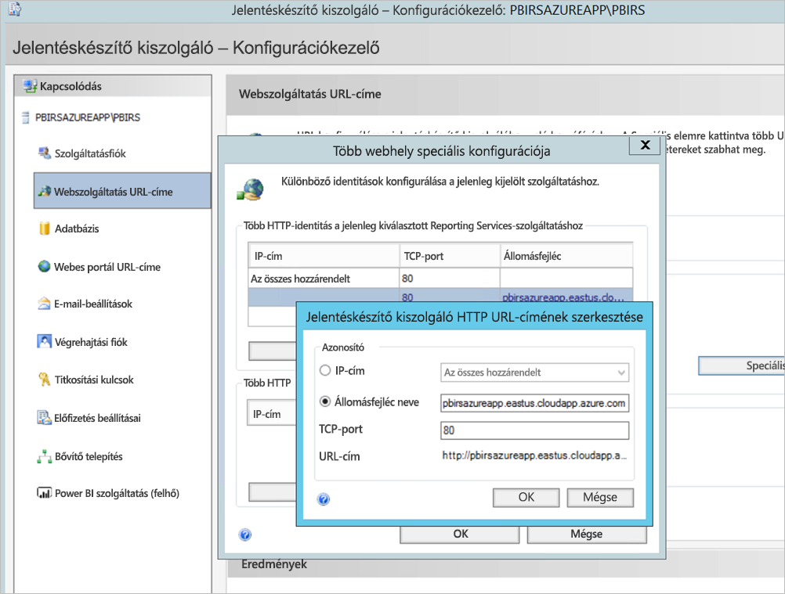

1. Végrehajtottuk az előző lépést a webszolgáltatás és a webes portál esetében is, és regisztráltuk az URL-címeket a jelentéskészítő kiszolgáló Konfigurációkezelőjében:

    - `https://pbirsazureapp.eastus.cloudapp.azure.com/ReportServer`
    - `https://pbirsazureapp.eastus.cloudapp.azure.com/Reports`

2. Az Azure Portal hálózatkezelés szakaszában két IP-cím jelenik meg a virtuális géphez 

    - **Nyilvános IP-cím**. 
    - **Magánhálózati IP-cím**. 
    
    A nyilvános IP-cím a virtuális gépen kívülről történő hozzáférésre szolgál.

3. Ezért hozzáadtuk a gazdafájl-bejegyzést a virtuális gépen (a Power BI jelentéskészítő kiszolgálón), hogy tartalmazza a nyilvános IP-címet és a `pbirsazureapp.eastus.cloudapp.azure.com` gazdanevet.
4. Vegye figyelembe, hogy a virtuális gép újraindításakor a dinamikus IP-cím módosulhat, és előfordulhat, hogy újból hozzá kell adnia a megfelelő IP-címet a gazdafájlban. Ennek elkerüléséhez állítsa a nyilvános IP-címet statikusra az Azure Portalon.
5. A fent említett módosítások végrehajtása után a webszolgáltatás és a webes portál URL-címeinek elérhetőnek kell lenniük.
6. A `https://pbirsazureapp.eastus.cloudapp.azure.com/ReportServer` URL-cím kiszolgálón való megnyitásakor a rendszer háromszor felkéri a hitelesítő adatok megadására, és megjelenik egy üres képernyő.
7. Adja hozzá a következő, beállításjegyzékbeli bejegyzést:

    `HKEY\_LOCAL\_MACHINE \SYSTEM\CurrentControlset\Control \Lsa\ MSV1\_0` beállításkulcs

1. Adjon hozzá egy új, többsztringes `BackConnectionHostNames` értéket, majd adja meg a `pbirsazureapp.eastus.cloudapp.azure.com` gazdanevet.

Ezt követően a kiszolgálón lévő URL-címek is elérhetők.

## <a name="configure-power-bi-report-server-to-work-with-kerberos"></a>A Power BI jelentéskészítő kiszolgáló konfigurálása a Kerberoshoz

### <a name="1-configure-the-authentication-type"></a>1. A hitelesítés típusának konfigurálása

A korlátozott Kerberos-hitelesítés engedélyezéséhez konfigurálni kell a jelentéskészítő kiszolgáló hitelesítési típusát. A konfigurálást az **rsreportserver.config** fájlban teheti meg.

Az rsreportserver.config fájlban keresse meg az **Authentication/AuthenticationTypes** szakaszt.

Győződjön meg arról, hogy az RSWindowsNegotiate megjelenik, és a hitelesítési típusok listájában az első elem. A képernyőnek az alábbihoz hasonlóan kell kinéznie.

```
<AuthenticationTypes>

    <RSWindowsNegotiate/>

</AuthenticationTypes>
```

Ha módosítania kell a konfigurációs fájlt, **állítsa le és indítsa újra a jelentéskészítő kiszolgáló** szolgáltatást a jelentéskészítő kiszolgáló Konfigurációkezelőjéből annak biztosításához, hogy a módosítások érvénybe lépnek.

### <a name="2-register-service-principal-names-spns"></a>2. Egyszerű szolgáltatásnevek (SPN-ek) regisztrálása

Nyissa meg a parancssort rendszergazdaként, és hajtsa végre az alábbi lépéseket.

Regisztrálja az alábbi SPN-eket a **Power BI jelentéskészítő kiszolgáló szolgáltatásfiókjában** az alábbi parancsok használatával

```
setspn -s http/ Netbios name\_of\_Power BI Report Server\_server<space> Power BI Report Server\_ServiceAccount

setspn -s http/ FQDN\_of Power BI Report Server\_server<space> Power BI Report Server\_ServiceAccount
```

Regisztrálja az alábbi SPN-eket az SQL Server-szolgáltatásfiókban az alábbi parancsok használatával (az SQL Server alapértelmezett példánya esetén):

```
setspn -s MSSQLSVC/FQDN\_of\_SQL\_Server: 1433 (PortNumber) <SQL service service account>

setspn -s MSSQLSVC/FQDN\_of\_SQL\_Server<SQL service service account>
```

### <a name="3-configure-delegation-settings"></a>3. A delegálási beállítások konfigurálása

Konfigurálja a delegálási beállításokat a jelentéskészítő kiszolgáló szolgáltatásfiókjában.

1. Nyissa meg az Active Directory – felhasználók és számítógépek modult.
2. Az Active Directory – felhasználók és számítógépek modulban nyissa meg a jelentéskészítő kiszolgáló szolgáltatásfiókjának Tulajdonságok szakaszát.
3. A korlátozott delegálást protokollváltással kell konfigurálni. Korlátozott delegálás esetén explicit módon kell meghatározni, hogy melyik szolgáltatásokhoz szeretne delegálni.
4. Kattintson a jobb gombbal a **jelentéskészítő kiszolgáló szolgáltatásfiókjára**, majd válassza a **Tulajdonságok** lehetőséget.
5. Válassza a **Delegálás** lapot.
6. Válassza **A számítógépen csak a megadott szolgáltatások delegálhatók** lehetőséget.
7. Válassza a **Bármely hitelesítési protokoll** lehetőséget.
8. **A fiók az alábbi szolgáltatásokhoz használhat delegált hitelesítő adatokat:** szakaszban kattintson a **Hozzáadás** elemre.
9. Az új párbeszédpanelben válassza a **Felhasználók vagy számítógépek** elemet.
10. Adja meg az **SQL Server szolgáltatás szolgáltatásfiókját**, majd kattintson az **OK** gombra.

    A szolgáltatásfiók neve az MSSQLSVC sztringgel kezdődik.

1. Adja hozzá az SPN-eket.
2. Válassza az **OK** lehetőséget. Ekkor az SPN-nek meg kell jelennie a listában.

E lépések segítségével úgy konfigurálhatja a Power BI jelentéskészítő kiszolgálót, hogy működjön a Kerberos hitelesítési mechanizmusával, és működésre bírja az adatforrás tesztkapcsolatát a helyi gépen.

## <a name="configure-azure-application-proxy-connector"></a>Az Azure-alkalmazásproxy összekötőjének konfigurálása

Tekintse meg [az alkalmazásproxy összekötőjével kapcsolatos konfigurációt](https://docs.microsoft.com/azure/active-directory/manage-apps/application-proxy-add-on-premises-application#add-an-on-premises-app-to-azure-ad) ismertető cikket

Bár a Power BI jelentéskészítő kiszolgálón telepítettük az alkalmazásproxy összekötőjét, konfigurálhatja azt egy másik kiszolgálón is, ha szeretne meggyőződni arról, hogy a delegálás megfelelően lett beállítva.

### <a name="ensure-the-connector-is-trusted-for-delegation"></a>Győződjön meg arról, hogy az összekötő megbízható a delegálás céljából

Győződjön meg arról, hogy az összekötő megbízható a jelentéskészítő kiszolgáló alkalmazáskészlet-fiókjához hozzáadott SPN-nek való delegálás céljából.

Konfigurálja a Kerberos általi korlátozott delegálást (KCD) úgy, hogy az Azure AD-alkalmazásproxy szolgáltatás képes legyen felhasználói identitásokat delegálni a jelentéskészítő kiszolgáló alkalmazáskészlet-fiókjába. Konfigurálja a KCD-t úgy, hogy engedélyezze az alkalmazásproxy összekötője számára a Kerberos-jegyek lekérését az Azure AD által hitelesített felhasználók számára. Ezt követően a kiszolgáló továbbítja a környezetet a célalkalmazásnak, illetve ebben az esetben a Power BI jelentéskészítő kiszolgálónak.

A KCD konfigurálásához ismételje meg az alábbi lépéseket minden összekötőgép esetében:

1. Jelentkezzen be egy tartományvezérlőre tartományi rendszergazdaként, majd nyissa meg az **Active Directory – felhasználók és számítógépek** modult.
2. Keresse meg a számítógépet, amelyen az összekötő fut.
3. Kattintson duplán a számítógépre, majd válassza a **Delegálás** lapot.
4. Állítsa a delegálási beállításokat **A számítógépen csak a megadott szolgáltatások delegálhatók** értékre. Ezután válassza a **Bármely hitelesítési protokoll használatával** lehetőséget.
5. Válassza a **Hozzáadás**, majd a **Felhasználók vagy számítógépek** lehetőséget.
6. Adja meg a Power BI jelentéskészítő kiszolgálóhoz használt szolgáltatásfiókot. Ez az a fiók, amelyhez hozzáadta az SPN-t a jelentéskészítő kiszolgáló konfigurációjában.
7. Kattintson az **OK** gombra. 
8. A módosítások mentéséhez kattintson újra az **OK** gombra.

## <a name="publish-through-azure-ad-application-proxy"></a>Közzététel az Azure AD-alkalmazásproxyn keresztül

Most már készen áll az Azure AD-alkalmazásproxy konfigurálására.

Tegye közzé a Power BI jelentéskészítő kiszolgálót az alkalmazásproxyn keresztül az alábbi beállításokkal. Az alkalmazások alkalmazásproxyval történő közzétételével kapcsolatos részletes utasításokért tekintse meg az [Alkalmazások közzététele az Azure AD-alkalmazásproxyval](https://docs.microsoft.com/azure/active-directory/manage-apps/application-proxy-add-on-premises-application#add-an-on-premises-app-to-azure-ad) szakaszt.

- **Belső URL-cím**: Adja meg a jelentéskészítő kiszolgáló URL-címét, amelyet az összekötő elérhet a vállalati hálózaton. Győződjön meg arról, hogy az URL-cím elérhető arról a kiszolgálóról, amelyre az összekötő telepítve van. Az ajánlott eljárásnak megfelelően legfelső szintű tartományt használjon (például a `https://servername/` tartományt) az alkalmazásproxyval közzétett alútvonalakkal kapcsolatos problémák elkerülése érdekében. Például használja a `https://servername/` URL-címet a `https://servername/reports/` vagy a `https://servername/reportserver/` helyett. A környezetet a `https://pbirsazureapp.eastus.cloudapp.azure.com/` URL-címmel konfiguráltuk.

    > [!NOTE]
    > Javasoljuk, hogy a jelentéskészítő kiszolgálóhoz való csatlakozáshoz biztonságos HTTPS-kapcsolatot használjon. Útmutatásért tekintse meg [az SSL-kapcsolatok natív módú jelentéskészítő kiszolgálón való konfigurálását](https://docs.microsoft.com/sql/reporting-services/security/configure-ssl-connections-on-a-native-mode-report-server?view=sql-server-2017) ismertető szakaszt.

- **Külső URL-cím**: Adja meg a nyilvános URL-címet, amelyhez a Power BI mobilalkalmazás csatlakozni fog. Ha egyéni tartományt használ, akkor például így nézhet ki: `https://reports.contoso.com`. Egyéni tartomány használatához töltse fel a tartomány tanúsítványát, és irányítson át egy DNS-rekordot az alkalmazás alapértelmezett msappproxy.net tartományára. A részletes lépésekért tekintse meg [az egyéni tartományok Azure AD-alkalmazásproxyban történő használatát](https://docs.microsoft.com/azure/active-directory/manage-apps/application-proxy-configure-custom-domain) ismertető szakaszt.

A környezet külső URL-címét a `https://pbirsazureapp-umacontoso2410.msappproxy.net/` URL-címként konfiguráltuk.

- **Előhitelesítési módszer**: Azure Active Directory.
- **Összekötőcsoport:** Az alapértelmezett érték.

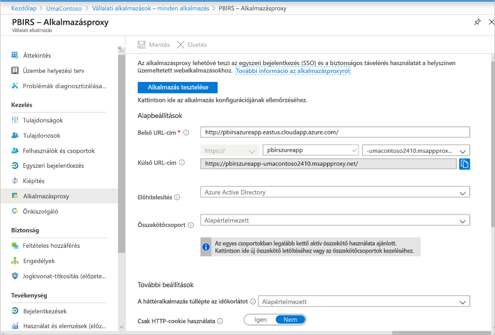

A **További beállítások** szakaszban nem végeztünk módosítást. Ez a szakasz az alapértelmezett beállításokra vannak konfigurálva:


### <a name="configure-single-sign-on"></a>Egyszeri bejelentkezés konfigurálása

Az alkalmazás közzététele után konfigurálja az egyszeri bejelentkezési beállításokat az alábbi lépések segítségével:

1. A portálon az alkalmazás lapján válassza az **Egyszeri bejelentkezés** lehetőséget.
2. Az **Egyszeri bejelentkezési mód** esetében válassza az **Integrált Windows-hitelesítés** lehetőséget.
3. Állítsa a **Belső alkalmazás egyszerű szolgáltatásneve** értékét a korábban beállított értékre. Ezt az értéket az alábbi lépések használatával azonosíthatja:

    - Próbáljon meg futtatni egy jelentést, vagy létesítsen tesztkapcsolatot az adatforrással, hogy a Kerberos-jegyek létrejöjjenek.
    - A jelentés/tesztkapcsolat sikeres végrehajtása után nyissa meg a parancssort, és futtassa a `klist` parancsot. Az eredményeket tartalmazó szakaszban található egy `http/` SPN-nel rendelkező jegy. Ha ez megegyezik a Power BI jelentéskészítő kiszolgálóval konfigurált SPN-nel, ebben a szakaszban használja azt az SPN-t.

1. Válassza ki az összekötő **Delegált bejelentkezési identitását** a felhasználók nevében történő használathoz. További információkért tekintse meg [a különböző helyszíni és felhőidentitások használatát](https://docs.microsoft.com/azure/active-directory/manage-apps/application-proxy-configure-single-sign-on-with-kcd#working-with-different-on-premises-and-cloud-identities) ismertető szakaszt.

    Javasoljuk, hogy a felhasználó egyszerű nevét használja. A mintában úgy konfiguráltuk, hogy működjön a **Felhasználó egyszerű neve** beállítással:

    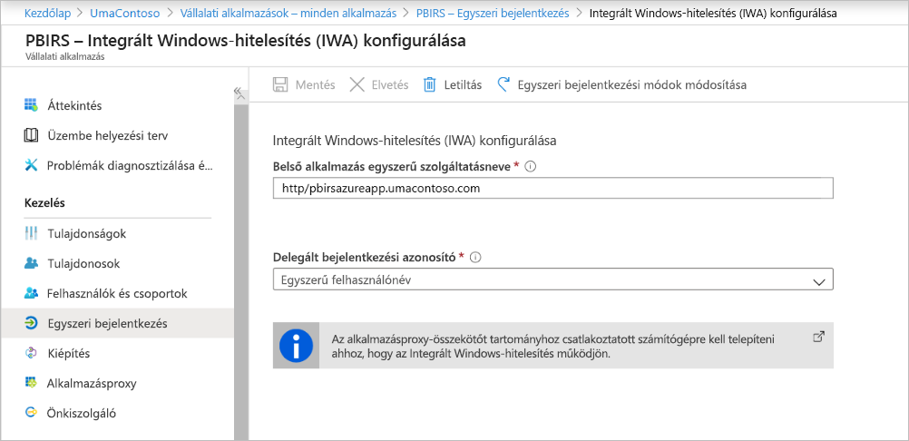

1. Kattintson a **Mentés** gombra a módosítások mentéséhez.

### <a name="finish-setting-up-your-application"></a>Az alkalmazás beállításának befejezése

Az alkalmazás beállításának befejezéséhez lépjen a **Felhasználók és csoportok** szakaszra, és rendelje hozzá a felhasználókat, akik hozzáférhetnek az alkalmazáshoz.

1. Konfigurálja a Power BI jelentéskészítő kiszolgáló alkalmazás Alkalmazásregisztrációja **Hitelesítés** szakaszát az alábbiak szerint az **Átirányítási URL-címek** és a **Speciális beállítások** esetében:

    - Hozzon létre egy új Átirányítási URL-címet, és konfigurálja a **Típus** = **Webes** és **Átirányítási URI** = `https://pbirsazureapp-umacontoso2410.msappproxy.net/` értékekkel
    - A **Speciális beállítások** szakaszban konfigurálja a **Kijelentkezési URL-címet** a következőre: `https://pbirsazureapp-umacontoso2410.msappproxy.net/?Appproxy=logout`

    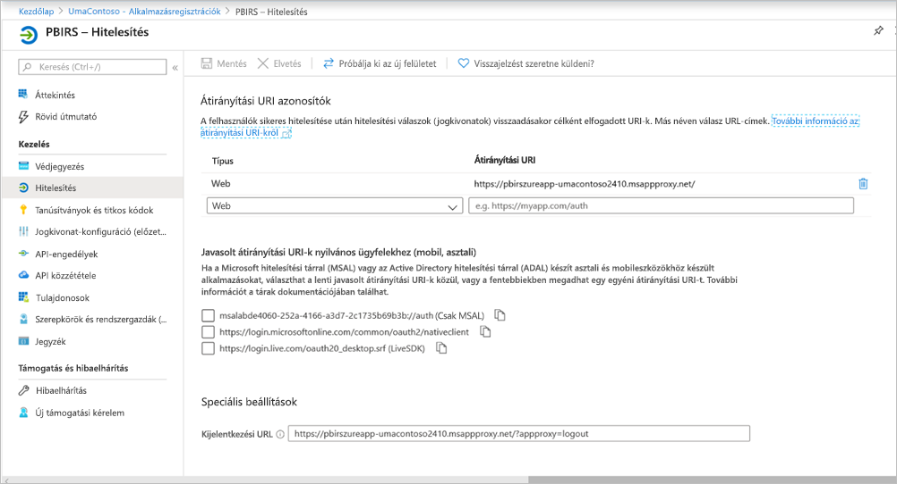

1. Folytassa a Power BI jelentéskészítő kiszolgáló alkalmazás Alkalmazásregisztrációja **Hitelesítés** szakaszának konfigurálását az alábbiak szerint az **Implicit engedély**, az **Alapértelmezett ügyféltípus** és a **Támogatott fióktípusok** esetében:

    - Állítsa az **Implicit engedélyt** **Azonosító jogkivonatok** értékre.
    - Állítsa az **Alapértelmezett ügyféltípust** **Nem** értékre.
    - Állítsa a **Támogatott fióktípusokat** **Csak az ebben a szervezeti címtárban található fiókok (csak az UmaContoso – egy bérlő)** értékre.

    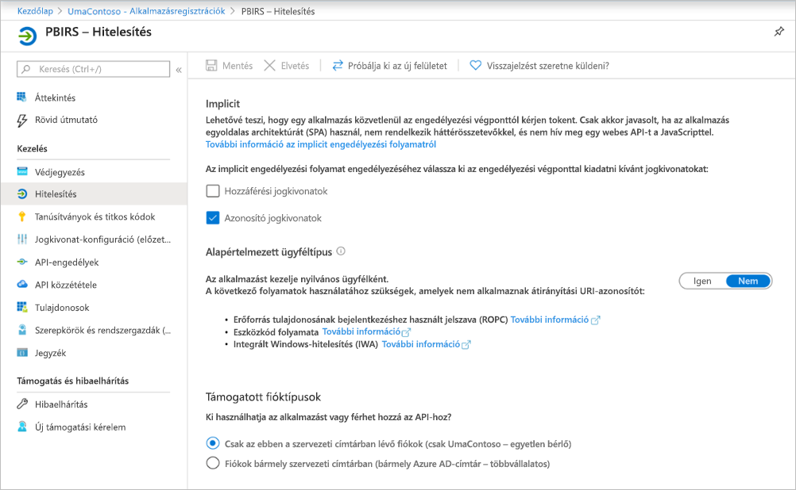

1. Ha beállította az egyszeri bejelentkezést, és a `https://pbirsazureapp-umacontoso2410.msappproxy.net` URL-cím is működik, meg kell győződnie arról, hogy a bejelentkezéshez használt fiók szinkronizálva van azzal a fiókkal, amely számára a Power BI jelentéskészítő kiszolgáló biztosítja az engedélyeket.

1. Először konfigurálja a bejelentkezéshez használni kívánt egyéni tartományt, majd győződjön meg arról, hogy az ellenőrizve van
2. Ebben az esetben az umacontoso.com nevű tartományt vásároltuk meg, és konfiguráltuk a DNS-zónákat a bejegyzésekkel. Megpróbálkozhat az `onmicrosoft.com` tartomány használatával, és szinkronizálhatja a helyszíni AD-vel.

    Tekintse meg az [Oktatóanyag: Meglévő egyéni DNS-név leképezése az Azure App Service-hez](https://docs.microsoft.com/Azure/app-service/app-service-web-tutorial-custom-domain) cikket.

1. Az egyéni tartomány DNS-bejegyzésének sikeres ellenőrzése után a portálon lévő tartománynak megfelelő állapot **Ellenőrzöttként** jelenik meg.

    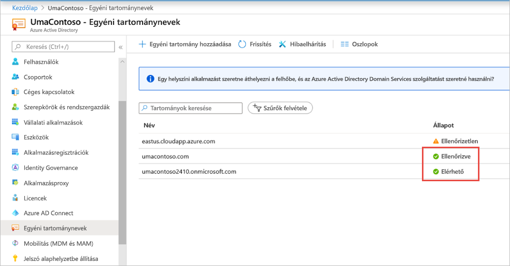

1. Telepítse a Microsoft Azure AD Connectet a tartományvezérlőre, és konfigurálja az Azure AD-vel való szinkronizáláshoz.

    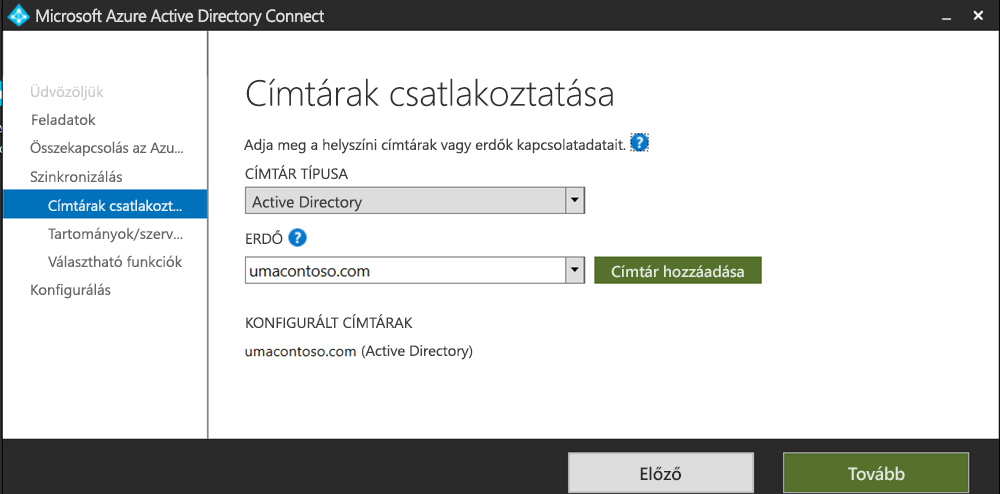

1. Ha az Azure AD és a helyszíni AD közötti szinkronizálás megtörtént, az alábbi állapot jelenik meg az Azure Portalon:

    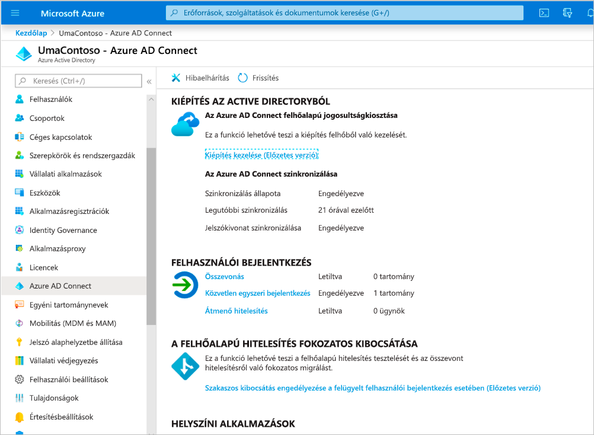

1. Továbbá, ha a szinkronizálás sikeres volt, nyissa meg az Active Directory – tartományok és megbízhatósági kapcsolatok szakaszt a Tartományvezérlőn. Kattintson a jobb gombbal az Active Directory – tartományok és megbízhatósági kapcsolatok > Tulajdonságok lehetőségre, és adja hozzá az egyszerű felhasználónevet. A környezetünkben a `umacontoso.com` a megvásárolt egyéni tartomány.

1. Az egyszerű felhasználónév hozzáadása után a segítségével konfigurálhatja a felhasználói fiókokat az Azure AD-fiók és a helyszíni AD-fiók összekapcsolása érdekében, valamint azért, hogy a rendszer felismerje a jogkivonatot a hitelesítés során.

    Az előző lépés elvégzése után az AD-tartománynév megjelenik a **Felhasználói bejelentkezési név** szakasz legördülő listájában. Konfigurálja a felhasználónevet, majd válassza ki a tartományt a legördülő listából az AD-felhasználói tulajdonságok **Felhasználói bejelentkezési név** szakaszában.

    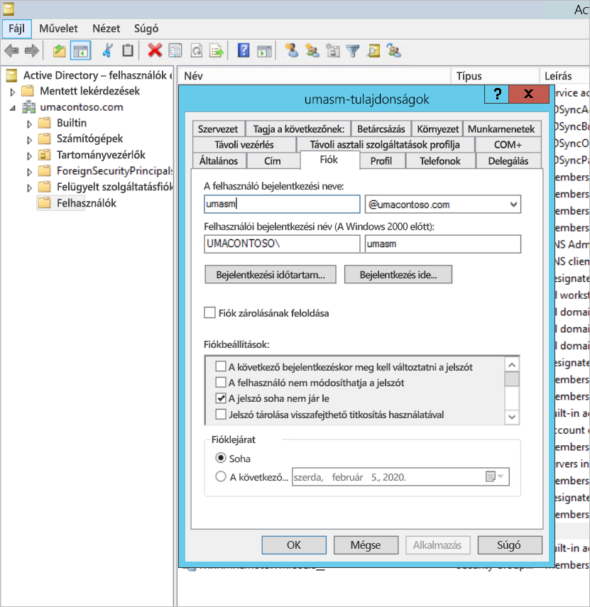

1. Ha az AD-szinkronizálás sikeres volt, az Azure Portalon az alkalmazás **Felhasználók és csoportok** szakaszában megjelenik a helyszíni AD-fiók. A fiók forrása a **Windows Server AD**.
2. A `umasm@umacontoso.com` e-mail-címmel való bejelentkezés megfelel a `Umacontoso\umasm` windowsos hitelesítő adatok használatának.

    Az előző lépések akkor alkalmazhatók, ha konfigurálta a helyszíni AD-t, és tervezi az Azure AD-vel való szinkronizálását.

    Sikeres bejelentkezés a fenti lépések implementálása után:

    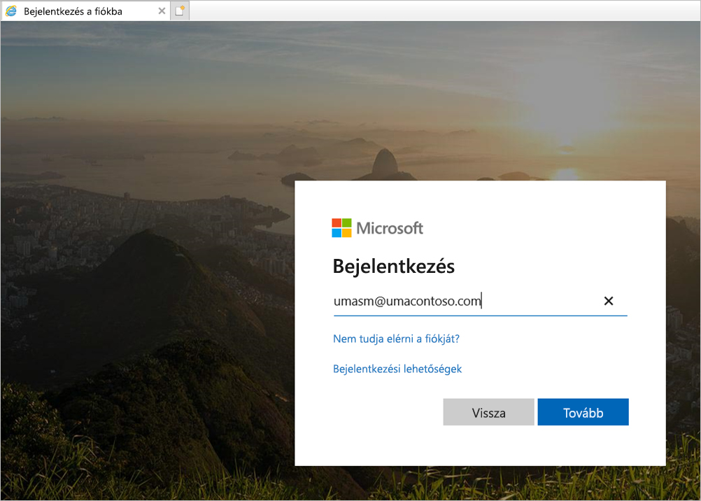

    Majd a webes portál képernyője:

    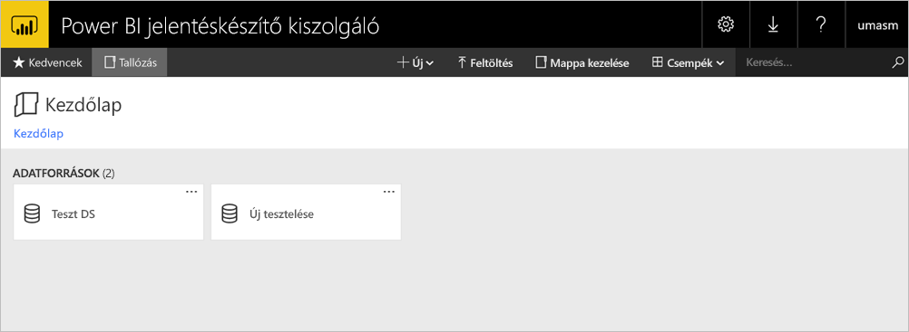

    Továbbá az adatforrással sikeresen létesített tesztkapcsolat a Kerberos mint hitelesítő használatával:

    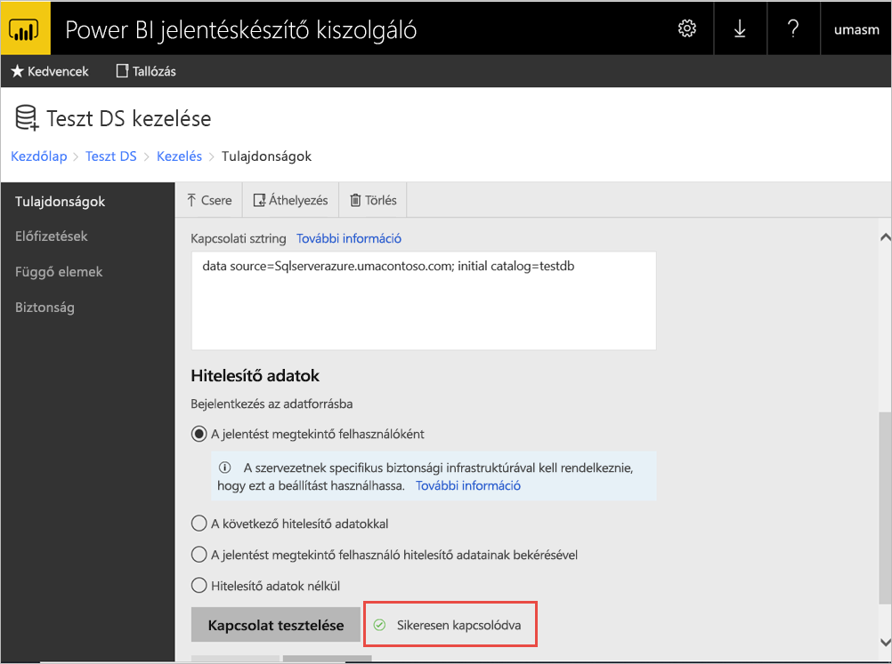

## <a name="access-from-power-bi-mobile-apps"></a>Hozzáférés Power BI-mobilalkalmazásokból

### <a name="configure-the-application-registration"></a>Az alkalmazásregisztráció konfigurálása

Ahhoz, hogy a Power BI-mobilalkalmazás képes legyen csatlakozni és hozzáférni a Power BI jelentéskészítő kiszolgálóhoz, konfigurálnia kell azt az alkalmazásregisztrációt, amelyet a rendszer automatikusan létrehozott az Ön számára a cikk korábbi, [Azure AD-alkalmazásproxyn keresztüli közzétételt](#publish-through-azure-ad-application-proxy) ismertető részében.

1. Az Azure Active Directory **Áttekintés** lapján válassza az **Alkalmazásregisztrációk** lehetőséget.
2. A **Minden alkalmazás** lapon keresse meg a Power BI jelentéskészítő kiszolgálóhoz létrehozott alkalmazást.
3. Válassza ki az alkalmazást, majd válassza a **Hitelesítés** lehetőséget.
4. Adja hozzá az alábbi Átirányítási URI-kat a használt platformtól függően.

    Ha a Power BI Mobile alkalmazást **iOS** rendszerre konfigurálja, adja hozzá az alábbi Nyilvános ügyfél (mobil és asztali) típusú Átirányítási URI-kat:

    - `msauth://code/mspbi-adal%3a%2f%2fcom.microsoft.powerbimobile`
    - `msauth://code/mspbi-adalms%3a%2f%2fcom.microsoft.powerbimobilems`
    - `mspbi-adal://com.microsoft.powerbimobile`
    - `mspbi-adalms://com.microsoft.powerbimobilems`

    Ha a Power BI Mobile alkalmazást **Android** rendszerre konfigurálja, adja hozzá az alábbi Nyilvános ügyfél (mobil és asztali) típusú Átirányítási URI-kat:

    - `urn:ietf:wg:oauth:2.0:oob`
    - `mspbi-adal://com.microsoft.powerbimobile`
    - `msauth://com.microsoft.powerbim/g79ekQEgXBL5foHfTlO2TPawrbI%3D`
    - `msauth://com.microsoft.powerbim/izba1HXNWrSmQ7ZvMXgqeZPtNEU%3D`

    Ha a Power BI Mobile alkalmazást iOS és Android rendszerre is konfigurálja, adja hozzá az alábbi Nyilvános ügyfél (mobil és asztali) típusú Átirányítási URI-kat az iOS rendszerhez konfigurált Átirányítási URI-k listájához:

    - `urn:ietf:wg:oauth:2.0:oob`

    > [!IMPORTANT]
    > Ahhoz, hogy az alkalmazás megfelelően működjön, hozzá kell adni az Átirányítási URI-kat.

### <a name="connect-from-the-power-bi-mobile-apps"></a>Csatlakozás a Power BI-mobilalkalmazásokból

1. A Power BI-mobilalkalmazásban csatlakozzon a jelentéskészítő kiszolgáló példányához. A csatlakozáshoz adja meg az alkalmazásproxyval közzétett alkalmazás **Külső URL-címét**.
2. Kattintson a **Csatlakozás** gombra. A rendszer átirányítja az Azure Active Directory bejelentkezési oldalára.
3. Adjon meg érvényes hitelesítő adatokat a felhasználóhoz, és válassza a **Bejelentkezés** lehetőséget. Megjelennek a jelentéskészítő kiszolgáló elemei.

## <a name="next-steps"></a>Következő lépések

[A Power BI Mobile távoli elérésének engedélyezése Azure AD-alkalmazásproxyval](https://docs.microsoft.com/azure/active-directory/manage-apps/application-proxy-integrate-with-power-bi)

További kérdései vannak? [Kérdezze meg a Power BI közösségét](https://community.powerbi.com/)

                