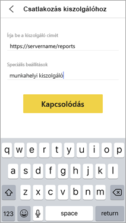

# A Power BI iOS-es mobilalkalmazás jelentéskészítő kiszolgálóhoz való távoli hozzáférésének konfigurálása

Ebben a cikkben megismerheti, hogyan használható a cég MDM eszköze ahhoz, hogy a Power BI iOS-es mobilalkalmazásának jelentéskészítő kiszolgálóhoz való hozzáférését konfigurálja. Ehhez az informatikai rendszergazdának létre kell hoznia egy alkalmazáskonfigurálási szabályzatot a megfelelő információkkal, amelyet le lehet küldeni az alkalmazásba. 

 Ha a jelentéskészítő kiszolgálóval való kapcsolat már konfigurálva van, a Power BI iOS-es mobilalkalmazásának felhasználói egyszerűbben csatlakozhatnak a cég jelentéskiszolgálójához. 

## Az alkalmazáskonfigurálási szabályzat létrehozása az MDM eszközzel 

Rendszergazdaként az alábbi lépéseket kell elvégeznie a Microsoft Intune-ban, hogy létrehozhassa az alkalmazáskonfigurálási szabályzatot. Más MDM-eszközökben eltérhetnek azok a lépések, amelyek az alkalmazáskonfigurálási szabályzat létrehozásához szükségesek. 

1. Csatlakoztassa az MDM eszközt. 
2. Hozzon létre egy új alkalmazáskonfigurálási szabályzatot, és nevezze el. 
3. Válassza ki, hogy mely felhasználóknak szeretné terjeszteni ezt az alkalmazáskonfigurálási szabályzatot. 
4. Hozzon létre kulcs-érték párokat. 

A párokat az alábbi táblázatban láthatja.

|Kulcs  |Típus  |Leírás  |
|---------|---------|---------|
| com.microsoft.powerbi.mobile.ServerURL | Sztring | Jelentéskészítő kiszolgáló URL-címe   Http/https-sel kell kezdődnie |
| com.microsoft.powerbi.mobile.ServerUsername | Sztring | [nem kötelező]   A kiszolgálóhoz való csatlakozáshoz használandó felhasználónév.   Ha még nem létezik ilyen, az alkalmazás kérni fogja a felhasználót, hogy adja meg a kapcsolathoz a felhasználónevet.| 
| com.microsoft.powerbi.mobile.ServerDisplayName | Sztring | [nem kötelező]   Az alapértelmezett érték „Report server” („Jelentéskészítő kiszolgáló”)   Az alkalmazásban használt rövid név a kiszolgáló azonosítására | 
| com.microsoft.powerbi.mobile.OverrideServerDetails | Logikai érték | Az alapértelmezett érték True (Igaz)  Ha értéke „True” (Igaz), felülbírálja a Jelentéskészítő kiszolgálónak a mobileszközön lévő definícióját. A már konfigurált meglévő kiszolgálók törölve lesznek.   A felülbírálás True értékre állítása azt is megakadályozza, hogy a felhasználó eltávolítsa ezt a konfigurációt.   Ha „False” (Hamis) értéket használ, akkor a leküldött értékek hozzáadódnak, a már meglévő beállítások pedig megmaradnak.   Ha az adott kiszolgálói URL-cím már konfigurálva van a mobilalkalmazásban, akkor az alkalmazás ezt a konfigurációt változatlanul hagyja. Az alkalmazás nem kéri fel a felhasználót, hogy újra hitelesítse magát ugyanazon a kiszolgálón. |

Az alábbiakban bemutatunk egy példát arra, hogyan állítható be a konfigurálási szabályzat az Intune-ban.

## A jelentéskészítő kiszolgálóhoz csatlakozó végfelhasználók

 Tegyük fel, hogy az alkalmazáskonfigurálási szabályzatot egy terjesztési listán teszi közzé. Amikor a terjesztési listában szereplő felhasználók és eszközök elindítják az iOS-es mobilalkalmazást, a következőket tapasztalják. 

1. Egy üzenet jelenik meg számukra arról, hogy a mobilalkalmazásuk egy jelentéskészítő kiszolgálóval lett konfigurálva, és kéri őket a **Bejelentkezésre**.

    

2.  A **Csatlakozás kiszolgálóhoz** oldalon a jelentéskészítő kiszolgáló adatai már ki vannak töltve. A **Csatlakozás** lehetőségre kell koppintaniuk.

    

3. Beírják a hitelesítéshez szükséges jelszót, majd a **Bejelentkezés** lehetőségre koppintanak. 

    

Most már megnézhetik és használhatják a jelentéskészítő kiszolgálón tárolt KPI-ket és Power BI-jelentéseket.

## Következő lépések

- [A Power BI Mobile távoli elérésének engedélyezése Azure AD-alkalmazásproxyval](https://docs.microsoft.com/azure/active-directory/manage-apps/application-proxy-integrate-with-power-bi)
- [Rendszergazdai áttekintés](admin-handbook-overview.md)  
- [A Power BI jelentéskészítő kiszolgáló telepítése](install-report-server.md)  

További kérdései vannak? [Kérdezze meg a Power BI közösségét](https://community.powerbi.com/)

