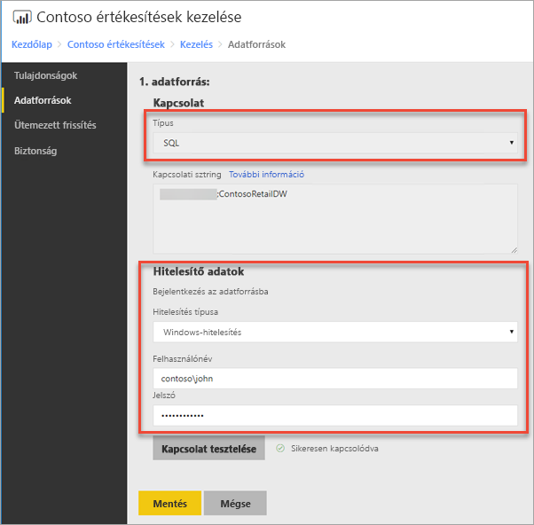
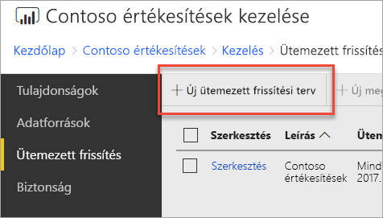
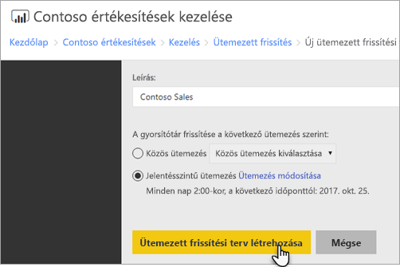
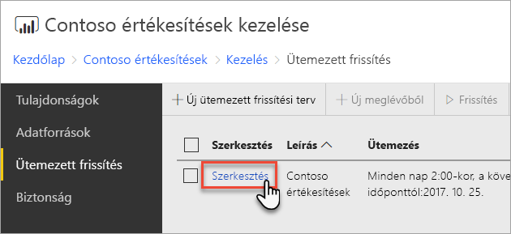
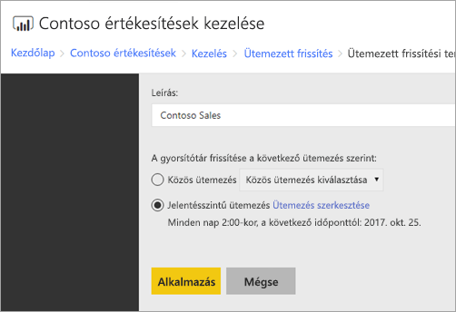

# A Power BI-jelentések ütemezett frissítésének konfigurálása
A Power BI-jelentések adatainak frissítéséhez létre kell hozni egy ütemezett frissítési tervet. Ez a Power BI-jelentések *Kezelés* területén lehetséges.

## Adatforrások hitelesítő adatainak konfigurálása
Mielőtt létrehozna egy ütemezett adatfrissítési tervet, meg kell adnia a Power BI-jelentésben használt **egyes adatforrások** hitelesítő adatait.

1. A webportálon kattintson jobb gombbal a Power BI-jelentésre, és válassza a **Kezelés** lehetőséget.
   
    
2. A bal oldali menüben válassza az **Adatforrások** lapot.
3. Minden egyes megjelenő adatforrás esetében válassza ki a hozzá való kapcsolódáskor használt hitelesítés típusát. Adja meg a megfelelő hitelesítő adatokat.
   
    

## Ütemezett frissítési terv létrehozása
Ütemezett frissítési terv létrehozásához tegye a következőket.

1. A webportálon kattintson jobb gombbal a Power BI-jelentésre, és válassza a **Kezelés** lehetőséget.
   
    
2. A bal oldali menüben válassza az **Ütemezett frissítés** lapot.
3. Az **Ütemezett frissítés** oldalon válassza az **Új ütemezett frissítési terv** lehetőséget.
   
    
4. Az **Új ütemezett frissítési terv** oldalon adja meg a terv leírását, valamint az adatmodell frissítésére vonatkozó ütemezést.
5. Miután végzett, kattintson az **Ütemezett frissítési terv létrehozása** lehetőséget.
   
    

## Ütemezett frissítési terv módosítása
Az ütemezett frissítési tervek módosítási folyamata nagyon hasonlít a létrehozáshoz.

1. A webportálon kattintson jobb gombbal a Power BI-jelentésre, és válassza a **Kezelés** lehetőséget.
   
    
2. A bal oldali menüben válassza az **Ütemezett frissítés** lapot.
3. Az **Ütemezett frissítés** oldalon válassza a módosítani kívánt frissítési terv mellett a **Szerkesztés** lehetőséget.
   
    
4. Az **Ütemezett frissítési terv szerkesztése** oldalon adja meg a terv leírását, valamint az adatmodell frissítésére vonatkozó ütemezést.
5. Ha végzett, kattintson az **Alkalmaz** gombra.
   
    

## Ütemezett frissítési tervek állapotának megtekintése
Az ütemezett frissítési tervek állapota a webportálon tekinthető meg.

1. A webportálon kattintson jobb gombbal a Power BI-jelentésre, és válassza a **Kezelés** lehetőséget.
   
    
2. A bal oldali menüben válassza az **Ütemezett frissítés** lapot.
3. Az **Ütemezett frissítés** oldalon a tervek állapota a jobb szélső oszlopban látható.
   
   | **Állapot** | **Leírás** |
   | --- | --- |
   | Új ütemezett frissítési terv |A terv létre lett hozva, de még nem futott. |
   | Frissítés |A frissítési folyamat elindult. |
   | Streamelési modell az Analysis Serverhez |A modell átmásolása a jelentéskészítési kiszolgáló katalógus-adatbázisából a futtatott Analysis Services-példányra. |
   | Adatok frissítése |A modellben lévő adatok frissítése. |
   | Hitelesítő adatok eltávolítása a modellből |Az adatforráshoz való kapcsolódáshoz használt hitelesítő adatok eltávolítása a modellből. |
   | Modell mentése a katalógusba |Az adatok frissítésének végeztével a frissített modell visszamentése a jelentéskészítési kiszolgáló katalógus-adatbázisába. |
   | Befejezve: adatfrissítés |A frissítés befejeződött. |
   | Hiba: |Hiba történt a frissítés során, és a hibaüzenet látható. |

Az aktuális állapot megtekintéséhez frissíteni kell a weblapot. Az állapot nem fog automatikusan változni.

## További lépések
Az ütemezések létrehozásával és módosításával kapcsolatban lásd: [Ütemezések létrehozása, módosítása és törlése](https://docs.microsoft.com/sql/reporting-services/subscriptions/create-modify-and-delete-schedules).

Az ütemezett frissítések hibaelhárításával kapcsolatos információkért lásd: [Power BI jelentéskészítési kiszolgálók ütemezett frissítésének hibaelhárítása](scheduled-refresh-troubleshoot.md).

További kérdései vannak? [Kérdezze meg a Power BI közösségét](https://community.powerbi.com/)

