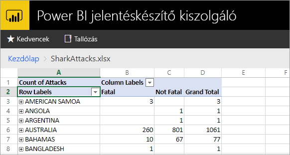
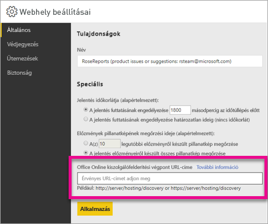

# <a name="configure-your-report-server-to-host-excel-workbooks-using-office-online-server-oos"></a>A jelentéskészítő kiszolgáló konfigurálása Excel-munkafüzetek üzemeltetéséhez az Office Online Server (OOS) használatával

A Power BI-jelentések webes portálon való megtekintése mellett a Power BI jelentéskészítő kiszolgáló már Excel-munkafüzeteket üzemeltethet az [Office Online Serverrel](https://docs.microsoft.com/officeonlineserver/office-online-server-overview) (OOS). A jelentéskészítő kiszolgálón egy helyen teheti közzé és tekintheti meg az önkiszolgáló Microsoft BI-tartalmakat.



## <a name="prepare-server-to-run-office-online-server"></a>A kiszolgáló előkészítése az Office Online Server futtatására

Végezze el ezeket a lépéseket azon a kiszolgálón, amelyen az Office Online Server futni fog. A kiszolgálónak Windows Server 2012 R2-nek vagy Windows Server 2016-nak kell lennie. A Windows Server 2016 az Office Online Server 2017. áprilisi vagy újabb verziójának használatát igényli.

### <a name="install-prerequisite-software-for-office-online-server"></a>Az Office Online Server használatának előfeltételeként megadott szoftverek telepítése

1. Nyissa meg a Windows PowerShell parancssort rendszergazdaként, és futtassa ezt a parancsot a szükséges szerepkörök és szolgáltatások telepítéséhez.

    **Windows Server 2012 R2:**

    ```powershell
    Add-WindowsFeature Web-Server,Web-Mgmt-Tools,Web-Mgmt-Console,Web-WebServer,Web-Common-Http,Web-Default-Doc,Web-Static-Content,Web-Performance,Web-Stat-Compression,Web-Dyn-Compression,Web-Security,Web-Filtering,Web-Windows-Auth,Web-App-Dev,Web-Net-Ext45,Web-Asp-Net45,Web-ISAPI-Ext,Web-ISAPI-Filter,Web-Includes,InkandHandwritingServices,NET-Framework-Features,NET-Framework-Core,NET-HTTP-Activation,NET-Non-HTTP-Activ,NET-WCF-HTTP-Activation45,Windows-Identity-Foundation,Server-Media-Foundation
    ```

    **Windows Server 2016:**

    ```powershell
    Add-WindowsFeature Web-Server,Web-Mgmt-Tools,Web-Mgmt-Console,Web-WebServer,Web-Common-Http,Web-Default-Doc,Web-Static-Content,Web-Performance,Web-Stat-Compression,Web-Dyn-Compression,Web-Security,Web-Filtering,Web-Windows-Auth,Web-App-Dev,Web-Net-Ext45,Web-Asp-Net45,Web-ISAPI-Ext,Web-ISAPI-Filter,Web-Includes,NET-Framework-Features,NET-Framework-45-Features,NET-Framework-Core,NET-Framework-45-Core,NET-HTTP-Activation,NET-Non-HTTP-Activ,NET-WCF-HTTP-Activation45,Windows-Identity-Foundation,Server-Media-Foundation
    ```

    Ha a rendszer kéri, indítsa újra a kiszolgálót.
2. Telepítse a következő szoftvereket:

   * [.NET Framework 4.5.2](https://go.microsoft.com/fwlink/p/?LinkId=510096)
   * [A Visual Studio 2013 szoftverhez készült Visual C++ terjeszthető csomagjai](https://www.microsoft.com/download/details.aspx?id=40784)
   * [A Visual Studio 2015 szoftverhez készült Visual C++ terjeszthető változata](https://go.microsoft.com/fwlink/p/?LinkId=620071)
   * [Microsoft.IdentityModel.Extention.dll](https://go.microsoft.com/fwlink/p/?LinkId=620072)

### <a name="install-office-online-server"></a>Az Office Online Server telepítése

Ha olyan Excel Online-funkciókat tervez használni, amelyek külső adathozzáférést használnak (ilyen például a Power Pivot), vegye figyelembe, hogy az Office Online Servernek ugyanabban az Active Directory-erdőben kell lennie, mint a felhasználóinak és az összes olyan külső adatforrásnak, amelyet Windows-alapú hitelesítéssel szeretne elérni.

1. Töltse le az Office Online Servert a [mennyiségi licencszolgáltatási központból (VLSC)](http://go.microsoft.com/fwlink/p/?LinkId=256561). A letöltési gomb az Office-termékek alatt található a VLSC portálon. Fejlesztési célokra letöltheti az OOS-t az MSDN-előfizetői letöltéseknél.
2. Futtassa a Setup.exe fájlt.
3. Az **Olvassa el a Microsoft szoftverlicenc-szerződést** oldalon jelölje be az **Elfogadom a szerződés feltételeit** jelölőnégyzetet, és válassza a **Folytatás** lehetőséget.
4. A **Fájl helyének kiválasztása** oldalon válassza ki az Office Online Server fájlok kívánt telepítési mappáját (például C:\Program Files\Microsoft Office Web Apps\*), és válassza a **Telepítés** lehetőséget. Ha a megadott mappa nem létezik, a telepítő létrehozza.

    Azt ajánljuk, hogy egy rendszermeghajtóra telepítse az Office Online Servert.

5. Amikor a telepítő befejezi az Office Online Server telepítését, válassza a **Bezárás** lehetőséget.

### <a name="install-language-packs-for-office-web-apps-server-optional"></a>Nyelvi csomagok telepítése az Office Web Apps Serverhez (nem kötelező)

Az Office Online Server nyelvi csomagjaival a felhasználók több nyelven tekinthetik meg a webalapú Office-fájlokat.

A nyelvi csomagok telepítéséhez kövesse az alábbi lépéseket.

1. Töltse le az Office Online Server nyelvi csomagjait a [Microsoft letöltőközpontból](http://go.microsoft.com/fwlink/p/?LinkId=798136).
2. Futtassa a **wacserverlanguagepack.exe** fájlt.
3. Az Office Online Server nyelvi csomagjainak varázslójában, az **Olvassa el a Microsoft szoftverlicenc-szerződést** oldalon jelölje be az **Elfogadom a szerződés feltételeit** jelölőnégyzetet, és válassza a **Folytatás** lehetőséget.
4. Amikor a telepítő befejezi az Office Online Server telepítését, válassza a **Bezárás** lehetőséget.

## <a name="deploy-office-online-server"></a>Az Office Online Server üzembe helyezése

### <a name="create-the-office-online-server-farm-https"></a>Az Office Online Server-farm (HTTPS) létrehozása

A New-OfficeWebAppsFarm paranccsal hozzon létre egy egyetlen kiszolgálóból álló új Office Online Server-farmot a lenti példában látható módon.

```powershell
New-OfficeWebAppsFarm -InternalUrl "https://server.contoso.com" -ExternalUrl "https://wacweb01.contoso.com" -CertificateName "OfficeWebApps Certificate"
```

**Paraméterek**

* Az **–InternalURL** az Office Online Servert futtató kiszolgáló teljes tartományneve (FQDN), például `http://servername.contoso.com`.
* Az **–ExternalURL** az interneten elérhető FQDN.
* A **–CertificateName** a tanúsítvány rövid neve.

### <a name="create-the-office-online-server-farm-http"></a>Az Office Online Server-farm (HTTP) létrehozása

A New-OfficeWebAppsFarm paranccsal hozzon létre egy egyetlen kiszolgálóból álló új Office Online Server-farmot a lenti példában látható módon.

```powershell
New-OfficeWebAppsFarm -InternalURL "http://servername" -AllowHttp
```

**Paraméterek**

* Az **–InternalURL** az Office Online Servert futtató kiszolgáló neve, például `http://servername`.
* Az **–AllowHttp** HTTP használatához konfigurálja a farmot.

### <a name="verify-that-the-office-online-server-farm-was-created-successfully"></a>Az Office Online Server-farm sikeres létrehozásának ellenőrzése

A farm létrehozása után a farm részletei megjelennek a Windows PowerShell parancssorban. Az Office Online Server megfelelő telepítésének és konfigurálásának ellenőrzéséhez egy böngészőben nyissa meg az Office Online Server felderítési URL-címét a lenti példában látható módon. A felderítési URL-cím az Office Online Server farm konfigurálásakor megadott *InternalUrl* paraméter, amelyet a */hosting/discovery* követ, például:

```
<InternalUrl>/hosting/discovery
```

Ha az Office Online Server a várt módon működik, egy Web Application Open Platform Interface Protocol (WOPI) feltárási XML-fájlt kell látnia a böngészőben. A fájl első néhány sorának a következő példára kell hasonlítania:

```xml
<?xml version="1.0" encoding="utf-8" ?> 
<wopi-discovery>
<net-zone name="internal-http">
<app name="Excel" favIconUrl="<InternalUrl>/x/_layouts/images/FavIcon_Excel.ico" checkLicense="true">
<action name="view" ext="ods" default="true" urlsrc="<InternalUrl>/x/_layouts/xlviewerinternal.aspx?<ui=UI_LLCC&><rs=DC_LLCC&>" /> 
<action name="view" ext="xls" default="true" urlsrc="<InternalUrl>/x/_layouts/xlviewerinternal.aspx?<ui=UI_LLCC&><rs=DC_LLCC&>" /> 
<action name="view" ext="xlsb" default="true" urlsrc="<InternalUrl>/x/_layouts/xlviewerinternal.aspx?<ui=UI_LLCC&><rs=DC_LLCC&>" /> 
<action name="view" ext="xlsm" default="true" urlsrc="<InternalUrl>/x/_layouts/xlviewerinternal.aspx?<ui=UI_LLCC&><rs=DC_LLCC&>" /> 
```

### <a name="configure-excel-workbook-maximum-size"></a>Excel-munkafüzet maximális méretének konfigurálása

A Power BI jelentéskészítő kiszolgálón található fájlok maximális mérete 100 MB lehet. Ennek betartása érdekében manuálisan kell beállítania ezt az értéket az OOS-ben.

```powershell
Set-OfficeWebAppsFarm -ExcelWorkbookSizeMax 100
```

## <a name="using-effectiveusername-with-analysis-services"></a>EffectiveUserName használata az Analysis Services szolgáltatással

Az Analysis Services élő kapcsolatainak lehetővé tétele EffectiveUserName nevet használó Excel-munkafüzetben lévő kapcsolatokhoz. Ahhoz, hogy az OOS EffectiveUserName nevet használjon, rendszergazdaként hozzá kell adnia az OOS-kiszolgáló számítógépfiókját az Analysis Services példányhoz. Ehhez a Management Studio for SQL Server 2016-os vagy újabb verziójára van szükség.

Jelenleg csak a beágyazott Analysis Services-kapcsolatok támogatottak az Excel-munkafüzetekben. A felhasználó fiókjának engedéllyel kell rendelkeznie az Analysis Serviceshez való csatlakozáshoz, mert a felhasználó nem helyettesíthető.

Futtassa az alábbi PowerShell-parancsokat az OOS-kiszolgálón.

```powershell
Set-OfficeWebAppsFarm -ExcelUseEffectiveUserName:$true
Set-OfficeWebAppsFarm -ExcelAllowExternalData:$true
Set-OfficeWebAppsFarm -ExcelWarnOnDataRefresh:$false
```

## <a name="configure-a-power-pivot-instance-for-data-models"></a>Power Pivot példány konfigurálása adatmodellekhez

Egy Analysis Services Power Pivot módpéldány telepítése lehetővé teszi a Power Pivotot használó Excel-munkafüzetek használatát. A példány neve mindenképpen *POWERPIVOT* legyen. Adja hozzá rendszergazdaként az OOS-kiszolgáló számítógépfiókját az Analysis Services Power Pivot módpéldányhoz. Ehhez a Management Studio for SQL Server 2016-os vagy újabb verziójára van szükség.

Ahhoz, hogy az OOS a Power Pivot módpéldányt használja, futtassa a következő parancsot.

```powershell
New-OfficeWebAppsExcelBIServer -ServerId <server_name>\POWERPIVOT
```

Ha még nem engedélyezte a külső adatokat, a fenti Analysis Services-lépésből futtassa a következő parancsot.

```powershell
Set-OfficeWebAppsFarm -ExcelAllowExternalData:$true
```

### <a name="firewall-considerations"></a>Tűzfallal kapcsolatos megfontolások

A tűzfallal kapcsolatos hibák elkerülése érdekében előfordulhat, hogy meg kell nyitnia a 2382-es és a 2383-as portot. Az *msmdsrv.exe* fájlt is hozzáadhatja a Power Pivot példányhoz az alkalmazás tűzfalszabályzataként.

## <a name="configure-power-bi-report-server-to-use-the-oos-server"></a>A Power BI jelentéskészítő kiszolgáló konfigurálása az OOS-kiszolgáló használatához

A **Hely beállításai** terület **Általános** lapján írja be az OOS felderítési URL-címét. Az OOS felderítési URL-címe az OOS-kiszolgáló üzembe helyezésekor használt *InternalUrl*, amelyet a */hosting/discovery* követ. Ez HTTP esetén lehet például `http://servername/hosting/discovery`, HTTPS esetén pedig `https://server.contoso.com/hosting/discovery`.

A **Hely beállításai** megnyitásához válassza a jobb felső sarokban lévő **fogaskerék ikont**, és válassza a **Hely beállításai** lehetőséget.

Csak a **Rendszergazda** szerepkörrel rendelkező felhasználók láthatják az Office Online Server felderítési URL-címének beállítását.



A webes portálon a felderítési URL-cím beírása, az **Alkalmazás** gomb, majd egy Excel-munkafüzet kiválasztása után meg kell jelennie a munkafüzetnek.

## <a name="limitations-and-considerations"></a>Korlátozások és szempontok

* A munkafüzetekben csak olvasási képességgel fog rendelkezni.

## <a name="next-steps"></a>Következő lépések

[Rendszergazdai áttekintés](admin-handbook-overview.md)  
[A Power BI jelentéskészítő kiszolgáló telepítése](install-report-server.md)  
[A Jelentéskészítő letöltése](https://www.microsoft.com/download/details.aspx?id=53613)  
[Az SQL Server Data Tools (SSDT) letöltése](http://go.microsoft.com/fwlink/?LinkID=616714)

További kérdései vannak? [Kérdezze meg a Power BI közösségét](https://community.powerbi.com/)
