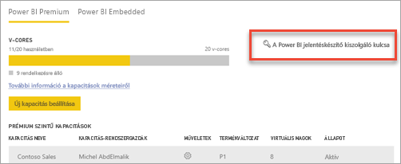
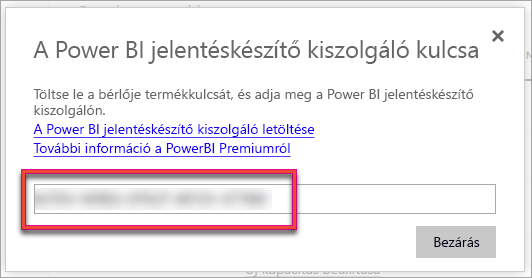
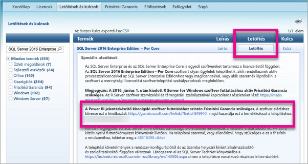

# A jelentéskészítő kiszolgáló termékkulcsának megkeresése
Megtudhatja, hogyan találhatja meg a Power BI jelentéskészítő kiszolgáló termékkulcsát a kiszolgáló éles környezetben történő telepítéséhez.

<iframe width="640" height="360" src="https://www.youtube.com/embed/6CQnf-NGtpU?rel=0&amp;showinfo=0" frameborder="0" allowfullscreen></iframe>

Letöltötte a Power BI jelentéskészítő kiszolgálót, és SQL Server Enterprise Frissítési garancia szerződéssel rendelkezik. Vagy megvásárolta a Power BI Premiumot. Éles környezetben szeretné telepíteni a kiszolgálót, de ehhez termékkulcsra van szüksége. Hol van a termékkulcs? 

A termékkulcs két helyen lehet attól függően, hogy mit vásárolt.

## Power BI Premium megvásárlása esetén
Ha a Power BI Premiumot vásárolta meg, a Power BI felügyeleti portáljának **Kapacitásbeállítások** lapján érheti el a Power BI jelentéskészítő kiszolgáló termékkulcsát. Ezt csak a globális rendszergazdák vagy a Power BI szolgáltatásrendszergazdai szerepéhez rendelt felhasználók érhetik el.

Ha rákattint a **Power BI jelentéskészítő kiszolgáló termékkulcsa** elemre, a termékkulcs megjelenik egy párbeszédpanelben. Innen lemásolhatja és felhasználhatja a telepítéshez.

## Frissítési garancia szerződés megvásárlása esetén
Ha SQL Server Enterprise Frissítési garancia szerződéssel rendelkezik, a [Mennyiségi licencszolgáltatási központból](https://www.microsoft.com/Licensing/servicecenter/) szerezheti be a termékkulcsot. Nézze meg az SQL Server legújabb verziójának legújabb szervizcsomagja alatt. Ha ott nem találja, keresse a legújabb SQL Server-verzió RTM kiadása alatt.

> [!NOTE]
> A Letöltés részben keresse, ne a Kulcs részben.
> 
> 

## További lépések
[A Power BI jelentéskészítő kiszolgáló telepítése](install-report-server.md)  
[A Power BI jelentéskészítő kiszolgálóra optimalizált Power BI Desktop telepítése](install-powerbi-desktop.md)  
[A Jelentéskészítő letöltése](https://www.microsoft.com/download/details.aspx?id=53613)  
[Az SQL Server Data Tools (SSDT) letöltése](https://go.microsoft.com/fwlink/?LinkID=616714)

Több kérdése van? [Kérdezze meg a Power BI-közösséget](https://community.powerbi.com/)

