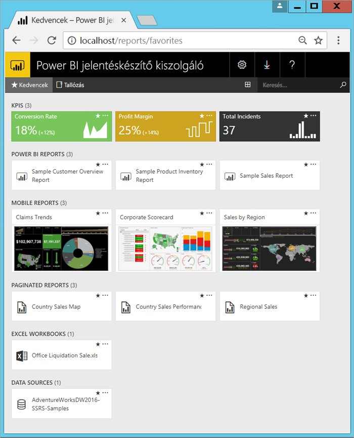

# Mi a Power BI jelentéskészítő kiszolgáló?

A Power BI jelentéskészítő kiszolgáló egy helyszíni jelentéskészítő kiszolgáló olyan webes portállal, amelyen megjeleníthetők és kezelhetők a jelentések és főbb teljesítménymutatók (KPI-k). Eszköztárával Power BI-jelentések, lapszámozott jelentések, mobiljelentések és KPI-k készíthetők. Ezekhez a jelentésekhez a felhasználók különböző módokon férhetnek hozzá: megtekinthetik őket webböngészőben vagy mobileszközön, vagy megkaphatják e-mailben a postafiókjukban.

## A Power BI jelentéskészítő kiszolgáló összehasonlítása 
A Power BI jelentéskészítő kiszolgáló hasonló az SQL Server Reporting Services és a Power BI online szolgáltatáshoz is, de más módon. A Power BI szolgáltatáshoz hasonlóan a Power BI jelentéskészítő kiszolgáló kezeli a Power BI-jelentéseket (.PBIX), Excel-fájlokat és lapszámozott jelentéseket (.RDL) is. A Reporting Serviceshez hasonlóan a Power BI jelentéskészítő kiszolgáló is helyszíni. A Power BI jelentéskészítő kiszolgáló funkciói lefedik a Reporting Servicest: ami a Reporting Servicesben megtehető, az a Power BI jelentéskészítő kiszolgálóval is végrehajtható, a Power BI-jelentések támogatásával együtt. További részleteket az [A Power BI jelentéskészítő kiszolgáló és a Power BI szolgáltatás összehasonlítása](compare-report-server-service.md) című szakaszban talál.

## A Power BI jelentéskészítő kiszolgáló licencelése
A Power BI jelentéskészítő kiszolgáló kétféle licenccel érhető el: [Power BI Premium](../service-premium-what-is.md) és [SQL Server Enterprise Edition](https://www.microsoft.com/sql-server/sql-server-2017-editions) Frissítési Garanciával. Power BI Premium licenccel hibrid, vegyesen felhőbeli és helyszíni telepítés is végrehajtható.  

> [!NOTE]
> A Power BI Premium esetében a Power BI jelentéskészítő kiszolgáló csak a P termékváltozatoknak képezi részét. Az EM termékváltozatok mellé nem jár.

## Webes portál
A Power BI jelentéskészítő kiszolgáló minden mai böngészőben megnyitható, biztonságos webes portál. Itt minden jelentést és KPI-t elérhet. A webes portál tartalma hagyományos mappahierarchiába van szervezve. A mappák tartalma típus szerint van szervezve: Power BI-jelentések, mobiljelentések, lapszámozott jelentések, KPI-k és Excel-munkafüzetek. A jelentések építőelemeiként használható megosztott adathalmazok és megosztott adatforrások saját mappával rendelkeznek. Kedvenceit megjelölheti, hogy egy mappában jelenjenek meg. A webes portálon közvetlenül is létrehozhatja a KPI-ket. 

A webes portál tartalmát jogosultságaitól függően kezelheti. Ütemezheti a jelentésfeldolgozást, igény szerint érheti el a jelentéseket, és feliratozhat a közzétett jelentésekre. Saját egyéni [védjegyzését](https://docs.microsoft.com/sql/reporting-services/branding-the-web-portal) is alkalmazhatja a webes portálra. 

További információ a [Power BI jelentéskészítő kiszolgáló webes portáljáról](https://docs.microsoft.com/sql/reporting-services/web-portal-ssrs-native-mode).

## Power BI-jelentések
Power BI-jelentéseket (.PBIX) a Power BI Desktopnak a jelentéskészítő kiszolgálóhoz optimalizált verziójával készíthet. Ezeket aztán közzéteheti és saját környezetében tekintheti meg a webes portálon.

A Power BI-jelentések az adatmodellek többszempontú nézetei, amelyek az adatmodellből származó különféle eredményeket és elemzéseket bemutató vizualizációkat tartalmaznak.  A jelentések egyetlen vagy akár több oldalnyi vizualizációt is tartalmazhatnak. Szerepkörétől függően olvasni és böngészni tudja a jelentéseket, vagy létrehozhat újakat mások számára.

Tájékozódhat a [Microsoft Power BI Desktop telepítéséről](install-powerbi-desktop.md).

## Oldalakra osztott jelentések
A többoldalas jelentések (.RDL) dokumentum-stílusú, vizualizációkat tartalmazó jelentések, amelyekben az összes adat megjelenítéséhez vízszintesen és függőlegesen bővülő táblázatok szükség esetén több oldalra is kiterjednek. Tökéletesek a nyomtatásra optimalizált, rögzített elrendezésű, képpontról képpontra egyező, például PDF- és Word-dokumentumok létrehozásához. 

Az [SQL Server Data Tools (SSDT)](https://docs.microsoft.com/sql/reporting-services/tools/reporting-services-in-sql-server-data-tools-ssdt) eszközkészlet által tartalmazott Jelentéstervező vagy a [Jelentéskészítő](https://docs.microsoft.com/sql/reporting-services/report-builder/report-builder-in-sql-server-2016) használatával lapszámozott jelentéseket hozhat létre.

## Reporting Services-mobiljelentések
A rugalmas elrendezésű mobiljelentések helyszíni adatokhoz csatlakoznak és alkalmazkodnak a különböző eszközökhöz és a különböző tájolási módokhoz. Az Microsoft SQL Server Mobiljelentés-publikálóval hozhatók létre.

További információ a [Reporting Services-mobiljelentésekről](https://docs.microsoft.com/sql/reporting-services/mobile-reports/create-mobile-reports-with-sql-server-mobile-report-publisher). 

## A Jelentéskészítő kiszolgáló programozási szolgáltatásai
Bővítheti és testre szabhatja a jelentéseket a Power BI Jelentéskészítő kiszolgáló programozási szolgáltatásaival, API-kkal integrálhatja vagy terjesztheti ki az adatokat és a jelentésfeldolgozást egyéni alkalmazásokban.

További [fejlesztői dokumentáció a Jelentéskészítő kiszolgálóhoz](https://docs.microsoft.com/sql/reporting-services/reporting-services-developer-documentation).

## Következő lépések
[A Power BI jelentéskészítő kiszolgáló telepítése](install-report-server.md)  
[A Jelentéskészítő letöltése](https://www.microsoft.com/download/details.aspx?id=53613)  

További kérdései vannak? [Kérdezze meg a Power BI közösségét](https://community.powerbi.com/)

