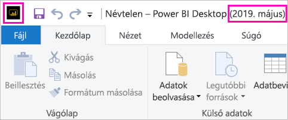

# A Power BI jelentéskészítő kiszolgálóhoz optimalizált Power BI Desktop telepítése

Ha a Power BI jelentéskészítő kiszolgálóhoz szeretne Power BI-jelentéseket létrehozni, akkor le kell tölteni és telepíteni a Power BI jelentéskészítő kiszolgálóhoz optimalizált Power BI Desktopot. Ez különbözik a Power BI szolgáltatáshoz használt Power BI Desktop-kiadástól. A Power BI szolgáltatáshoz készült Power BI Desktopban például olyan előzetes funkciók is megtalálhatók, amelyek a kiadásukig nem érhetők el a Power BI jelentéskészítő kiszolgálóban. Ha ezt a verziót használja, akkor a jelentéskészítő kiszolgáló a jelentések és a modell ismert verzióját használhatja. 

A Power BI Desktop és a Power BI jelentéskészítő kiszolgálóhoz optimalizált Power BI Desktop azonban egymás mellett is telepíthető ugyanazon a számítógépen.

## A Power BI Desktop letöltése és telepítése

Ha ellenőrizné, hogy a Power BI jelentéskészítő kiszolgálóhoz optimalizált Power BI Desktop legújabb verzióját használja-e, akkor a jelentéskészítő kiszolgáló webportáljáról induljon.

1. A jelentéskészítő kiszolgáló webportálján kattintson a **Letöltés** nyíl > **Power BI Desktop** lehetőségre.

    

    Vagy lépjen közvetlenül [Microsoft Power BI Desktop](https://www.microsoft.com/download/details.aspx?id=56723) (optimalizált Power BI jelentéskészítő kiszolgáló – május 2019) a Microsoft Download Center.

2. A letöltőközpontlapon kattintson a **Letöltés** gombra.

3. A számítógépétől függően válassza az alábbiak egyikét: 

    - **PBIDesktopRS.msi** (32 bites verzió) vagy

    - **PBIDesktopRS_x64.msi** (64 bites verzió).

1. A telepítő letöltése után a Power BI Desktop (2019. május) telepítővarázsló futtatásához.

2. Válassza ki a telepítés végén **indítsa el a Power BI Desktop**.

    A folyamat automatikusan elindul, és máris hozzákezdhet.

## Annak ellenőrzése, hogy a megfelelő verziót használja-e
Egyszerűen ellenőrizheti, hogy a megfelelő Power BI Desktopot használja-e: A Power BI Desktopban ellenőrizze az indítási képernyőt vagy a címsort. A címsor a kiadás hónapját és évét jelzi. Emellett a Power BI logószínei is fordítva jelennek meg: fekete háttéren sárga, és nem sárga háttéren fekete.

A Power BI szolgáltatás Power BI Desktop verziójának címsorában nem szerepel a hónap és az év.

## Fájlkiterjesztés társítása
Ha a Power BI Desktopot és a Power BI jelentéskészítő kiszolgálóhoz optimalizált Power BI Desktopot ugyanarra a gépre telepítette, a Power BI Desktop legutóbbi telepítése rendelkezik a .pbix fájltársítással. Így ha duplán kattint egy .pbix-fájlra, akkor elindul a nemrég telepített Power BI Desktop.

Ha először a Power BI Desktopot telepítette, majd a Power BI jelentéskészítő kiszolgálóhoz optimalizált Power BI Desktopot, az összes pbix-fájl alapértelmezés szerint a Power BI jelentéskészítő kiszolgálóhoz optimalizált Power BI Desktopban nyílik meg. Ha azt szeretné, hogy inkább a Power BI Desktop induljon el alapértelmezés szerint a pbix-fájlok megnyitásakor, telepítse újra a [Power BI Desktopot a Microsoft Store áruházból](http://aka.ms/pbidesktopstore).

Azt is megteheti, hogy először megnyitja a Power BI Desktop használni kívánt verzióját, majd megnyitja a fájlt a Power BI Desktopból.

A Power BI jelentéskészítő kiszolgálón egy Power BI-jelentés szerkesztése vagy új Power BI-jelentés létrehozása a webes portálról, mindig megnyitja a Power BI Desktop megfelelő verziója.

## Megfontolandó szempontok és korlátozások

A Power BI jelentéskészítő kiszolgálón, a Power BI szolgáltatásban (http://app.powerbi.com)) és a Power BI-mobilalkalmazásokban található jelentések működése szinte teljesen megegyezik, de bizonyos funkciók eltérnek egymástól.

### Böngészőben

A Power BI jelentéskészítő kiszolgálón tárolt jelentések szinte minden vizualizációt támogatnak, beleértve az egyéni vizualizációkat. A Power BI jelentéskészítő kiszolgálón tárolt jelentések nem támogatják az alábbiakat:

* R vizualizációk
* ArcGIS-térképek
* Útkövetési eszközök
* A Power BI Desktop előzetes verziójú funkciói

### A Power BI-mobilalkalmazásokban

A Power BI jelentéskészítő kiszolgálón tárolt jelentések a [Power BI-mobilalkalmazások](../consumer/mobile/mobile-apps-for-mobile-devices.md) minden alapvető funkcióját támogatják, köztük:

* [A jelentés telefonos elrendezése](../desktop-create-phone-report.md): A jelentést optimalizálhatja a Power BI-mobilalkalmazásokra. Az optimalizált jelentéseknek különleges ikonjuk  és elrendezésük van a mobiltelefonon.
  
    

A Power BI jelentéskészítő kiszolgálón tárolt jelentések nem támogatják a Power BI-mobilalkalmazások alábbi funkcióit:

* R vizualizációk
* ArcGIS-térképek
* Egyéni vizualizációk
* Útkövetési eszközök
* A földrajzi szűrés vagy sáv kódot

## Power BI Desktop a Power BI jelentéskészítő kiszolgáló korábbi verzióihoz

Ha a jelentéskészítő kiszolgálója korábbi verziójú, akkor a Power BI Desktop vonatkozó verzióját kell használnia. Íme a hivatkozásra kattintva töltse le az előző verzióját.

- A Microsoft Power BI Desktop ([optimalizált Power BI jelentéskészítő kiszolgáló – január 2019](https://go.microsoft.com/fwlink/?linkid=2055039))

## Következő lépések

Most, hogy telepítette a Power BI Desktopot, megkezdheti Power BI-jelentések létrehozását.

[Power BI-jelentés létrehozása a Power BI jelentéskészítő kiszolgálóhoz](quickstart-create-powerbi-report.md)  
[Mi a Power BI jelentéskészítő kiszolgáló?](get-started.md)

További kérdései vannak? [Kérdezze meg a Power BI közösségét](https://community.powerbi.com/)
