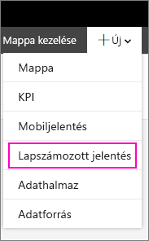
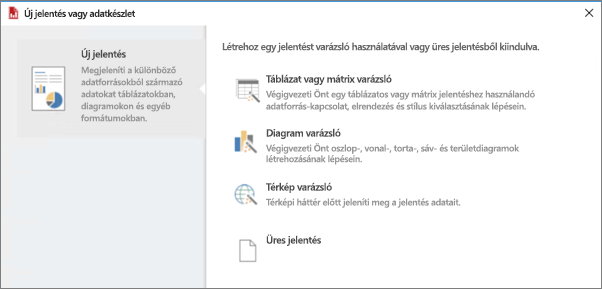

# A Jelentéskészítő telepítése – Power BI jelentéskészítő kiszolgáló

A Jelentéskészítő egy önálló alkalmazás, amelyet Ön vagy egy rendszergazda telepít a számítógépre. Telepítheti a Microsoft letöltőközpontból vagy a Power BI jelentéskészítő kiszolgálóról.  

Segítségre van szüksége a Power BI szolgáltatás Jelentéskészítőjének telepítésében? Lásd: [Power BI Jelentéskészítő](../paginated-reports/report-builder-power-bi.md).
  
Általában egy rendszergazda telepíti és konfigurálja a Power BI jelentéskészítő kiszolgálót, ad engedélyt a Jelentéskészítő letöltésére a webportálról, valamint kezeli a jelentéskiszolgálóra mentett megosztott adatkészleteket, valamint a jelentések mappáit és engedélyeit. További információ a Power BI jelentéskészítő kiszolgálóról: [Rendszergazdai áttekintés, Power BI jelentéskészítő kiszolgáló](admin-handbook-overview.md).  
  
## Rendszerkövetelmények
  
 Tekintse meg a [Jelentéskészítő letöltési oldalának](https://go.microsoft.com/fwlink/?LinkID=734968) **Rendszerkövetelmények** szakaszát a Microsoft letöltőközpontban.
 
## A Jelentéskészítő telepítése egy webportálról
  
A Jelentéskészítőt telepítheti egy Power BI jelentéskészítő kiszolgálóhoz tartozó webportálról is. Lehet, hogy korábban már telepítette a Jelentéskészítőt, hogy jelentéseket hozzon létre egy SSRS-kiszolgálóra. Használhatja ugyanezt a verziójú Jelentéskészítőt arra is, hogy a Power BI jelentéskészítő kiszolgálóra hozzon létre jelentéseket. Ha még nem telepítette, akkor ezt egyszerűen megteheti.

1. A Power BI jelentéskészítő kiszolgáló webportálján válassza az **New** (Új) > **Paginated Report** (Többoldalas jelentés) lehetőséget.
   
    
   
    Ha még nincs telepítve Jelentéskészítő, elindul a Microsoft Jelentéskészítő varázsló.  
  
3.  Fogadja el a licencszerződés feltételeit, majd válassza a **Tovább** lehetőséget.  
 
5.  Kattintson a **Telepítés** gombra a Jelentéskészítő telepítésének befejezéséhez.  

2. A telepítést követően megnyílik a Jelentéskészítő az **Új jelentés vagy adatkészlet** képernyőn.
   
    
 

##   A Jelentéskészítő telepítése a letöltőközpontból  
  
1.  A [Microsoft letöltőközpont Jelentéskészítő lapján](https://go.microsoft.com/fwlink/?LinkID=734968) válassza a **Letöltés** lehetőséget.  
  
2.  A Jelentéskészítő letöltése után válassza a **Futtatás** lehetőséget.  
  
     Ekkor elindul a Microsoft Jelentéskészítő varázsló.  
  
3.  Fogadja el a licencszerződés feltételeit, majd válassza a **Tovább** lehetőséget.  
 
5.  Kattintson a **Telepítés** gombra a Jelentéskészítő telepítésének befejezéséhez.  
 

## Következő lépések

[Mi a Power BI jelentéskészítő kiszolgáló?](get-started.md)
