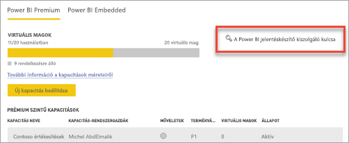
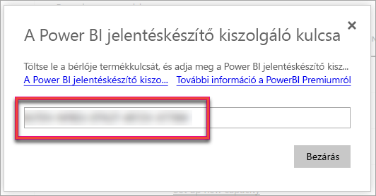
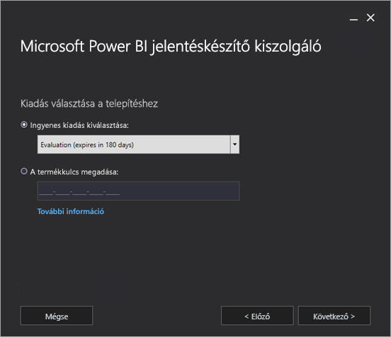
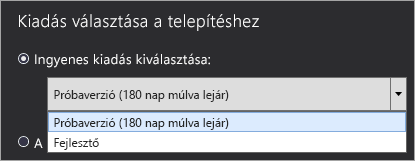
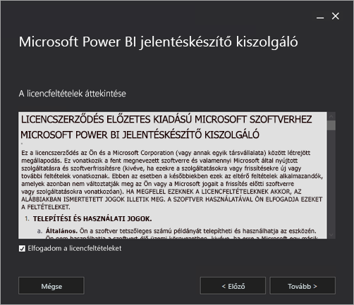
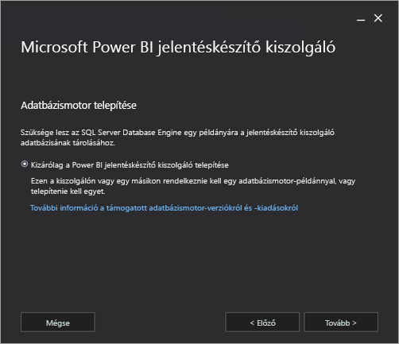
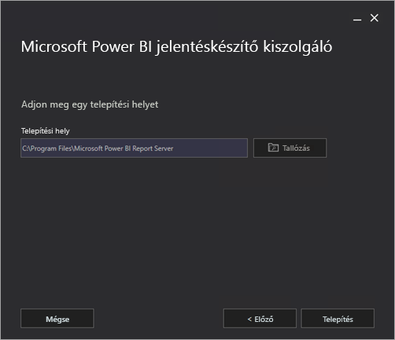
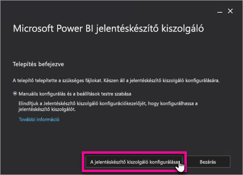
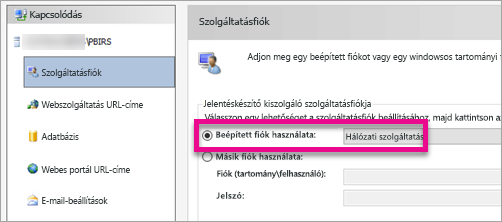
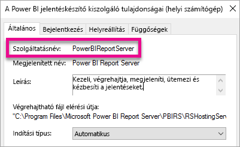

# A Power BI jelentéskészítő kiszolgáló telepítése

Ismerje meg, hogyan telepítheti a Power BI jelentéskészítő kiszolgálót.

## A Power BI jelentéskészítő kiszolgáló letöltése

A [Power BI jelentéskészítő kiszolgálóval végzett helyszíni jelentéskészítéssel](https://powerbi.microsoft.com/report-server/) foglalkozó oldalon válassza az **Ingyenes próbaverzió letöltése** lehetőséget.

A PowerBIReportServer.exe fájl futtatásakor válassza az ingyenes próbaverziót, vagy adja meg a termékkulcsot. További részletekért olvasson tovább.

## Előkészületek a telepítés előtt

Javasoljuk, hogy a Power BI jelentéskészítő kiszolgáló telepítése előtt tekintse át a [Power BI jelentéskészítő kiszolgáló telepítésének hardver- és szoftverkövetelményeit](system-requirements.md).

 > [!IMPORTANT]
 > Bár a Power BI jelentéskészítő kiszolgáló telepíthető írásvédett tartományvezérlővel (RODC-vel) rendelkező környezetben is, a Power BI jelentéskészítő kiszolgálónak a megfelelő működés érdekében hozzáféréssel kell rendelkeznie egy írható tartományvezérlőhöz. Ha a Power BI jelentéskészítő kiszolgáló csak egy írásvédett tartományvezérlőhöz (RODC-hez) fér hozzá, akkor hibákat tapasztalhat a szolgáltatás felügyelete során.

### A Power BI jelentéskészítő kiszolgáló termékkulcsa

A Power BI jelentéskészítő kiszolgáló termékkulcsa két forrásból szerezhető be:

- Power BI Premium
- SQL Server Enterprise Frissítési Garancia (SA)

További részletekért olvasson tovább.

#### Power BI Premium

Ha a Power BI Premiumot vásárolta meg, a Power BI felügyeleti portáljának **Premium-beállítások** lapján érheti el a Power BI jelentéskészítő kiszolgáló termékkulcsát. A felügyeleti portált csak a globális rendszergazdák vagy a Power BI szolgáltatásadminisztrátori szerepköréhez rendelt felhasználók érhetik el.

A **Power BI jelentéskészítő kiszolgáló kulcsának** kiválasztásakor megjelenik a termékkulcsot tartalmazó párbeszédpanel. Innen lemásolhatja és felhasználhatja a telepítéshez.

#### SQL Server Enterprise Frissítési Garancia (SA)

Ha SQL Server Enterprise Frissítési garancia szerződéssel rendelkezik, a [Mennyiségi licencszolgáltatási központból](https://www.microsoft.com/Licensing/servicecenter/) szerezheti be a termékkulcsot.

## A jelentéskészítő kiszolgáló telepítése

A Power BI jelentéskészítő kiszolgáló telepítése rendkívül egyszerű. Alig néhány lépés szükséges a fájlok telepítéséhez.

A telepítés során nincs szükség elérhető SQL Server adatbázismotor-kiszolgálóra. Csak telepítés után, a Reporting Services konfigurálásához kell majd használnia.

1. Keresse meg a PowerBIReportServer.exe fájlt, és indítsa el a telepítőt.

2. Kattintson a **Power BI jelentéskészítő kiszolgáló telepítése** elemre.

    
3. Válassza ki a telepítendő kiadást, majd kattintson a **Tovább** elemre.

    

    Válassza vagy az Evaluation (próbaverzió) vagy a Developer (fejlesztői) kiadást.

    

    A másik lehetőség, hogy megadja azt a termékkulcsot, amelyet a Power BI szolgáltatástól vagy a Mennyiségi licencszolgáltatási központtól kapott. A termékkulcs beszerzéséhez a fenti [Előkészületek a telepítés előtt](#before-you-install) című részben talál további információkat.
4. Olvassa el és fogadja el a licencfeltételeket, majd kattintson a **Tovább** elemre.

    
5. A jelentéskészítő kiszolgáló adatbázisának tárolásához elérhető adatbázismotorra van szükség. Ha csak a jelentéskészítő kiszolgálót kívánja telepíteni, kattintson a **Tovább** elemre.

    
6. Adja meg a jelentéskészítő kiszolgáló telepítési helyét. A folytatáshoz kattintson a **Telepítés** elemre.

    

    Az alapértelmezett útvonal: C:\Program Files\Microsoft Power BI Report Server.

7. Sikeres telepítés után kattintson a **Jelentéskészítő kiszolgáló konfigurálása** lehetőségre a Reporting Services konfigurációkezelő indításához.

    

## A jelentéskészítő kiszolgáló beállítása

Ha kiválasztotta a **Jelentéskészítő kiszolgáló konfigurálása** lehetőséget a telepítés során, megnyílik a Reporting Services konfigurációkezelő. További információkért tekintse meg a [Reporting Services konfigurációkezelő](https://docs.microsoft.com/sql/reporting-services/install-windows/reporting-services-configuration-manager-native-mode) oldalt.

A Reporting Services kezdeti konfigurációjának befejezéséhez [hozzon létre egy adatbázist a jelentéskészítő kiszolgáló számára](https://docs.microsoft.com/sql/reporting-services/install-windows/ssrs-report-server-create-a-report-server-database). A lépés végrehajtásához SQL Server adatbázis-kiszolgáló szükséges.

### Adatbázis létrehozása más kiszolgálón

Ha a jelentéskészítő kiszolgáló adatbázisát egy másik gépen futó adatbázis-kiszolgálón hozza létre, akkor a jelentéskészítő kiszolgáló szolgáltatásfiókját olyan hitelesítő adatokkal kell módosítania, amelyeket az adatbázis-kiszolgáló felismer. 

A jelentéskészítő kiszolgáló alapértelmezés szerint a virtuális szolgáltatásfiókot használja. Ha másik kiszolgálón kísérli meg az adatbázis létrehozását, a Kapcsolódási jogok alkalmazása lépés során a következő hibaüzenetet kaphatja:

`System.Data.SqlClient.SqlException (0x80131904): Windows NT user or group '(null)' not found. Check the name again.`

A hiba megoldása érdekében a szolgáltatásfiókot Hálózati szolgáltatásfiókra vagy tartományi fiókra módosíthatja. A szolgáltatásfiók Hálózati szolgáltatásfiókra történő módosítása a jelentéskészítő kiszolgálóhoz tartozó számítógépfiók környezetében alkalmazza a jogokat.

További információkért lásd: [A jelentéskészítő kiszolgáló szolgáltatásfiókjának konfigurálása](https://docs.microsoft.com/sql/reporting-services/install-windows/configure-the-report-server-service-account-ssrs-configuration-manager).

## Windows-szolgáltatás

A telepítés során létrejön egy Windows-szolgáltatás, amely **Power BI jelentéskészítő kiszolgáló** néven jelenik meg. A szolgáltatás neve **PowerBIReportServer**.

## Alapértelmezett URL-foglalások

Az URL-foglalások előtagból, állomásnévből, portból és virtuális könyvtárból állnak:

| Rész | Description (Leírás) |
| --- | --- |
| Előtag |Az alapértelmezett előtag a HTTP. Ha korábban már telepített Secure Sockets Layer (SSL) tanúsítványt, a Telepítő megkísérel HTTPS-előtagot használó URL-foglalásokat létrehozni. |
| Állomásnév |Az alapértelmezett állomásnév egy erős helyettesítő (+). Azt határozza meg, hogy a jelentéskészítő kiszolgáló a kijelölt porton bármilyen HTTP-kérelmet elfogad a számítógéphez rendelt bármely állomásnévhez, beleértve a következőket: `https://<computername>/reportserver`, `https://localhost/reportserver` vagy `https://<IPAddress>/reportserver.` |
| Port |Az alapértelmezett port a 80-as. Ha a 80-astól eltérő portot használ, explicit módon kell azt hozzáadnia az URL-hez, amikor a böngészőablakban megnyitja a webes portált. |
| Virtuális könyvtár |Alapértelmezés szerint a virtuális könyvtárak mind a Jelentéskészítő kiszolgáló webszolgáltatáshoz, mind a webes portálhoz készült jelentésekhez a ReportServer formátumában jönnek létre. A Jelentéskészítő kiszolgáló webszolgáltatás alapértelmezett virtuális könyvtára a **reportserver**. A webes portál alapértelmezett virtuális könyvtára a **reports**. |

A teljes URL-sztring például a következő lehet:

* `https://+:80/reportserver`, hozzáférést biztosít a jelentéskészítő kiszolgálóhoz.
* `https://+:80/reports`, hozzáférést biztosít a webes portálhoz.

## Tűzfal

Ha távoli gépről éri el a jelentéskészítő kiszolgálót, érdemes ellenőriznie, hogy tűzfal jelenléte esetén beállította-e a tűzfalszabályzatokat.

Nyissa meg a webszolgáltatás és a webes portál URL-címére konfigurált TCP-portot. Alapértelmezés szerint ezek a 80-as TCP-portra vannak konfigurálva.

## További konfigurálás

* Ahhoz, hogy a jelentéseket rögzíthesse a Power BI-irányítópulton, konfigurálnia kell a Power BI szolgáltatással történő integrációt az [Integráció a Power BI szolgáltatással](https://docs.microsoft.com/sql/reporting-services/install-windows/power-bi-report-server-integration-configuration-manager) című témakörben leírtak szerint.
* Az előfizetés-feldolgozási levelezés konfigurálásához lásd a [Levelezési beállítások](https://docs.microsoft.com/sql/reporting-services/install-windows/e-mail-settings-reporting-services-native-mode-configuration-manager) és az [E-mailek kézbesítése a jelentéskészítő kiszolgálón](https://docs.microsoft.com/sql/reporting-services/subscriptions/e-mail-delivery-in-reporting-services) témaköröket.
* Ha úgy szeretné konfigurálni a webes portált, hogy egy jelentéskészítő számítógépről hozzáférve jelentéseket tekinthessen meg és kezelhessen rajta, tekintse meg a [Tűzfal beállítása a jelentéskészítő kiszolgáló eléréséhez](https://docs.microsoft.com/sql/reporting-services/report-server/configure-a-firewall-for-report-server-access) és a [Jelentéskészítő kiszolgáló beállítása távoli felügyelethez](https://docs.microsoft.com/sql/reporting-services/report-server/configure-a-report-server-for-remote-administration) című témaköröket.
* További részleteket a jelentéskészítő kiszolgáló tulajdonságainak az SQL Server Management Studióban való beállításáról a [Kiszolgálótulajdonságok speciális lapján](https://docs.microsoft.com/sql/reporting-services/tools/server-properties-advanced-page-reporting-services). A beállítások a Power BI jelentéskészítő kiszolgálóra és az SQL Server Reporting Servicesre is vonatkoznak, hacsak nincs másképp megszabva.

## További lépések

[Rendszergazdai áttekintés](admin-handbook-overview.md)  
[A jelentéskészítő kiszolgáló termékkulcsának megkeresése](find-product-key.md)  
[A Power BI jelentéskészítő kiszolgálóra optimalizált Power BI Desktop telepítése](install-powerbi-desktop.md)  
[A Reporting Services telepítésének ellenőrzése](https://docs.microsoft.com/sql/reporting-services/install-windows/verify-a-reporting-services-installation)  
[A jelentéskészítő kiszolgáló szolgáltatásfiókjának konfigurálása](https://docs.microsoft.com/sql/reporting-services/install-windows/configure-the-report-server-service-account-ssrs-configuration-manager)  
[A jelentéskészítő kiszolgáló URL-címeinek konfigurálása](https://docs.microsoft.com/sql/reporting-services/install-windows/configure-report-server-urls-ssrs-configuration-manager)  
[A jelentéskészítő kiszolgáló adatbázis-kapcsolatának konfigurálása](https://docs.microsoft.com/sql/reporting-services/install-windows/configure-a-report-server-database-connection-ssrs-configuration-manager)  
[Jelentéskészítő kiszolgáló inicializálása](https://docs.microsoft.com/sql/reporting-services/install-windows/ssrs-encryption-keys-initialize-a-report-server)  
[SSL-kapcsolatok konfigurálása a jelentéskészítő kiszolgálón](https://docs.microsoft.com/sql/reporting-services/security/configure-ssl-connections-on-a-native-mode-report-server)  
[Windows-szolgáltatásfiókok és -engedélyek konfigurálása](https://docs.microsoft.com/sql/database-engine/configure-windows/configure-windows-service-accounts-and-permissions)  
[A Power BI jelentéskészítő kiszolgáló böngészőtámogatása](browser-support.md)

Több kérdése van? [Kérdezze meg a Power BI-közösséget](https://community.powerbi.com/)